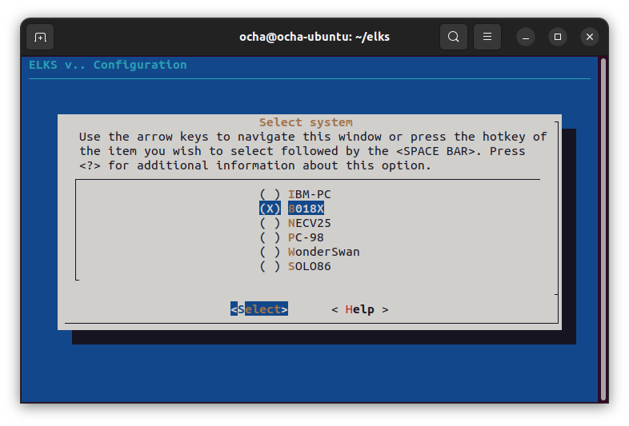
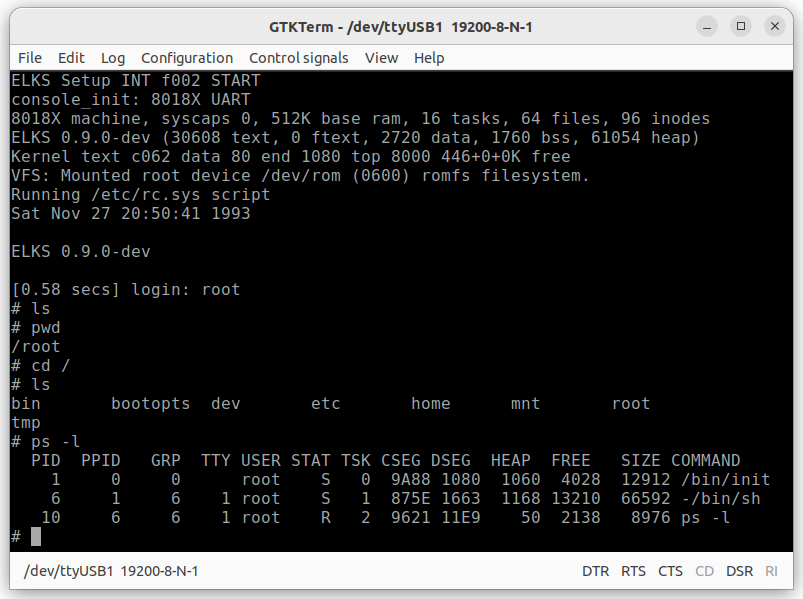
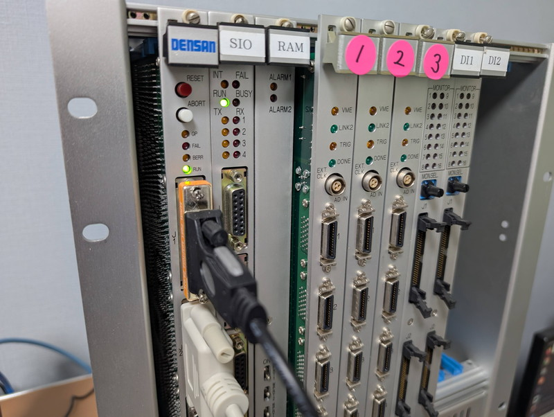

[前回](/2026/02/v53-vme-system-13.html)は、NASCOM BASICをV53 VMEボードで動かしてベンチマークテストを行いました。今回は8086系の組み込み向けLinuxである[ELKS](https://github.com/ghaerr/elks)をV53 VMEシステムで動かしてみます。

## ELKSとは

ELKSとはEmbeddable Linux Kernel Subset - Linux for 8086で、8086系の16ビットプロセッサ向けに開発された、組み込みLinuxカーネルサブセットです。GitHubで公開されています。

* https://github.com/ghaerr/elks

ROM化もできるようで、今回のV53 VMEボードにはちょうど良さそうです。早速cloneしてソースコードを読んでみることにしました。

## 移植方針の検討

ソースにはいくつかのアーキテクチャが対応していてIBM-PCやPC98といった文字が見えます。その中で8018xというアーキテクチャがあり、ROMベースのようです。これをベースにV53 VMEボードに移植することにしました。
まずはほとんどの機能を削って最低限の状態でELKSが起動することを目指します。

ELKSのコンフィグレーションはmake menuconfigで行うことができます。



menuconfigで今回作成したconfigファイルはGitHubに置きました。
* [v53-rom.config](https://github.com/kanpapa/elks/blob/v53-rom/v53-rom.config)

## メモリマップの定義

メモリマップは以下のようにしました。これもmake menuconfigで設定します。

|Area|Address|Max Size|ファイル名|機能|メモ|
|:---|:---|:---|:---|:---|:---|
|RAM|00000-7FFFF|512KB RAM|-|ベクタ,スタック,ヒープ,アプリケーション|-|
|ELKS ROMFS|80000-AFFFF|192KB RAM|romfs.hex|ルートファイルシステム|-|
|ELKS KERNEL ROM|C0000-CFFFF|64KB RAM|image.hex|ELKSカーネル本体|実行アドレス C000:0014|
|RAM MONITOR|D0000-DFFFF|64KB RAM|v53_ram_mon.hex|拡張モニタ(基本モニタにペリフェラルを追加)|実行アドレス D000:0000|
|ROM MONITOR|E0000-FFFFF|128KB ROM|-|基本モニタ(ロード,ダンプ,実行)|電源投入時に自動実行|

基本モニタと拡張モニタはこれまで開発してきたものをそのまま使い、VMEボードの初期設定とメモリへのバイナリのロードを行った後にELKSカーネルを実行します。最終的にはROMベースにして電源投入と同時にELKSを起動したいですが、まずはRAM上で動作を確認します。

## ソースコードの主な修正点

V53 CPUは8086系プロセッサですのでバイナリレベルでは互換性がありますが、ハードウェアは当然異なります。8018xシステムのソースでは内蔵ペリフェラルのみを使う構成ですが、このVMEボードではV53 CPU内蔵のペリフェラルと外部ペリフェラルを連携して動作する設計になっています。このため以下の点について大幅に変更を行いました。

### タイマー割り込み

ELKSではタイマー割り込みが必須です。すでに[モニタでもタイマー割り込みでTickを刻む仕組み](/2026/01/v53-vme-system-9.html)を実装していますが、ELKSでも後述のようにスレーブ側にタイマーが接続されている点を考慮する必要があるのと、V53のTCU用に修正を行っています。

* [elks/arch/i86/kernel/timer-8018x.c](https://github.com/kanpapa/elks/blob/v53-rom/elks/arch/i86/kernel/timer-8018x.c)

### シリアルコンソール

すでにV53 SCUは[モニタコンソール](/2026/01/v53-vme-system-5.html)として使っているので、ELKSのコンソールは[外部ペリフェラルのUSART](/2026/01/v53-vme-system-6.html)を使っています。こうすることでモニタ操作とELKS操作を分離してお互いに影響を受けないようにしています。
ELKSのconsoleドライバは送信はポーリングですが、受信は割り込みを使っています。今回初めて受信割り込みを組み込んでみました。

* [elks/arch/i86/drivers/char/console-serial-8018x.c](https://github.com/kanpapa/elks/blob/v53-rom/elks/arch/i86/drivers/char/console-serial-8018x.c)
* [elks/arch/i86/boot/crt0.S](https://github.com/kanpapa/elks/blob/v53-rom/elks/arch/i86/boot/crt0.S)

### 割り込み処理

このVMEボードではV53 ICUをマスタとして、μPD71059 PPIがスレーブとなるカスケード接続になっています。以前[割り込みの実験](/2026/01/v53-vme-system-9.html)で試したようにスレーブの割り込みをマスタ経由でCPUに伝えて、その後ディスパッチャでスレーブのどの割り込みかを判断処理する構造にしています。

* [elks/arch/i86/kernel/irq.c](https://github.com/kanpapa/elks/blob/v53-rom/elks/arch/i86/kernel/irq.c)
* [elks/arch/i86/kernel/irq-8018x.c](https://github.com/kanpapa/elks/blob/v53-rom/elks/arch/i86/kernel/irq-8018x.c)


### その他

上記以外にも修正を行っていますが、修正したソースはForkしたGitHubのv53-romブランチに置きました。

* https://github.com/kanpapa/elks/tree/v53-rom

## 動作確認

ELKSを起動するには生成されたバイナリを[ツールでHEXファイルに変換](https://github.com/kanpapa/elks/blob/v53-rom/image2hex.sh)したものをモニタでロードして実行します。

```
**  V53 MONITOR v0.1 2026-01-12  **
> l d000                RAMモニタv0.10をロード
Load HEX...D000:0
.....
OK> 

> g d000 0000　　　　　　RAMモニタv0.10を実行　メモリWait, USART, 割り込みなど初期化される
Go!

**  V53 RAM MONITOR v0.10 2026-02-15  **
> l 8000                ROMディスク(romfs.hex)をロード
Load HEX...8000:0
.
........
> l c000                カーネル(image.hex)をロード
Load HEX...C000:0
.
........
> g c000 0014　　　　　　 カーネルの実行
Go!
** INT 80 detected ** AX=0010 BX=77E0 CX=0080 DX=06E0　←何故か一度モニタ側のハンドラが動く
 Stop at CS:IP = 0003:1B0A
```

ELKSが起動すると以下のような画面になります。

```
LKS Setup INT f002 START
console_init: 8018X UART
8018X machine, syscaps 0, 512K base ram, 16 tasks, 64 files, 96 inodes
ELKS 0.9.0-dev (30608 text, 0 ftext, 2720 data, 1760 bss, 61054 heap)
Kernel text c062 data 80 end 1080 top 8000 446+0+0K free
VFS: Mounted root device /dev/rom (0600) romfs filesystem.
Running /etc/rc.sys script
Sat Nov 27 20:50:41 1993

ELKS 0.9.0-dev

[0.58 secs] login: 
```
見慣れたlogin:プロンプトです。ここにrootと入力してログインするとシェルが使えるようになりました。



## まとめ

次のステップとして、現在はモニタ起動時に行っている初期化処理をマージしてROMに固定し、スイッチONでELKSが起動できるようにしてみたいです。今のROMは128KBですが、ボードのジャンパー設定でもっと大きな容量のROMが搭載できるかもしれません。  
また、ELKSはネットワーク対応ですが、残念ながらVMEのEthernetボードは持っていないのでLANに直接接続するのは難しいですが、シリアルポートとSLIPやPPPなど使えばネットワークに接続できる可能性もあります。
まだまだ楽しめそうです。



次の記事：[V53 VMEシステムで遊ぶ #15 ELKSをV53対応にする](/2026/03/v53-vme-system-15-elks-2.html)