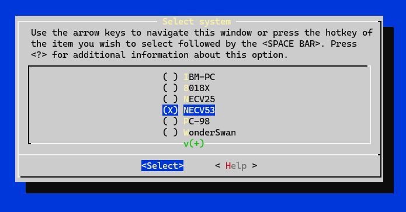
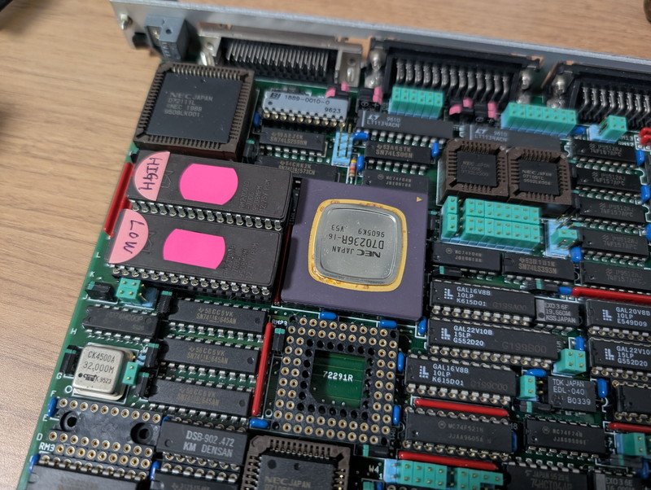
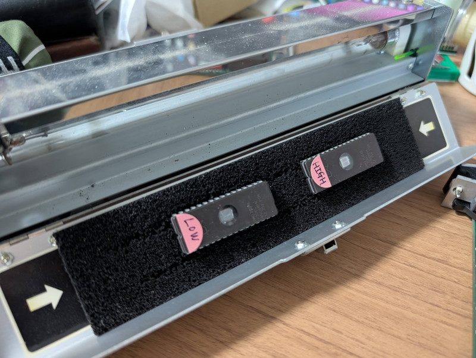
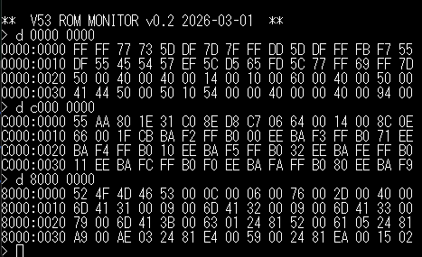
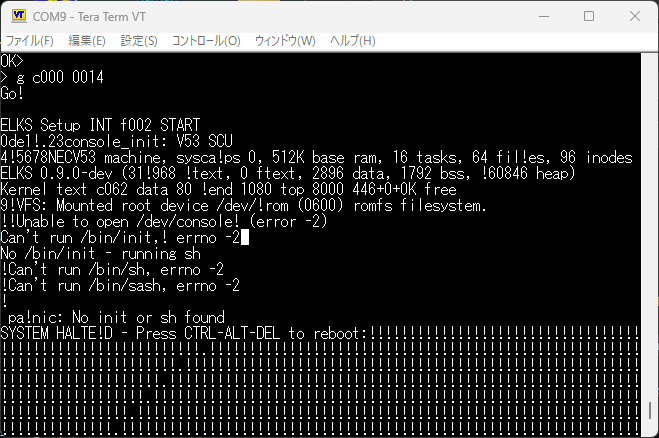
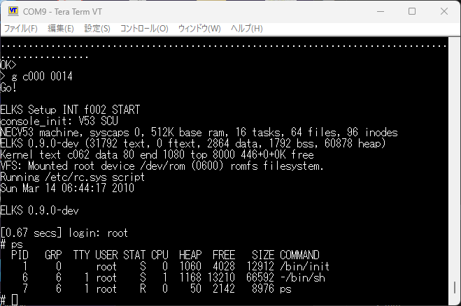

[前回](/2026/02/v53-vme-system-14-elks-1.html)は、8086系の組み込み向けLinuxである[ELKS](https://github.com/ghaerr/elks)をV53 VMEシステムで動かしてみました。ただしこの環境は暫定的なものでペリフェラルの初期化はRAMモニタに頼っているなど、ELKS単体で動作するものではありません。今回は8018xのパッチ版からV53のソースコードを分離しELKS単体で動作するようにします。

## 修正方針

今回の修正方針は以下の通りです。

* menuconfigでV53が選択できるようにして、`CONFIG_ARCH_NECV53`フラグを導入します。
* `CONFIG_ARCH_NECV53`フラグを使い、現在のソースからNEC V53用のソースを分離し整理します。
* ペリフェラルの初期化をELKSにマージし、RAMモニタを踏んだ起動を不要にします。
* コンソールは`USART`から`SCU`に変更し、`USART`は今後拡張できるように空けておきます。
* 内部I/Oベースアドレスを`0x20xx`から`0xf0xx`に変更します。

## menuconfigにV53を追加する

まずは8018xやNECv25の定義を参考にしてmenuconfigに`NECV53`を追加しました。

無事にシステム選択メニューに`NECV53`が表示されました。

これで`CONFIG_ARCH_NECV53`が使えるようになったので、V53用のコードを整理していきます。

## V53用のソースを分離する

主に以下のソースを修正し、8018xのソースを使っているものはNECV53のソースを新たに起こしました。
これでペリフェラル初期化はマージされ、コンソールも`USART`から`SCU`に変更しました。

|変更点|変更前のソース|変更後のソース|
|:--|:--|:--|
|USARTからSCUに変更|elks/arch/i86/boot/crt0.S|elks/arch/i86/boot/crt0.S|
|CPU初期化の追加、USARTからSCUに変更|elks/arch/i86/boot/setup.S|elks/arch/i86/boot/setup.S|
|USARTからSCUに変更 | elks/arch/i86/drivers/char/conio-8018x.c| elks/arch/i86/drivers/char/conio-necv53.c|
|USARTからSCUに変更|elks/arch/i86/drivers/char/console-serial-8018x.c | elks/arch/i86/drivers/char/console-serial-necv53.c|
|ICUおよびPICの初期化を追加|elks/arch/i86/kernel/irq-8018x.c |elks/arch/i86/kernel/irq-necv53.c |
|TCUの初期化を追加|elks/arch/i86/kernel/timer-8018x.c |elks/arch/i86/kernel/timer-necv53.c |
|CPU制御レジスタの定義|elks/include/arch/8018x.h |elks/include/arch/necv53.h |
|IOアドレスの定義|elks/include/arch/ports.h|elks/include/arch/ports.h |

この修正がうまく動けばRAMモニタを踏んだ起動は不要になるはずです。

## ROMモニタをセグメント越えのロードに対応する

今回のアップデートでRAMモニタは不要になるはずですが、ROMモニタのロードコマンドはまだ64KBセグメント越えの処理が入っていません。このためROMモニタも更新することにします。

久しぶりにV53 CPUボードをVMEラックから取り外してROMモニタを書き換えます。

ROMモニタの書き換えが完了しバージョン0.1が0.2になりました。

これで64KBを超えるELKSのimage.hexとromfs.hexの読み込みがROMモニタでもできるようになりました。

## V53版ELKSのデバッグ

V53版ELKSはソースコードの大幅な修正を行ったので、やはり一発では動きません。これまでと同様にprintk()を使いながらデバッグを進めました。

ほぼ動作するようになったところでデバッグ表示を削除しました。

ConsoleはV53 SCUと表示され、NECV53 machineと表示されています。

## まとめ

V53版ELKSはひとまず動作しているようです。

8018x系のソースからオブジェクトは生成されていないことも確認しました。8018x系のソースはもう使用しなくなったので、オリジナルの状態に切り戻しました。これで8018xのソースとV53のソースの分離は完了です。

なお、ELKSのカーネルとROMファイルシステムをバッテリーバックアップされているVMEシステムのRAMにロードしておくことで、電源投入後にROMモニタからELKSがすぐ起動できる状態になりました。

次の記事：[V53 VMEシステムで遊ぶ #16 ELKSでRAMDISKを使う](/2026/03/v53-vme-system-16-elks-3.html)