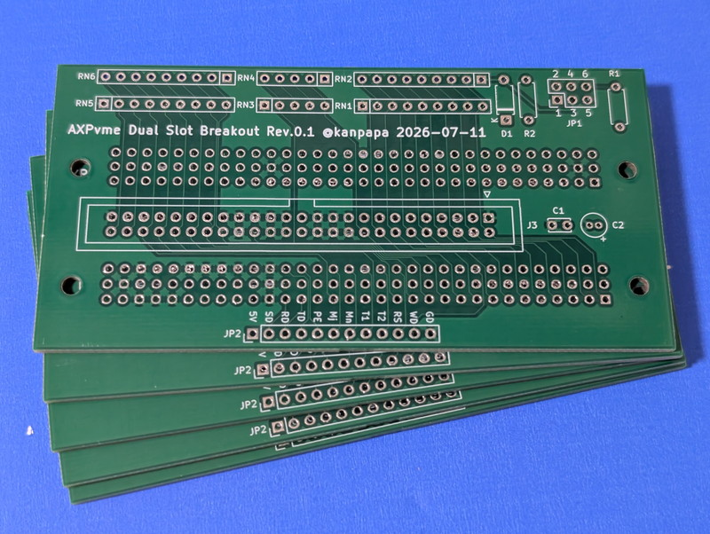
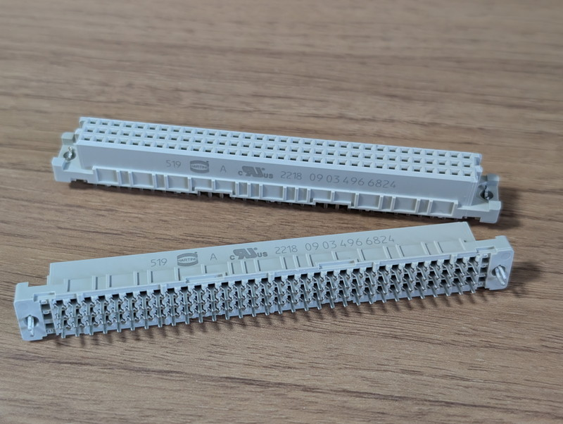
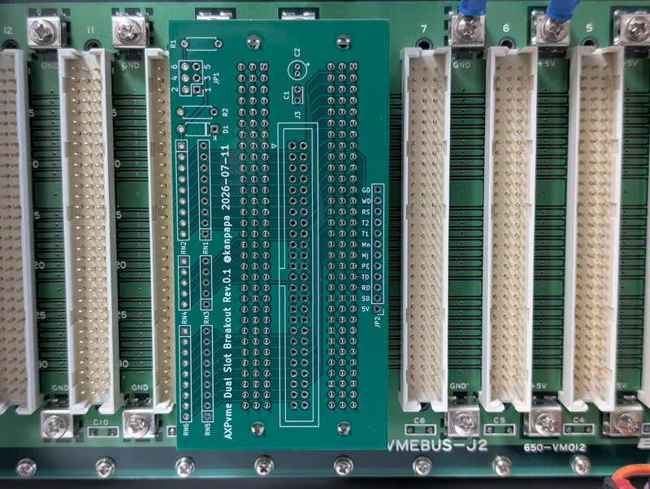
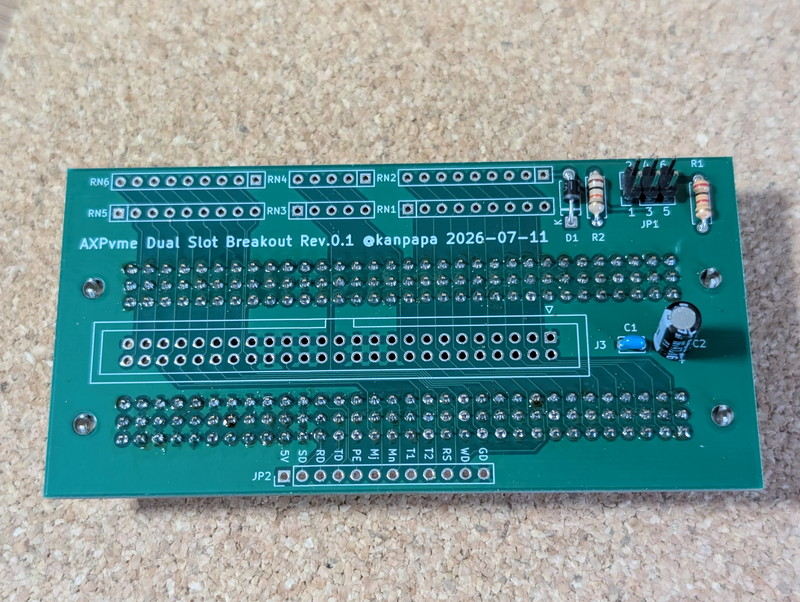
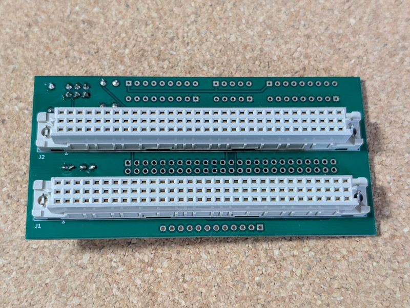
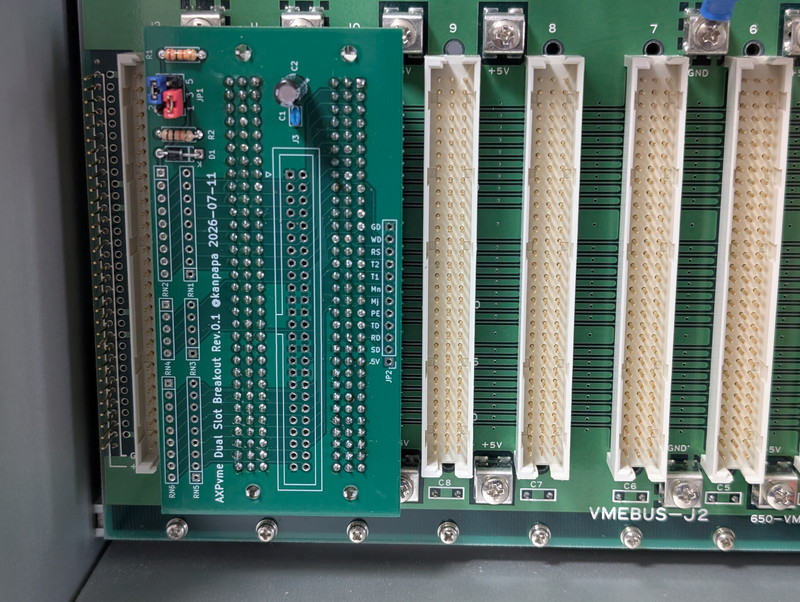
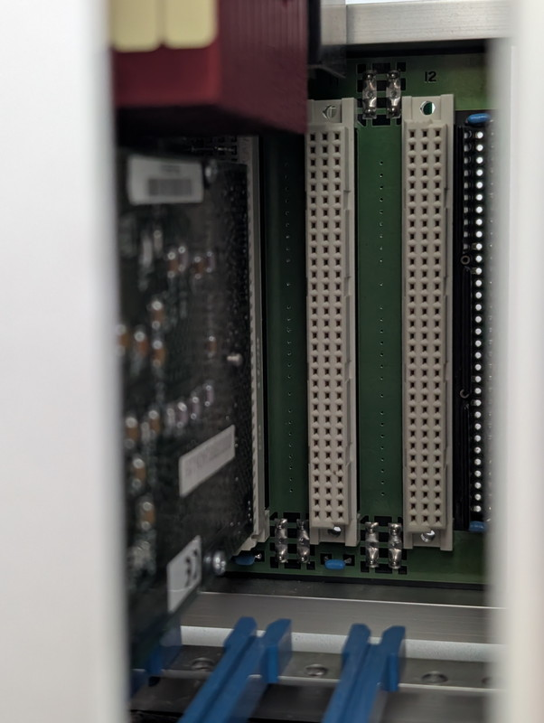
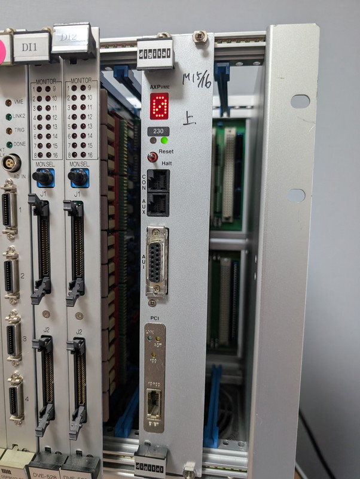
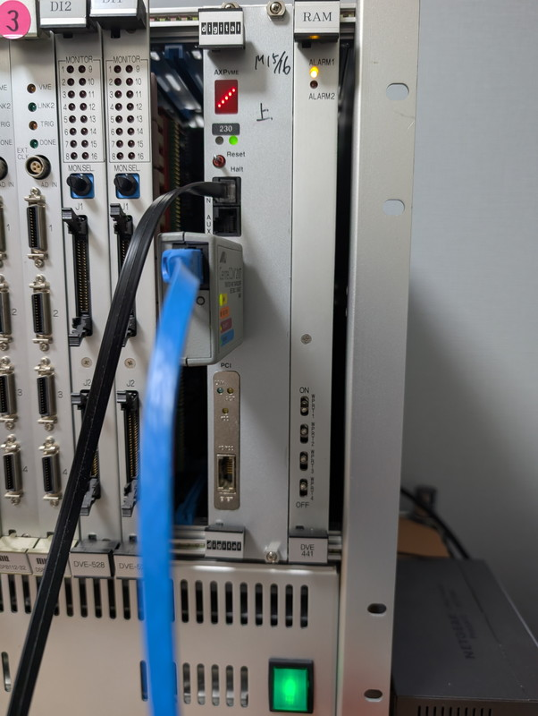

[前回](/2026/07/axpvme-vme-9.html)は[DEC AXPvme230](/2026/06/axpvme-vme-1.html)をVMEラックに実装するために必要なDual Slot Breakout基板の設計と発注まで行いました。今回はDual Slot Breakout基板を製作して、AXPvme230をVMEラックに搭載して動かしてみます。

## Breakoutボードの仮付け

[JLCPCB](https://jlcpcb.com/jp/)さんに発注したAXPvme Dual Slot Breakout基板が届きました。ほぼ一週間で到着です。



もう一つ重要なパーツとしてDIN 96Pコネクタがあります。こちらもほぼ同じタイミングで[マルツ](https://www.marutsu.co.jp/)さんから入手できました。



Breakout基板にDINコネクタを仮付けしてVMEラックのバックプレーンのコネクタ位置に合わせて実装に問題がないかを確認しました。



特に問題なさそうです。

## Breakoutボードの組み立て

BreakoutボードにはSCSIを使用するための50Pコネクタやターミネーター用の集合抵抗が実装できるようにしていますが、今回は必要最小限のパーツだけ実装して動作確認を行います。

このため表面はちょっとしたパーツのみの実装になります。



裏面はDIN 96Pコネクタが２つ実装されます。



これでBreakoutボードは完成です。

## Breakoutボードの取り付け

完成したBreakoutボードをVMEラックの裏側のJ2バックプレーンに取り付けます。

今回はスロット10番にAXPvme230ボードを取り付けることにしました。BreakoutボードのJ1をスロット10番に差し込みます。J2は隣のスロット11番に差し込みここからも電源を供給します。



これでJ2バックプレーン側の設定は完了です。

## AXPvme230ボードの取り付け

次にAXPvme230ボードをVMEラックに取り付けます。AXPvme230ボードのP2コネクタをスロット10番に合わせて差し込みます。



これで問題ないはずです。

## VMEラックでの動作確認

いよいよVMEラックの電源を投入します。このVMEラックは12スロット用ですので電源容量は余裕があります。

電源を投入したところ、平置きと同じようにLEDパネルに数字と英字が次々と表示されていきます。



まずは問題なく動作しているようです。

## SRMコンソールの起動設定

現在の設定では自動bootするようになっていますが、SRMコンソールを起動して停止するように環境変数の設定を変更しました。

```
>>>show auto_action
auto_action             BOOT
>>>set auto_action halt
>>>show auto_action
auto_action             HALT
>>>
```

これでSRMコンソールのプロンプトを表示してコマンド入力待ちの状態になります。

SRMコンソールがアイドルの状態だとLEDディスプレイに棒が回転するアニメーションが表示されます。



なかなかカッコいいです。

## エアフローの課題

しばらくこの状態で使用したのですが、CPUがかなり熱くなっていることに気が付きました。触れない熱さではないですが、平置きの時はサーキュレーターで強力な風を送っていたのでここまでは熱くなりませんでした。

Technical Descriptionで確認したところ、AXPvme230モジュールを適切に冷却するためには、以下のエアフロー要件を満たす必要があるとのことです。

* 最低200LFM（Linear Feet per Minute：フィート毎分）の風量が必要
* VMEシャーシに空きスロットがある場合は、導電性のブランクパネル（ダミーパネル）を挿入してください。これにより、エアフローが改善され、電磁波干渉（EMI）も低減されます。

現状のVMEラックの写真をみるとわかりますが、ブランクパネルが無く折角のエアーが周囲から漏れてしまっている状況です。

今はコネクタから外している未使用のVMEボードを差せばブランクパネルの代わりにはなりますが、無駄な電力を消費してしまいます。

やむなく一番電力を消費しないと思われるV53 RAMボード(1M SRAMが4個しか載っていない) を空きスロットに取り付け、CPUのヒートシンク側のブランクパネルの代用としました。



RAMボード分電力を消費してしまいますが、一旦この状態で動かしてみます。

## まとめ

エアフローに課題は残りますが、ひとまずVMEラックで安定した動作ができるようになりました。懸案のブランクパネルは引き続き探していますが、すでに国内の小売店では販売終了となっているようです。

AXPvme230をVMEラックに搭載した状態でNetBSDを動かしつつ次のテーマを探してみます。まずはSCSIを動かすか、それともPCIのLANカードを動かすか、まだまだ試すことはありそうです。

次の記事：[DEC AXPvme230で遊ぶ #11 PCI LANカードで100Mbpsにする](/2026/07/axpvme-vme-11.html)