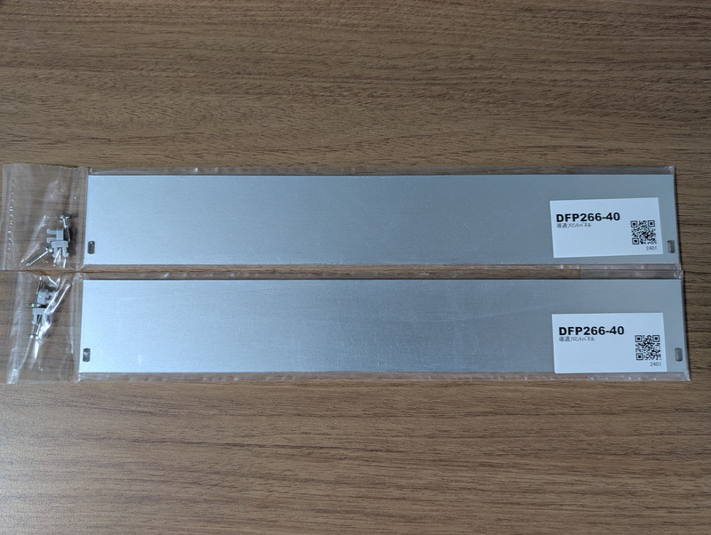
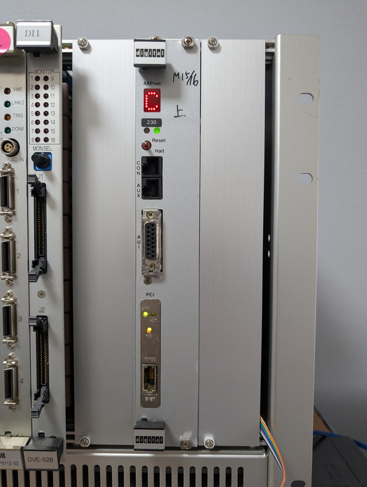
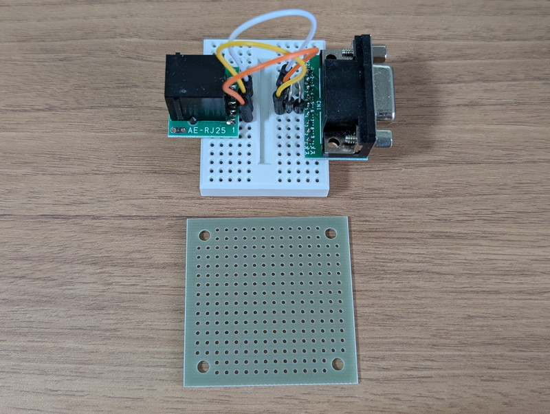
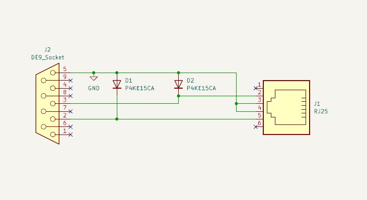
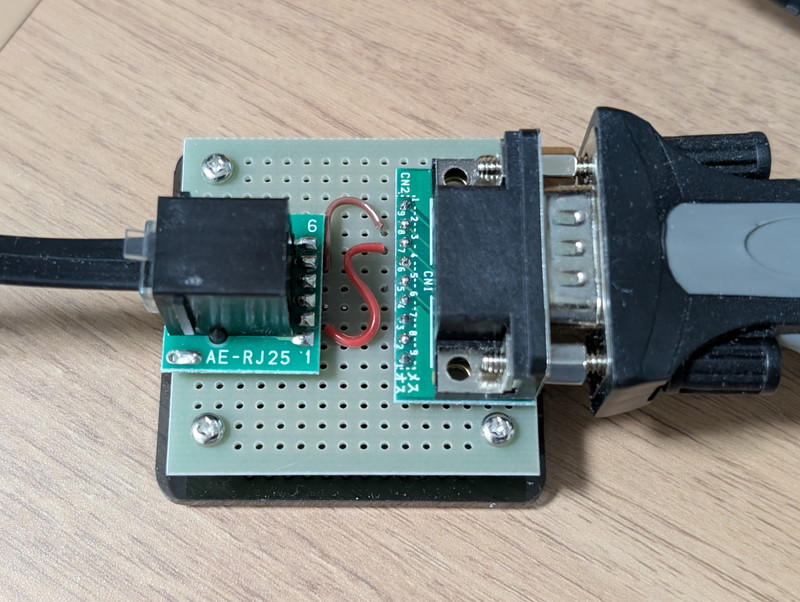
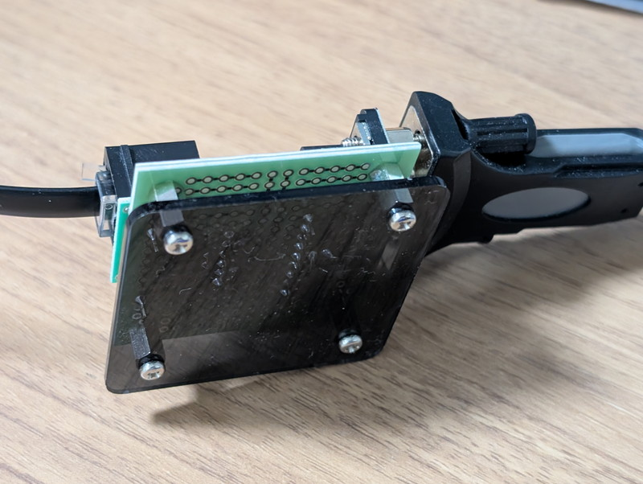

[前回](/2026/07/axpvme-vme-11.html)は[DEC AXPvme230](/2026/06/axpvme-vme-1.html)のPCI LANカードにネットワークを接続して100Mbpsに高速化しました。今回はVMEラックを含む動作環境の整備を行います。

## エアフローの課題

以前の記事でも触れましたが[エアフローの課題](https://kanpapa.com/2026/07/axpvme-vme-10.html#%E3%82%A8%E3%82%A2%E3%83%95%E3%83%AD%E3%83%BC%E3%81%AE%E8%AA%B2%E9%A1%8C)が残っており、VMEラックで安定運用するにはこの点を解決しなければなりません。

Technical Descriptionによると、AXPvme230モジュールを適切に冷却するためには、以下のエアフロー要件を満たす必要があるとのことです。

* 最低200LFM（Linear Feet per Minute：フィート毎分）の風量が必要
* VMEシャーシに空きスロットがある場合は、導電性のブランクパネル（ダミーパネル）を挿入してください。これにより、エアフローが改善され、電磁波干渉（EMI）も低減されます。

現在はやむなく一番電力を消費しないと思われるV53 RAMボード(1M SRAMが4個しか載っていない) を空きスロットに取り付け、CPUのヒートシンク側のブランクパネルの代用としていました。

## フロントパネルの入手

VME 6Uラック用の導電性のブランクパネルを探したのですが、こんなマニアックな製品はオークションサイトやフリマサイトでも見つかりません。  
個人向けの販売サイトでは販売が終息しているようで、「販売終了」や「売り切れ」の表示ばかりです。あきらめずに探したところ[フルタカパーツオンライン](https://www.furutaka-netsel.co.jp/)さんでタカチ電機工業さんの[導通フロントパネル DFPシリーズ](https://www.takachi-el.co.jp/products/DFP)の在庫を見つけることができました。  
欲しかった6U 2HP（通常のVMEボード1枚分のパネル）はすでに売り切れでしたが、6U 4HP（AXPvme230と同じ2枚分のパネル）を2枚購入することができました。  
フルタカパーツオンラインさんはこれまで利用したことがなかったのですが、各種メーカーの品揃えが豊富なので、今後も利用させていただこうと思います。

## フロントパネルの効果

早速フロントパネルをVMEラックに取り付けます。スロット10にAXPvme230を取り付けていましたが、4HPのパネルを左右に取り付けるため、AXPvme230はスロット9の位置に変更しました。空いた両脇に6U 4HPのフロントパネルをネジ止めしました。

これでエアーの漏れが少なくなり、真上に向けてエアーが安定して流れるようになります。右端に5mmほど隙間ができてしまいますが、ここはこのままにして100MbpsのLANコネクタのフラットケーブルの引き出しに使います。

この状態で電源を投入して数時間動作させてみると、ラックの上部がほんのりと温かくなっています。CPUやメモリなどで暖められた空気が当たって温かくなっているようです。やはり発熱量は相当なものですが、空冷効果は出ているようです。

## MMJ-RS232C変換の基板化

次に気になっていたのはブレッドボードで製作しているMMJ-RS232C変換です。RS232Cコネクタやモジュラコネクタに力がかかって抜けそうになることがあります。ここも安定化するために基板に移し替えることにしました。

今回は写真にある秋月電子の[45基板](https://akizukidenshi.com/catalog/r/rboard19/)に移し替えます。少し大きめかもしれませんが、この基板には[45基板用アクリルパネル](https://akizukidenshi.com/catalog/g/g112444/)が販売されており、それを利用するためです。

回路図は以下のように非常にシンプルです。

45基板への実装はすぐ終わりました。

裏側にはスモークの専用アクリル板を取り付けて接触防止と見栄えを少し良くしています。

これでMMJ-RS232C変換も安定して使用できるようになりました。

## まとめ

今回はVMEラックの環境整備とMMJ-RS232C変換の基板化を行い、安定して稼働できる環境になりました。
これで安心して長時間の稼働もできそうです。今後はNetBSD/alphaを動かしてX11を含む様々なアプリケーションを試していきます。
