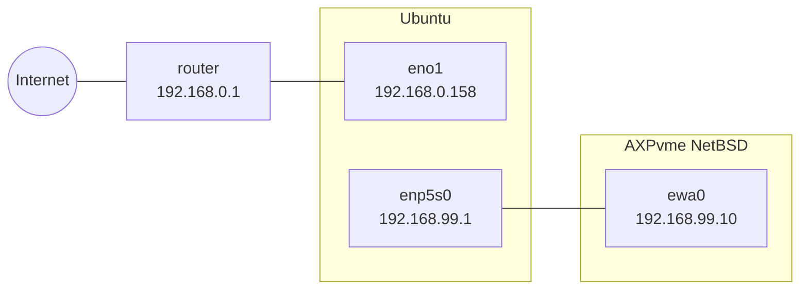
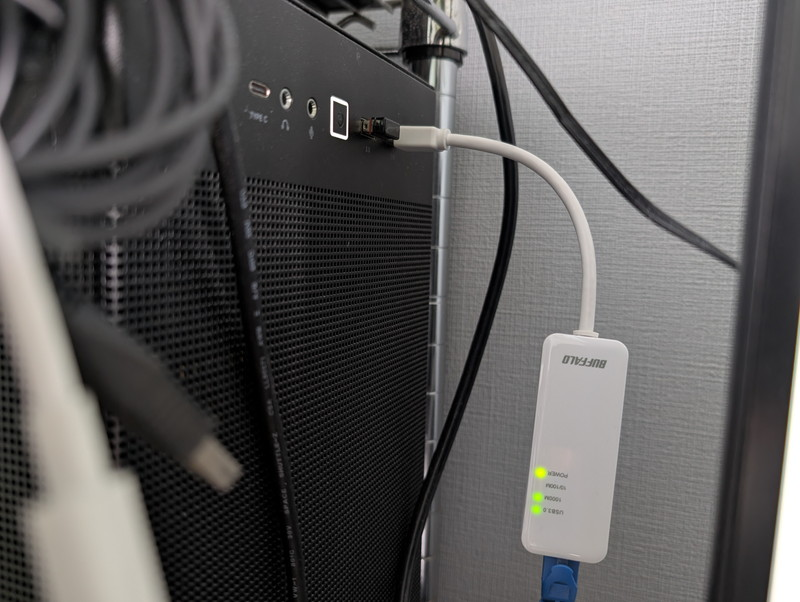
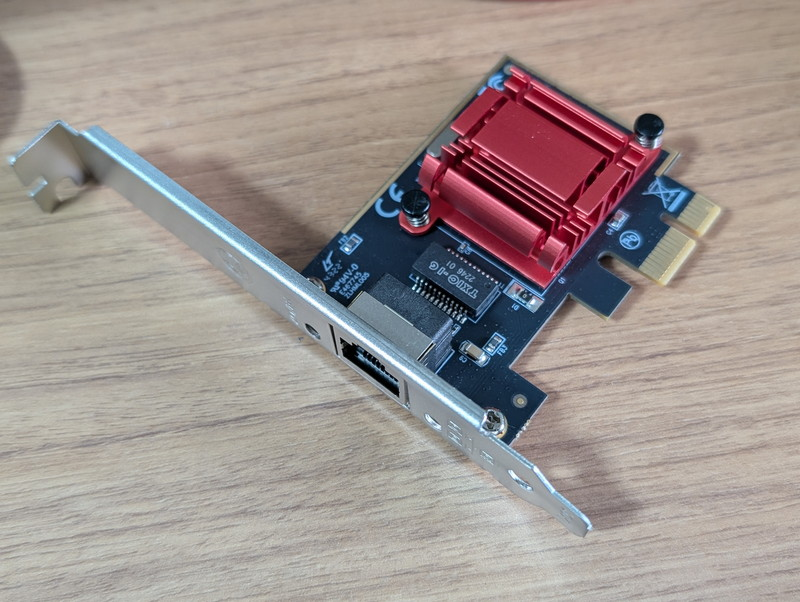
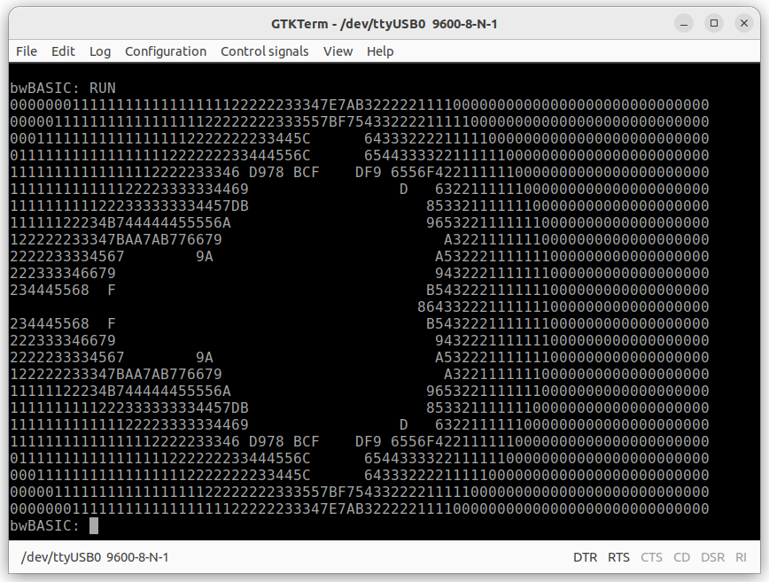
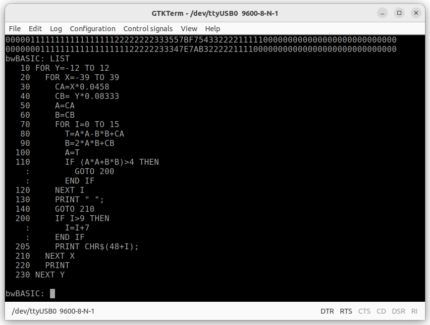

[前回](/2026/07/axpvme-vme-7.html)はClaude Codeに手伝ってもらって[AXPvme230](/2026/06/axpvme-vme-1.html)に[NetBSD/alpha](https://wiki.netbsd.org/ports/alpha/)をポーティングすることができました。スタンドアロン環境では問題なく動作しているようです。  
今回は実験ネットワークからインターネットに接続して、NetBSD/alphaのパッケージをインストールしてアプリケーションを動かしてみます。

## 現在のネットワーク構成

現在のネットワーク構成です。



このようにAXPvmeは192.168.99.0/24のネットワーク内に閉じている状態です。
このため、Ubuntuをルーター（ゲートウェイ）として機能させ、AXPvme(NetBSD)のセグメントからインターネットへの通信ができるようにします。
また、この機会にUSB-C LAN adapterをi210 LANカードに変更しました。






## NetBSD（AXPvme230）側の設定手順

以下の作業はAXPvmeにログインして行います。

1. デフォルトゲートウェイの設定

    インターネット向けのパケットをすべて Ubuntu (192.168.99.1) へ送るように設定する。

    ```Bash
    route add default 192.168.99.1    
    ```

1. DNSの設定

    ドメイン名での通信を可能にするため、/etc/resolv.conf にDNSサーバーを登録する。

    ```Bash
    vi /etc/resolv.conf
    ```
    以下の内容を記述しました。

    ```Plaintext
    nameserver 192.168.0.1
    nameserver 8.8.8.8
    ```

## Ubuntu 側の設定手順

次にUbuntuデスクトップにログインして、NetBSDから送られてきたパケットの転送とアドレス変換を設定します。

1. IPフォワーディング（パケット転送）の有効化

    ```Bash
    sudo sysctl -w net.ipv4.ip_forward=1
    ```

1. FORWARDチェーンの許可

    これだけでは動作しなかったので確認したところ、Docker環境でインターフェース間をまたぐパケット転送（FORWARD）が拒否（DROP）されていたため、これを許可しました。

    ```Bash
    sudo iptables -P FORWARD ACCEPT
    ```

1. IPマスカレード（NAT）の設定

    192.168.99.x のパケットを、外向きインターフェース（eno1）のIPアドレスに変換してルーターへ送る設定。

    ```Bash
    sudo iptables -t nat -A POSTROUTING -o eno1 -j MASQUERADE
    ```

## 接続確認

設定完了後に疎通確認を行います。

まず自宅のISPルーターにpingを投げてみます。（NetBSD ➔ router）

```plain
client# ping 192.168.0.1
PING router.askey.net (192.168.0.1): 56 data bytes
64 bytes from 192.168.0.1: icmp_seq=0 ttl=63 time=9.162631 ms
64 bytes from 192.168.0.1: icmp_seq=1 ttl=63 time=8.875548 ms
^C
----router.askey.net PING Statistics----
2 packets transmitted, 2 packets received, 0.0% packet loss
round-trip min/avg/max/stddev = 8.875548/9.019090/9.162631/0.202998 ms
```

Ubuntu(ゲートウェイサーバ)経由でルーターまで接続できています。  
いよいよインターネットにpingを投げてみます。（NetBSD ➔ 外部DNS）

```plan
client# ping 8.8.8.8
PING dns.google (8.8.8.8): 56 data bytes
64 bytes from 8.8.8.8: icmp_seq=0 ttl=116 time=88.981487 ms
64 bytes from 8.8.8.8: icmp_seq=1 ttl=116 time=16.703629 ms
^C
----dns.google PING Statistics----
2 packets transmitted, 2 packets received, 0.0% packet loss
round-trip min/avg/max/stddev = 16.703629/52.842558/88.981487/51.108164 ms
```

最後にドメイン名でpingを投げてみます。（NetBSD ➔ ドメイン指定）

```plain
client# ping kanpapa.com
PING kanpapa.com (172.67.203.155): 56 data bytes
64 bytes from 172.67.203.155: icmp_seq=0 ttl=56 time=14.187002 ms
64 bytes from 172.67.203.155: icmp_seq=1 ttl=56 time=14.788608 ms
^C
----kanpapa.com PING Statistics----
2 packets transmitted, 2 packets received, 0.0% packet loss
round-trip min/avg/max/stddev = 14.187002/14.487805/14.788608/0.425400 ms
```

無事インターネットとの接続ができたことが確認できました。  
試しにftp.netbsd.orgにFTPで接続してみます。

```plain
client# ftp ftp.netbsd.org
Trying [2001:470:a085:999::21]:21 ...
ftp: Can't connect to `2001:470:a085:999::21:21': No route to host
Trying 199.233.217.201:21 ...
Connected to ftp.netbsd.org.
220 ftp.NetBSD.org FTP server (NetBSD-ftpd 20230930) ready.
Name (ftp.netbsd.org:root): anonymous
331 Guest login ok, type your name as password.
Password: 
230-
        The NetBSD Project FTP Server located in San Jose, CA, USA
        1 Gbps connectivity
                                                    WELCOME!    /(        )`
                                                                \ \___   / |
          +--- Currently Supported Platforms ----+              /- _  `-/  '
          | acorn32, algor, alpha, amd64, amiga, |             (/\/ \ \   /\
          | amigappc, arc, atari, bebox, cats,   |             / /   | `    \
          |  cesfic, cobalt, dreamcast, emips,   |             O O   ) /    |
          | epoc32, evbarm{,64}, evbmips, evbppc,|             `-^--'`<     '
          |     evbsh3, ews4800mips, hp300,      |            (_.)  _  )   /
          |hpc{arm,mips,sh}, hppa, i386, ibmnws, |              .___/`    /
          |iyonix, landisk, luna68k,mac{68k,ppc},|               `-----' /
          | mipsco, mmeye, mvme68k, mvmeppc,     |  <----.     __ / __   \
          |netwinder, news68k, newsmips, next68k,|  <----|====O)))==) \) /====
          |ofppc, pmax, prep, rs6000, sandpoint, |  <----'    `--' `.__,' \
          |sgimips, shark, sparc{,64}, sun{2,3}, |               |        |
          |      vax, x68k, xen, zaurus          |                \       /
          +--------------------------------------+           ______( (_  / \_____
          See our website at http://www.NetBSD.org/        ,'  ,-----'   |       \
           We log all FTP transfers and commands.          `--{__________)  (FL) \/
    
230-
    EXPORT NOTICE
    
    Please note that portions of this FTP site contain cryptographic
    software controlled under the Export Administration Regulations (EAR)
    of the United States of America.
    
    None of this software may be downloaded or otherwise exported or
    re-exported into (or to a national or resident of) any country
    to which the U.S. has embargoed goods. Also, people personally
    on the block lists of the United States Department of Treasury
    or the United States Department of Commerce are prohibited.
    
    By downloading or using said software, you are agreeing to the
    foregoing and you are representing and warranting that you are not
    located in, under the control of, or a national or resident of any
    such country or on any such list.
230 Guest login ok, access restrictions apply.
Remote system type is UNIX.
Using binary mode to transfer files.
ftp> 
```

NetBSDのFTPサーバにアクセスできてデーモンくんが確認できました。これでFTPサーバから各種リソースが入手できます。

## パッケージのインストール

次はNetBSDのパッケージをインストールしてみます。今回はbwBASICをインストールして実行してみました。

```plain
client# PKG_PATH="https://netbsd.org(uname -p)/$(uname -r)/All/"
client# export PKG_PATH
client# pkg_add bwbasic
pkg_add: Warning: package `bwbasic-3.10' was built for a platform:
pkg_add: NetBSD/alpha 10.0 (pkg) vs. NetBSD/alpha 11.99.6 (this host)
client# bwbasic
########  ##    ## ##      ##    ###    ######## ######## ########            
##     ##  ##  ##  ##  ##  ##   ## ##      ##    ##       ##     ##           
##     ##   ####   ##  ##  ##  ##   ##     ##    ##       ##     ##           
########     ##    ##  ##  ## ##     ##    ##    ######   ########            
##     ##    ##    ##  ##  ## #########    ##    ##       ##   ##             
##     ##    ##    ##  ##  ## ##     ##    ##    ##       ##    ##            
########     ##     ###  ###  ##     ##    ##    ######## ##     ##           
                                                                              
                                                                              
                                    ########     ###     ######  ####  ###### 
                                    ##     ##   ## ##   ##    ##  ##  ##    ##
                                    ##     ##  ##   ##  ##        ##  ##      
                                    ########  ##     ##  ######   ##  ##      
                                    ##     ## #########       ##  ##  ##      
                                    ##     ## ##     ## ##    ##  ##  ##    ##
                                    ########  ##     ##  ######  ####  ###### 
                                                                              
Bywater BASIC Interpreter, version 3.10                                       
Copyright (c) 1993, Ted A. Campbell                                           
Copyright (c) 1995-1997, Jon B. Volkoff                                       
Copyright (c) 2014-2016, Howard Wulf, AF5NE                                   
                                                                              
bwBASIC: 
```

無事bwBASICが起動したので、いつもの[ASCIIART(マンデルブロ集合)ベンチマーク](https://haserin09.la.coocan.jp/asciiart.html)プログラムを入力して実行です。



完走しました。実行時間は30秒でした。NetBSDのOS上で動いているので実行時間は参考記録です。  
ちなみにLISTと入力すると、インデント表示されました。



## まとめ

DEC alphaが搭載されたAXPvme230にNetBSDを載せてインターネットに接続できました。30年前の産業用VMEボードでNetBSDが動いてInternetに接続できているのは感慨深いです。

今回のインターネット接続により今後のAXPvme230の実験や開発がスムーズになると期待していますが、机の上に広げて扇風機を当てながらの運用を続けるわけにはいきません。次回からはVMEラックに搭載しての安定運用に向けて動き始めます。

次の記事：[DEC AXPvme230で遊ぶ#9 Dual Slot Breakoutボードの設計](/2026/07/axpvme-vme-9.html)
