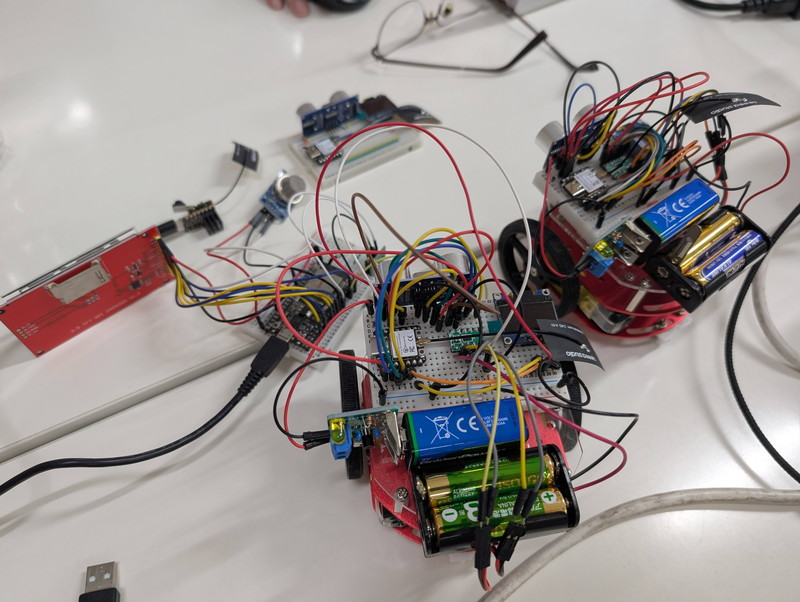
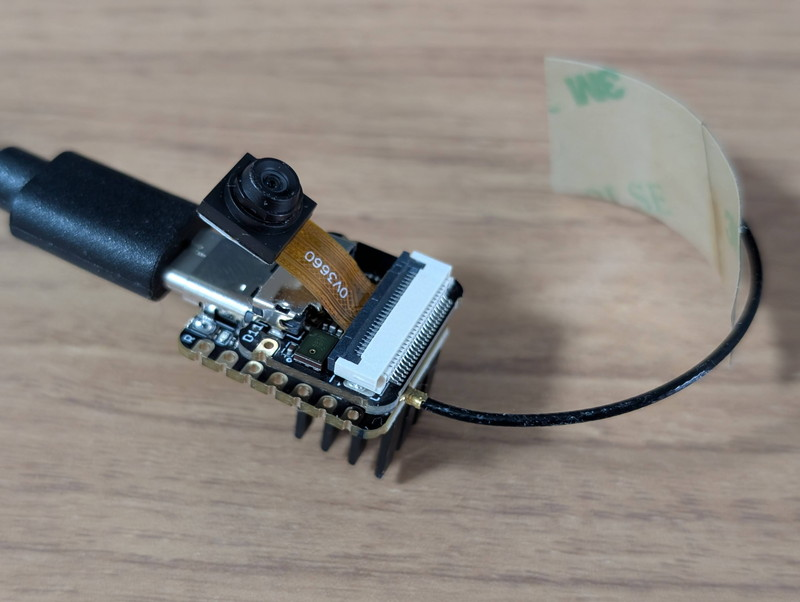
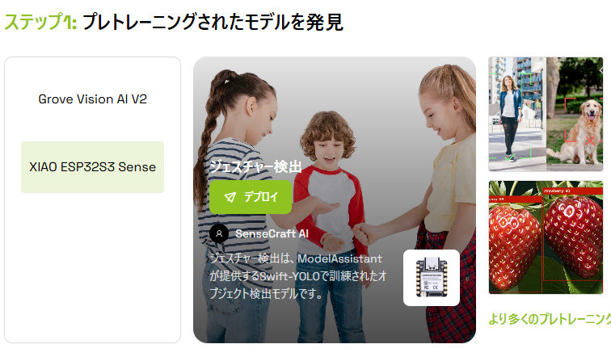
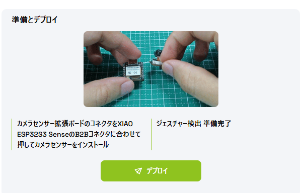
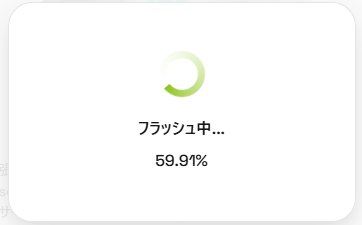
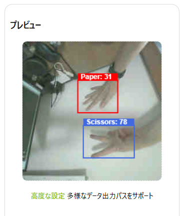
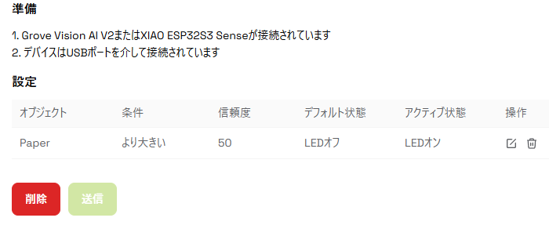
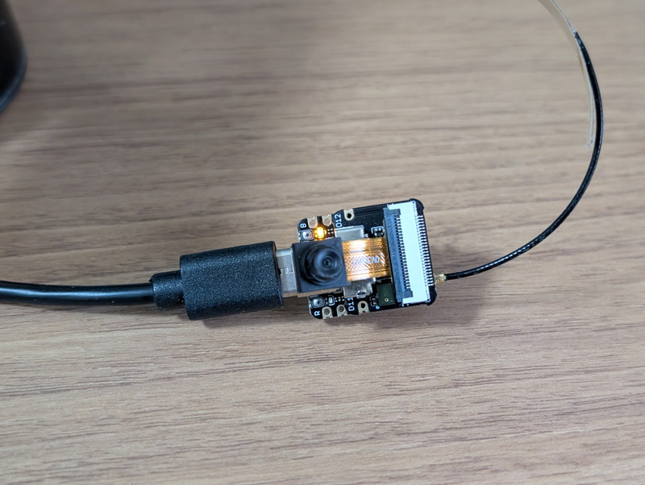

[おおたfab](https://ot-fb.com/event)さんでは電子工作初心者勉強会を定期的に開催しています。  
[前回](/2026/05/otafab-esp32-arduino-cloud-minicar-2.html)は[Arduino Cloud](https://cloud.arduino.cc/)のダッシュボードからミニカーのマイコン(XIAO ESP32C3)を制御できることを確認し、そのマイコンをミニカーに載せて実際に走らすことができました。
これでミニカーを使った作業は一通り完了したので、今後電子工作初心者勉強会で取り組むテーマを考えていきます。

## 今後のテーマを考える

まずは参加者の皆さんで今後のテーマについてブレストを行いました。

ブレストでは次のようなアイデアが出ました。

* ミニカーを拡張する
    - ラインセンサーを追加してライントレースカー。カメラを載せてセンサーの代わりにする
    - 2台で協調してダンスする（１台はクラウド、１台は通常）、後をつけるように動かす。
    - 音声認識で動かす
    - 感情をLEDもしくは画面に表示する。
    - 指の動きで動かす。
    - お掃除ロボット　カメラでごみを見つけて拾う。

* ウェアブルデバイスを作ってみる
    - 脈拍、気温、気圧とかをセンサーで取得してクラウドで記録する

* 据え置き型の機器を作ってみる
    - 音声合成と防犯アラームや防災アプリを連携。ゲリラ豪雨を知らせる。ぬいぐるみに仕込むとか。
    - カメラを使って画像認識：台所の蛇口閉め忘れ検知。リモート会議中だと部屋の入口にON AIRのランプ点灯
    - 観葉植物の給水　湿度センサーでポンプ給水、光制御、スマート農業 
    - 3Dプリンタのフィラメントの乾燥ツール 
    - スマートホーム　エアコンのON/OFF  上がったときにON。
    - プロジェクターで天井にプラネタリウム投影とか。暗くなったら自動表示。球体LCDや円形LCDの表示も。

このようにいろいろなアイデアがでてきましたが、やはりせっかく作ったミニカーを何等かの形で拡張してみたいという意見が多かった半面、据え置き型のデバイスなど実用的なものに取り組んではという意見もありました。  
またキーワードとしては音声合成や音声認識、カメラでの画像認識など少しこれまでとは違うセンサーを使ってみたいという希望もあるようです。

## XIAO ESP32S3 Senseを使ってみる

ここで何かのヒントになればと準備しておいた[XIAO ESP32S3 Sense](https://wiki.seeedstudio.com/ja/xiao_esp32s3_getting_started/)を使ったデモを行いました。

XIAO ESP32S3 Senseは、ESP32S3をコアに持ち、小型カメラと音声認識用のデジタルマイクをXIAOのサイズに搭載したものです。もちろんWiFiやBluetoothも搭載して無線通信にも対応しています。これまで使ってきたXIAO ESP32C6やXIAO ESP32C3よりは少し高価ですが、カメラ機能、音声認識機能付きのエッジデバイスとしては安価です。
また、画像を扱うために高速なCPUを使っていて付属品としてヒートシンクが2個ついてきます。デモアプリケーションのライブストリーミングを実行したところ確かに熱くなるのでヒートシンクを1個取り付けています。

## SenseCraft AIを試してみる

先ほどのブレストでも話題になった画像認識や音声認識を簡単に実現できそうなSeeed StudioさんのSenseCraft AIを試してみます。

* [SenseCraft AI](https://sensecraft.seeed.cc/ai/home/) 

SenseCraft AIはノーコードでESP32S3 Senseなどのエッジデバイスを制御できて、すぐ使えるように学習済のモデルがいくつか用意されているものです。

## 手のジェスチャーを認識してみる

SenseCreaft AIはブラウザで使うことができ、ログインも不要ですべての公開AIモデルが使えます。  
ここでは手のジェスチャーを認識するモデルがありましたので試してみました。

ジェスチャー検出のモデルを選びESP32S3 Senseにデプロイします。

デプロイボタンを押すだけでESP32S3 Senceが接続されているシリアルポートを認識し、ESP32S3 Senseにモデルファイルを書き込んでくれます。

デプロイが完了すると、ESP32S3 Senseが再起動し、カメラの画像がプレビュー画面に表示されます。  
カメラの前でグー、チョキ、パーをするとその状態を認識してくれます。

## 手のジェスチャーでLチカしてみる

SenseCreaft AIではセンサー出力としてAIの認識結果からLチカを行ったり、WiFi経由でデータを送信したり、GPIOを制御することもできるのです。

この仕組みを利用すればミニカーでの応用も難しくなさそうです。ただし画像認識に少しタイムラグがありますので、速く動くものとの組み合わせは少し工夫が必要かもしれません。

## まとめ

SenseCraft AIを使えばノーコードで画像認識や音声認識ができて、さらにLチカができることがわかりました。準備されている学習モデルもありますが、自分で集めた画像を使って独自のモデルを作ることもできるようです。応用事例もいくつか紹介されているようなので、それを参考にしながらミニカーをAIミニカーに進化させてみるのも良いですし、ミニカー以外のアイデアにも応用できそうです。  
次回はミニカーのマイコンをESP32S3 SenseにしてSenseCraft AIでGPIOを制御するところから始めてみます。また、SenseCraft AIで表示されていた[Grove Vision AI V2](https://wiki.seeedstudio.com/ja/grove_vision_ai_v2/)は演算プロセッサがハードウェア化されているのでもう少し認識速度を高速化できるかもしれません。こちらも入手して試してみます。

