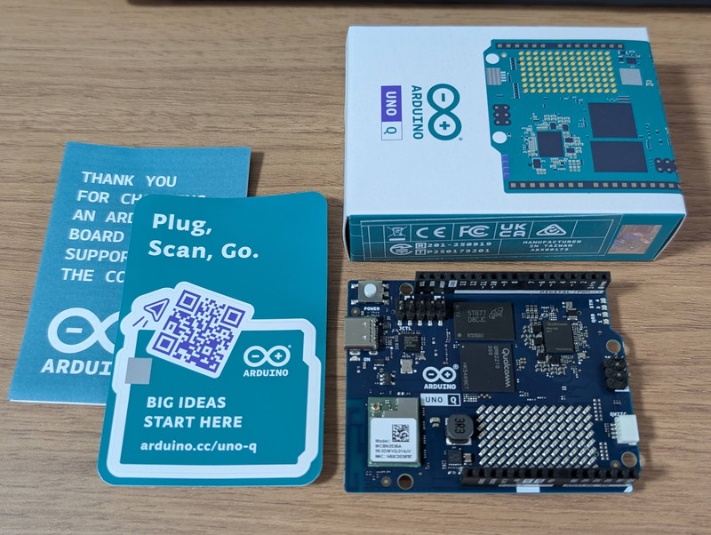
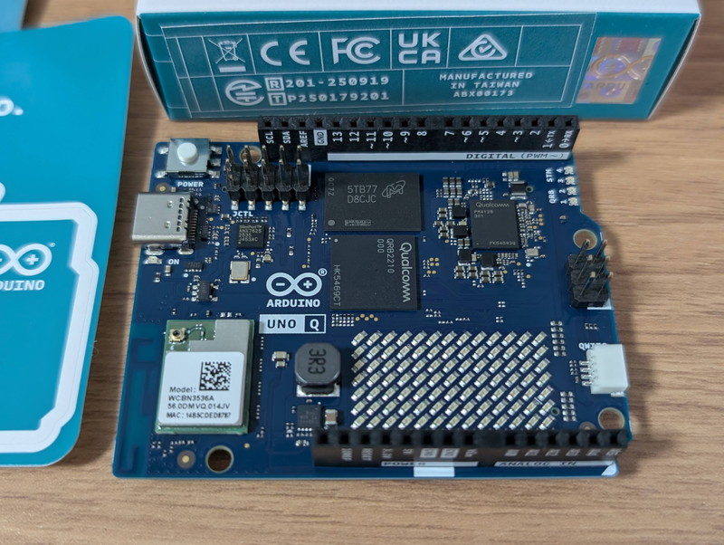
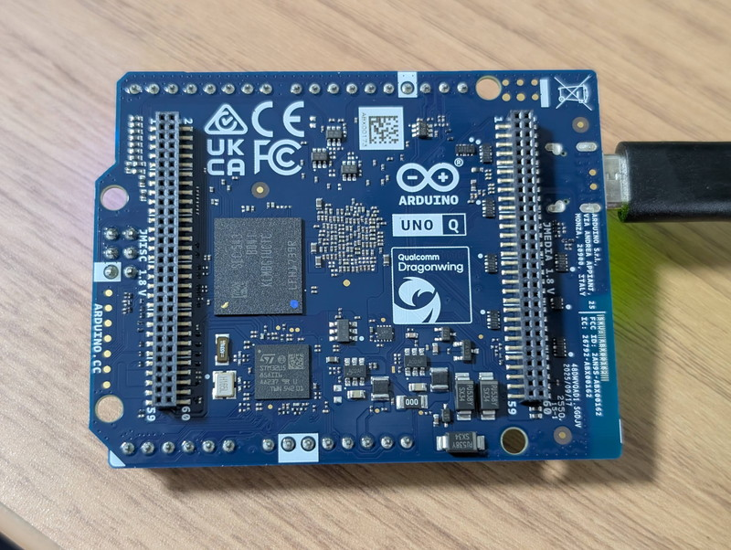
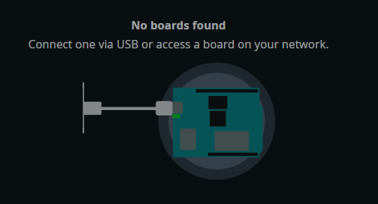
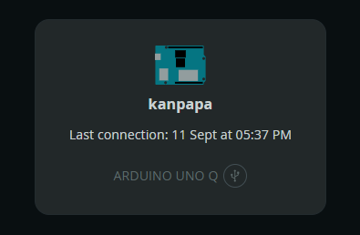
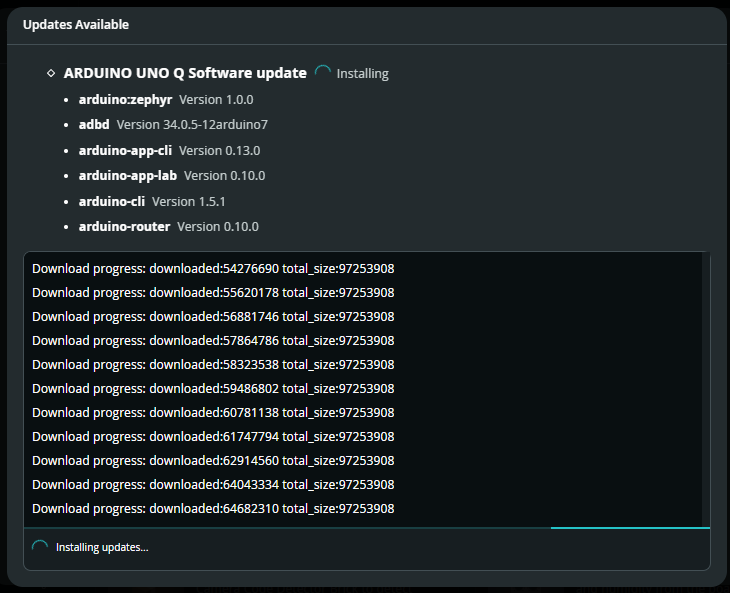
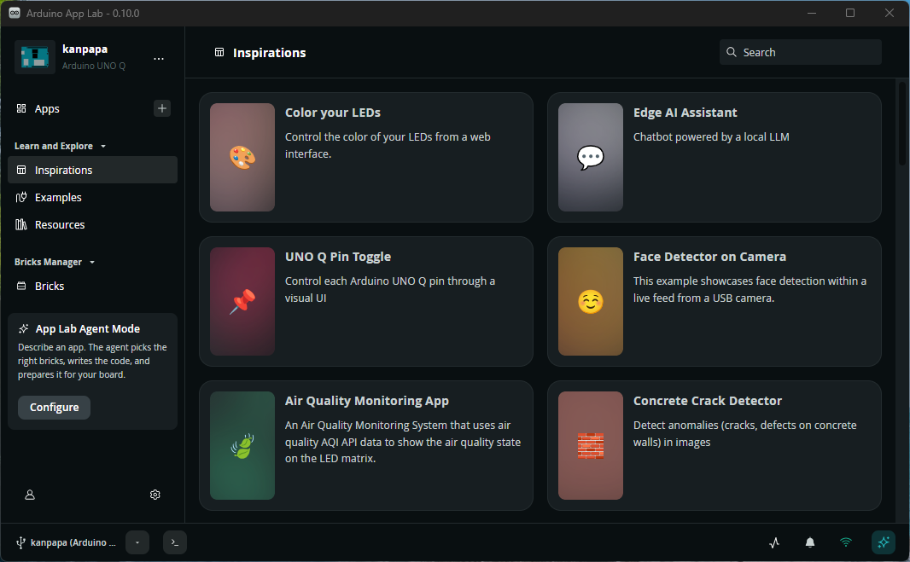
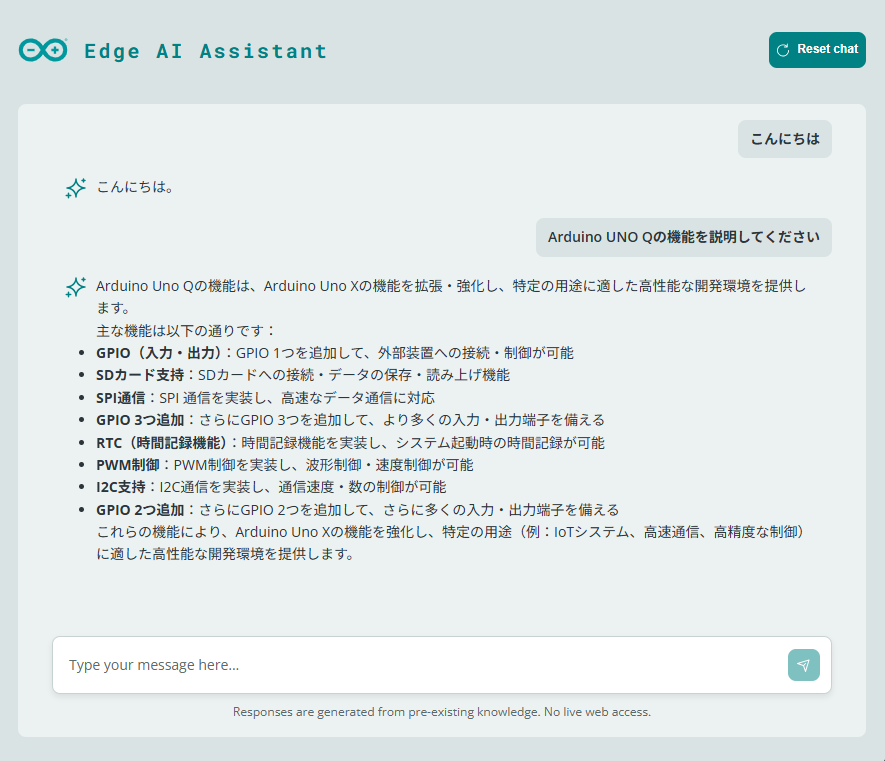
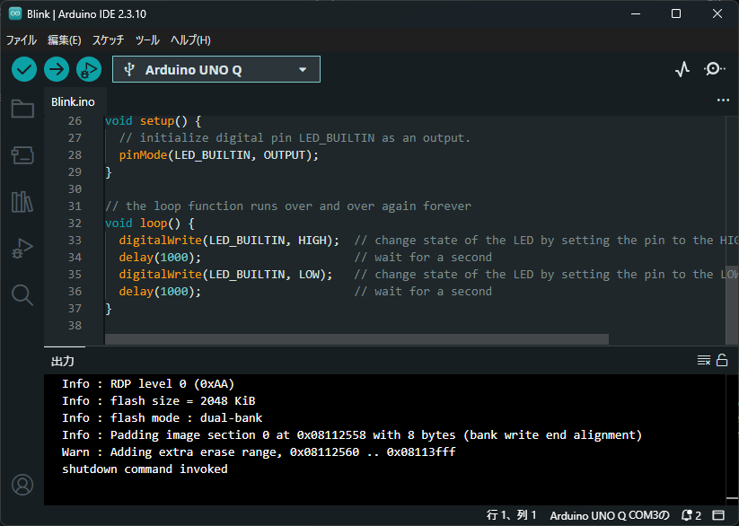

## はじめに

前々から気になっていた[Arduino Uno Q](https://ssci.to/10800)ですが、今度最大40 TOPSの推論性能を持つ[Arduino VENTUNO Q](https://ssci.to/11359)というものが発売されるようで、そろそろArduino Uno Qも触っておいたほうがいいかなとArduino Uno Q 4GBを購入してみました。  
Arduino Uno QはLinuxが動くSoCとSTM32マイコンが連携しながら動かせるもので、NPUも搭載しある程度のLLMも動かせそうです。今後はこのようなマイコン（リアルタイム制御）＋小型Linux SBC（エッジAI/ネットワーク）の組み合わせが主流になるものと思われます。

## 外観

おなじみのArduinoフォームファクタですので小さく感じます。

表面はこれまでのArduinoと見た目は変わりませんが、裏面をみると2つのコネクタがあります。ピン数が多くここから様々な機能拡張ができそうです。

## 電源投入

Arduino Uno QにはUSB-Cコネクタがありますので、ここからPCに接続して電源を供給します。
電源を投入するとマトリクスLEDにArduinoのロゴがアニメーションで表示され、その後ハートのマークになりました。



この動画の右上にある4個のRGB LEDがQRB SoCやSTMマイコンの動作状態を示しているようです。

## Arduino App Lab 

Arduino Uno Qの標準の開発環境である[Arduino App Lab](https://docs.arduino.cc/software/app-lab/)をインストールしました。起動すると対応ボードの接続を要求されます。

この状態でArduino Uno QをUSBに接続すると自動認識されますので、ボードに名前を付けます。ここではkanpapaとしました。

次にWiFiに接続するように案内され、接続すると自動的にソフトウェアアップデートが動きます。

アップデートが終わるとArduino App Labの初期画面が表示されました。サンプルプログラムはinspirationsにあるようなので眺めてみます。

この中ですぐ試せそうなEdge AI Assistantを実行してみました。UIはブラウザになります。

それなりに回答できているようですが、よく見るとUno Qではなく一般的なUnoの情報が表示されているように見えます。これはエッジAIのローカルLLMなのでやむを得ないでしょう。

## Arduino IDE 2.0

MCUだけ使うプログラムであればArduino IDE 2.0も使用できます。サンプルのBlink.inoを動かしたところ、ボード上のRGB LED 3が赤く点滅をはじめました。

もちろん、こうしたLチカ程度の単体動作だけであれば従来のArduino Unoで事足りますが、従来の開発環境もそのまま使えるのは安心感があります。

## まとめ

Arduino App Labは非常にパワフルで直感的な可能性を感じる一方、これまでのArduino IDEとは全く異なるものですので、公式ドキュメントを読みながら手探りで試している段階です。今後、日本語を含むローカライズにも期待したいところです。    
最近、[Arduino Uno Q メディアキャリアボード](https://ssci.to/11135)というものが発売されたようです。これを使えばカメラやディスプレイ、オーディオなどが直接接続できるので、次はメディアキャリアボードを取り付けてAIによる画像認識や音声認識やQualcomm SoCとSTM32間の通信連携などを試してみます。
