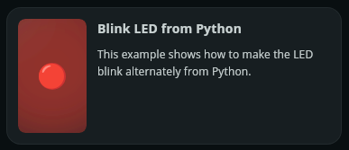
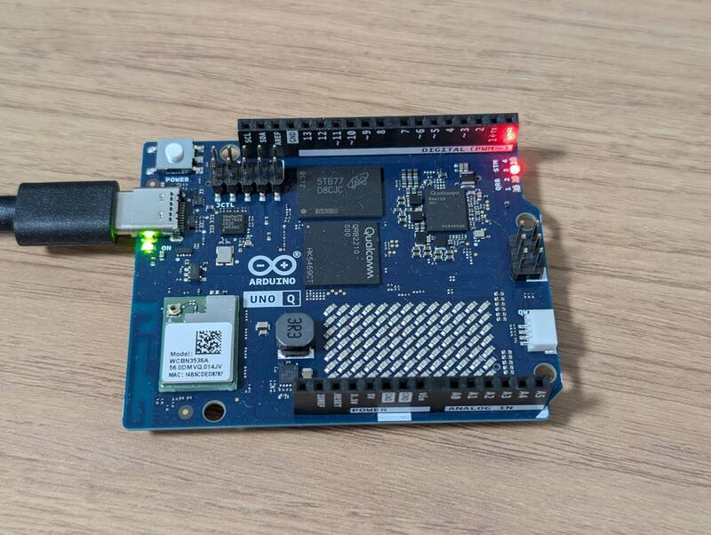
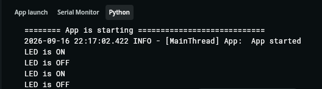
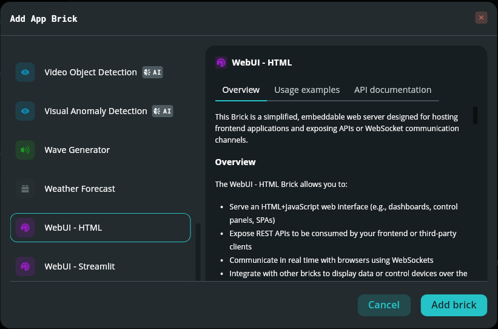
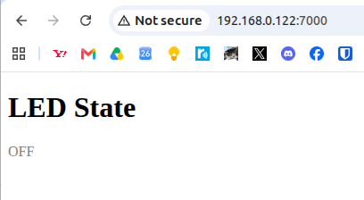
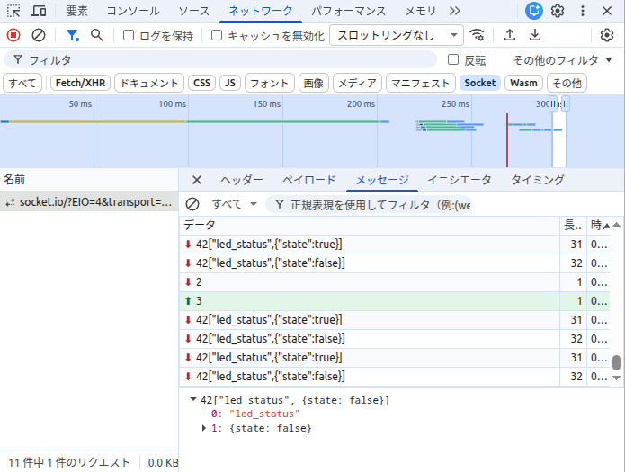

## はじめに

せっかく[Arduino Uno Qを購入](/2026/09/arduino-uno-q-1.html)したのですから、[Arduino App Lab](https://docs.arduino.cc/software/app-lab/)を使って、Arduino Uno Qのデュアルコア・プロセッサを連携した使い方を試してみます。  
今回とりあげるサンプルプログラムは、Arduino App LabのInspirationsに用意されている「Blink LED from Python」です。



このサンプルを選んだ理由は大きく2つあります。

- Arduino Uno QのSoC（Linux/Python側）とMCU（スケッチ側）が、Bridgeを介してどのように連携しているのかを確認したかった
- Brickの使い方を体験するために、シンプルなプログラムにBrickを追加してみたかった

Arduino App LabやBricksの詳細な説明はここでは割愛しますが、簡単に言うと「Arduinoのスケッチ（MCU側）とPython（SoC側）を組み合わせてアプリを作れる開発環境」で、Bricksはその中でよく使う機能（Web UI表示、AI推論など）をパーツ化したものです。

## Blink LED from Pythonを動かす

「Blink LED from Python」は最小構成のサンプルでファイルは2つだけです。Brickは使用していません。

```
sketch/sketch.ino
python/main.py
```

App Labでこのサンプルをそのまま実行すると、1秒間隔でArduino Uno QのRGB LED 3が赤く点滅します。

まずはこれを動かして、期待通りLEDが点滅することを確認しました。



## ソースの構造を理解する

次はソースを読んで、SoC↔MCU間の連携がどう行われているのかを追いました。

### `sketch.ino`（MCU側）

```cpp
#include "Arduino_RouterBridge.h"

void setup() {
    pinMode(LED_BUILTIN, OUTPUT);

    Bridge.begin();
    Bridge.provide("set_led_state", set_led_state);
}

void loop() {
}

void set_led_state(bool state) {
    // LOW state means LED is ON
    digitalWrite(LED_BUILTIN, state ? LOW : HIGH);
}
```

`Bridge.provide()`で`set_led_state`という関数をSoC側から呼び出せるように公開しているだけで、`loop()`自体は空です。つまりMCU側は「言われた通りにLEDを光らせる／消す」だけの役割に徹しています。

### `main.py`（SoC/Python側）

```python
from arduino.app_utils import *
import time

led_state = False

def loop():
    global led_state
    time.sleep(1)
    led_state = not led_state
    Bridge.call("set_led_state", led_state)

App.run(user_loop=loop)
```
タイミング制御（1秒ごとのトグル）はPython側が持っていて、`Bridge.call()`でMCU側の`set_led_state`関数を呼び出しています。

「SoC側がロジックを持ち、MCU側は末端のI/Oだけを担当する」という役割分担がはっきり見える良いサンプルです。

## LEDの状態表示を追加してみる

このサンプルプログラムに修正を加えて、現在LEDが点灯しているのか、消灯しているのかを把握できるようにしてみました。

サンプルプログラムを修正する場合は、右上の`Run`の右隣にある`Copy and edit app`ボタンを押してあらかじめコピーしておく必要があります。

### Pythonの標準出力を使ってみる

Pythonでprint関数を追加してみます。修正したプログラムです。

`main.py`（標準出力を追加）

```python
from arduino.app_utils import *
import time

led_state = False

def loop():
    global led_state
    time.sleep(1)
    led_state = not led_state
    Bridge.call("set_led_state", led_state)

    # led_stateの状態をコンソールに表示するように追加
    if led_state:
        print("LED is ON")
    else:
        print("LED is OFF")

App.run(user_loop=loop)
```

これを実行すると、LEDの状態がArduino App LabのPythonコンソールに表示されます。



このように簡単なデバッグに活用できそうです。

### WebUI - HTML Brickを追加してみる

ここでBrickを追加してみましょう。ブラウザでもLEDの状態をリアルタイム表示してみます。この機能を簡単に実装するためにWebUI - HTML Brickを追加します。



App Labのエディタ左サイドバーの「Add Brick」から「WebUI - HTML」を選択すると、`assets/`ディレクトリの中に、`index.html`や`app.js`の雛形が生成されます。

`index.html`（雛形）

```html
<!doctype html>
<html lang="en">
  <head>
    <meta charset="UTF-8" />
    <meta name="viewport" content="width=device-width, initial-scale=1.0" />
    <title>Copy of Blink LED from Python 1</title>
    <link rel="stylesheet" type="text/css" href="style.css" />
  </head>
  <body>
    <!-- Add your HTML here -->

    <script src="libs/socket.io.min.js"></script>
    <script src="libs/arduino.js"></script>
    <script src="app.js"></script>
  </body>
</html>
```

`app.js`（雛形）

```javascript
// Initialize UI
const ui = new WebUI();
ui.on_connect(onUIConnected);

// Called when the websocket connection is established.
function onUIConnected() {
  // Write your logic here
}
```

これでポート7000でHTTPサーバーとSocket.IOのWebSocketサーバーが自動的に立ち上がり、次のURLでアクセスできるようになります。

`http://<Uno_QのIPアドレス>:7000`

今回は雛形のファイルを次のように修正しました。

`index.html`（雛形の修正後）

```html
<!doctype html>
<html lang="en">
  <head>
    <meta charset="UTF-8" />
    <meta name="viewport" content="width=device-width, initial-scale=1.0" />
    <title>Copy of Blink LED from Python</title>
    <link rel="stylesheet" type="text/css" href="style.css" />
  </head>
  <body>
    <!-- Add your HTML here -->
    <!-- LEDの状態を表示する要素を追加 -->
    <h1>LED State</h1>
    <div id="status">--</div>
    <!-- ここまで追加 -->

    <script src="libs/socket.io.min.js"></script>
    <script src="libs/arduino.js"></script>
    <script src="app.js"></script>
  </body>
</html>
```

`main.py`（WebUI追加後）

```python
from arduino.app_utils import *
from arduino.app_bricks.web_ui import WebUI
import time

web_ui = WebUI()
led_state = False

def loop():
    global led_state
    time.sleep(1)
    led_state = not led_state
    Bridge.call("set_led_state", led_state)

    # led_stateの状態をコンソールに表示するように追加
    if led_state:
        print("LED is ON")
        # WebUIにLEDの状態を送信するように追加
        web_ui.send_message("led", {"state": "ON"})
    else:
        print("LED is OFF")
        # WebUIにLEDの状態を送信するように追加
        web_ui.send_message("led", {"state": "OFF"})

App.run(user_loop=loop)
```

`app.js`（雛形の修正後）

```javascript
// LEDの状態を表示する要素を取得
const statusEl = document.getElementById("status");

// Initialize UI
const ui = new WebUI();
ui.on_connect(onUIConnected);

function onUIConnected() {
  // Write your logic here
  ui.on_message("led_status", (data) => {
    // LEDの状態を表示する（要素の文字列と色を変更）
    statusEl.textContent = data.state ? "ON" : "OFF";
    statusEl.style.color = data.state ? "red" : "gray";
  });
}
```

`WebUI`クラスの`on_connect()`でWebSocket接続確立時の処理を登録し、`on_message()`でPython側から配信されるイベントを購読する、という構造です。

## つまずいたポイント

この状態で実行したところ、**ブラウザの表示が更新されませんでした**。

原因を切り分けたところ、2つの問題がありました。

### 原因1：イベント名の不一致

- Python側：`web_ui.send_message("led", {...})` → イベント名は`"led"`
- JS側：`ui.on_message("led_status", ...)` → `"led_status"`を購読

送信側と受信側でイベント名が違っていたため、ブラウザには何も届いていませんでした。

### 原因2：状態値の型（文字列 vs 真偽値）

Python側は`{"state": "ON"}` / `{"state": "OFF"}`という**文字列**を送っていましたが、JS側は

```javascript
data.state ? "ON" : "OFF"
```

という真偽値判定をしていました。JavaScriptでは空文字列以外の文字列は常にtruthyなので、`"OFF"`という文字列が入っていても真扱いになり、正しく届いていたとしても常に「ON」と表示されてしまう不具合でした。

## 修正と検証

イベント名を一致させて、状態は真偽値（`True`/`False`）でやり取りするように修正しました。

### `main.py`（修正後）

```python
from arduino.app_utils import *
from arduino.app_bricks.web_ui import WebUI
import time

web_ui = WebUI()
led_state = False

def loop():
    global led_state
    time.sleep(1)
    led_state = not led_state
    Bridge.call("set_led_state", led_state)

    # led_stateの状態をコンソールに表示するように追加
    if led_state:
        print("LED is ON")
    else:
        print("LED is OFF")

    # WebUIにLEDの状態を送信するように追加          
    web_ui.send_message("led_status", {"state": led_state})

App.run(user_loop=loop)
```

### `app.js`（修正変更なし）

```javascript
const statusEl = document.getElementById("status");

const ui = new WebUI();
ui.on_connect(onUIConnected);

function onUIConnected() {
  ui.on_message("led_status", (data) => {
    statusEl.textContent = data.state ? "ON" : "OFF";
    statusEl.style.color = data.state ? "red" : "gray";
  });
}
```

### 動作確認

上記の修正後、ブラウザ側の表示がLEDの点滅に合わせて`ON`/`OFF`と切り替わるようになりました。





デバッグの際は、ブラウザの開発者ツール（F12）のネットワークタブのSocketフィルタでSocket.IOのフレームを直接確認するのが有効でした。



## まとめ

- SoC↔MCU間の連携は、MCU側がI/Oの操作に徹し、SoC（Python）側がロジックとタイミングを持つ、という役割分担がされていました。
- WebUI Brickを追加することで、Socket.IOサーバーの構築やHTTP配信といった面倒な部分を意識せずに、最小限のコーディングでブラウザへのリアルタイム表示が実現できました。
- 一方で、Python側とJS側は別々の言語・別々のファイルなので、**イベント名やデータ型を一致させる必要がある**という注意点もわかりました。

今回はPython側からWebUIへLEDの状態をPushして表示しましたが、WebUI側のボタン操作イベントをPython/MCU側で受け取る双方向通信を行えば、ブラウザからLEDをON/OFFするスイッチも簡単に作れそうです。

実際にArduino App LabのInspirationsには似たようなサンプルも掲載されています。Inspirationsにある様々なサンプルを組み合わせることでArduino Uno Qの無限の可能性を開くことができるでしょう。
