## はじめに

前回は[Arduino Uno Qに接続した慣性センサデバイスのデータをMCUで取得し、WebUIで慣性センサの3Dデータをリアルタイムに表示](/2026/09/arduino-uno-q-mpu6050-webui.html)しました。

次のステップとしてカメラを接続してAI認識を行ってみます。

Arduino Uno QにPD電源対応のUSBハブを接続し、USBカメラを接続する方法もあり、こちらは手軽に試すことができますが、設備が大掛かりになってしまい、構想している小型ロボットを制御することには向いていません。

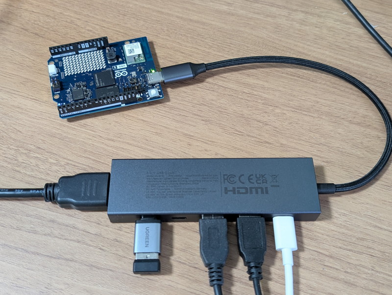

Raspberry Piではカメラやディスプレイを接続できるコネクタが装備されていますが、Arduino Uno Qではそのような用途のために[メディアキャリアボード](https://ssci.to/11135)が用意されています。今回はこれを使用してみることにしました。

## メディアキャリアボードの概要

購入したメディアキャリアボードです。

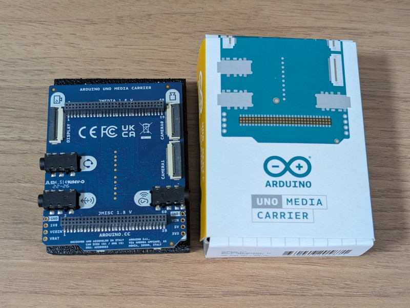

写真のようにMIPI-CSIカメラが2台、組み込み用ディスプレイが1台、スピーカー、マイク、イヤホンが接続できます。他にもカラーLEDが4個搭載されていてシステムの状態を知らせることもできます。

Arduino Uno Qとは2つの小型コネクタで接続し重ね合わせる構造です。

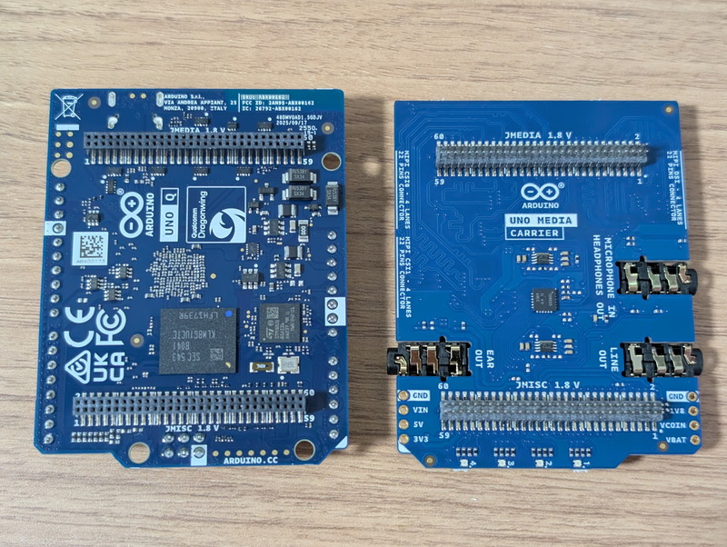

Arduino Uno Qのメスコネクタにメディアキャリアボードのオスコネクタを差し込んで重ねて使用します。ピン間隔も狭くピン数も多いので取り付けの際は十分注意してください。

## カメラの取り付け

Arduino Uno Qのカメラ用CSIコネクタは22ピンでRaspberry Pi 5やZeroと同じ仕様です。手元にあるカメラは15ピンタイプなので、15ピン-22ピンの変換FPCケーブルを使用して接続します。

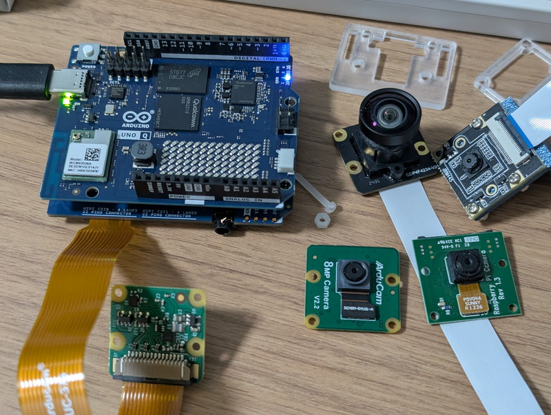

最初に3rdParty製のカメラ[ArduCam B0390](https://akizukidenshi.com/catalog/g/g117368/)を接続したところ認識してくれませんでした。3rdParty製なので何等かの追加設定が必要かもしれないので、他の用途で使用していた純正品の[Raspberry Pi カメラモジュール V2](https://akizukidenshi.com/catalog/g/g110518/)やRaspberry Pi カメラモジュール V1も接続してみましたが、なぜかこれらも認識できませんでした。

## カメラを認識しない原因

どうしてもカメラを認識しないのでカメラの動作確認用に[Raspberry Pi 4](https://akizukidenshi.com/catalog/g/g116834)を引っ張り出してきました。[Raspberry Pi Imager](https://www.raspberrypi.com/software/)でmicroSDに最新のRaspberry Pi OSを書き込んでカメラを接続しました。3rdParty製のカメラなので少しconfigファイルの設定が必要ですが、問題なく動作しました。もちろん、Raspberry Pi カメラモジュール V2とV1も正常に動作しました。

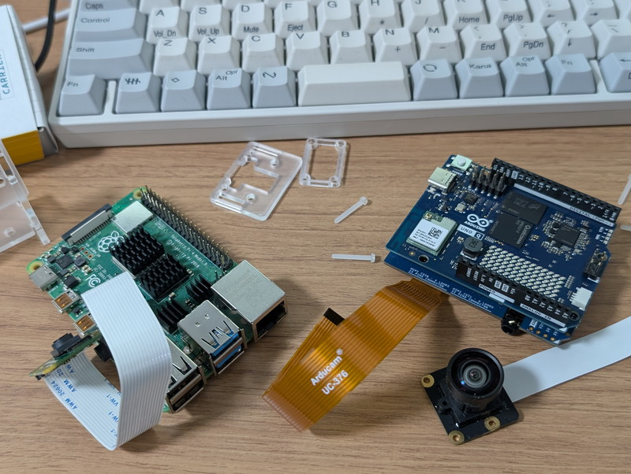

同じように[Raspberry Pi 5](https://akizukidenshi.com/catalog/g/g129325)でも確認し、15ピン-22ピンのFPCケーブルにも問題がないことを確認しました。

そういえば昔のRaspberry Pi OSではカメラを接続するときに、設定する画面があったなと思いだし、もしかしてUno Qでも同じような設定がないかと、ボードの設定画面をみてみました。すると、`Enable external carriers connected to your Arduino UNO Q`という設定を見つけました。

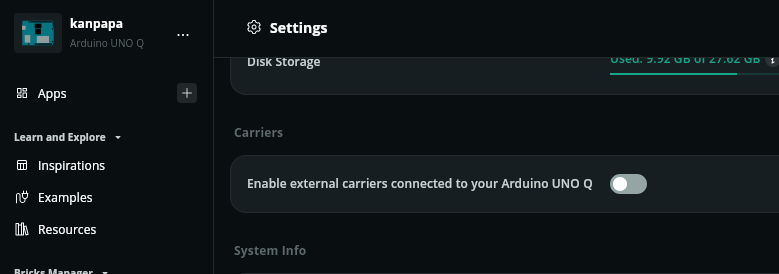

ここにキャリアボードを有効化するかのスイッチがありました。早速スイッチをONにしようとしたところ、次の画面が表示されました。

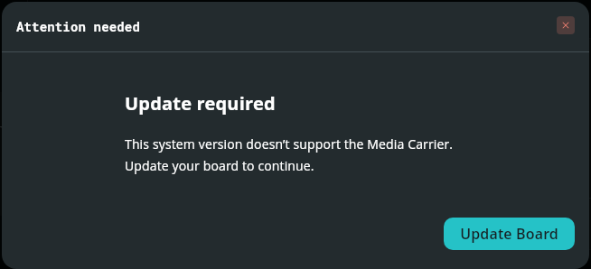

OSが古いので使えないとのことです。早速最新のOSに更新しましょう。

## Uno QのOSアップデート

現在のOSバージョンを確認したところ`20251210-442`でした。

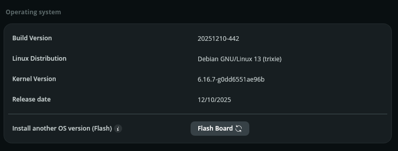

この画面のFlash boardのボタンをクリックしたところ、最新のOSバージョン`20260528-558`が表示されました。

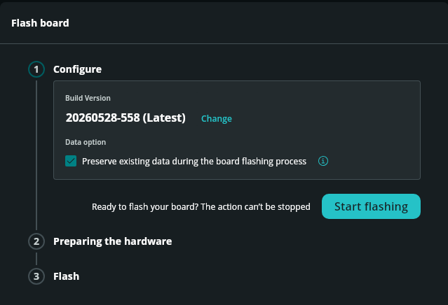

Latestバージョンに書き換えるために指示通りにアップデートを進めます。

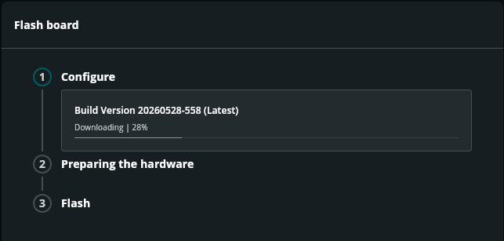

ダウンロードが終わると次の画面が表示され、一度電源を切ってジャンパーを接続せよとのことです。

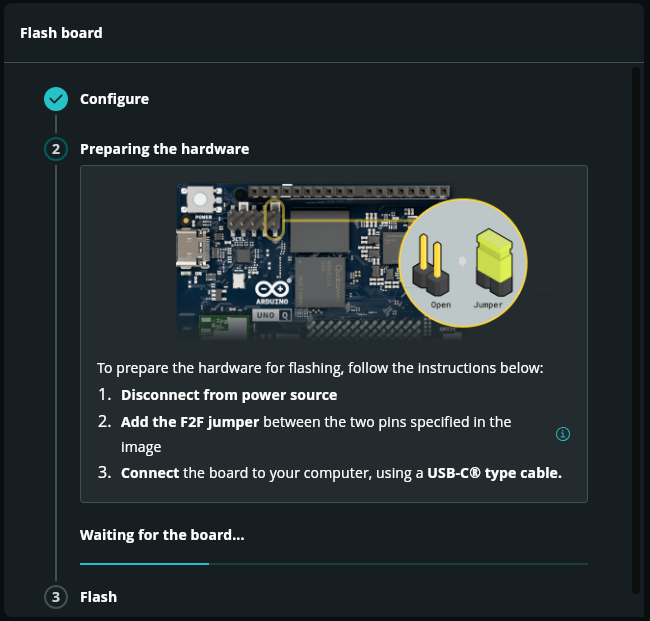

指示通りにジャンパーを接続して、再度USB-Cに接続しました。

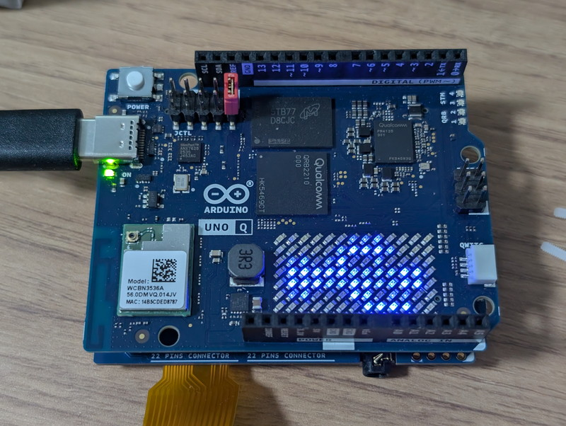

Arduino Uno QのLEDマトリクスにはUSBのようなマークが表示され、書き込みモードになってはいるようです。しかし、`Waiting for the board...`のまま画面上は何も変化が無く先に進んでいないように見えます。しかし、正常に書き込み中の可能性もあるので、しばらくこのまま見守ります。

これまでの作業はUbuntu版のArduino App Labで行っていますが、Windows版で行うべきだったかと不安になってきました。

## Windows版でOSアップデート

やはりアップデートが進んでいないようなので、Arduino App LabをUbuntu版からWindows版に変更して再度OSアップデートを行ったところ、Flashの書き込みが始まりました。

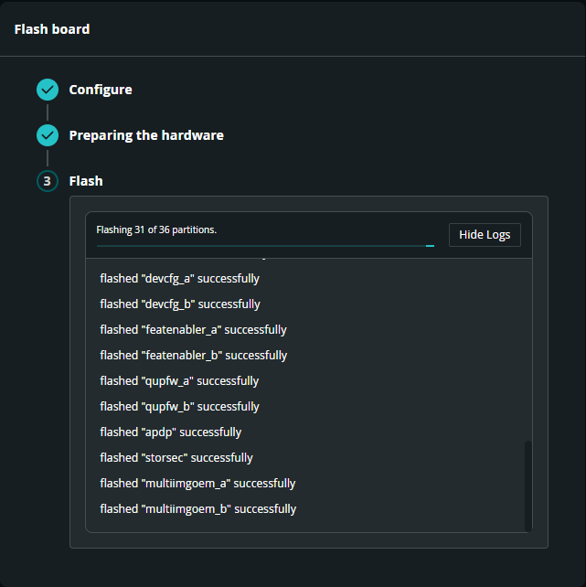

次々とファームウェアが書き込まれて完了しました。

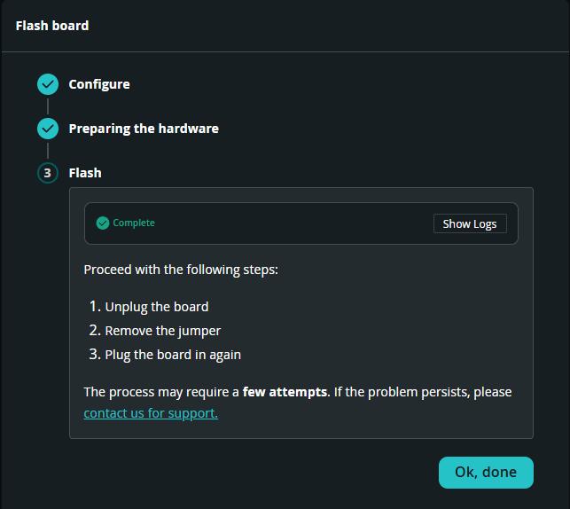

引き続きソフトウェアアップデートも行われこちらも無事完了しました。

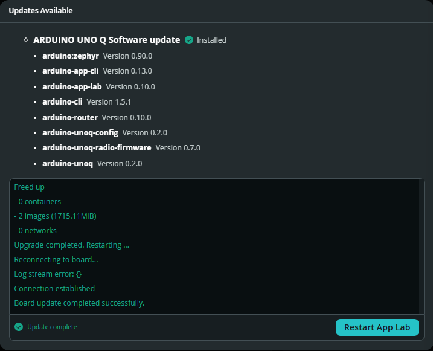

OSのビルド番号を確認したところ、Latestのバージョンに書き換わっています。

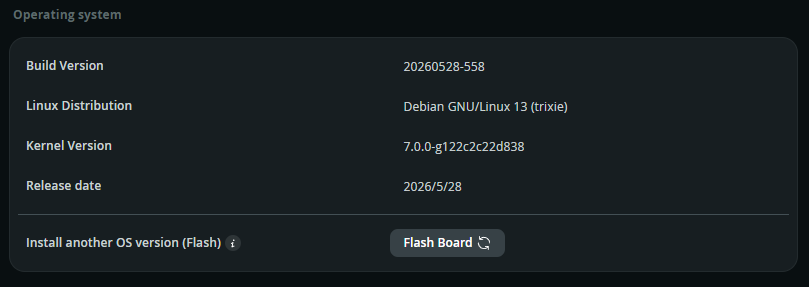

## キャリアボードの有効化設定

これでキャリアボードの有効化設定ができるはずです。設定画面からスイッチをONにしてみました。

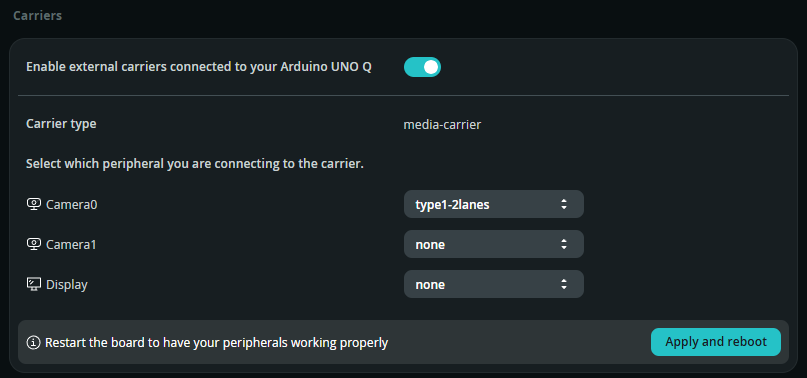

何を接続しているかの選択画面になりましたので、今回はカメラ0を設定しました。

## AI物体認識の実験

これでカメラが使えるようになりました。Arduino App Labのインスピレーションにあるサンプルプログラム Detect Objects on Camera を動かしてみます。

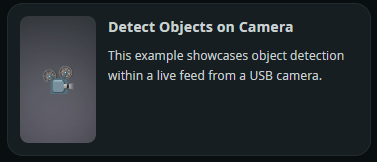

無事にカメラの画像が表示され、物体認識までできています。

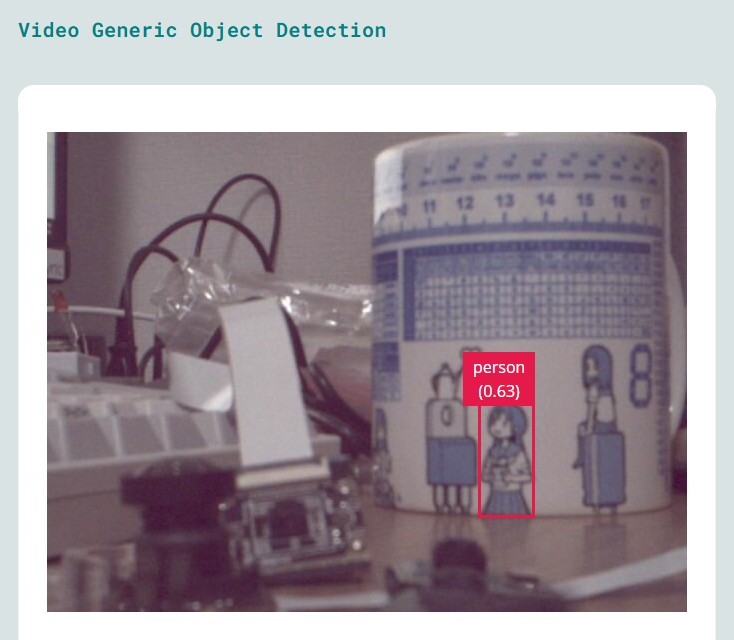

結構素早く認識ができているように思われます。
最終的な動作確認結果は以下のようになります。

**Detect Objects on Cameraでの各カメラの動作確認結果**

| カメラ | センサ | レーン | 動作確認結果 |
| --- | --- |--- | --- |
| Camera Module v2 | IMX219 / 8MP | CSI-2 2-lane | 〇 |
| Arducam B0390 | IMX219 / 8MP | CSI-2 2-lane | 〇 |
| Camera Module v1 | OV5647 / 5MP | CSI-2 2-lane | × |

やはりCamera Module v1では動作しませんでした。手持ちのカメラでは4レーンに対応したものは無いため、Camera Module v3等での動作確認はできていません。

## まとめ

最近はローカルLLMを使っていることもあり、大部分の作業をGPU搭載のUbuntuデスクトップで行っています。

今回のトラブルの原因はArduino Uno QのOSが古くメディアキャリアボードに対応していなかったためですが、Arduino Uno Qの購入時からUbuntu版のArduino App Labを使用していたので、本来であれば最初に起動したとき自動更新されるべきものが更新できていなかったのではと考えられます。

これまでもそうでしたが、ファームウェアのアップデートなどハードウェアに強く依存した処理についてはWindows版で行うのが良さそうです。
