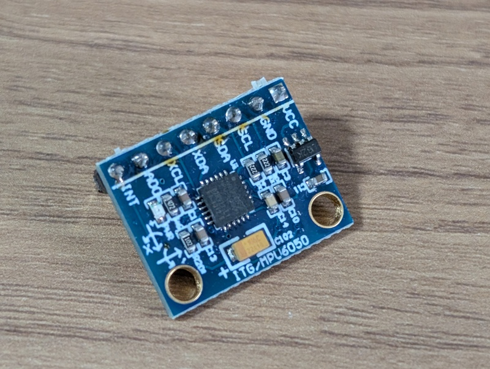
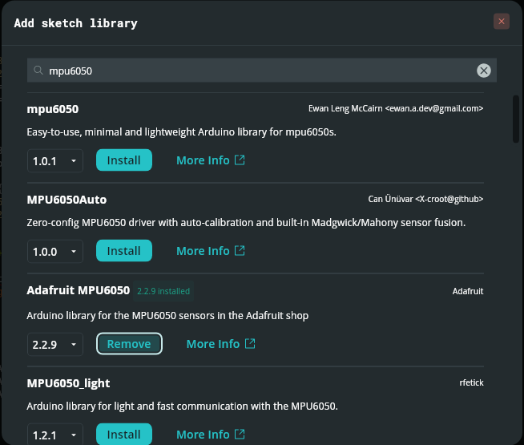
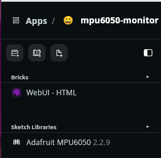
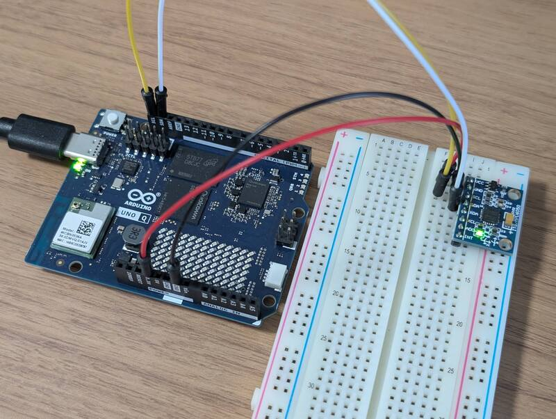
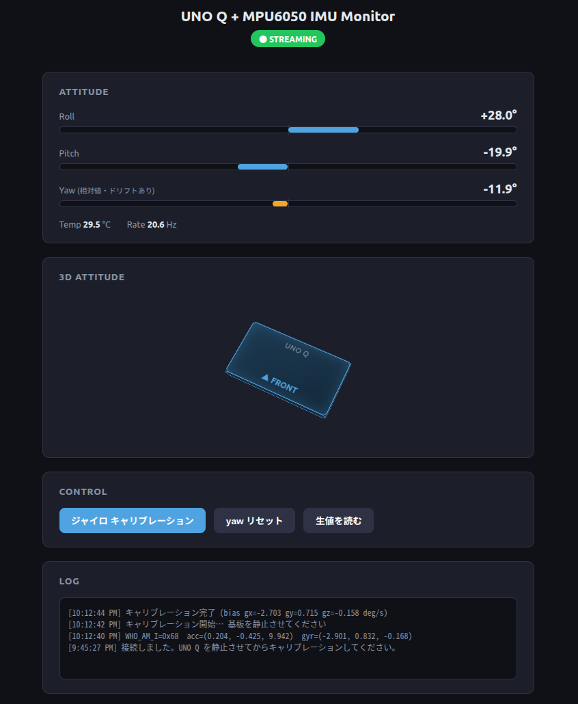

## はじめに

前回、[Arduino App LabのBrick](/2026/09/arduino-uno-q-blink-led-webui.html)を使ってLEDの点灯状態をブラウザにリアルタイム表示する実験を行いました。  
今回は手持ちの6軸慣性センサー **MPU6050（GY-521モジュール）** をUNO Qに接続し、姿勢角をWebUI上にリアルタイム表示することに挑戦してみます。



全体の処理分担と構成方針は以下のようにシンプルにしました。

- **MCU側（sketch）**：MPU6050から生データを読み取り、姿勢角（roll / pitch / yaw）まで計算する
- **Python側（Linux側）**：Bridge経由でその計算結果を受け取り、WebUI（Socket.IO）へ配信する

100Hz程度の等間隔サンプリングが必須となる積分処理を、Linux側のスケジューラによる揺れから切り離したかったのが主な理由です。

## ハードウェア構成

GY-521モジュール（MPU6050搭載）をUNO Qに接続します。

| MPU6050 | UNO Q | 備考 |
|---|---|---|
| VCC | 3V3 | UNO QのGPIOは5Vトレラントではないため3.3Vを供給 |
| GND | GND | |
| SDA | A4 (SDA) | ※実はD20が正解（詳細は後述） |
| SCL | A5 (SCL) | ※実はD21が正解（詳細は後述） |
| AD0 | GND または未接続 | 未接続でも内部プルダウンによりI2Cアドレスは `0x68` |

MPU6050の設定パラメータは、DLPF 44Hz、±250dps、±2g といった標準的な値にしています。加速度センサから算出した絶対角と、ジャイロセンサの積分値を相補フィルタ（α=0.98）でブレンドして roll / pitch を求めました。なお、yawに関しては地磁気センサがないためジャイロ積分のみ（ドリフトを含む相対値）としています。

## MPU6050のスケッチライブラリの追加

スケッチを書く前にArduinoのMPU6050のライブラリをインストールします。すでに有名なセンサーであれば便利なライブラリが揃っており、Arduino App Labでも利用できます。

Arduino App LabのAdd Sketch Libraryのアイコンをクリックするとライブラリのリストが表示されます。今回は`Adafruit MPU6050`を使用しました。



ライブラリが追加されると`Sketch Libraries`に表示されます。



## I2Cが繋がらない

配線を済ませてsketchを書き込み、生値を読んでみたところLOGでは加速度もジャイロもすべて0しか返ってきていません。

```
[4:57:08 PM] WHO_AM_I=0xFF  acc=(0.0, 0.0, 0.0)  gyr=(0.0, 0.0, 0.0)
[4:57:06 PM] WHO_AM_I=0xFF  acc=(0.0, 0.0, 0.0)  gyr=(0.0, 0.0, 0.0)
[4:57:03 PM] WHO_AM_I=0xFF  acc=(0.0, 0.0, 0.0)  gyr=(0.0, 0.0, 0.0)
```

ここから原因究明のための切り分け作業を行いました。

1. GY-521モジュールの電源LEDは点灯している → 電源供給は正常
2. テスターによるI2Cラインの導通確認 → 配線・接触自体には問題なし
3. [Uno Qのピンアウト](https://docs.arduino.cc/resources/pinouts/ABX00162-full-pinout.pdf)を見直したところ、D20/D21に別のI2Cポート(I2C2)の記載があったため、配線をD20/D21コネクタ側へ差し替えたところ、無事にセンサーの値が返ってきました。

```
[5:01:16 PM] WHO_AM_I=0x68  acc=(0.213, -0.409, 9.977)  gyr=(-2.908, 0.802, -0.191)
[5:01:10 PM] WHO_AM_I=0x68  acc=(0.186, -0.427, 9.972)  gyr=(-3.0, 0.779, -0.145)
[5:01:05 PM] キャリブレーション完了 (bias gx=-2.78 gy=0.748 gz=-0.17 deg/s)
[5:01:04 PM] キャリブレーション開始… 基板を静止させてください
[5:01:01 PM] 接続しました。UNO Q を静止させてからキャリブレーションしてください。
```

> UNO QではA4/A5(I2C3)とD20/D21(I2C2)とQwiic(I2C4)はそれぞれ独立したI2Cインターフェースです。I2Cが認識されないときは、従来のArduino感覚で`A4`/`A5`を使うのではなく、もう一つの`SDA`/`SCL`（数字の付いていないピン）に接続して確認してみてください。



## Bridge APIの設計

MCUとPython（Linux）間の通信は、メソッド名やデータ型を厳密に固定して設計しました。ここが1文字でも異なると、例外エラーも出ずに無言で通信が失敗してしまうため注意が必要です。

**MCU → Python（push）**

| メソッド名 | 引数 | 説明 |
|---|---|---|
| `imu_data` | roll, pitch, yaw, temp (float×4) | 20Hz周期で姿勢角と温度をpush |

**Python → MCU（call）**

| メソッド名 | 引数 | 戻り値 |
|---|---|---|
| `imu_calibrate` | samples: int | JSON文字列でバイアス値を返却 |
| `imu_reset_yaw` | dummy: int | JSON文字列 `{"ok":true}` |
| `imu_read_raw` | dummy: int | JSON文字列で生値を返却 |

戻り値をJSON文字列にまとめているのは、App LabのBridge内部で使われているmsgpack-RPCの仕様上、戻り値として単一の値しか返せない制約があるためです。

## WebUI表示

WebUI-HTML Brickを使用し、Socket.IO経由で10Hz程度に間引いてブラウザへbroadcast配信しました。画面上にroll/pitch/yawの数値をバー表示するだけでなく、渡すデータがすべて明確な数値型や真偽値になるよう徹底しています（前回のBlink実験で「文字列と真偽値の型不一致」にハマった反省を活かしました）。



## CSSだけで3D表示

Three.jsなどのリッチな外部ライブラリは使わず、CSSの `perspective` と `rotateX/Y/Z` だけで「板が傾く」簡易3D表示を実装してみました。

```css
.scene3d {
  perspective: 700px;
}
.board3d {
  transform-style: preserve-3d;
  transition: transform 0.08s linear;
}

board.style.transform =
  `rotateZ(${d.roll}deg) rotateX(${-d.pitch}deg) rotateY(${d.yaw}deg)`;
```

これだけのコードですが、MPU6050モジュールを手で傾けると、WebUI画面内の板が連動してリアルタイムに同じ方向へ傾いてくれます。CSSの3Dトランスフォームだけでここまで手軽に視覚化できるのは、嬉しい発見でした。



## まとめ

- MPU6050（GY-521）自体のI2C制御や相補フィルタ計算は定番の手法で問題なく動作し、Arduino IDEでおなじみのライブラリもスケッチで利用できました。
- 今回最大のハードルは、UNO QのI2Cピン配置が従来のArduinoシールド配置（A4/A5）とは異なっていたことでした。
- Bridge経由でPython側にデバック情報を中継し、WebUIに表示することで、デバッグをスムーズに行うことができました。
- Bridge APIを定義する際は、メソッド名と型をあらかじめ仕様書として固めておくことで手戻りを防げます。
- CSSの3Dトランスフォームで、センサデータの表示を立体的に表現できました。

今回のスケッチおよびPythonスクリプト一式は、[GitHubリポジトリ](https://github.com/kanpapa/mpu6050-monitor) に公開しています。
