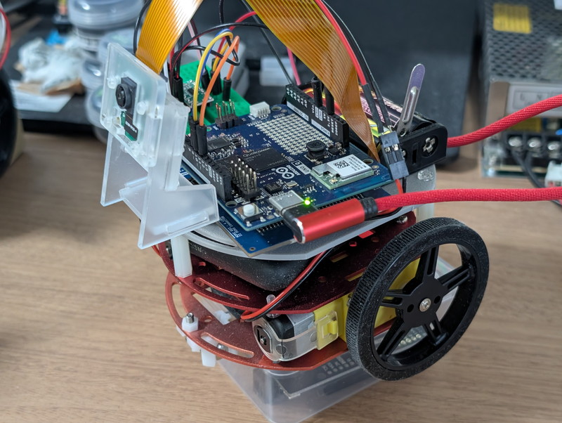

前回は[Arduino Uno Qにメディアキャリアボードを取り付けて、接続したMIPIカメラでの物体認識](/2026/09/arduino-uno-q-media-carrier-board.html)
を行いました。これまでArduino Uno Qで試してきたものを統合してAIロボットカーを製作してみます。
これまでの振り返りです。
- [Arduino Uno Qを触ってみました](/2026/09/arduino-uno-q-1.html)
- [Arduino Uno QでLチカの状態をブラウザにリアルタイム表示する](/2026/09/arduino-uno-q-blink-led-webui.html)
- [Arduino Uno Qでモーションセンサーを使ってみた](/2026/09/arduino-uno-q-mpu6050-webui.html)
- [Arduino Uno Q メディアキャリアボードでカメラを接続する](/2026/09/arduino-uno-q-media-carrier-board.html)

## 要件定義

ゼロから組み立てるよりはArduino App Labのインスピレーションのプロジェクトを流用することを考えます。先日まで実験していた[ESP32S3 Senseの物体認識でロボットカーを動かす](/2026/09/otafab-esp32-arduino-robotcar-ai-1.html)ものと同様なものを製作してみます。

AIロボットカーの要件は以下の通りです。
- 何らかの物体を認識したら前進する。
- 物体を認識できていない場合は停止する。

最初はシンプルな機能にして、徐々に機能を拡張していきます。

## 開発方針

ベースとなるプロジェクトはメディアキャリアボードの時に動かしてみた[Detect Objects on Camera](https://github.com/arduino/app-bricks-examples/tree/main/inspirational/common/video-generic-object-detection)が良さそうです。このプロジェクトはカメラ画像からの物体認識とWebUIによるモニタリングや制御ができます。このプロジェクトはLinux側(Python)だけで動作しており、MCU側は使用していないためスケッチはありません。このため次のように進めてみます。
1. ベースとなるDetect Objects on Cameraを動かす。
1. MCU側のスケッチを作成し、モータードライバを制御できるようにする。
1. Brigde機能で、Linux側のPythonスクリプトからMCU側のスケッチに物体認識結果を送信する
1. MCU側のスケッチで物体認識結果に合わせてモーターを制御する。

PythonからMCU側への通信はこれまで試してきた内容から、Bridgeを使えば良いはずです。要件も前進と停止だけですので、MCUに渡す情報は0か1かの世界です。

## MCU側のスケッチの作成

ESP32S3 Senseで実験しているロボットカーを流用しますので、モータードライバは秋月電子のDRV8835モジュールを使用します。PWM制御で回転数を制御しますので、PWMが使用できるArduino Uno Qの端子を使用します。
今回は以下の表のように設定しました。

| DRV8835ピン| 接続先 | 説明 |
|:---:|:---:|:---:|
| VM | 単3電池 (+) | モーター電源（約3V）|
| AOUT1 | モーターA(+) | 左輪モーター |
| AOUT2 | モーターA(-) | 左輪モーター |
| BOUT1 | モーターB(+) | 右輪モーター |
| BOUT2 | モーターB(-) | 右輪モーター |
| GND | 単3電池 (-) ＆ Uno Q GND | 共通グラウンド（必ず共通接続）|
| VCC | Uno Q 3.3V | ロジック電源 |
| MODE | GND | IN/INモード（常時GNDに接続）|
| AIN1 | Uno Q D3 (PWM) | 左モーター 前進 |
| AIN2 | Uno Q D9 (PWM) | 左モーター 後退 |
| BIN1 | Uno Q D10 (PWM) | 右モーター 前進 |
| BIN2 | Uno Q D11 (PWM) | 右モーター 後退 |

ここではモーターの配線は行なわず、スタンドアロンテストとしてモータードライバをLEDに見立ててテストを進めます。
MCUに接続されているRGB LEDは２個ありますので、LED3をモーターA、LED4をモーターBとし、モータードライバの入力ピンのIN1がHIGHは赤、IN2がHIGHは青、両方ともLOWの場合は消灯となるスケッチを作成します。

Arduino App Labで以下のsketch.inoを作成しました。
```
/*
 *   Uno Q Robot Car -- MCUスケッチ
 */

// DRV8835 ピン設定
const int MOTOR_L_IN1 = 3;  // D3 (PWM)
const int MOTOR_L_IN2 = 9;  // D9 (PWM)
const int MOTOR_R_IN1 = 10; // D10 (PWM)
const int MOTOR_R_IN2 = 11; // D11 (PWM)

const int DRIVE_SPEED = 200;

// 前進（LED点灯: 赤）
void moveForward() {
  analogWrite(MOTOR_L_IN1, DRIVE_SPEED);
  analogWrite(MOTOR_L_IN2, 0);
  analogWrite(MOTOR_R_IN1, DRIVE_SPEED);
  analogWrite(MOTOR_R_IN2, 0);

  // アクティブLOW（LOWで点灯）
  digitalWrite(LED3_R, LOW);
  digitalWrite(LED3_B, HIGH);
  digitalWrite(LED4_R, LOW);
  digitalWrite(LED4_B, HIGH);
}

// 停止（LED消灯）
void stopMotors() {
  analogWrite(MOTOR_L_IN1, 0);
  analogWrite(MOTOR_L_IN2, 0);
  analogWrite(MOTOR_R_IN1, 0);
  analogWrite(MOTOR_R_IN2, 0);

  digitalWrite(LED3_R, HIGH);
  digitalWrite(LED3_B, HIGH);
  digitalWrite(LED4_R, HIGH);
  digitalWrite(LED4_B, HIGH);
}

void setup() {
  pinMode(MOTOR_L_IN1, OUTPUT);
  pinMode(MOTOR_L_IN2, OUTPUT);
  pinMode(MOTOR_R_IN1, OUTPUT);
  pinMode(MOTOR_R_IN2, OUTPUT);

  pinMode(LED3_R, OUTPUT);
  pinMode(LED3_B, OUTPUT);
  pinMode(LED4_R, OUTPUT);
  pinMode(LED4_B, OUTPUT);

  stopMotors();
}

void loop() {
  startMotors();
  delay(500);
  stopMotors();
　delay(500);
}
```
スケッチを作成したらArduino App LabでRUNを実行します。

物体認識はそのまま動作しつつ、LEDが指示した通りに点滅し続けます。デュアルプロセッサであることがよくわかる動きです。

## Pythonとスケッチを連携する

ここでBridgeを使用してPythonとスケッチを連携します。物体を認識したらMCU側のLEDが光るようにします。
Python側は以下のように追記しました。（主要な部分のみを記載）

```python
def update_motor(should_move: int):
    global current_state
    new_state = 1 if should_move > 0 else 0
    
    if new_state != current_state:
        current_state = new_state
        try:
            bridge.call("motor_state", new_state, timeout=5)
        except Exception as e:
            print(f"Bridge call error: {e}")

def send_detections_to_ui(detections: dict):
    global last_detection_time
    total_detected = sum(len(items) for items in detections.values())
    
    if total_detected > 0:
        last_detection_time = time.time()
        update_motor(1)
```

スケッチ側は以下のように追記しました。（主要な部分のみを記載）

```c++
String rpc_motor_state(int state) {
  if (state > 0) {
    moveForward();
  } else {
    stopMotors();
  }
  return "{\"ok\":true}";
}

  // Bridge 通信の開始とRPC登録
  Bridge.begin();
  Bridge.provide("motor_state", rpc_motor_state);
```

再度App LabでRUNを行い、新しいプログラムを書き込みます。
無事に動作することが確認できました。

## 物体が認識できないときに停止する

ただし、ここで問題がありました。物体を認識していないときもLEDが点灯したままになってしまいます。認識した場合は通知が来ますが、認識できなくなったときは通知はありません。このためウオッチドッグタイマーを設定して0.5秒間隔で認識できているかどうかをチェックするように改良しました。
今回はpythonで行っています。

```python
# 0.5秒間検知が途切れたら停止と判定
TIMEOUT_SEC = 0.5

def watchdog_loop():
    global last_detection_time, current_state
    while True:
        if current_state == 1 and (time.time() - last_detection_time > TIMEOUT_SEC):
            update_motor(0)
        time.sleep(0.05)
```

この修正で物体を認識しているときだけLEDが光るようになりました。



## モータードライバを接続する

スタンドアロンでテストが完了しましたので、ロボットカーの筐体にArduino Uno Qやカメラを組み込みます。モータードライバもArduino Uno Qに接続します。



## ロボットカーの動作確認

ロボットカーの動作確認を行います。いきなり暴走する可能性もありますので、車輪が宙に浮く状態にしてモーター電源を投入します。物体認識を行うとLEDが点灯し、モーターが回転しました。



これで要件通り物体が認識したら前進し、認識できない場合は停止するロボットカーができました。

## まとめ

今回は非常にシンプルな機能に限定していますが、WebUIにリアルタイムで表示されているような物体の種類や、位置といった情報もPython側では取得できています。次回はこれらをMCU側に連携して少し高度な動きを試してみます。

Bridgeで複数の情報を引き渡すにはJSON文字列にして送信すればよいことはこれまでの実験からもわかっているので、難しくはなさそうです。あとはアイデア次第です。

Arduino App Labを使うとLinux側とMCU側の連携も容易で再利用可能なパーツであるBrickも揃っています。インスピレーションにある豊富な事例を参考にして独自のものも作成しやすいはずです。

また、Arduino Uno Qは小型で機器に組み込みやすく、ヒートシンクも今のところは不要そうですし、消費電流もそんなに大きくないため、電源周りも楽だと思います。ひとつ残念な点はメディアキャリアボードにネジ穴が無いことです。そのため今回のロボットカーではネジでの固定ができていません。キャリアボードの下にコネクタだけのボードを接続してネジ止めができるようにすると良いかもしれません。

なお、本プロジェクトのソースコードは[GitHub](https://github.com/kanpapa/uno-q-robotcar/)に置いてありますので参考にしてください。
