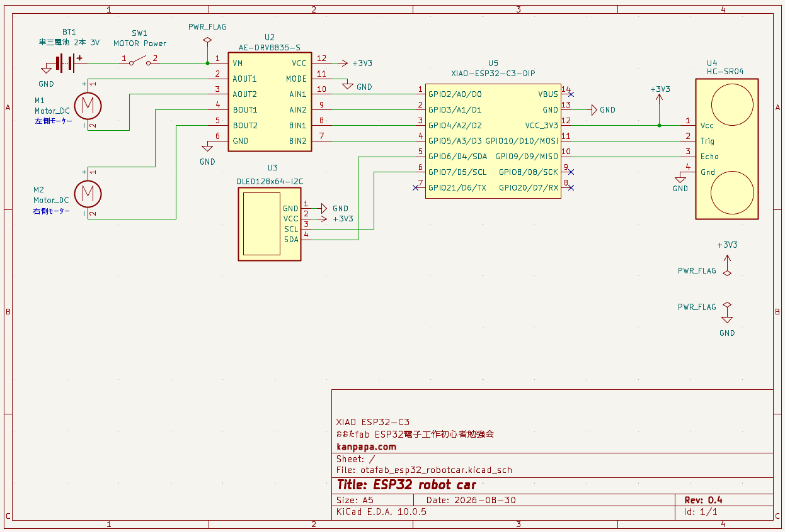
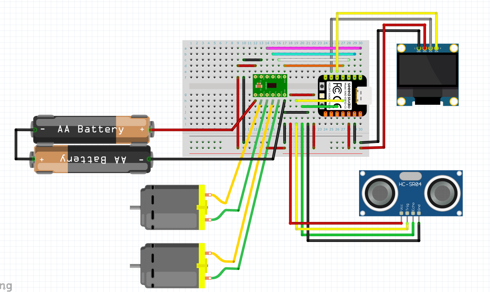
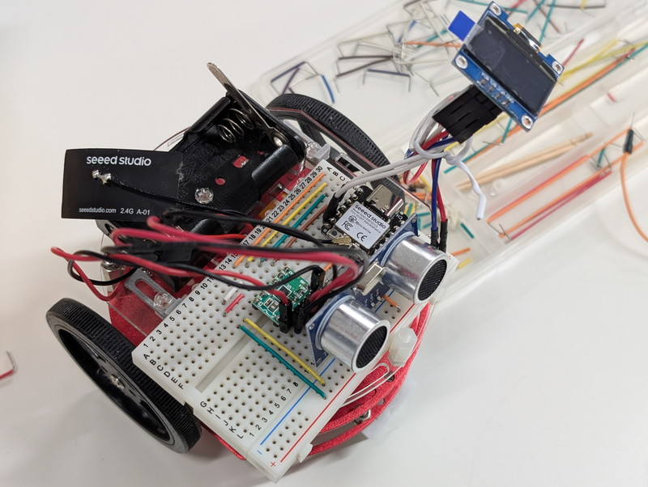
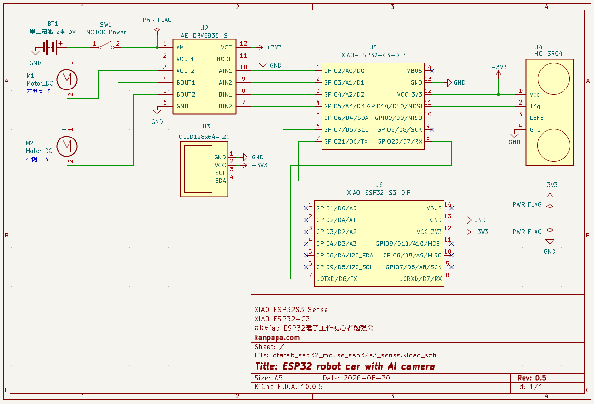
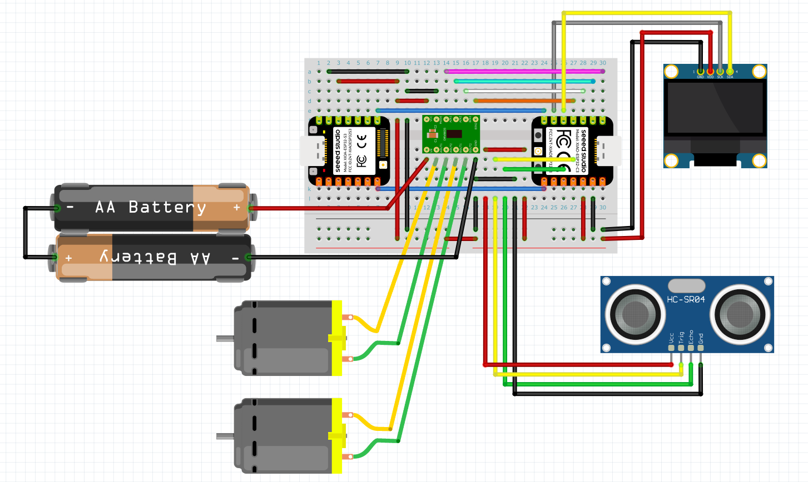
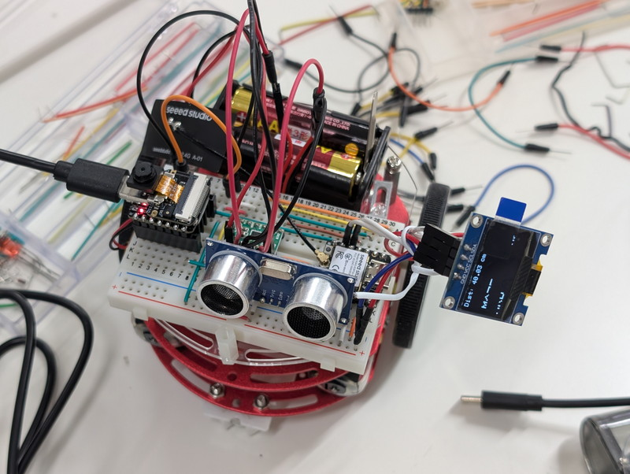
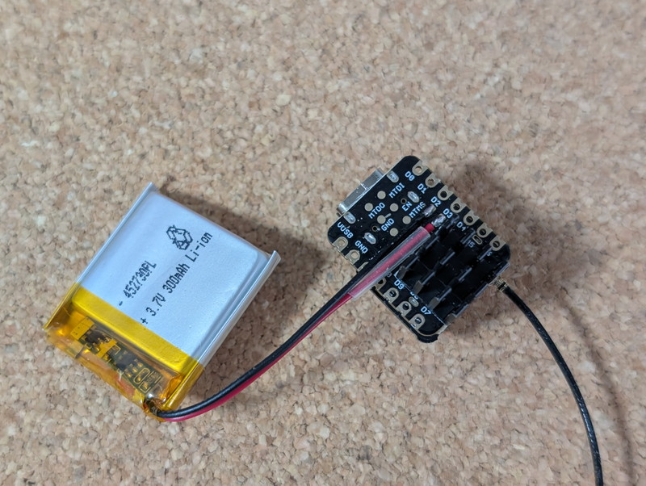

[おおたfab](https://ot-fb.com/event)さんでは電子工作初心者勉強会を定期的に開催しています。  
[前回](/2026/08/otafab-esp32-arduino-sensecraft-ai-1.html)はSeeedStudioのXIAO ESP32S3 SenseとSenseCraft AIで物体認識ができることを確認しました。
今回はこの仕組みを用いて、実際に走るロボットカーに応用してみます。

## ロボットカーの基本構成

これまで電子工作初心者勉強会で製作してきたESP32ロボットカーの基本構成と電子回路について紹介します。

### ロボットカーの主要パーツ

ESP32ロボットカーを構成している主要パーツは以下の通りです。なるべく安価で様々な実験ができるようにしています。

- マイコン：XIAO ESP32C3
- モータ：DCモータ 2個
- モータードライバ：DRV8835
- 超音波距離センサー：HC-SR04
- モーター電源：単３電池 2本
- マイコン電源：モバイルバッテリー
- 本体シャーシ：秋月電子のキット

### ロボットカーの回路

ESP32ロボットカーの回路図を示します。シンプルな構成ですが、超音波センサー、画面表示、モーター制御といった基本機能が使用できます。

これをブレッドボードで配線すると以下のようになります。

### ロボットカーの実装

パーツを実際に実装したロボットカーの写真です。

### サンプルスケッチ

ロボットカーのESP32C3にはArduino IDEでスケッチを書き込みます。サンプルとして超音波センサーで壁を検知すると右方向に回転してぶつからないような動きをするスケッチを作成しました。
このスケッチはGitHubリポジトリにあります。GitHubのリンクは以下のリンクになります。

- [esp32_minicar_maze_solver.ino](https://github.com/kanpapa/esp32-minicar/tree/main/Arduino/esp32_minicar_maze_solver/esp32_minicar_maze_solver.ino)

## AI機能の追加

これまで製作してきたロボットカーにAI機能を追加します。
今回は、ESP32S3 SenseとSenseCraft AIでロボットカーを制御してみます。

### ESP32S3 Senseの概要

ESP32S3 Senseは、ESP32S3をベースにエッジAIのプラットフォームとして設計されています。すぐ利用できる学習済モデルもSenseCraft AIで提供されています。
前回の勉強会ではESP32S3 Sense単体でジェスチャー認識ができることを確認しました。
SenseCraft AIの導入とモデルのデプロイについては[前回の記事](/2026/08/otafab-esp32-arduino-sensecraft-ai-1.html)を参照してください。

XIAO ESP32S3 Senseは他のXIAOシリーズとピン配置が共通なため、当初はESP32C3とそのまま差し替えれば動くのではと考えていました。
しかし、SenseCraft AIでモデルをデプロイした場合、認識結果に応じて特定の1箇所のGPIOへHIGH/LOWを出力する仕様になっています。ロボットカーの走行にはモーターごとに2ビットの制御信号が必要なため、単に差し替えるだけではモーターを制御できません。
さらに調べたところ、推論結果はUARTシリアル（JSON）でも出力されていることがわかったため、走行制御と推論をマイコンごとに分担させる構成が最適だと判断しました。そこで、ESP32S3 Senseを推論専用の「エッジAIセンサー」とし、UARTシリアル経由でESP32C3が結果を受け取ってモータードライバ（DRV8835）を駆動する構成にしました。

### AIロボットカーの回路

SenseCraft AIでデプロイすると認識結果はシリアル出力されるので、そのデータをロボットカーのマイコンESP32C3で解析し、それに応じてロボットを制御します。
ESP32S3 Senseをロボットカーに追加した回路図は以下のようになります。

これをブレッドボードで配線すると以下のようになります。

### AIロボットカーの実装

パーツを実際に実装したロボットカーの写真です。

### サンプルスケッチ

ESP32S3 Senseからシリアル接続で送られてくるデータ形式はJSONですが、Seeed_Arduino_SSCMAというArduino用ライブラリを使用することでスケッチで容易に取り扱うことができます。

- [Seeed_Arduino_SSCMA Library](https://github.com/Seeed-Studio/Seeed_Arduino_SSCMA)

これを使用したサンプルスケッチです。ジェスチャーの認識結果からロボットカーを前進、右回転、停止を制御するものです。

- [esp32_minicar_esp32s3_sense.ino](https://github.com/kanpapa/esp32-minicar/tree/main/Arduino/esp32_minicar_esp32s3_sense/esp32_minicar_esp32s3_sense.ino)

## マイコン電源の見直し

ロボットカーのマイコン回路の電源はこれまでモバイルバッテリーを使用していましたが、今回からリポバッテリーに切り替えてみました。

※リポバッテリーは過放電・ショートに弱いため、極性（プラス/マイナス）の間違いや取り扱いには十分ご注意ください。保護回路付きのセルの使用をおすすめします。  

ESP32C3やESP32S3にはリポバッテリーを接続する機能が搭載されているため、リポバッテリーをはんだ付けするだけで使用できます。  
秋葉原で300円で販売されていた保護回路付きのリポバッテリーを使用してみました。いまのところ問題なく利用できています。XIAOをUSBに接続するだけで充電してくれるので取り扱いが楽になりました。

## 次回

今回は時間の関係でAIロボットカーの組み立てまでを行いました。次回はAIロボットカーの動作確認を行います。  
うまく動作すればSenseCraft AIが提供している画像認識や音声認識といった様々な学習済モデルをAIロボットカーに組み込んで動作させることを計画しています。
