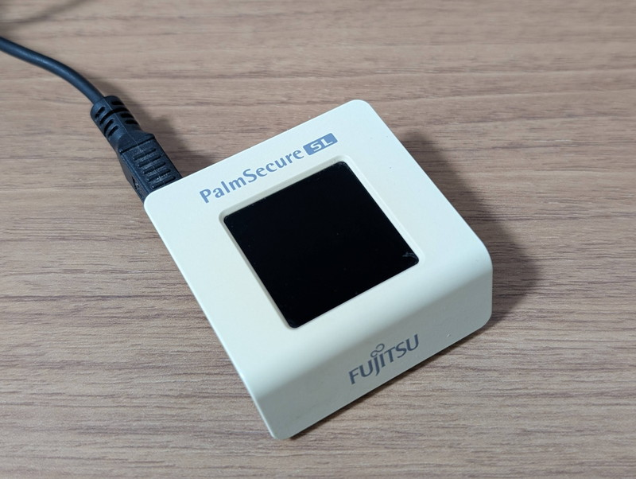
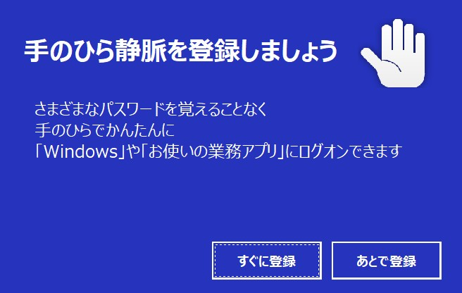
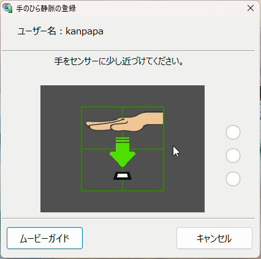
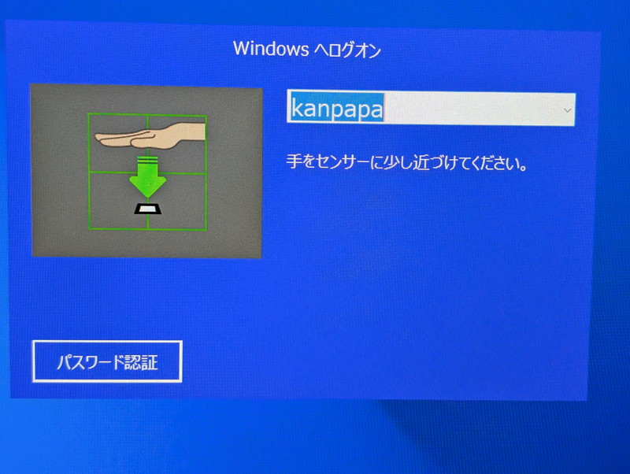
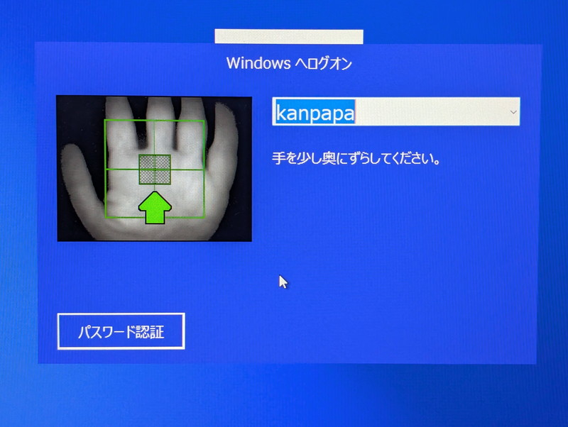

+++
date = '2026-03-30T08:44:47+09:00'
title = '300円の手のひら静脈認証デバイスを試してみました'
categories = ["Electronics"]
slug = '300yen-palmsecure-sl'
tags = ["PalmSecure"]
image = 'palmsecure-sl.jpg'
+++

> **【注意】** 本記事の内容はあくまでも実験です。Windowsの環境が壊れる可能性もありますので、自己責任で使用してください。販売店およびメーカーには決して問い合わせをしないでください。

Xを眺めていると気になるデバイスを見つけました。300円の手のひら静脈認証デバイス PalmSecure SLです。
USB接続のデバイスで古い物のようですがWindows11でも動くらしいとのことです。

早速購入してきました。購入時は少し煤けていましたが、湿った布で拭いたらきれいになりました。

## アプリケーションのインストール
アプリケーションはFMVサポートからダウンロードしました。これにはデバイスドライバも含まれます。

* [手のひら静脈認証BasicパックFMV-SLD01, FMV-SLD02セットアップディスク V1.0L12](https://azby.fmworld.net/app/customer/driversearch/pc/drvdownload?driverNumber=E1026634)

サポートOSはWindows 10までのようですが、もう手元にWindows 10のマシンはないのでWindows 11にインストールしました。途中ランタイムのインストールが失敗しますが、そのまま継続するとインストールできます。    
使用条件にもあるように「本ソフトウェアを使用した結果、損害が発生しても弊社は責任を負いません」とのことです。冒頭にも記載しましたが**自己責任で使用してください。**

## 静脈認証の登録

ダウンロードした静脈認証ソフトウェアですが、残念ながら独自のアプリケーションのため、Windows Helloには対応していません。
デバイスドライバとアプリケーションをインストールして再起動するとWindowsの認証画面が表示され、そのまま進むと次のような画面が表示されました。

「すぐに登録」を選んで静脈認証を設定します。
登録手順は丁寧に説明がありますが、面倒だったのが手の位置の調整です。手の位置を細かく指示されます。

手を認識すると画面に手のひらが表示され登録が完了ます。  
以前、ATMで静脈認証に対応したものがありましたが、その時は手の位置が固定されるような器具が取り付けてあったことを思いだしました。この位置ずれを少なくするためのものだったのだとわかりました。

## 静脈認証でのサインイン

静脈認証の設定が終わったところで実際にサインインできるか確認します。

やはりここでも手の位置を細かく指定されるので、その通りに手を動かします。

手の位置をいろいろ調整して無事サインインできました。

## まとめ

Windows 11で静脈認証でのサインインができるようにはなりましたが、Windows Helloではなく独自アプリによる認証のためあまり活用できなさそうです。  
この実験の終了後に静脈認証アプリケーションをアンインストールしてWindows Helloに戻してしまいましたが、Linux用のドライバやアプリがあれば面白いかもしれません。  
やはり毎回手の位置を調整する必要があるのはストレスを感じます。現在一般的に使われている顔認証がいかに素晴らしい技術であるかを再認識することができました。