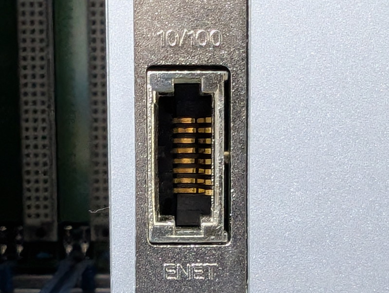
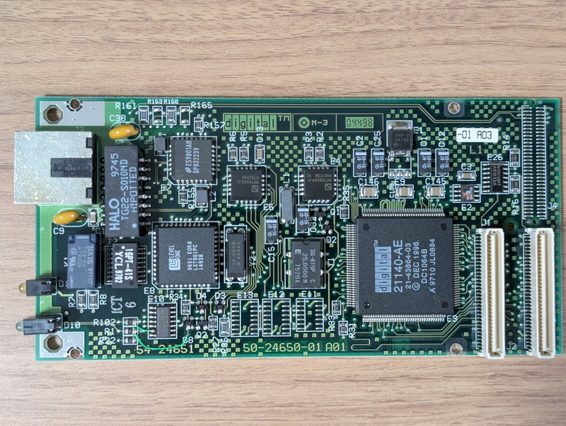
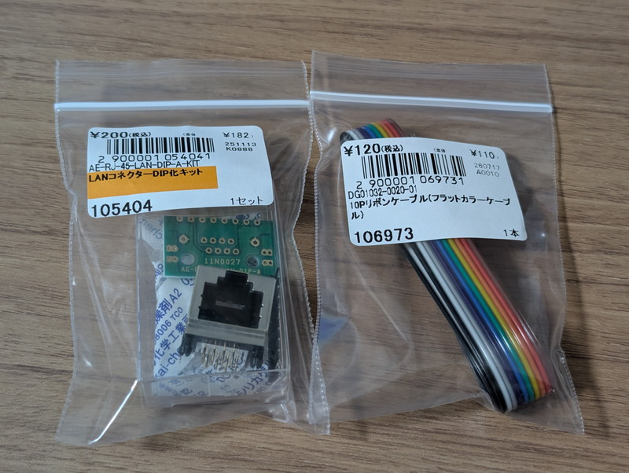
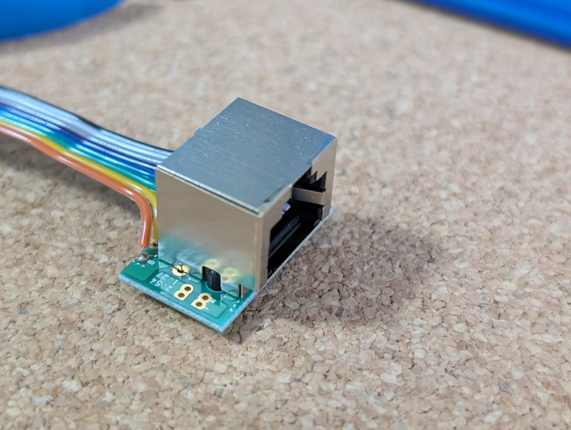
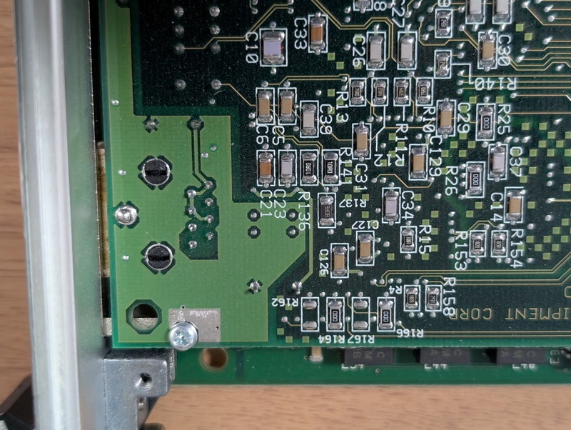
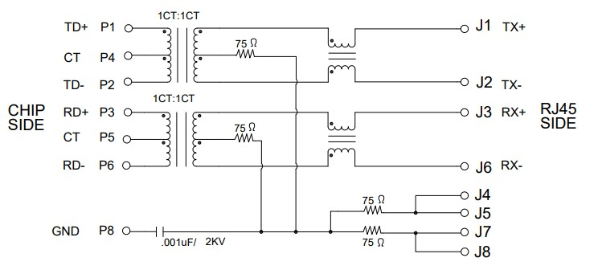
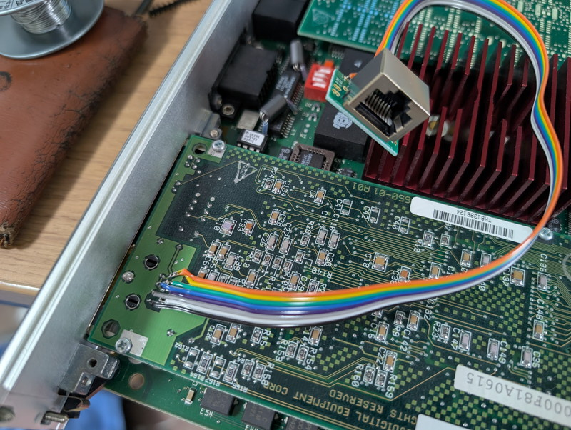
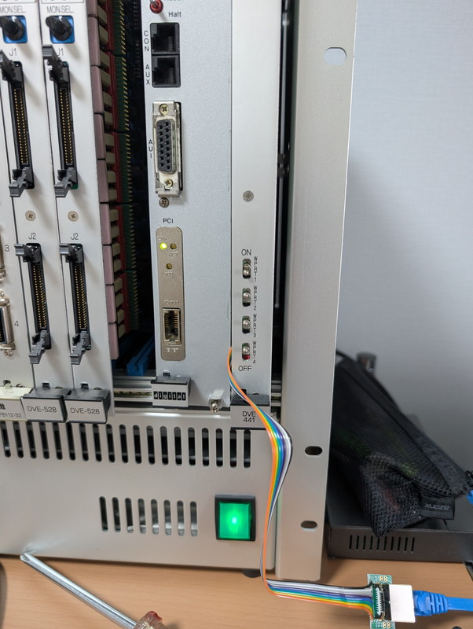
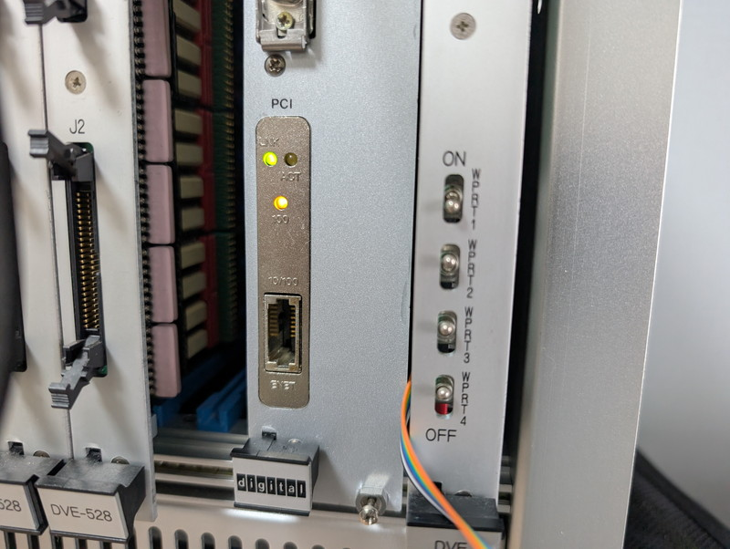
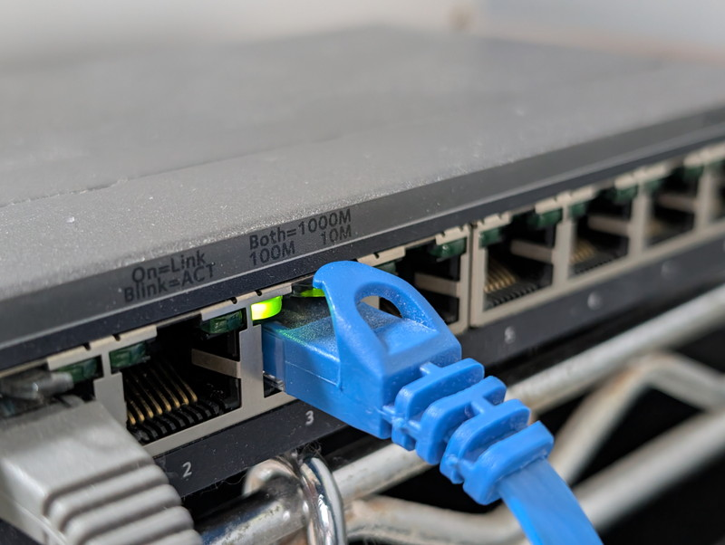

+++
date = '2026-07-26T11:49:39+09:00'
title = 'DEC AXPvme230で遊ぶ #11 PCI LANカードで100Mbpsにする'
slug = 'axpvme-vme-11'
tags = ["DEC", "AXPvme", "VME", "DECalpha", "AlphaAXP", "NetBSD"]
categories = ["Retro Computing"]
image = 'axpvme-pci-lan-100m.jpg'
+++

[前回](/2026/07/axpvme-vme-10.html)は[DEC AXPvme230](/2026/06/axpvme-vme-1.html)をVMEラックに搭載して動作確認を行いました。次のステップとして現在利用できていないPCI LANカードにネットワークを接続して100Mbpsに高速化します。

## PCI LANカードのコネクタ

入手したAXPvme230ボードにはLANカードが搭載されていました。しかし、このLANカードのコネクタが特殊で見たことが無いものでした。



いろいろ調べた結果、適合するプラグは見当たらないため、このコネクタは使わずに基板から直接ワイヤーで引き出すことにしました。

## PCI LANカードの確認

LANコネクタを接続するにあたって１点気になったのはパルストランスの存在です。現在販売されているLANコネクタにはパルストランス内蔵のものと無しのものがあります。多分この時代であればパルストランスは外付けと思われますが、念のため確認する必要があります。  
PCI LANカードの裏面からではわからないので、PCI LANカードを取り外して確認しました。



LANコネクタの周りにパルストランスが実装されています。この結果からワイヤーで引き出して接続するLANコネクタはパルストランス無しのものを使用します。

## LANコネクタの外付け用パーツ

カードの間から線を引き出すことになるので、秋月電子さんから[手頃なフラットケーブル](https://akizukidenshi.com/catalog/g/g106973/)と[LANコネクタDIP化キット](https://akizukidenshi.com/catalog/g/g105404/)を購入しました。



まずはフラットケーブルをLANコネクタDIP化キットにはんだ付けします。



## LANコネクタのピンの推測

PCI LANカードのコネクタは特殊なものでRJ45のピン配置と必ずしも一致しているとは限りません。
コネクタ部分を確認すると写真のようになっています。



プリントパターンで接続されているピンがいくつかありますので、これが目印になりそうです。  
参考としてパルストランス内蔵RJ45のデータシートをみてみると図のように記載されていました。



この回路図ではJ4, J5, J7, J8が抵抗とコンデンサを経由してGNDに接続されていることから、ピン番号は図のように推測できます。

```
|　〇
|  　     (8)
|    (7)--/
|     |   (6)---- RX-
|    (5)
|      \--(4)
|    (3)--------- RX+
|         (2)---- TX-
|    (1)--------- TX+
|　〇
```

これに従ってPCI LANカードのコネクタのハンダ面にフラットケーブルをはんだ付けして完成です。



## LANの接続確認

PCI LANカードに接続したフラットケーブルを隙間から引き出して、LANコネクタにLANケーブルを接続します。  
この状態で電源を投入したところPCI LANカードのLINK LEDが点灯しました。HUB側のLINK LEDも10Mbpsとして点灯しています。



これで10Mbpsは問題なく使えそうです。  
SRMコンソールのコマンドを確認して以下のコマンドで状態を確認しました。

```plain
>>>show device
ewa0.0.0.1.0               EWA0              00-00-F8-25-76-FC
ewb0.0.0.4.0               EWB0              00-00-F8-1A-06-15
pka0.7.0.2.0               PKA0                  SCSI Bus ID 7
>>>show ewb0_mode
ewb0_mode               Twisted-Pair
>>>
```

PCI LANカードは`ewb0`であることがわかります。通信モードは`Twisted-Pair`となっています。
通信モードには何が指定できるのかを確認してみます。

```plain
>>>set ewb0_mode
bad value - valid selections:
        Twisted-Pair
        Full Duplex, Twisted-Pair
        AUI
        BNC
        Fast
        FastFD (Full Duplex)
        Auto-Negotiate
bad value - ewb0_mode not modified
>>>
```

100MbpsのFull Duplexにする場合は`FastFD`にすれば良さそうです。

```plain
>>>set ewb0_mode FastFD
Change mode to FAST Full Duplex.
>>>
```

このコマンドを入力したらカチッというリレーの音がして、PCI LANカードの100のLEDが点灯しました。



HUBも100Mbpsになっています。



## ネットワークブートの準備

ネットワークブートを行う場合は今回接続したLANインターフェースのMACアドレスと付与するIPアドレスをTFTPサーバに設定する必要があります。  
実験用ネットワークのUbuntuデスクトップの`/etc/dnsmasq.conf`にPCI LANカードに対応する１行を追加し、PCI LANカードのMACアドレスには192.168.99.11のIPアドレスが割り当てられるようにしました。

```plain
interface=enp5s0
bind-interfaces
port=0
dhcp-range=192.168.99.10,192.168.99.50,255.255.255.0
dhcp-host=00:00:f8:25:76:fc,192.168.99.10
dhcp-host=00:00:f8:1a:06:15,192.168.99.11  # ←この行を追加
dhcp-boot=netboot
dhcp-option=17,/export/client/root
enable-tftp
tftp-root=/srv/tftp
```

## NetBSDをネットワークブート

SRMコンソールからbootコマンドを投入してネットワークブートをしてみました。
ブートストラップローダーやカーネルの読み込み時間が短くなったように思います。

```plain
>>>boot ewb0                    ←PCI LANからboot
(boot ewb0.0.0.4.0 -flags a)

Trying MOP boot.
..^C
>>>^C                           ←MOP bootを手動で中断
>>>set ewb0_protocols bootp     ←プロトコルがMOPだったので、BOOTPに変更
>>>show ewb0_protocols
ewb0_protocols          BOOTP
>>>boot ewb0　　　　　　　　　　　←再びboot
(boot ewb0.0.0.4.0 -flags a)

Trying BOOTP boot.

Broadcasting BOOTP Request...
Received BOOTP Packet File Name is: netboot
local inet address: 192.168.99.11
remote inet address: 192.168.99.1
TFTP Read File Name: netboot
netmask = 255.255.255.0
Server is on same subnet as client.
.
bootstrap code read in
base = 10a000, image_start = 0, image_bytes = f200
initializing HWRPB at 2000
initializing page table at fc000
initializing machine state
setting affinity to the primary CPU
jumping to bootstrap code

NetBSD/alpha 10.1 Network Bootstrap, Revision 1.9 (Mon Dec 16 13:08:11 UTC 2024)

VMS PAL rev: 0x1000700010538
OSF PAL rev: 0x1000c0002012d
Switch to OSF PAL code succeeded.

Boot flags: a
boot: ethernet address: 00:00:f8:1a:06:15
boot: client addr: 192.168.99.11
boot: client name:
boot: subnet mask: 255.255.255.0
boot: net gateway: 192.168.99.1
boot: server addr: 192.168.99.1
boot: server path: /export/client/root
13609712+303904 [661056+432596]=0xe50638

Entering netbsd at 0xfffffc0000a014d0...
[   1.0000000] axpvme: MCR1[0x2c00]: 0x10 -> wrote 0x10 readback=0x10
[   1.0000000] axpvme cons_init: Z8530 ChA RR0=0xd8 (TX_RDY=0 RX_RDY=0)
[   1.0000000] consinit: using prom console
[   1.0000000] Copyright (c) 1996, 1997, 1998, 1999, 2000, 2001, 2002, 2003,
[   1.0000000]     2004, 2005, 2006, 2007, 2008, 2009, 2010, 2011, 2012, 2013,
[   1.0000000]     2014, 2015, 2016, 2017, 2018, 2019, 2020, 2021, 2022, 2023,
[   1.0000000]     2024, 2025, 2026
[   1.0000000]     The NetBSD Foundation, Inc.  All rights reserved.
[   1.0000000] Copyright (c) 1982, 1986, 1989, 1991, 1993
[   1.0000000]     The Regents of the University of California.  All rights reserved.

[   1.0000000] NetBSD 11.99.6 (GENERIC-$Revision: 1.421 $) #124: Sun Jul  5 15:25:22 JST 2026
[   1.0000000]  ocha@ocha-ubuntu:/home/ocha/obj/sys/arch/alpha/compile/AXPVME
[   1.0000000] Digital AXPvme Model 230, 230MHz
[   1.0000000] 8192 byte page size, 1 processor.
[   1.0000000] total memory = 65536 KB
[   1.0000000] (2000 KB reserved for PROM, 63536 KB used by NetBSD)
[   1.0000000] avail memory = 38672 KB
[   1.0000000] mainbus0 (root)
[   1.0000000] cpu0 at mainbus0: ID 0 (primary), 21066-2 (LCA4)
[   1.0000000] lca0 at mainbus0
[   1.0000000] lca0: 512 KB Bcache detected
[   1.0000000] lca_dma_init: lc_bcache_size=524288 sync=bcache_evict
[   1.0000000] axpvme: master 8259 ICW2=0x08, OCW1=0xf9 (IRQ1+IRQ2 unmasked)
[   1.0000000] axpvme: HBEAT_CLR_REG(0x2000) written, IRQ1 latch cleared
　　：
```

しかし、NetBSDがブートした直後に10Mbpsに切り替わってしまいました。NetBSDでのデフォルトが10Mbpsになっているようです。

## NetBSDで100Mbpsに設定する

まずは手動でifconfigコマンドを入力して100Mbpsにできるかを試してみました。

```
# ifconfig tlp1 media 100baseTX mediaopt full-duplex
# ifconfig tlp1
tlp1: flags=0x8843<UP,BROADCAST,RUNNING,SIMPLEX,MULTICAST> mtu 1500
        ec_capabilities=0x1<VLAN_MTU>
        ec_enabled=0
        address: 00:00:f8:1a:06:15
        media: Ethernet 100baseTX full-duplex
        status: active
        inet6 fe80::200:f8ff:fe1a:615%tlp1/64 flags 0 scopeid 0x2
        inet 192.168.99.11/24 broadcast 192.168.99.255 flags 0
#
```

リレーの音がカチッとして100Mbpsに切り替わりました。NetBSDでのハードウェアのサポートは問題なさそうです。
起動のたびにこのコマンドを入力するのは面倒ですので、`/etc/rc.local`で自動的に切り替えるように設定しました。

```
# echo 'ifconfig tlp1 media 100baseTX mediaopt full-duplex' >> /etc/rc.local
```

これでNetBSDの起動時に強制的に100Mbpsに設定されるようになりました。

## まとめ

AXPvme230に搭載されていたPCI LANカードを使って100Mbpsの速度でネットワークに接続できました。これまでは外付けトランシーバを使用して10Mbpsで接続していましたが、これも不要になり見た目もスッキリです。  
せっかく100Mbpsの速度になったので次はX11アプリケーションを動かしてGUI環境を試してみます。
