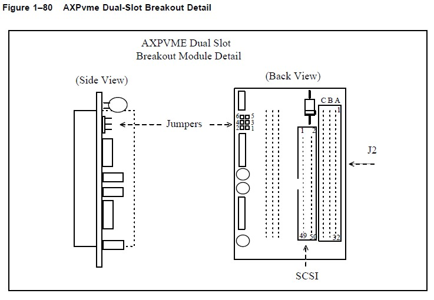
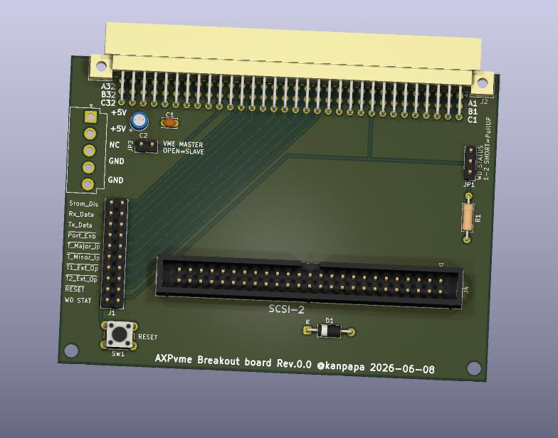

+++
date = '2026-06-12T10:12:56+09:00'
draft = true
title = 'DEC AXPvme230で遊ぶ #2 Breakoutボードの設計'
slug = 'axpvme-vme-2'
tags = ["DEC", "AXPvme", "VME", "Alpha-CPU"]
categories = ["Retro Computing"]
image = 'axpvme230_p2_breakout_board_3d.jpg'
+++

前回はAXPvme230ボードの実機を入手して外観からボードの仕様を確認しました。レガシーなVMEボードですので実際に動作させるためにはいくつかの課題が見つかりましたが、１つずつ問題をつぶしていくことにします。

## AXPvme230の電源要件

まずは電源を確認していきます。AXPvme230ボードの電源仕様は以下の通りです。

【基本電源仕様（AXPvme 230 module）】
|電源電圧|最大電流|
|:--|:--|
|+5V|9.9A|
|+12V|0.5A|
|-12V|0.1A|

【オプション使用時の追加要件】
* SCSIターミネーション（終端）: +5Vで最大 0.8 A （最大 4W）
* PMCオプションスロット: +5Vで最大 2.0 A （最大 10 W）

今回入手したボードはPMCオプションスロットにLANカードが搭載されていますので、5V 12Aの容量を準備する必要があります。

## VMEバスの電源容量

VMEバスの1スロットあたりの電源容量は、規格で以下のように定義されています。

【VMEbus (IEEE 1014) 標準スロット電源仕様】

|電源レール|1スロットあたりの最大電流電力|
|:--|:--|
|+5V|1A（標準）〜 5A（最大）5〜25W|
|+12V|0.5A 6W|
|−12V|0.5A 6W|
|+5Vスタンバイ|規格外（実装依存）|

課題の1つとして、AXPvme230ボードの電源容量はVME 1スロットの電源容量を大幅に超えるものです。

そのためにP1コネクタの電源ピンだけではなくP2コネクタのユーザピンに電源ピンが設定され、P2コネクタ専用のAXPvme Breakout module (54–22621–01)が用意されています。しかし、このAXPvme Breakout moduleは手元にはありません。

そのためテクニカルドキュメントを参照しながらAXPvme230のP2 Breakoutボードを自作することにしました。

## P2コネクタの仕様

AXPvmeボードののP2コネクタのピン配置（Row AおよびRow C）は、AXPvme Single-Board Computer Technical Descriptionの「Table B-4 VMEbus P2 Connector」に記載があります。
以下の通りRow AおよびRow Cがユーザー定義ピンとして割り当てられており、多数の電源ピンやSCSI信号や固有のI/O制御信号などが引き出されています。

【P2コネクタ ピン配置表】
| ピン番号 | Row A | Row C |
| :---: | :--- | :--- |
| **1** | SCSI_DATA<0> L | +5V |
| **2** | SCSI_DATA<1> L | +5V |
| **3** | SCSI_DATA<2> L | GND |
| **4** | SCSI_DATA<3> L | GND |
| **5** | SCSI_DATA<4> L | +5V |
| **6** | SCSI_DATA<5> L | +5V |
| **7** | SCSI_DATA<6> L | GND |
| **8** | SCSI_DATA<7> L | GND |
| **9** | SCSI_DP L | WD_STATUS_OC H |
| **10** | SCSI_ATN L | GND |
| **11** | SCSI_BSY L | GND |
| **12** | SCSI_ACK L | +5V |
| **13** | SCSI_RST L | +5V |
| **14** | SCSI_MSG L | EXT_RESET L |
| **15** | SCSI_SEL L | TMR2_EXT_OP L |
| **16** | SCSI_CD L | TMR1_EXT_OPL |
| **17** | SCSI_REQ L | TMR_MINOR_IP L |
| **18** | SCSI_IO L | TMR_MAJOR_IP L |
| **19** | Not used | SCSI_TERMPWR H (AXPvme 64 only) |
| **20** | SROMD H | SROMOE L |
| **21** | SROMDIS H | SROMCLK H |
| **22** | GND | GND |
| **23** | Not used | SCSI_TERMPWR H (AXPvme 160 only) |
| **24** | +5V | GND |
| **25** | +5V | GND |
| **26** | +5V | GND |
| **27** | +5V | GND |
| **28** | GND | +5V |
| **29** | GND | +5V |
| **30** | GND | GND |
| **31** | +5V | +5V |
| **32** | +5V | +5V |

信号名の後ろに記載されているLやHはそれぞれ負論理、正論理であることを示します。

注意：Row Bの全ピン（1〜32番）はVMEbus標準仕様で定義された信号なので一切接続してはいけません。（オープンにしておく）

## P2 Breakoutボードの設計

AXPvme230用のDual-slot breakout moduleはTechnical Descriptionドキュメントに以下のような図で説明されていました。

このモジュールの写真は入手できていないので詳細はわかりませんが、SCSIコネクタとターミネーターが載っているようです。  
今回製作するbreakout boardは電源を確実に供給することを目標にし、VMEラックへの取り付けは行わず机上で確認するためのものです。そのためSCSIやその他の信号については単純に引き出すだけにしました。  
また電源ラインにはある程度の電流が流れるため、4層基板にすることで他の信号から電源ラインを分離させます。
これを前提にKiCADで回路図をおこしガーバーデータを作成しました。すでに[製作済のP1ブレイクアウトボード](/2023/08/68000-vme-board2.html)と同じサイズにしています。

## P2 Breakoutボードの発注

完成した基板イメージです。これをJLCPCBさんに発注しました。

初めての4層基板なので出来上がりが楽しみです。

## まとめ

今回はAXMvme230用のブレイクアウトボードの設計と基板の発注まで行いました。次回は到着した基板を組み立てていよいよAXPvme230ボードに電源を投入してみます。
