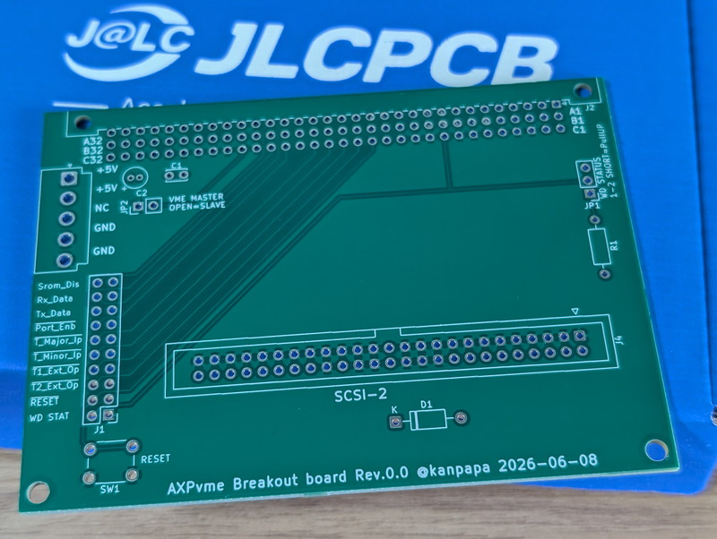
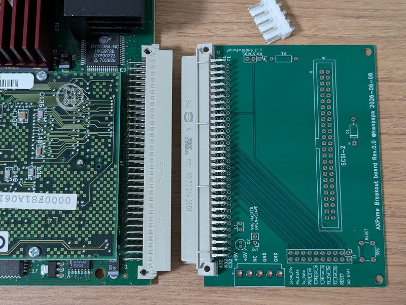
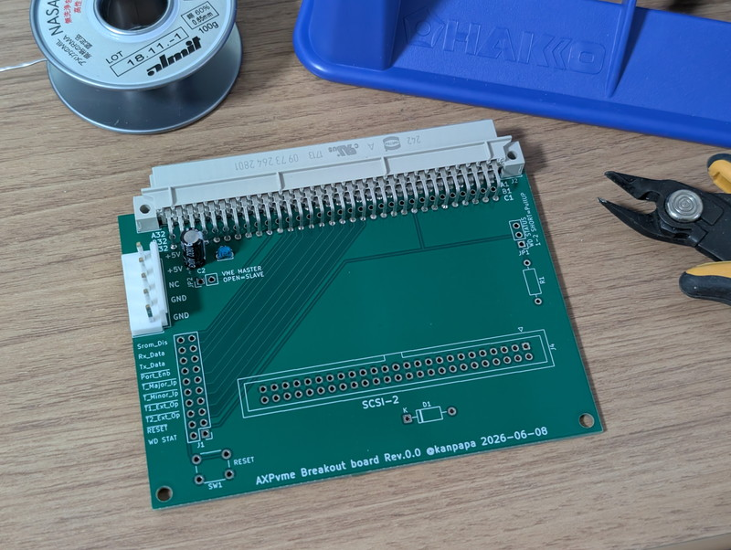
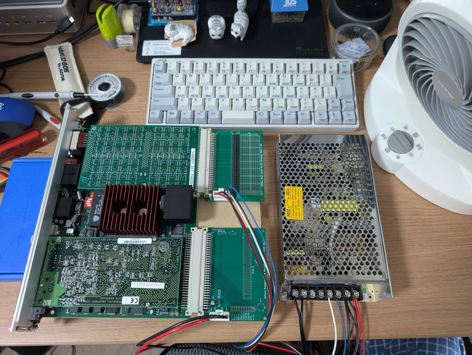
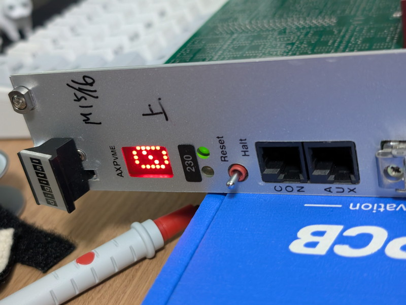

+++
date = '2026-06-19T07:57:04+09:00'
title = 'DEC AXPvme230で遊ぶ #3 AXPvme230の起動確認'
slug = 'axpvme-vme-3'
tags = ["DEC", "AXPvme", "VME", "DECAlpha", "AlphaAXP"]
categories = ["Retro Computing"]
image = 'axpvme230-front-panel-led-0.jpg'
+++

[前回](/2026/06/axpvme-vme-2.html)はAXPvme230ボードのブレークアウト基板を設計し発注まで行いました。今回はその基板を使用してAXPvme230の実機に電源を投入して正常に起動できるかの確認を行います。

## ブレークアウト基板の確認

JLCPCBさんに発注していたDIY AXPvmeブレークアウト基板が到着しました。

ブレークアウト基板が意図した接続になっているか、AXPvme230本体コネクタとブレークアウトボードのコネクタを突き合わせて、A列番号とC列番号が正しく、本体ボードと同じ導通状態であることを確認しました。

## パーツの実装

問題なさそうなので最小限のパーツをハンダ付けしました。J2コネクタはB列を省略したものがあったのでそれを使用しました。
あとは電源コネクタとコンデンサだけがあれば動作するはずです。

はじめての4層基板の実装が完了しました。

## ワークベンチの準備

今回は机上で電源を投入してみます。AXPvme230ボードと実績のある[P1ブレークアウトボード](/2023/08/68000-vme-board2.html)と今回製作したP2ブレークアウトボードから電源を投入します。十分なエアフローを確保するためにサーキュレーターも用意しました。  
手持ちの電源が5V 4Aしかなかったので、オークションで5V 12A, 12V 1A, -12V 1A, -5V 4Aの電源を購入しました。
これらを作業しやすいように机に配置して配線しました。

## 電源投入後の状態

サーキュレーターを送風状態にしたあとに、電源を投入したところ、フロントパネルのLEDが点灯したことを確認しました。ステータスLEDに"0"が表示され、GREENのLEDが点灯しています。

ステータスLEDの状態を最初から観察するためにリセットスイッチを倒して再度起動したところ、5->4->3->2->1->0->A点滅となることが確認できました。



正常に動作すれば、バーが回転すると聞いていたので、どうやらA点滅はエラーで止まっているように見えます。

## フロントLEDの意味

ここでフロントパネルのLEDの状態を確認しておきます。
AXPvmeのフロントパネルには、モジュールのステータスを示す2つのLEDが搭載されています。

|位置|LED|名称|機能|
|:--|:--|:--|:--|
|左側|黄色（AMBER）LED|watchdog|ウオッチドッグタイマーが動作したときに点灯|
|右側|緑色（GREEN）LED|DC_OK|5V電源が4.5V以上の正常状態で点灯|

もう一つ5x7ドットのステータス表示LEDがあります。  
リセット後にPOSTが行われますが、その状況を表示するものです。

最初にSROMのコードでのチェックが行われます。
|LED表示|テスト内容|
|:--|:--|
|9|Processor test|
|8|I/O device test|
|7|Console line test|
|6|Internal data cache test|
|5|Main memory test|
|4|Internal data cache start|
|3|External cache check|
|2|External cache test|
|1|Console code load|
|0|Console code start|

このあとはConsoleのコードでのチェックが行われます。
|LED表示|テスト内容|
|:--|:--|
|A|Breakout module test|
|B|External cache test|
|C|Memory ECC (error correction code) test|
|D|Module configuration register test|
|E|SCSI control and status register (CSR) test|
|F|Heartbeat timer test|
|G|Interval timer test|
|H|Flash ROM test|
|I|DS1386 nonvolatile RAM tests|
|J|Auxiliary UART test|
|K|Ethernet address ROM test|
|L|Ethernet internal and external loopback tests|
|M|Watchdog timer test|
|N|VME interface processor/VIC64 test|

以上のPOSTが終わったらLEDにはくるくる回転するバーが表示されるようです。途中でエラーになった場合は最初に発生したエラーの箇所を点滅して表示します。

今回は"A"点滅ですので、`Breakout module test`に失敗しているようです。

## まとめ

今回はAXPvme230のボードに電源を投入し、POSTが走るところまで確認できました。  
残念ながらBreakout module testに失敗していますが、これはDIY Breakout boardのため、何か配線に不足があると思われますので引き続き調査します。  
心配していた電源容量や発熱もワークベンチの上ではクリアできているようです。

次回はシリアルコンソールを接続し、コンソールに出力されているはずの情報を確認していきます。
