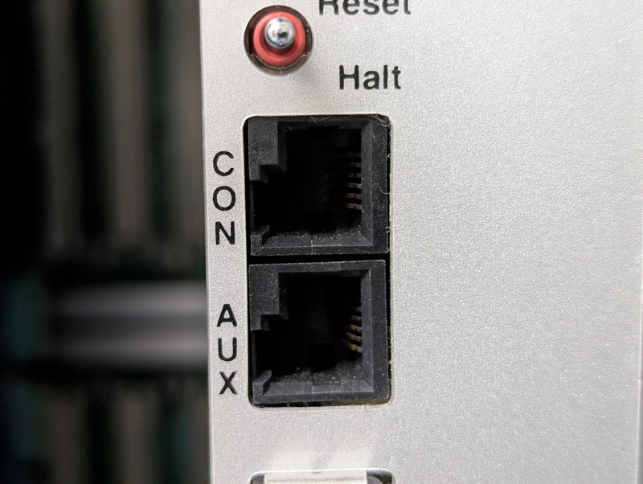
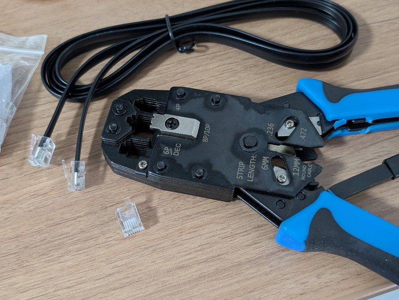
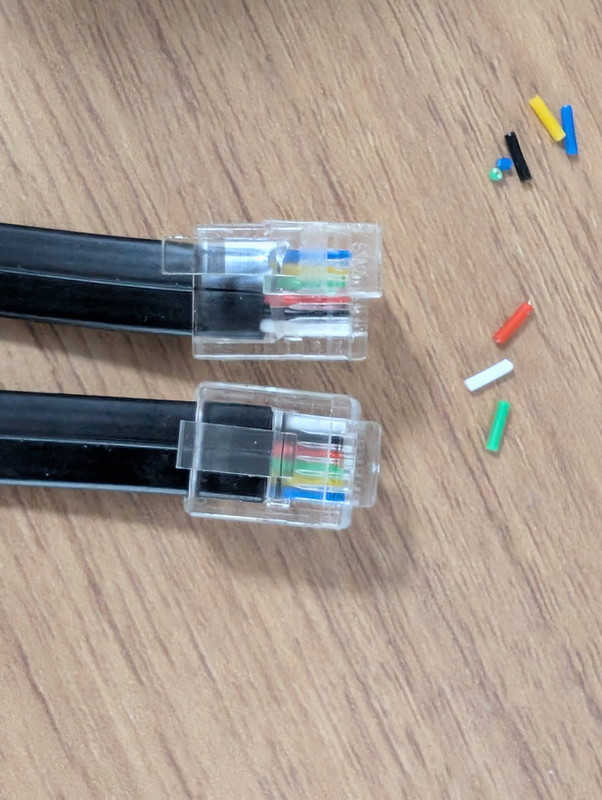
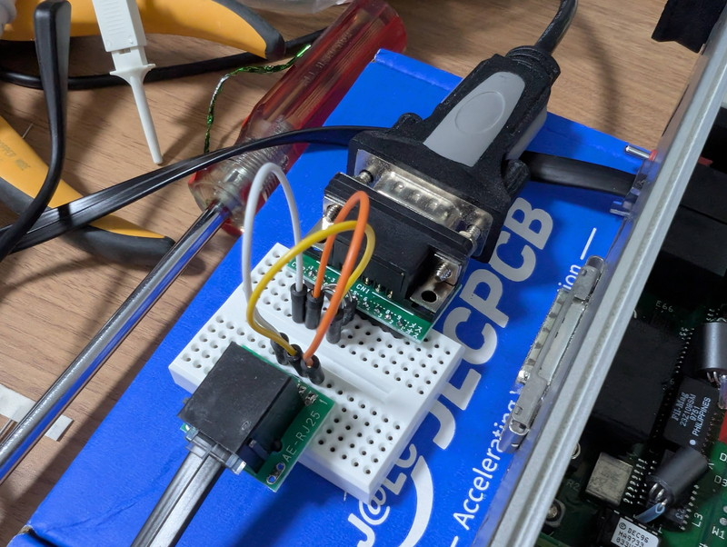
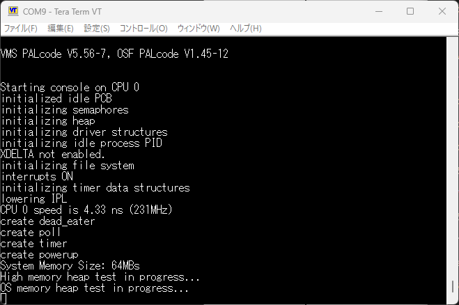

+++
date = '2026-06-21T15:10:06+09:00'
title = 'DEC AXPvme230で遊ぶ #4 コンソールを接続する'
slug = 'axpvme-vme-4'
tags = ["DEC", "AXPvme", "VME", "DECAlpha", "AlphaAXP"]
categories = ["Retro Computing"]
image = 'axpvme-console-connect.jpg'
+++

[前回](/2026/06/axpvme-vme-3.html)はAXPvme230ボードに電源を投入してPOSTが動作することを確認しましたが、残念ながら`Breakout module test`エラーになってしまいました。
詳細を調査するために、シリアルコンソールを接続し状況を確認します。

## コンソールのコネクタ
AXPvmeのコンソールのコネクタはいわゆるモジュラージャックのツメが左側に寄っているDEC独自のMMJコネクタです。



一般のパーツショップでは見かけないタイプのため、AliExpressで探したところ見つけることができました。
また、MMJプラグのツメの位置に対応した圧着工具も必要で、さらにRJ25のケーブルも必要です。
これら一式はすべてAliExpressでそろえることができました。

到着したMMJプラグ、RJ25ケーブル、圧着工具です。圧着工具には「6P/DEC」の表記があることがわかります。



これらを組み合わせて、MMJプラグーRJ25プラグのケーブルを製作しました。RJ25のプラグはそのまま活用します。



## DEC423をRS232Cに変換する

MMJコネクタの電気的仕様はDEC423というRS423に似たものなので、これをRS232Cに変換しなければなりません。
情報を探していたところ素晴らしいサイトがありました。

* [DEC MMJ serial adapters and cables](https://www.lammertbies.nl/comm/cable/dec-mmj)

また、XでもDEC純正のDEC423-RS232C変換器の情報をいただき、さらには変換器の中身も見せていただけました。上記サイトの回路のように単純な接続だけではなく、コネクタ内部にDIPの素子が存在し型番から調査したところ、TVSダイオードであることがわかりました。
これらの情報を元にDEC423をRS232Cに変換するために、以下のパーツを秋月電子さんで揃えました。

* [DSUBコネクターDIP化キット(メス)](https://akizukidenshi.com/catalog/g/g105406/)
* [6極6芯モジュラージャックDIP化キット](https://akizukidenshi.com/catalog/g/g109688)
* [TVSダイオード P4KE15CA](https://akizukidenshi.com/catalog/g/g129635/)

TVSダイオードはRXとGND, TXとGNDの間にとりつけます。  
ブレッドボードで製作した変換器は以下になります。



これをコンソールコネクタに接続してPCのターミナルを9600bpsに設定して、AXPvme230の電源を投入したところ何やら文字が表示されました。



## コンソールログを確認する

TeraTermでロギングを行ったのちに、AXPvme230のリセットを行い最初から漏れなく記録してみました。

```
AXPvme SROM Version  V2.0
Speed - 231MHz  Cache - 512K\5
06.05.04.03.02.01.00.

VMS PALcode V5.56-7, OSF PALcode V1.45-12


Starting console on CPU 0
initialized idle PCB
initializing semaphores
initializing heap
initializing driver structures
initializing idle process PID
XDELTA not enabled.
initializing file system
interrupts ON
initializing timer data structures
lowering IPL
CPU 0 speed is 4.33 ns (231MHz)
create dead_eater
create poll
create timer
create powerup
System Memory Size: 64MBs
High memory heap test in progress...
OS memory heap test in progress...
Setting system speed to 5
Cluster 1 bitmap VA = 0x10028a00, PA = 0x2aa00
****************************************************************************
        No P2 Connector Installed - May Cause Hardware Damage
        No SCSI termination detected, SCSI operation indeterminate
****************************************************************************
probing hose 0, PCI
entering idle loop
bus 0, slot 1 -- ewa -- DECchip 21040-AA
bus 0, slot 2 -- pka -- NCR 53C810
bus 0, slot 4 -- ewb -- DECchip 21140-AA
Station Address: 00-00-f8-25-76-fc
Station Address: 00-00-f8-1a-06-15
Secondary Cache Test...
waiting for pka0.7.0.2.0 to stop...
Memory ECC Tests...
Module Configuration Register Test...
SCSI Tests...
Heartbeat Test...
Interval Timer Tests...
Flash Device Test...
Time-of-Year Test...
Auxiliary UART Tests...
Ethernet ROM Tests...
NI Loopback Test...
Watchdog Test...
VIP Tests...
.................
Digital AXPvme Model 230 Common Console V17.0-0, built on Aug 27 1997 at 10:16:08

CPU 0 booting

        No P2 Connector Installed - May Cause Hardware Damage
Do you really want to continue [Y/N] ? : 
```

途中に気になる表示があります。

```
****************************************************************************
        No P2 Connector Installed - May Cause Hardware Damage
        No SCSI termination detected, SCSI operation indeterminate
****************************************************************************
```

これがフロントパネルのLEDに"A"と表示している原因のようです。  
メッセージを見るとわかりますが、フロントパネルでは"A"の表示のままですが、実はその後もPOSTが進んでいることもわかりました。

しかし、最終的にはP2エラーで継続するか中止するかが聞かれます。  
ここで継続を選択すると、SCSIからのブートアップを進めているようでした。

```
Do you really want to continue [Y/N] ? : y

        Attempts to boot without P2 installed = 2

(boot dka300.3.0.2.0 -flags a)
failed to open dka300.3.0.2.0

Retrying, type ^C to abort...

(boot dka300.3.0.2.0 -flags a)
failed to open dka300.3.0.2.0

Retrying, type ^C to abort...

(boot dka300.3.0.2.0 -flags a)
failed to open dka300.3.0.2.0

Retrying, type ^C to abort...

(boot dka300.3.0.2.0 -flags a)
failed to open dka300.3.0.2.0

```

残念ながらまだSCSIドライブは接続していませんのでこれ以上は動作しません。

## SRMコンソールを操作する

先ほどのP2エラーで継続するか中止するかが聞かれたときに中止としてみたところ、SRMコンソールのプロンプトが表示されました。

```
	No P2 Connector Installed - May Cause Hardware Damage
Do you really want to continue [Y/N] ? : n
>>>
```

helpと入力したところ、たくさんのコマンド説明が表示されました。

```
>>>help
NAME    
	 help or man
FUNCTION
	 Display information about console commands. 
SYNOPSIS
	 help or man [<command>...] 
	             Command synopsis conventions: 
	             <item> Implies a placeholder for user specified item. 
	             <item>... Implies an item or list of items. 
	             [] Implies optional keyword or item. 
	             {a,b,c} Implies any one of a, b, c. 
	             {a|b|c} Implies any combination of a, b, c. 

The following help topics are available:

alloc           bin             boot            build           cat             
cbcc            cdp             check           chmod           chown           
clear           clear_error     cmp             continue        crc             
date            deposit         dynamic         echo            edit            
eval            examine         exer            exer_read       exer_write      
exit            fbus_diag       find_field      free            grep            
hd              help or man     init            io_test         kill            
kill_diags      line            login           ls              memexer         
memexer_mp      memtest         net             netexer         nettest         
ntlpex          ps              rm              sa              semaphore       
set             set host        set password    set secure      show            
show config     show device     show error      show fru        show hwrpb      
show map        show memory     show_status     sleep           sort            
sp              start           stop            sw              test            
tr              uniq            wc              
>>>
```

気になるコマンドを叩いてみたところ、SRMコンソールは単純なモニタではなく高機能なものであることがわかりました。

```
>>>show config

                        Digital Equipment Corporation
                            Digital AXPvme Model 230

	SRM Console V17.0-0   VMS PALcode V5.56-7, OSF PALcode V1.45-12

                     MEMORY:	64 Meg of system memory
          System Controller:	VIC64 Enabled

Hose 0, PCI
	slot 0  DECchip 7407                                                     
	slot 1  DECchip 21040-AA      ewa0.0.0.1.0           00-00-F8-25-76-FC   
	slot 2  NCR 53C810            pka0.7.0.2.0           SCSI Bus ID 7       
	slot 3  Intel 82378                                                      
	slot 4  DECchip 21140-AA      ewb0.0.0.4.0           00-00-F8-1A-06-15   

>>>ps
 ID       PCB     Pri CPU Time Affinity CPU  Program    State
-------- -------- --- -------- -------- --- ---------- ------------------------
0000005f 03f3b5a0 3          1 00000001 0           ps running
0000005d 03f37160 5          1 00000001 0    pka0_poll waiting on pke_isr      
0000005a 03f38380 3       2730 00000001 0        shell ready
0000000c 03f35f40 3          1 00000001 0  led_control waiting on tqe          
00000009 03f291a0 5          1 ffffffff 0      rx_ewb0 waiting on rx_isr_ewb0  
00000007 03f1a2c0 5          1 ffffffff 0      rx_ewa0 waiting on rx_isr_ewa0  
00000006 0002aec0 6          2 ffffffff 0   tt_control waiting on tt_control   
00000004 00027480 7         11 ffffffff 0        timer waiting on timer        
00000003 00026260 2     670413 ffffffff 0         poll ready
00000002 00025040 6          7 ffffffff 0   dead_eater waiting on dead_beef    
00000001 000f7080 0     231145 00000001 0         idle ready
>>>show device
ewa0.0.0.1.0               EWA0              00-00-F8-25-76-FC
ewb0.0.0.4.0               EWB0              00-00-F8-1A-06-15
pka0.7.0.2.0               PKA0                  SCSI Bus ID 7
>>>
```

## まとめ

コンソールに接続したことでPOSTの途中でエラーは発生しているものの、SRMコンソールの起動まで確認できました。ここまで動作すれば次のステップであるOSのネットワークブートもできそうです。    
ただし、`Breakout module test`のエラーが発生すると、起動中に継続するか否かの問いあわせが発生し入力応答待ちの状態になってしまうので、なんとかしてこのエラーを解消したいところです。
引き続き調査を進めます。

次の記事：[DEC AXPvme230で遊ぶ #5 Breakout moduleエラーを攻略する](/2026/06/axpvme-vme-5.html)