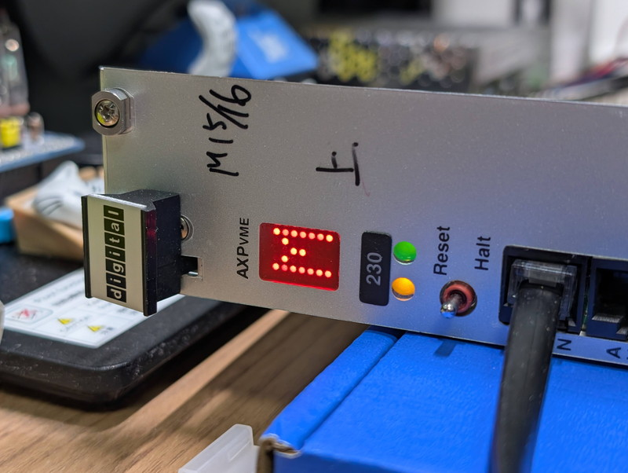

+++
date = '2026-06-22T07:38:49+09:00'
draft = true
title = 'DEC AXPvme230で遊ぶ #5 Breakout moduleエラーを攻略する'
slug = 'axpvme-vme-5'
tags = ["DEC", "AXPvme", "VME", "DECAlpha", "AlphaAXP"]
categories = ["Retro Computing"]
image = 'axpvme230-front-panel-led-m.jpg'
+++

[前回](/2026/06/axpvme-vme-4.html)はコンソールを接続して１つの問題を除きPOSTが正常に行われていることを確認しました。問題となっている`Breakout module test`エラーの解決に向けて、ブレークアウト基板の見直しを行います。

## P2/J2コネクタの情報

P2/J2コネクタの仕様に関する情報は以下のようにいくつかあります。

* Figure 1-78 AXPvme Single-Slot Breakout J2 Connector Pinout
* Figure 1-81 AXPvme Dual-Slot Breakout J2 Connector Pinout
* Figure 1-82 AXPvme P2 Connector Pinout Dual-Slot and Single-Slot
* Table B-4 VMEbus P2 Connector on the breakout module

ほぼ一致はしているのですが、C19とC23が微妙に違いがあります。まとめると以下のようになります。

|Pin|Figure 1-78|Figure 1-81,82|Table B-4|
|:--|:--|:--|:--|
|C19||M_Sense H|SCSI_TERMPWR H(AXPvme 64 only)|
|C23|VME_Master_SW L|VME_Master_SW L|SCSI_TERMPWR H(AXPvme 160 only)|

また、コネクタ仕様以外にもドキュメントのあちこちに断片的な情報もありました。

Breakout Module Functionality  
The AXPvme breakout modules provide the following functions:
* Connection to SCSI signals　→　P2 A1～A11と思われる
* SCSI termination and control  →　JUMPER設定およびTERMPWRのピンと思われる
* External reset pin →　Ext_Reset Lと思われる
* Connection to additional power and ground pins　→　+5VとGNDのピン
* Connection to AXPvme specific external timing signals　→　Tmr関係のピンと思われる
* Connection and control of watchdog timeout signal　→　Wd_Status_Oc Hと思われる
* Connection to manufacturing test port　→ SROM関係のピンと思われる
* External VME Master Selector Pin (AXPvme 66, AXPvme 100, and AXPvme231 modules only) → VME_Master_SW Lと思われる

## 第一世代と第二世代の違い

情報を集めているうちにAXPvmeのモデルは第１世代と第２世代があることがわかりました。CPUがアップデートされています。

|model|CPU|Gen|発売日|Slot|breakout module|C19(推測)|C23(推測)|
|:--|:--|:--|:--|:--|:--|:--|:--|
|AXPvme64|21068|Gen1|1994-3-1|Single|54-22605-01|SCSI_TERMPWR H|??|
|AXPvme64LC|21068|Gen1|1994-3-1|Single|54-22605-01|SCSI_TERMPWR H|??|
|AXPvme100|21066A|Gen2|1995?|Single|54-22605-01|M_Sense H(?)|VME_Master_SW L|
|AXPvme160|21066|Gen1|1994-3-1|Dual|54-22621-01|??|SCSI_TERMPWR H|
|AXPvme166|21066A|Gen2|1995?|Dual|54-22621-01|M_Sense H|VME_Master_SW L(?)|
|AXPvme230|21066A|Gen2|1995?|Dual|54-22621-01|M_Sense H|VME_Master_SW L|

ブレークアウトボードは第１世代も第２世代も同じものを使うため、P2ピンの仕様は同じはずなのですが、第１世代と第２世代でP2ピンの仕様が変更されていている可能性も無いとは言い切れません。これがピン仕様のブレの原因かもしれません。

## 怪しいピンの調査

不用意にピンに5VやGNDに接続してボード本体を壊すわけにはいきません。まずは現在の電圧を確認しました。

|Pin|機能|測定電圧|
|:--|:--|:--|
|C14|Ext_Reset L|5V|
|C15|Tmr2_Ext_Op L|4.4V|
|C16|Tmr1_Ext_Op L|4.4V|
|C17|Tmr_Minor_Ip L|4.8V|
|C18|Tmr_Major_Ip L|4.8V|
|C19|M_Sense H|不定|
|C20|Port_Enb H|3.3V|
|C21|Tx_Data H|3.3V|
|C22|Gnd|0V |	
|C23|VME_Master_SW L|Low|

* C14はプルダウンするとリセットすることを確認していますので、ここは関係ありません。
* C15～C18のタイマー系はHIGHになっています。ここも関係ないでしょう。
* C20～C21のMROM系は3.3Vの電圧が出ているようです。ここも関係ないので触らないことにします。
* C19の`M_Sense`は浮いているような気配です。0V近辺でふらふらしています。ここは怪しいです。
* C23の`VME_Master_SW`はLowを示しています。もともと負論理ですので正常な状態かもしれません。ここも触らないことにします。

一番疑わしいのは`M_Sense H`です。Breakout Module Senseの略なのかなとも思い、ここに10KΩの抵抗でプルアップしてHIGHにしてみました。しかしこの状態で再起動しても残念ながら全く変化はありませんでした。

他に疑わしいピンといえば`VME_Master_SW L`しかありません。この機能はドキュメントにも存在することが明記されていたので、ここを触るとVME SLAVEに切り替わってしまうのではと不安に思ったのですが、思い切ってHIGHにプルアップしてみました。
この状態で再起動したところ、`Breakout module test`のエラーは出なくなりました。

今は`M_Sense`と`VME_Master_SW`の両方をプルアップしている状態なので、`M_Sense`のプルアップを外しOPENにして再起動したところ、`Breakout module test`のエラーは発生しません。結局 C23のピンだけをプルアップするだけで良いことがわかりました。

## 残った謎

この結果から若干の謎は残ります。
* ドキュメントやピン配置に書かれていたVME_Master_SWのピンはどこにあるのか？
* M_Senseの役割は何なのか。このピンはどうしておくべきなのか？
この２点の疑問は残ったままですが、これらはissueに挙げておくことにして先に進みたいと思います。

## まとめ

若干不明点もありますが、とりあえずブレークアウトボードが接続されている状態として認識されました。しばらくの間はワイヤーでプルアップして様子をみて問題なさそうであれば、基板にプルアップ抵抗をはんだ付けしようと思います。KiCadの回路図やガーバーも更新しておきます。

これでエラーも出なくなり安心して実験ができるようになりました。次回はネットワークを接続し、いよいよOSのネットワークブートを試してみます。
