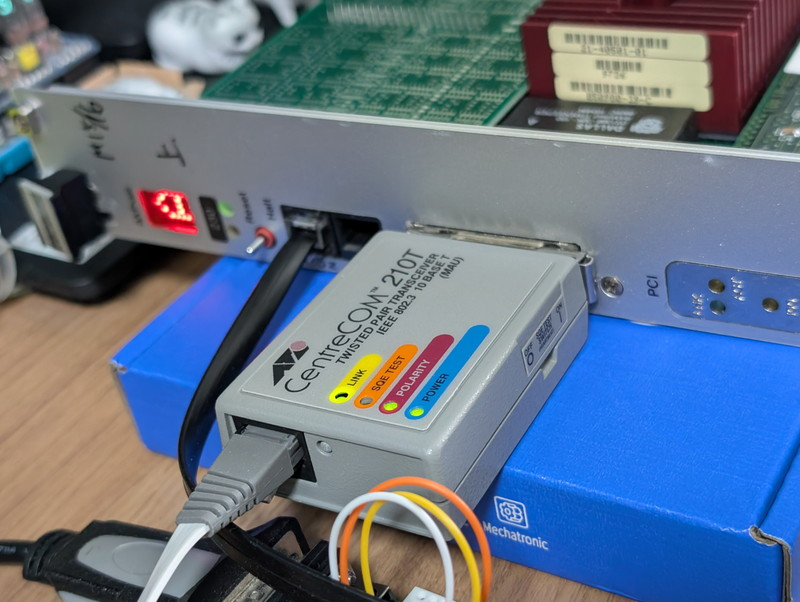
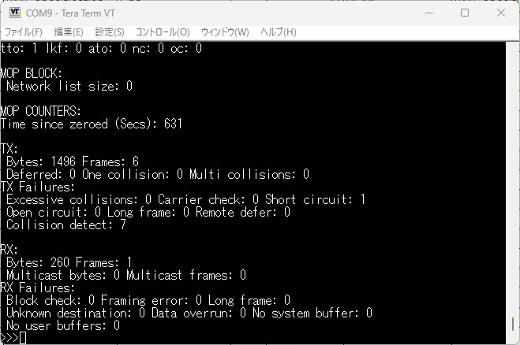
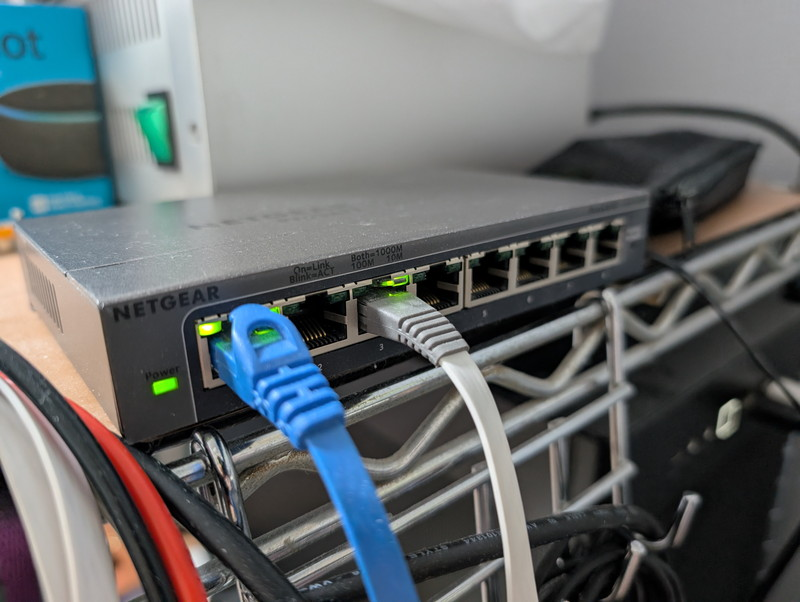
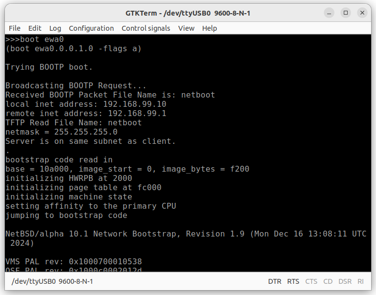
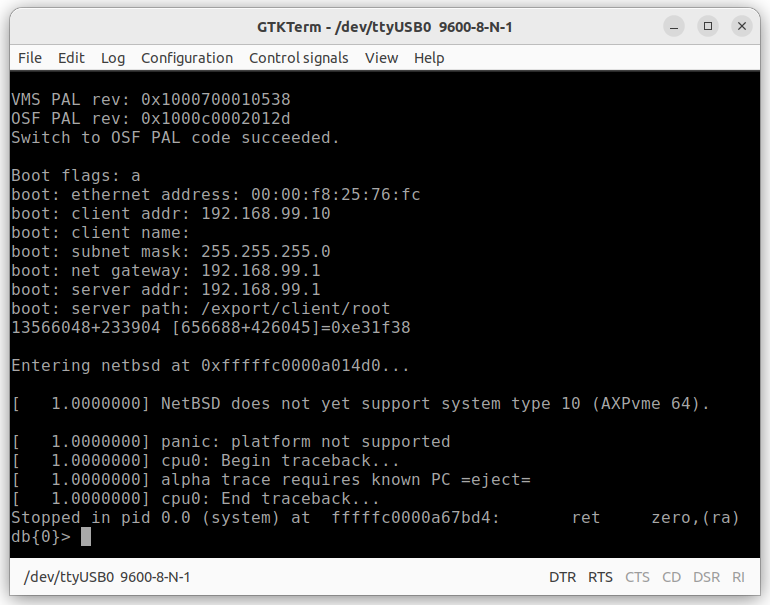

+++
date = '2026-06-27T14:32:55+09:00'
title = 'DEC AXPvme230で遊ぶ #6 NetBSDをネットワークブートする'
slug = 'axpvme-vme-6'
tags = ["DEC", "AXPvme", "VME", "DECAlpha", "AlphaAXP", "NetBSD"]
categories = ["Retro Computing"]
image = 'network-mau.jpg'
+++

[前回](/2026/06/axpvme-vme-5.html)でBreakout moduleのエラーも無くなり足回りが安定になりました。今回はネットワークを接続し、いよいよOSのネットワークブートを試してみます。

## ターゲットOSの選定

Alpha CPUをサポートしているOSは以下のものがあります。

* Tru64 UNIX（旧名：Digital UNIX / DEC OSF/1）
* OpenVMS（VMS）
* Windows NT (3.51 / 4.0)
* Linux
* NetBSD / FreeBSD / OpenBSD

やはりいろいろ試すにはオープンなOSが良さそうです。その中でもNetBSDは移植性が良いと聞いています。まずはNetBSDをターゲットOSとしました。

## AUIポートにMAUを接続する

まずはAXPvmeのAUIポートに問題がないかを確認します。  
AUIポートに10BASE-TのMAU(Medium Attachment Unit)を接続し、ネットワークに接続したところMAUのLINKが点灯しました。



実際にパケットの送受信ができているかをSRMで確認したところ、TX/RXのパケット数がカウントされているようです。



AUIポートは正常に動作していると確認できました。

## 実験用ネットワークの構築

実験用ネットワークとしてスイッチを１つ準備して、新たにサブネットを作成しました。
このネットワークにはDHCP/TFTP/NFSサーバが動いているUbuntuデスクトップとAXPvme230だけを接続しています。

/etc/hosts

```plain
192.168.99.1     ubuntu      # Ubuntu 22.04 LTS Desktop (Bootp, TFTP, NFS)
192.168.99.10    axpvme      # AXPvme230 (NetBSD)
```

UbuntuデスクトップにLANポートが１つしかなかったので、USB3.0にLANアダプタを接続しスイッチに接続しました。



## DHCP/TFTPサーバの構築

ネットワークブートを行うためにはBOOTPまたはDHCPサーバーとTFTPサーバが必要です。  
今回は[Dnsmasq](https://thekelleys.org.uk/dnsmasq/doc.html)を使用し、設定ファイルは以下のようにしました。

/etc/dnsmasq.conf
```plain
interface=enx6084bd485c85
bind-interfaces
port=0
dhcp-range=192.168.99.10,192.168.99.50,255.255.255.0
dhcp-host=00:00:f8:25:76:fc,192.168.99.10
dhcp-boot=netboot
dhcp-option=17,/export/client/root
enable-tftp
tftp-root=/srv/tftp
```

TFTPサーバーのルートにNetBSD公式サイトからダウンロードした[netboot](https://cdn.netbsd.org/pub/NetBSD/NetBSD-10.1/alpha/installation/netboot/)を置きます。

```plain
$ ls -l /srv/tftp
total 64
-rw-r--r-- 1 root root 61952 Jun 22 11:00 netboot
```

次にdnsmasqを起動します。

```plain
sudo systemctl start dnsmasq
sudo systemctl status dnsmasq
```

これでAXPvme230はDHCPでIPを割り当ててもらい、その後TFTPサーバにあるnetbootを読み込んでネットワークブートができるはずです。

## NFSサーバの設定

netbootはNFSサーバーにあるカーネルファイルを読み込んでNetBSDが起動します。  
NFSサーバーは当初はQNAPを使おうと思ったのですが、QNAPもLANポートが１つしかなかったので、Ubuntu DesktopにNFSサーバーを設定しました。
NFSサーバの設定は/export/clientディレクトリをNFSでアクセスできるようにしました。

/etc/exports
```plain
/export/client 192.168.99.0/24(rw,sync,no_root_squash,insecure,no_subtree_check)
```

## ファイルシステムの作成

NetBSDのファイルシステムをNFSサーバのexportディレクトリに準備する必要があります。
[NetBSD/alphaのバイナリセット](https://cdn.netbsd.org/pub/NetBSD/NetBSD-10.1/alpha/binary/sets/)にあるbase.tgz、etc.tgz、kern-GENERIC.tgz をダウンロードして/export/client/rootに展開します。

```plain
sudo mkdir /export/client/
sudo mkdir /export/client/root
tar -xvzpf base.tgz -C /export/client/root
tar -xvzpf etc.tgz -C /export/client/root
tar -xvzpf kern-GENERIC.tgz -C /export/client/root
sudo mkdir /export/client/root/kern
sudo mkdir /export/client/root/swap
sudo dd if=/dev/zero of=/export/client/swap bs=4k count=4k
sudo mv /export/client/root/usr /export/client/usr
```

展開したファイルシステムはデバイスファイルが空の状態なので、VirtualBoxにインストールしたNetBSDからこのNFSサーバーにmountして、MAKEDEVを実行することでデバイスファイルを作成しておきます。

```plain
cd /dev
/bin/sh MAKEDEV all
```

ファイルシステムが完成するとこのようなディレクトリになります。ルートディレクトリにある`netbsd`がカーネルファイルです。

```plain
$ ls -l /export/client
total 16396
drwxr-xr-x  2 root root     4096 Jun 22 16:56 home
drwxr-xr-x 18 root root     4096 Jun 22 20:46 root
-rw-r--r--  1 root root 16777216 Jun 22 16:34 swap
drwxr-xr-x 11 root root     4096 Dec 16  2024 usr
```

```plain
$ ls -l /export/client/root
total 29000
drwxr-xr-x  2 root root     4096 Dec 16  2024 altroot
drwxr-xr-x  2 root root     4096 Dec 16  2024 bin
drwxr-xr-x  9 root root    36864 Jun 22 16:49 dev
drwxr-xr-x 30 root root     4096 Jun 22 16:42 etc
drwxr-xr-x  2 root root     4096 Jun 22 16:33 kern
drwxr-xr-x  3 root root     4096 Dec 16  2024 lib
drwxr-xr-x  3 root root     4096 Dec 16  2024 libdata
drwxr-xr-x  5 root root     4096 Dec 16  2024 libexec
drwxr-xr-x  2 root root     4096 Dec 16  2024 mnt
-rwxr-xr-x  1 root root 14805376 Dec 16  2024 netbsd
drwxr-xr-x  2 root root     4096 Dec 16  2024 rescue
drwxr-xr-x  2 root root     4096 Jun 22 16:33 root
drwxr-xr-x  2 root root     4096 Dec 16  2024 sbin
drwxr-xr-x  2 root root     4096 Dec 16  2024 stand
drwxr-xr-x  2 root root     4096 Jun 22 16:34 swap
drwxrwxrwt  2 root root     4096 Dec 16  2024 tmp
drwxr-xr-x 24 root root     4096 Dec 16  2024 var
```

他にもクライアント側の設定も必要になりますが、まずはカーネルを起動するところまで試したいのでここまでにしておきます。

## ネットワークブートの実行

いよいよネットワークブートを実行します。SRMから以下のように入力します。

```
>>> boot ewa0
```

順調にネットワークブートが進んでいきます。



しかし、カーネルが起動した途端に停止してしまいました。



メッセージをよく見ると、AXPvme 64はサポートされていないと表示されています。

NetBSDの公式サイトのドキュメントをよくみたところAXPvmeは未サポートであることがわかりました。
さすがにAXPvmeは一般的な機種ではないからでしょう。

## まとめ

今回はネットワークブートの環境構築およびNetBSD/Alphaのnetbootの動作確認ができました。  
カーネルも起動はしたもののそのままでは動かずAXPvme用のポーティングが必要のようです。  
Alpha CPUは64bit RISCプロセッサであり、これまで経験してきたm68kやV53とは桁違いに複雑です。  
しかし、すでにNetBSD/Alphaでは多数のAlpha CPU搭載機種がサポートされていますので、これらの情報を参考にしてAXPvmeへのポーティングにチャレンジしてみます。

次の記事：[DEC AXPvme230で遊ぶ #7 NetBSD/alphaを起動する](/2026/07/axpvme-vme-7.html)