+++
date = '2026-07-04T07:51:39+09:00'
title = 'DEC AXPvme230で遊ぶ #7 NetBSD/alphaを起動する'
slug = 'axpvme-vme-7'
tags = ["DEC", "AXPvme", "VME", "DECAlpha", "AlphaAXP", "NetBSD"]
categories = ["Retro Computing"]
image = 'axpvme-netbsd-workbench-photo.jpg'
+++

[前回](/2026/06/axpvme-vme-6.html)はネットワークブートの環境構築を行いましたが、カーネルがAXPvmeをサポートしておらずポーティングが必要なことがわかりました。  
NetBSD/Alphaでは多数のAlpha搭載機種がサポートされていますので、これらのコードやAXPvme Tecnical Descriptonなどの公式ドキュメントを参考に生成AIに手伝ってもらってNetBSD/alphaが動くようにします。

## AXPvmeでのOS起動の流れ

DEC Alphaは64bit RISCプロセッサであり、これまで経験してきたm68kやV53とは仕組みが大きく異なります。PALcodeやSROMなど耳慣れないキーワードもあり単純ではありません。  
前回のネットワークブートの起動時にも気になるバージョン表示がたくさんありました。

```
AXPvme SROM Version  V2.0  
VMS PALcode V5.56-7, OSF PALcode V1.45-12
Digital AXPvme Model 230 Common Console V17.0-0
```
これらのキーワードとハードウェアの起動の流れを簡単にまとめておきます。

1. 電源ON / リセット
1. CPUの初期化：SROM(Serial ROM)に格納された小さなコードをCPUのキャッシュに読み込み、CPU周辺デバイスを初期化する
1. コンソール起動: フラッシュROMに書かれているCommon Consoleプログラム(SRMなど)が動き出す
1. PALcodeの展開: OS（OpenVMSやUNIX）に応じたPALcodeがメモリにロードされ、CPUの特権処理を行う準備が整う
1. OS起動: PALcodeの抽象化レイヤーの上で、OSが稼働する

最後のステップのOSの起動開始までは確認できている状況です。

## 生成AIの活用

最初にAlphaアーキテクチャやAXPvmeのマニュアルを集めて[NotebookLM](https://notebooklm.google.com/)に登録しました。これでAXPvmeに関する強力な知識データベースができました。
あとは作業用のブランチを作成し、ソースコードを見ながら、他の機種の情報を参考にして[Gemini](https://gemini.google.com/)や[Claude](https://claude.ai/)の無料枠の範囲で利用しながらコードを書き換えて行く方法で進めてみました。
その結果ある程度は動作するようになったのですが起動途中でハングアップしてしまいます。

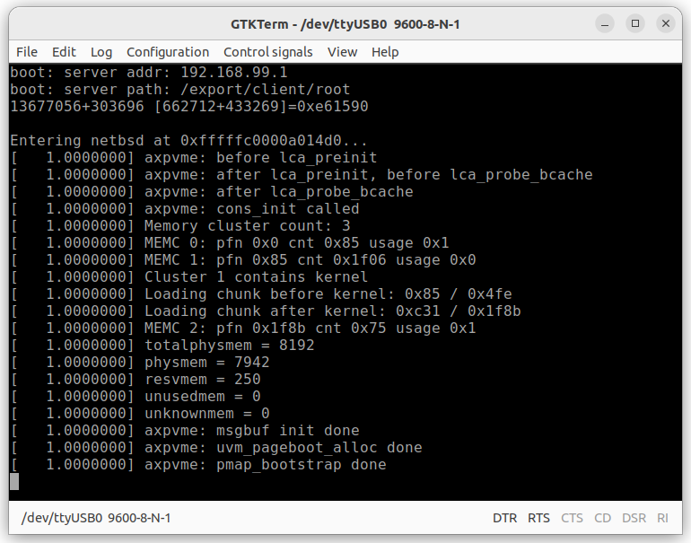

ここまでたどり着くためにはソースコードの一部を抜き出してClaudeやGeminiに貼り付けたり、NotebookLMの結果を貼り付けたりなど、かなりの手間がかかることもわかりました。

## Claude Codeを導入(6月25日)

ここでブランチを新規作成して、[Claude Code](https://claude.com/ja/product/claude-code)を使ってみることにしました。有料にはなりますが、まだ使ったことが無く何がどの程度できるのかを体験する良い機会と考えました。今回はVSCodeで作業しましたが、カーネルのソースコードにClaude Codeが直接アクセスできるため、作業の効率が格段によくなり、あっという間にカーネルが動き始めました。

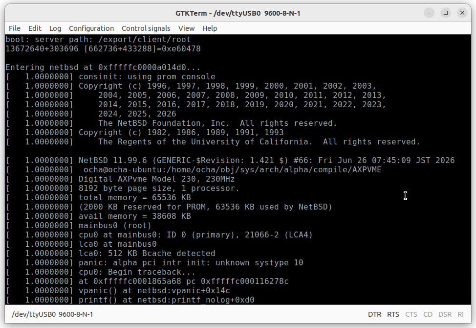

途中でハードウェアの情報も確認しながら作業を進められるように、Tecnical DescriptionのPDFもコードツリーに入れて、それも参照しながらポーティングを進め、ついにrootファイルシステムのNFS mountの直前まで動かすことができました。

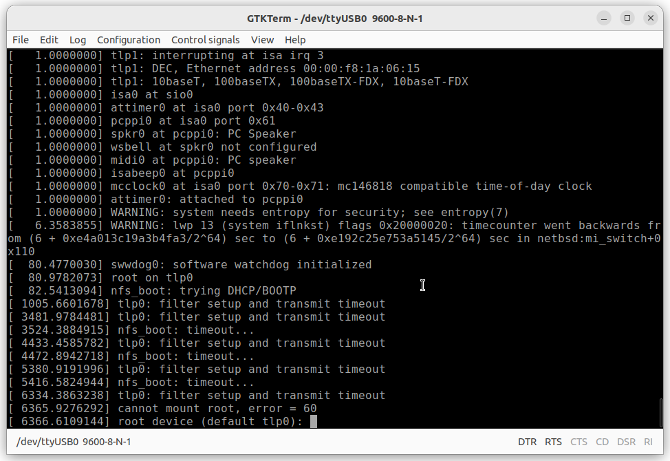

## NICとの通信ができない(6月28日)

NICからの割り込みがどうしてもCPUに届かないため方針を変更してポーリング方式に変更したところエラーメッセージも無くなり通信できるようになりました。tcpdumpのログからも正常にNFS mountができているように見受けられました。

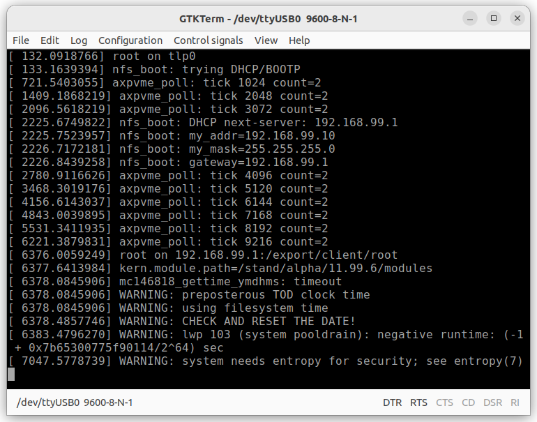

しかし、ログインプロンプトは表示されない状態のままなので止まっているようにみえます。

## pingの動作確認(6月30日)

この状態で試しに他のPCからpingを投げたところ応答が返ってきました。

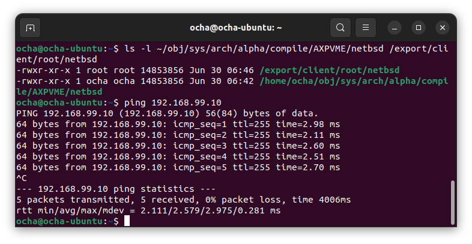

少なくともハングアップしている状態ではなくカーネルは正しく動いているようです。
mountしているファイルシステムの設定ファイルを調整し、sshdを動かしたところ、不完全ながらもsshログインができました。

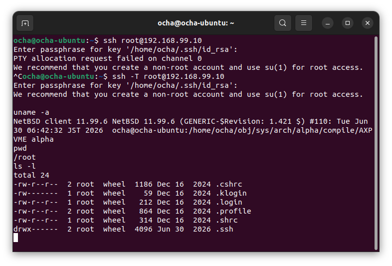

この状態からもう少しチューニングを進めて、通常通りのsshログインができて、psコマンドなど普通の操作ができることを確認しました。

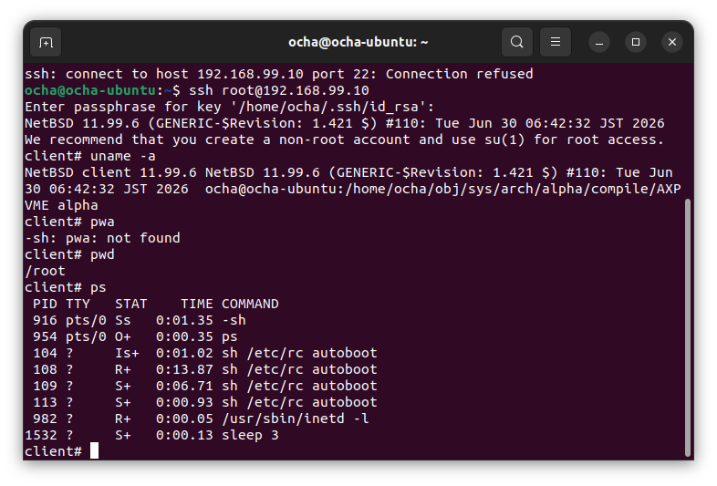

## シリアルコンソールの実装(7月3日)

ここまではシリアルコンソールドライバはまだ実装しておらず、PROM Consoleを暫定的に使用していたため、loginプロンプトが表示できない状態でした。そこでシリアルコンソールドライバを実装し、loginプロンプトが表示できました。

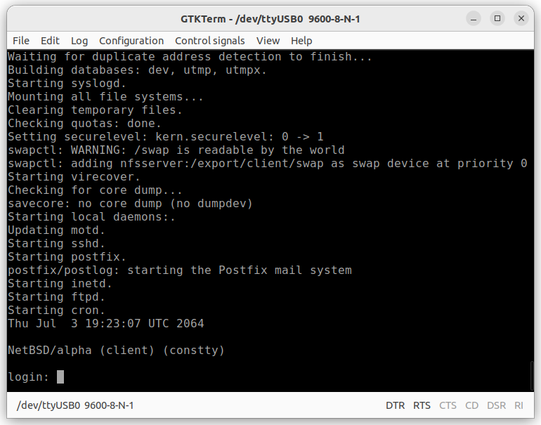

すでにsshではログインを確認しているので、シリアルコンソールからも問題なくログインできました。

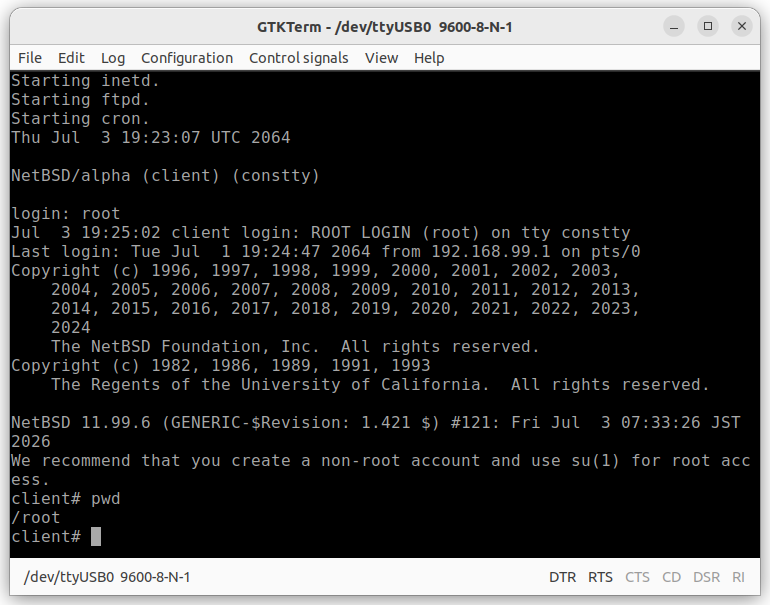

また、システムが正常にシャットダウンできるのかも確認しておく必要があります。

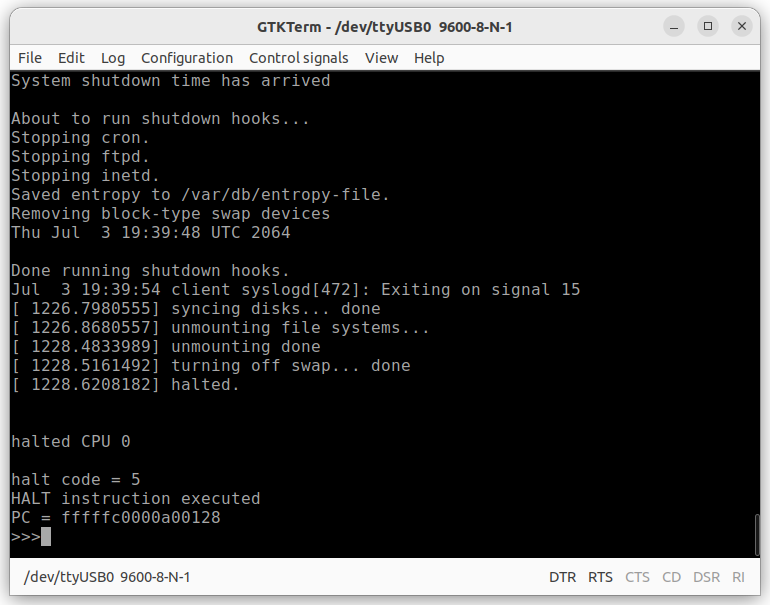

無事シャットダウンできました。これでNetBSDの起動から終了まで一通りの動作が確認できました。

## ポーティング結果

今回のAXPvme230へのポーティング作業をまとめておきます。

* ポーティング期間: 2026-06-25 〜 2026-07-04
* 動作確認済み機能
    * NFS diskless boot
    * Z8530 シリアルコンソール
    * getty ログイン (constty)
    * SSH アクセス
    * FTP / sshd / cron
    * マルチユーザー起動

ポーティングしたソースコードはGitHubにいれておきました。axpvme-v2ブランチで作業しています。

* https://github.com/kanpapa/src

Claude Codeが作成したドキュメントもコミットしていますので参考にしてください。

* [DEC AXPvme 230 NetBSD/alpha ポーティング記録](https://github.com/kanpapa/src/blob/axpvme-v2/porting_summary.md)
* [DEC AXPvme 230 NetBSD/alpha テストガイド](https://github.com/kanpapa/src/blob/axpvme-v2/test_guide.md)
* [AXPvme 230 ポーティング開発ジャーナル](https://github.com/kanpapa/src/blob/axpvme-v2/journal.md)

これらを見るとわかりますが、Clade Codeは本当にすごい力を秘めていると思います。ただし任せきりにすると想定外の方向に突き進むこともあるので、適切な情報を与えながらターゲットに向かってプロンプトを与えて微調整していくことが必要だと感じました。

## まとめ

今回のポーティング作業で最低限のNetBSD/alphaがAXPvme230 VMEボードの上で動作するようになりました。今回はスタンドアロンでの動作を確認しましたが、次回はインターネットに接続して外部との通信やバイナリパッケージをインストールして動かしてみます。  

参考までにAXPvme230のテスト環境の写真を載せておきます。

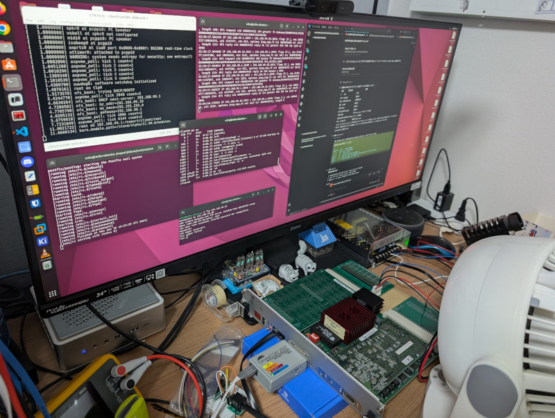
