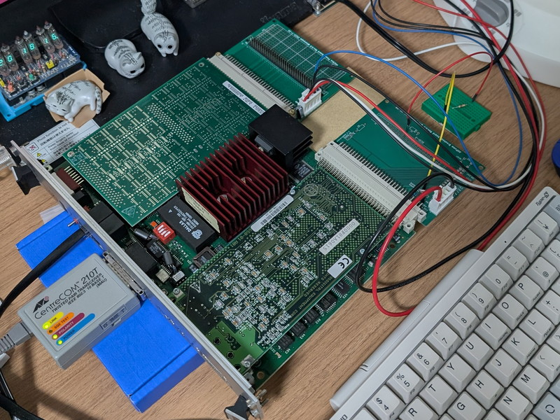
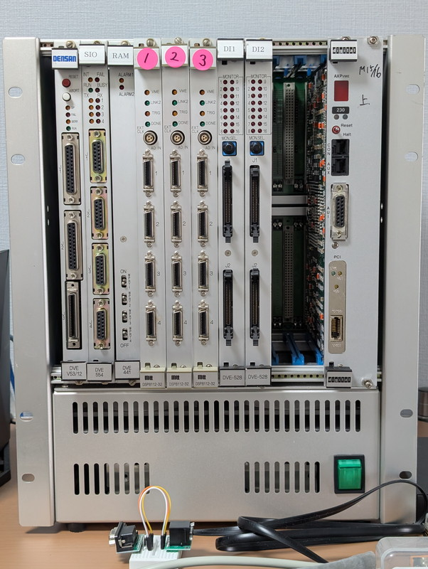
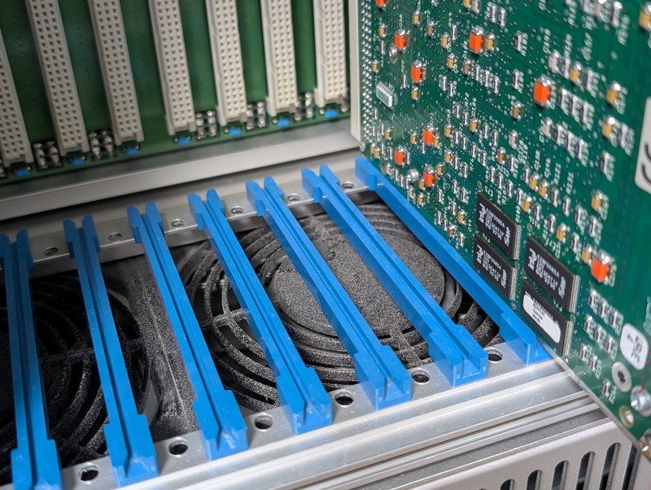
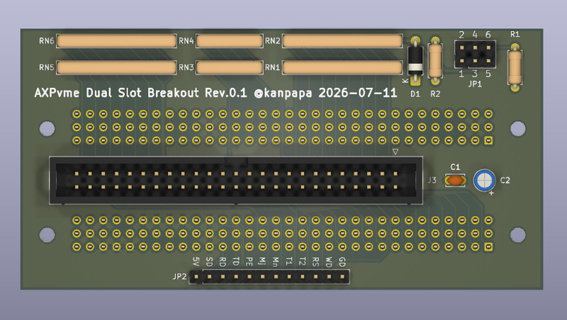
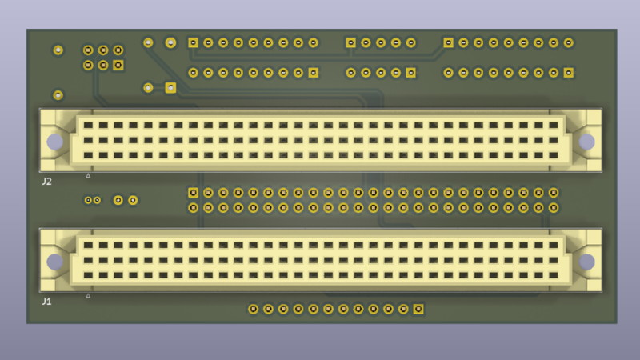
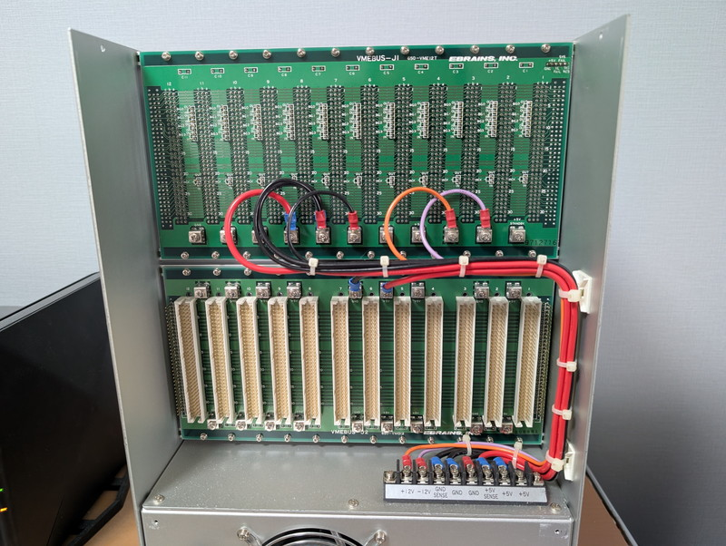
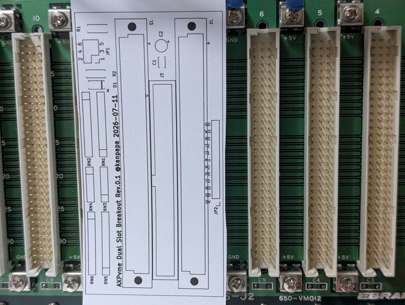

+++
date = '2026-07-12T08:39:15+09:00'
title = 'DEC AXPvme230で遊ぶ #9 Dual Slot Breakoutボードの設計'
slug = 'axpvme-vme-9'
tags = ["DEC", "AXPvme", "VME", "DECalpha", "AlphaAXP", "NetBSD"]
categories = ["Retro Computing"]
image = 'axpvme-vme-rack-backplane-back.jpg'
+++

[前回](/2026/07/axpvme-vme-8.html)は[DEC AXPvme230](/2026/06/axpvme-vme-1.html)で動くようになった[NetBSD/alpha](https://wiki.netbsd.org/ports/alpha/)からインターネットに接続して、NetBSDのFTPサーバーやパッケージのインストールを試しました。  
まだまだ試したいこともあるのですが、現在のワークベンチ環境はボードを机の上に平置きにして扇風機でエアフローを当てて何とか動かしている状態です。  
このままの状態で実験を続けるのも危険ですし、VME規格のボードですのでVMEラックに搭載するための準備をしていきます。

## 自宅のVMEラック

自宅にVMEラックが置いてあるのは稀だと思います。AXPvme230ボードをVMEバスコネクタに接続しない状態で右端のスロットに入れてみました。

もともとは興味本位で購入した[V53 VMEシステム](/2026/01/v53-vme-system-1.html)で使用しているものです。  
12スロットの6U VMEラックでまだスロットに空きがありますので、ここにAXPvme230を取り付けて電源とエアフローを確保します。  

1番スロットのシステムコントローラーにはV53 CPUボードが実装されていますが、AXPvme230を動かす際は一時的に外して干渉しないようにする予定です。

## AXPvme230への電源供給

AXPvme230は消費電力が大きく5V 9.9Aが必要です。VME規格では1スロットあたり5V 5A(Max)となっているので電源容量が足りません。このため隣のスロットのP2バスからも電源を供給します。  
本来はその機能をもつ`Dual Slot Breakout Module`がAXPvme230ボードに付属しているのですが、中古品のため手元にありません。  

これまでのワークベンチ環境で使用している[Breakoutボード](/2026/06/axpvme-vme-2.html)は平置き用で動作確認を目的としていましたが、今回はVMEラックに搭載するためのBreakoutボードを製作する必要があります。  

Dual Slot Breakout ModuleのイラストはTechnical Descriptionにいくつかありましたのでパーツレイアウトはそれに合わせています。残念ながら回路図は見当たらないのですが、これまでの実験結果から電源ラインは明確なのでそれをベースに設計しています。  

## Breakout基板の設計

KiCadでDual Slot Breakout Moduleを設計したところ、10cm×5cmの基板になりました。

ボード上にはSCSIの接続端子や終端抵抗、その他の制御信号を引き出せるようにはしていますが、この部分の動作確認はできていないので実験的な実装となります。

今回は電源を確実に供給することをゴールにしています。前回と同様に4層基板としました。

## VMEバックプレーンの確認

設計したAXPvme Dual Slot Breakoutボードが物理的にVMEラックに実装できるかを確認します。
まだVMEラックの裏側は開けたことがありませんので今回初めてネジを外してカバーを外してみました。

整然とDINコネクタが基板に取り付けられ、太い電源コードがきれいに配線されています。拡張しやすい構造になっています。さすが産業用機器です。  

上段のJ1バックプレーンはVME規格でバス配線となっており、割り込みやバス使用権のディジーチェーンの設定用にいくつかのジャンパーピンが突き出ています。

下段のJ2バックプレーンのB列はVME規格でバス配線になっていますが、A列とC列はユーザ定義となっており、その信号を引き出すためのDINコネクタが各スロットに取り付けられています。ここにDual Slot Breakoutボードを取り付けることで隣のスロットのP2コネクタからも電源を供給する仕掛けです。

## 実装イメージの確認

設計したDual Slot Breakoutボードを原寸で印刷してJ2バックプレーンの上に重ねて物理的な確認を行いました。

取り付けは問題なさそうです。ガーバーデータをJLCPCBさんに送るとともにDINコネクタの注文を行いました。
実装準備ができるのは１～２週間後になると思います。

## まとめ

今回はVMEラックの搭載にむけてBreakoutボードの設計と発注を行いました。  
もうしばらくは平置きの状態が続きますが、いずれVMEラックで安定した稼働ができるように準備していきます。
