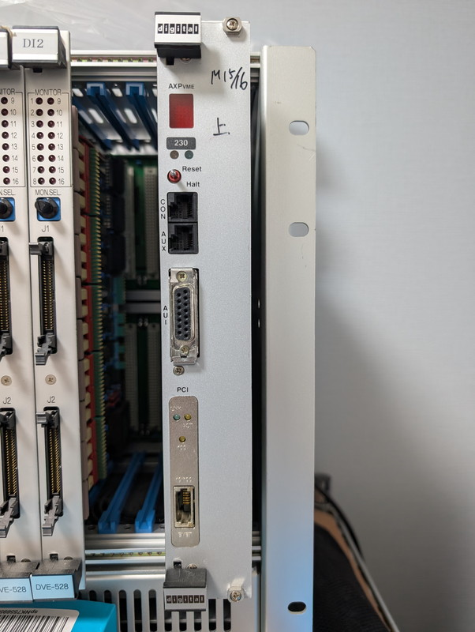
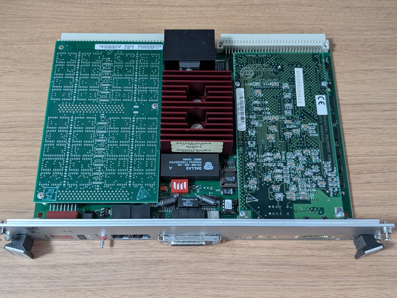
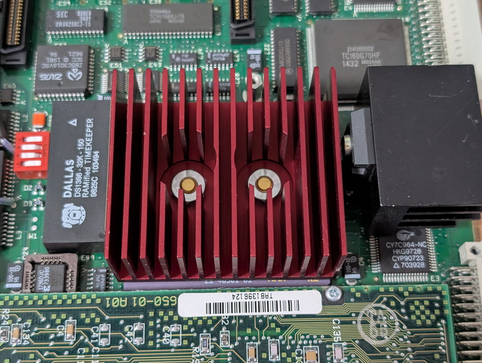
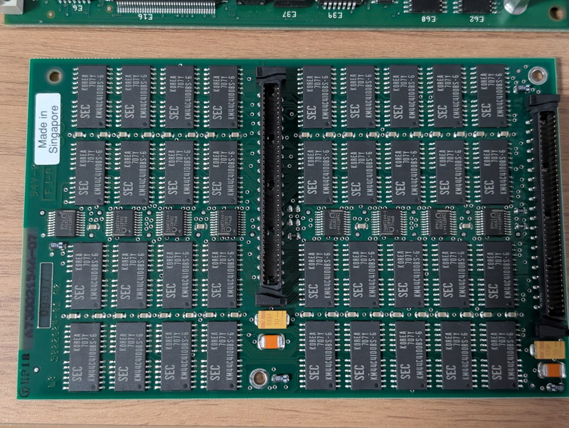
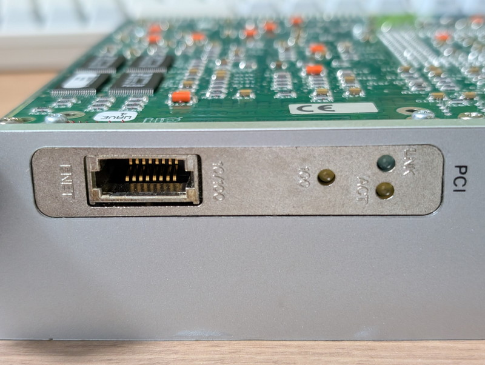
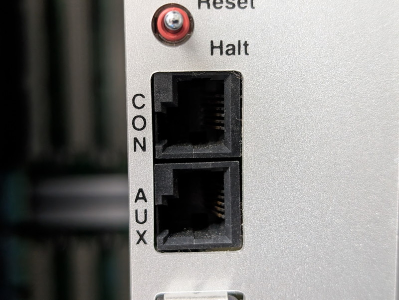

+++
date = '2026-06-11T09:59:54+09:00'
title = 'DEC AXPvme230で遊ぶ #1 AXPvme230ボードの入手'
slug = 'axpvme-vme-1'
tags = ["DEC", "AXPvme", "VME", "Alpha-CPU"]
categories = ["Retro Computing"]
image = 'axpvme230-board.jpg'
+++

## AXPvmeボードの出会い

オークションで気になる商品を見つけてしまいました。DECのAXPvme230 VMEボードです。このボードは[DEC Alpha CPU](https://ja.wikipedia.org/wiki/DEC_Alpha)が搭載され、6Uの2スロットサイズです。AlphaというCPUは知っていましたが実際に動作させたことはありませんし、実物を見たこともありません。このため気になってしまいました。

## ドキュメントの入手

AXPvme230 VMEボードについて調査したところ、以下のドキュメントが入手できました。

|Title|Order Number|Published|
|:--|:--|:--|
|AXPvme Single-Board Computer Release Notes| EK–EBV1X–RN. B01 |December 1994|
|AXPvme Single-Board Computer Installation/User Guide|EK–EBV1X–IN. B01| September 1995|
|AXPvme Single-Board Computer Technical Description| EK–EBV1X–TD. B01| July 1995|

これまで入手したVMEボード（68K, V53）はドキュメントが全く無く手探りで仕様を調査して動かしてきましたが、その苦労はなさそうです。ネットワーク機能もついているので、ネットワークブートもできそうです。実際に動かしてみたくなりました。

## ボードの動作要件

ドキュメントを眺めていると、気になる点がいくつかありました。

* 電源が5V 9.9A必要。P1コネクタだけでなくP2コネクタからも電源を供給する構造
* コンソールポートがDEC独自の[MMJコネクタ](https://en.wikipedia.org/wiki/Modified_Modular_Jack)
* AXPvmeボードを冷却するために十分なエアフローが必要
* 商品写真ではPCIスロットに10/100BASE-TのLANカードが搭載されているが、これもRJ45ロープロファイルという独自コネクタ

このように動作要件に課題はあるものの極端に難易度が高いものはなさそうです。

## ボードの外観

これまでの調査結果からボード自体が壊れていなければ工夫することでなんとか動かせそうとの結論となり、次のターゲットとしてDEC AXPvme230ボードを購入しました。

入手したボードの外観です。

VME規格のため基板の大きさはコンパクトですが、フロントパネルを見ると2スロット占有することがわかります。これは基板が二段重ねになっているためで、パーツの実装密度が高く、消費電力が多くなるのも分かります。

### CPU

Alpha CPUが実装されている部分には大きな放熱フィンが見えます。放熱フィンとCPUは大きなネジで固定されています。放熱フィンの横にはパーツ番号21-40501-01のシールが貼ってあり、確認したところDEC Alpha 21066-AB (233MHz CLK)であることがわかりました。

CPUの放熱フィンの下にCPUパッケージが少し見えていて大きなパッケージであることがわかります。CPUの放熱フィンの隣にはレギュレーターICの放熱フィンもあり、相当な発熱量と電力消費が見込まれます。

あと気になるのがここに写っているDS1386です。32KBの不揮発性メモリとRTCがパッケージされたものですが、この中にはバッテリーがあるので長期保管品の場合は電池切れの可能性があります。

### Memory

ボード左側の何も実装されていないように見えるボードはメモリボードです。型番の54-22625-DAから64MBであることがわかりました。RAMボードを外して裏面を確認したらSamsung製の「KM44C4100BS-6」が36個ならんでいました。このチップは4M x 4ビット（16Mビット）DRAMなのでDATA用32個＋ECC用4個と考えると64MBになります。

メモリチップが両面にフル実装されると128MBのようです。

### Network

右側にはPCIバスでLANカードが載っています。こちらはDEC DE520-AAで10/100BASE-Tに対応しています。ぜひともこのネットワークカードを使用したいですが、専用コネクタが曲者です。このコネクタが使えない場合はAUIインターフェースを使うことになりますが、10Mbpsとなってしまうのがいまいちです。

### Console

フロントパネルにはコンソール接続用のMMJコネクタがあります。噂通りに左側にツメが寄っている点が特徴的です。誤って他の機器と接続できないようにするためでしょうが、ちと厄介です。

## ボードの構成

今回入手できたAXPvme230ボードの構成をまとめると以下のようになります。SCSIも内蔵されていましたので外部ストレージも接続できそうです。

|機能|部品番号|仕様|
|:--|:--|:--|
|CPU|54-24120-01|6U VME AXP CPU 230(Alpha 21066 233 MHz)|    
|RAM|54-22625-DA|VME SBC 64 MB MEMORY|
|Network|DE520-AA|Fast EtherWORKS/PMCAdapter(10/100BASE-T)|
|SCSI|-|P2コネクタ経由で接続可能|

## 次のステップ

今回、AXPvme230ボードの実機を入手して外観からボードの仕様を確認しました。レガシーなVMEボードですので実際に動作させるためにはいくつかの課題が見つかりましたが、１つずつ問題をつぶしていくことにします。

最終的な目標としては[NetBSD/alpha](https://wiki.netbsd.org/ports/alpha/)や[OpenVMS alpha](https://www.openvmshobby.com/alpha-vms/)などを動作させてみたいと考えています。
