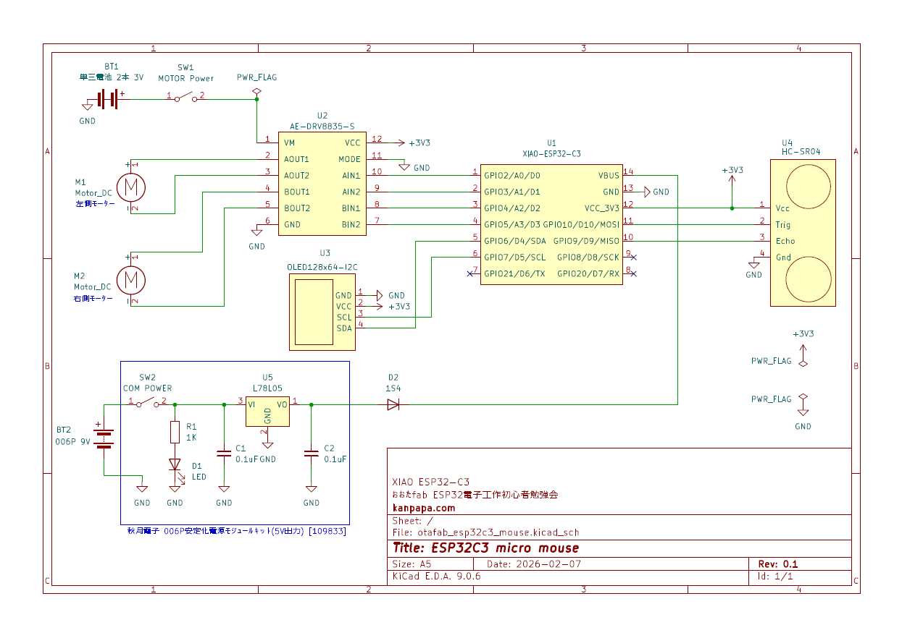
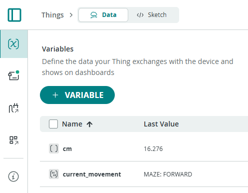
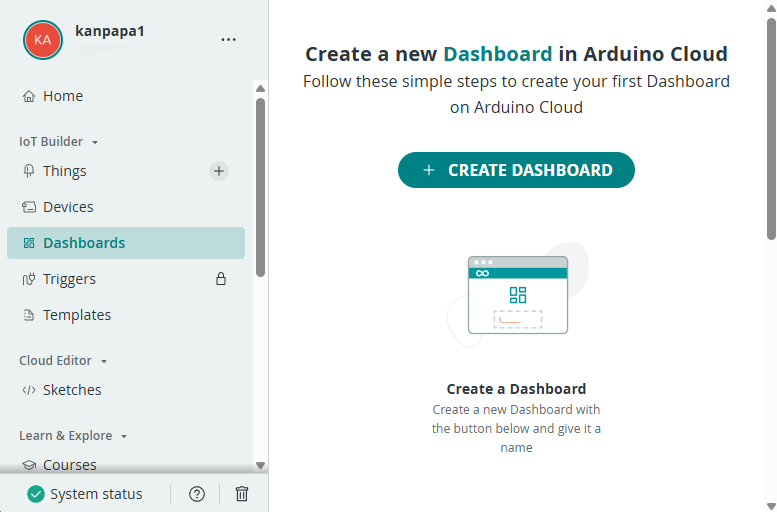
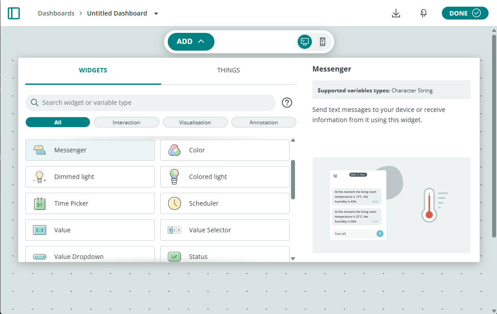
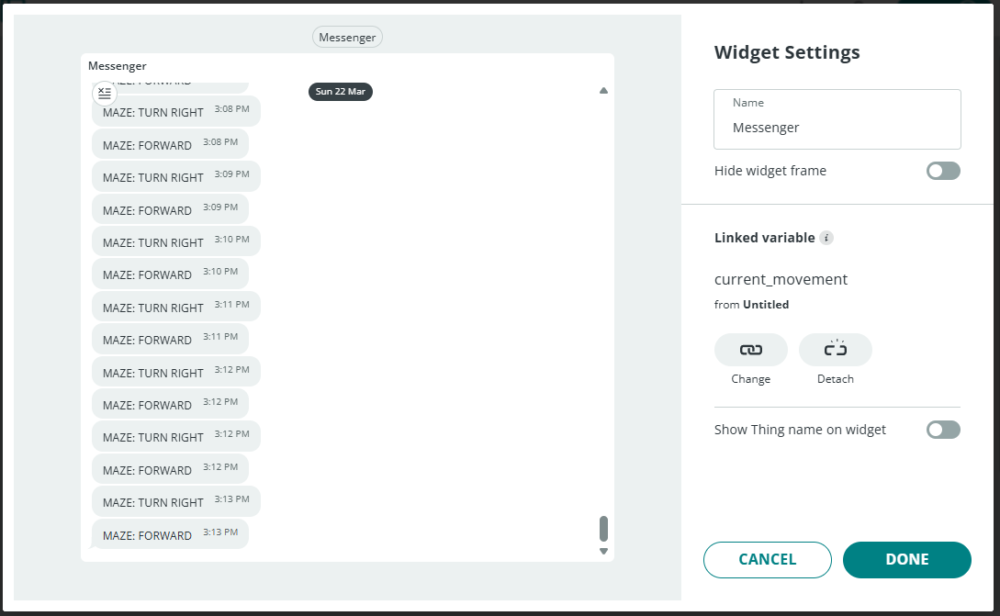
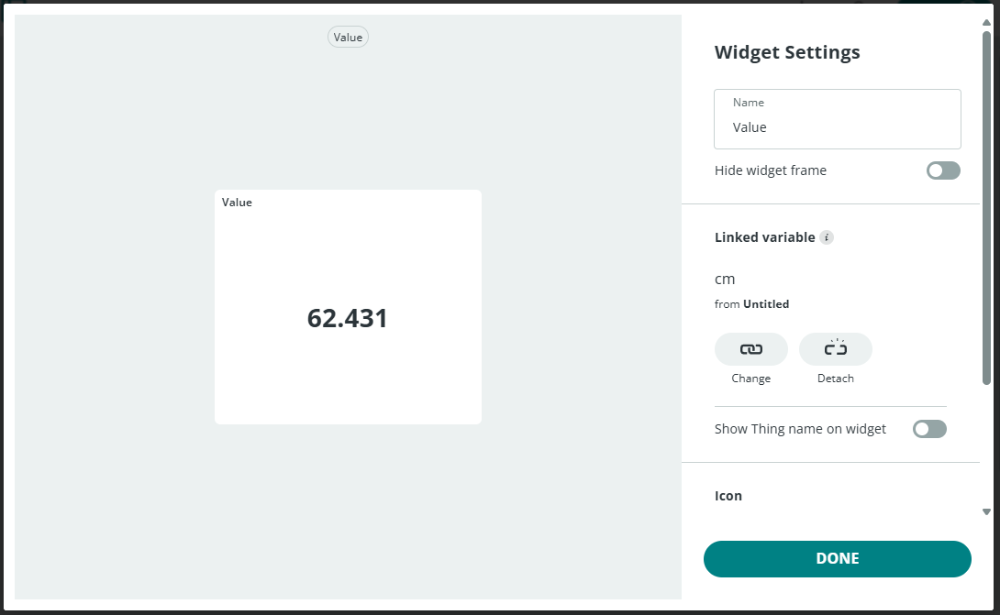
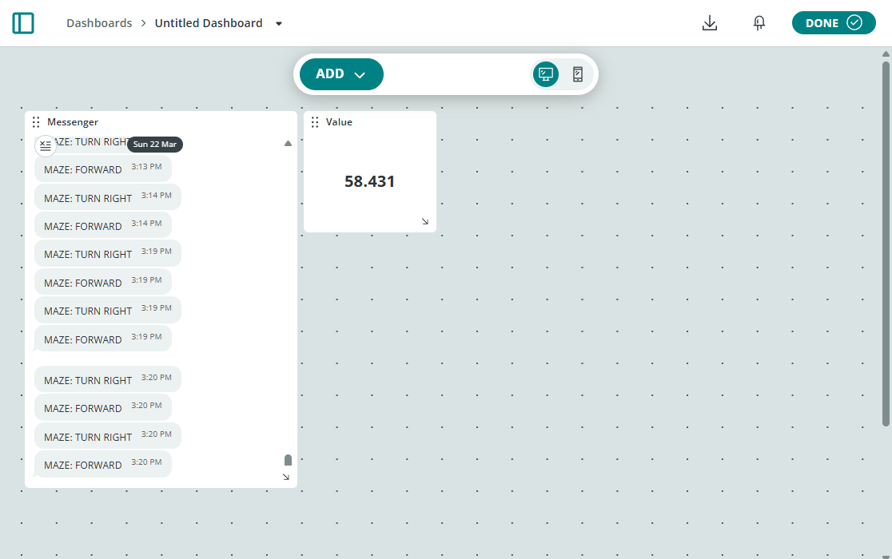
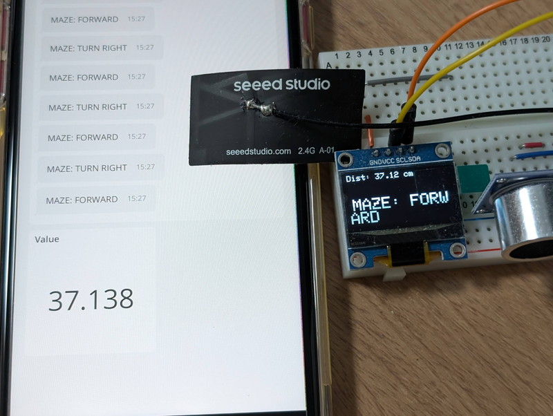

+++
date = '2026-03-22T08:56:03+09:00'
title = 'ESP32ミニカーをArduino Cloudで動かす #1（おおたfab 電子工作初心者勉強会）'
slug = 'otafab-esp32-arduino-cloud-minicar-1'
tags = ["Arduino","ESP32","Otafab","Xiao","電子工作","IoT"]
categories = ["Electronics"]
image = 'esp32-arduino-cloud-minicar-1.jpg'
+++

[おおたfab](https://ot-fb.com/event)さんでは電子工作初心者勉強会を定期的に開催しています。

これまで[ESP32マイコンで動くミニカー](/2025/12/otafab-esp32-minicar7.html)の自律走行を試してきましたが、[Arduino Cloud](https://cloud.arduino.cc/)を使ってリモート制御でミニカーを動かしてみます。今回はOLEDに表示しているミニカーの状態をArduino Cloudでスマートフォンやブラウザに表示するところまでを試してみます。

## 今日の目標

Arduino Cloudのクラウド変数を使って、ダッシュボードにミニカーの状態を表示してみます。
具体的には現在OLEDに表示されている以下の情報を表示します。
 * センサーの距離情報
 * ミニカーが動いている方向（STOP, FORWARD, RIGHT TURN）

## 準備するもの

* [XIAO ESP32-C3](https://wiki.seeedstudio.com/ja/XIAO_ESP32C3_Getting_Started/)
* Arduino Cloudのアカウント（無料版）
* USB-Cのケーブル（XIAOとPCの接続用）
* ミニカー本体（超音波距離センサー、OLED搭載） 

## 使用するスケッチ

[これまでの勉強会](https://kanpapa.com/2025/12/otafab-esp32-minicar7.html)で作成したスケッチを使用します。ただしこのスケッチはXIAO ESP32C6用なのでGPIO番号を修正する必要があります。

* [esp32_mouse2_move_to_4_direction_and_rolate_8.ino](https://github.com/kanpapa/esp32-minicar/blob/main/Arduino/esp32_mouse2_move_to_4_direction_and_rolate_8/esp32_mouse2_move_to_4_direction_and_rolate_8.ino)

## ミニカーの回路図

XIAO ESP32-C3用に変更しています。回路そのものは同じですが、GPIO番号が異なります。



## 「モノ」を登録する

[前回Arduino CloudでLチカを行った勉強会](https://kanpapa.com/2026/02/otafab-esp32-arduino-cloud-blink.html)から少し時間が経過し、Arduino Cloudのメニューが大きく変わっていたので、もう一度おさらいをしました。すべてThingsのメニュー内で行うのがコツのようです。

Arduino Cloudでの「モノ」（ミニカー）の登録は以下のように行いました。

1. [Arduino Cloud](https://app.arduino.cc/)をブラウザで開きます。
1. 右上の`CREATE NEW`から`THING`をクリックします。
1. 右上の`+ VARIABLE`を押してクラウド変数を設定します。今回はOLEDに表示している内容をダッシュボードに表示したいので、OLEDに表示している以下の２つの変数をクラウド変数に設定しました。

    |変数名|Variable Type|Variable Permission|Variavle Update Pilocy|Threshold|
    |:--|:--|:--|:--|:--|
    |cm|Floating Point Number|Read Only|On change|0|
    |current_movement|Character String|Read Only|On change|0|

    `On change`はクラウド変数の値が変化した時のみにデータをクラウドに送信する設定です。

1. 左側メニューのデバイス (Associated Device) をクリックします。
    * 新規デバイス登録の場合  
        1. "New Device" → Compatible device
        1. ESP32 → XIAO_ESP32C3 → `CONTINUE`をクリック
        1. デバイス名を付与（変更しなくてそのままでも良い）してチェックマークをクリック
        1. DOWNLOADを押して、デバイスに割り当てられた名前、Client ID、Client Secretが書かれたPDFファイルをダウンロード
        1. ダウンロードがおわったら、チェックを入れて`CONTINUE`をクリック

    * 既に登録済のデバイスの場合  
        1. "Choose from your list" →　CONFIRM DEVICE （すでにSecret Keyは手元にあることが前提)

1. CHANGE NETWORKをクリック
 → WiFI Name, WiFi Password, Secret Key を入力
1. "GO TO SKETCH"をクリックするとスケッチのひな型が自動的に生成され、スケッチのエディタ画面になります。

## 「モノ」のスケッチを書き込む

Arduino Cloudで自動生成されたスケッチは以下のようになります。  

```C
#include "thingProperties.h"

void setup() {
  // Initialize serial and wait for port to open:
  Serial.begin(9600);
  // This delay gives the chance to wait for a Serial Monitor without blocking if none is found
  delay(1500); 

    // Defined in thingProperties.h
    initProperties();

    // Connect to Arduino IoT Cloud
    ArduinoCloud.begin(ArduinoIoTPreferredConnection);

    /*
        The following function allows you to obtain more information
        related to the state of network and IoT Cloud connection and errors
        the higher number the more granular information you’ll get.
        The default is 0 (only errors).
        Maximum is 4
    */
    setDebugMessageLevel(2);
    ArduinoCloud.printDebugInfo();
}

void loop() {
    ArduinoCloud.update();
    // Your code here 


}
```

ヘッダファイルとsetup()、loop()にArduino Cloudで必要な関数がありますので、これを既存のスケッチに組み込んでいきます。

1. 既存のスケッチをThingsで自動生成されたスケッチの最終行にコピペします。
1. 自動生成されたスケッチのsetup()とloop()にある関数を既存のスケッチに組み込みます。コメント行でArduino Cloudのひな型から持ってきた部分を示します。

    ```C
    #include "thingProperties.h"    // Arduino Cloudのひな型から追加 

    #include <SPI.h>
    #include <Wire.h>
    #include <Adafruit_GFX.h>
    #include <Adafruit_SSD1306.h>

    //
    // 途中省略
    //

    void setup() {
      // Arduino Cloudのひな型から追加 ここから ------------
      // Initialize serial and wait for port to open:
      Serial.begin(9600);
      // This delay gives the chance to wait for a Serial Monitor without blocking if none is found
      delay(1500); 

      // Defined in thingProperties.h
      initProperties();

      // Connect to Arduino IoT Cloud
      ArduinoCloud.begin(ArduinoIoTPreferredConnection);
    
      setDebugMessageLevel(2);
      ArduinoCloud.printDebugInfo();
      // Arduino Cloudのひな型から追加 ここまで ------------

      // ここから既存のスケッチ
      pinMode(TRIG_PIN, OUTPUT);
      digitalWrite(TRIG_PIN, LOW);
      pinMode(ECHO_PIN, INPUT);

      //
      // 途中省略
      //
    
      current_movement = "STOPPED";
      robot_state = STATE_STOPPED;
    }

    void loop() {
      // Arduino Cloudのひな型から追加 ここから ------------
      ArduinoCloud.update();
    
      // Your code here 
      // Arduino Cloudのひな型から追加 ここまで ------------

      // 常に距離を測定
      float distance = dest(); 
      cm = distance; 

    　//
      // （途中省略） 
      //

      // 処理速度が速すぎる場合の暴走を防ぐため、ごく短い遅延(10ms)を入れる
      delay(10);    
    }
    ```

1. クラウド変数にした変数の定義をコメントにします。  
クラウド変数は自動生成された `thingProperties.h` に以下のようにグローバル変数として定義され、スケッチにincludeされています。

    ```C
    String current_movement;
    float cm;
    ```

    このためスケッチ本体にこの変数定義が残ったままだと二重定義になってしまうのでコメントにします。

    ```C
    //cmはクラウド変数にしたのでコメントにする
    //float cm = 0;

    //current_movementはクラウド変数にしたのでコメントにする
    //String current_movement = "INITIALIZING";
    ```
1. GPIO番号の修正  
オリジナルのソースはXIAO ESP32C6用のためXIAO ESP32C3とはGPIO番号が異なります。
回路図に合わせて以下のように修正します。

    ```C
    // Pins
    const int TRIG_PIN = 10;  //18;
    const int ECHO_PIN = 9;   //20;

    const unsigned int MAX_DIST = 23200;

    int LP = 2; //0; // AIN1   LEFT PLUS
    int LM = 3; //1; // AIN2   LEFT MINUS
    int RP = 4; //2; // BIN1   RIGHT MINUS
    int RM = 5; //21; // BIN2   RIGHT PLUS
    ```

1. これでスケッチの修正が完了したので、`Verify`でエラーがないか確認します。
1. 問題が無ければ`Upload`でUSB接続したXIAO ESP32C3に書き込みます。

## クラウド変数の確認

クラウド変数を表示するためには、ミニカーのThingsを選び、上側のDataタブを選択します。

正常に動作していればOLEDに表示されている内容がVariablesにリアルタイムで表示されます。



## ダッシュボードを作る

クラウド変数をダッシュボードに表示してみます。
左サイドバーのDashboardsを選択します。

`+ CREATE DASHBOARD`または`+ DASHBOARD`というボタンが表示されますのでクリックします。



右上のEDITボタンをクリックすると表示される`ADD`をクリックします。



今回はMessengerウィジェットとValueウィジェットを使います。

Messengerウイジェットをクリックすると、`Link Variable`ボタンが表示されます。それをクリックするとクラウド変数が選択できるのでcurrent_movementをクリックし、`LINK VARIABLE`ボタンをクリックすると次の画面になり、OLEDに表示されているメッセージが表示されます。問題なければ`DONE`をクリックします。



次はValueウイジェットです。Messengerと同様にクラウド変数cmをリンクします。問題なければ`DONE`をクリックします。



これで２つのウィジェットがダッシュボードに表示されるようになりました。EDIT状態であれば表示位置は自由に変更できます。



修正が終わったら右上の`DONE`を押すとダッシュボードの表示内容が固定されます。

## スマートフォンでの動作確認

この状態でスマートフォンアプリ`Arduino IoT Remote`からArduino Cloudにアクセスしてダッシュボードを表示すると同じ画面が表示されます。距離の値は微妙に変化しており若干のタイムラグがあるため表示内容は完全には一致しませんが近い値が表示されています。



## トラブルシューティング

今回の勉強会の中で発生したトラブルシューティングの例です。

* デバイスがONLINEにならない
    1. Homeから左サイドメニューのDevicesをクリック
    1. 接続できないデバイスを縦三点メニューにあるDelete permanentlyで削除
    1. Thingsをクリックして、Thingsの左メニューのAssociated Deviceでもう一度New Deviceからデバイスを登録 

* XIAO ESPC3をUSBに接続しても認識されない
    1. Arduino Cloud Agentをインストールする。
    https://cloud.arduino.cc/download-agent
    1. インストールができていれば「Your Agent is ready. You can now close this tab.」と表示されます。

* WiFiのアクセスポイントを変更したい
    1. Thingsを選びWiFiを変更したい「モノ」を選ぶ
    1. 左側のデバイス (Associated Device) をクリック
    1. CHANGE NETWORK → WiFI Name, WiFi Passwordを変更。Secret Keyはそのままで変更しない
    1. "GO TO SKETCH"を押して、スケッチ作成画面に移動。
    1. Verifyでエラー確認
    1. UploadでC3に書き込み 

## まとめ

これまでOLEDに表示されていた情報がスマホで簡単に見ることができるようになりました。
次はスマホからミニカーを制御してみます。

次の記事：[ESP32ミニカーをArduino Cloudで動かす #2（おおたfab 電子工作初心者勉強会 第44回）](/2026/05/otafab-esp32-arduino-cloud-minicar-2.html)