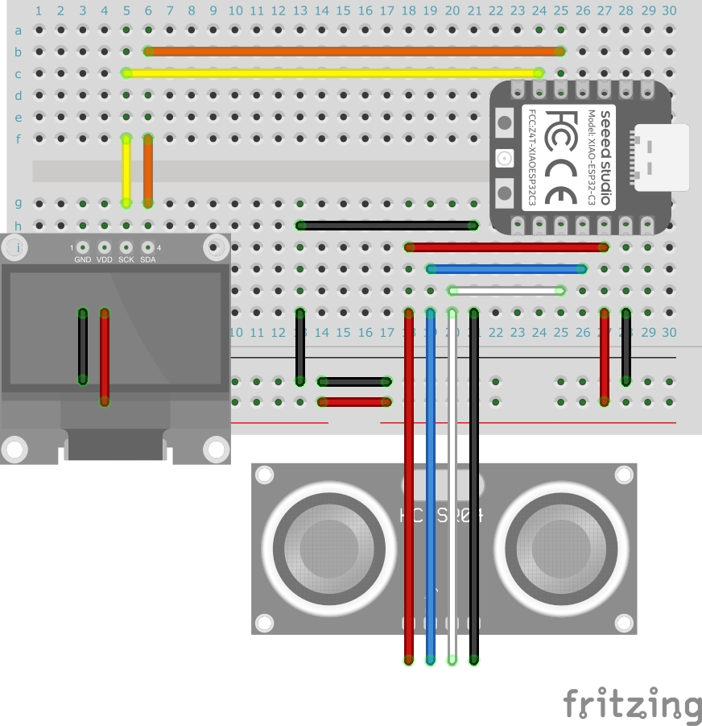
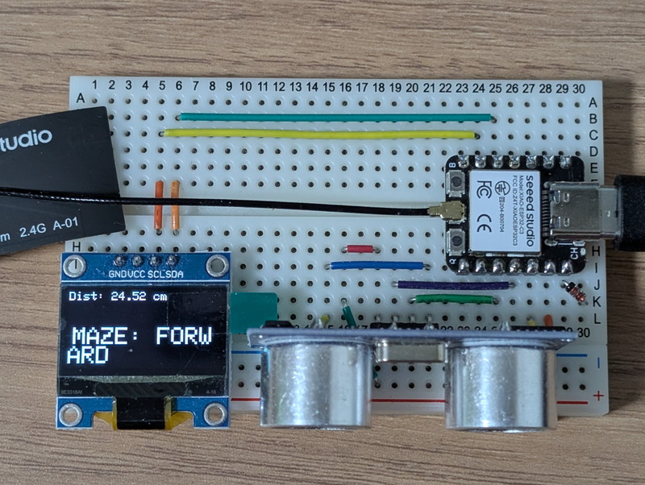
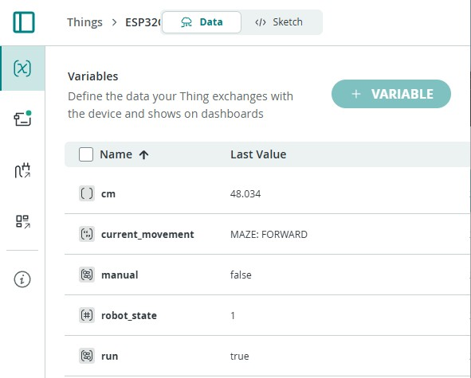
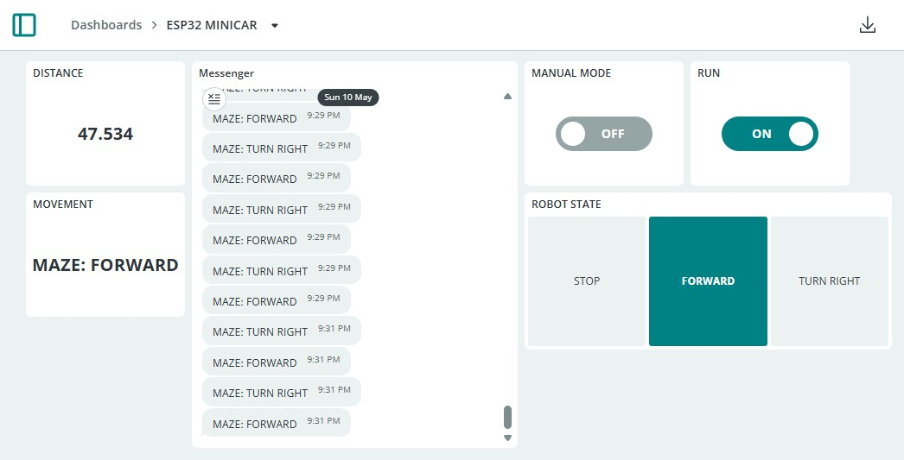

+++
date = '2026-05-10T17:08:40+09:00'
title = 'ESP32ミニカーをArduino Cloudで動かす #2（おおたfab 電子工作初心者勉強会 第44回）'
slug = 'otafab-esp32-arduino-cloud-minicar-2'
tags = ["Arduino","ESP32","Otafab","Xiao","電子工作","IoT"]
categories = ["Electronics"]
image = 'esp32-arduino-cloud-minicar-2.jpg'
+++

[おおたfab](https://ot-fb.com/event)さんでは電子工作初心者勉強会を定期的に開催しています。

[前回](/2026/03/otafab-esp32-arduino-cloud-minicar-1.html)はミニカーのOLEDに表示している内容を[Arduino Cloud](https://cloud.arduino.cc/)のダッシュボードでスマートフォンやブラウザに表示しました。今回はダッシュボードからミニカーを制御します。

## 今日の目標

Arduino Cloudのダッシュボードからミニカーを制御してみます。  
その前にミニカーは２台しかないため、参加者全員がArduino Cloudを試せるように自分専用のプロトタイプボードを製作することにしました。

その上でミニカーを制御するスケッチを作成しある程度のテストを行った後に実際のミニカーを動かすことにします。

## プロトタイプボードの製作
プロトタイプボードはミニカーのモータードライバの部分を省略し、ESP32マイコンと距離センサーとOLEDを搭載したものです。実際のモーターは動かせませんがArduino Cloudとの接続を確認するには十分な機能を持ちます。

使用したパーツは以下の通りです。
* [XIAO ESP32C3](https://akizukidenshi.com/catalog/g/g117454/)
* [超音波センサー HC-SR04](https://akizukidenshi.com/catalog/g/g111009/)
* [OLED 128x64ドット I2C接続用](https://akizukidenshi.com/catalog/g/g112031/)
* [ブレッドボード　6穴または5穴](https://akizukidenshi.com/catalog/g/g112366/)
* [USB-C ケーブル](https://akizukidenshi.com/catalog/g/g117017/)
* [ブレッドボード・ジャンパーワイヤー](https://akizukidenshi.com/catalog/g/g102315/)

ブレッドボードを使用した実体配線図は以下のようになりました。



組み立て後のプロトタイプボードです。



このプロトタイプボードに前回作成したスケッチをアップロードして動作確認を行いました。

## ミニカー制御スケッチの作成

動作しているスケッチを修正して、ミニカーを制御できるように機能を追加していきます。

### クラウド変数の追加

まずはクラウド変数を追加します。ここでは3つの変数を追加しました。無料版では変数は5つまでです。

|変数の種類|変数名|TYPE|備考|
|:--|:--|:--|:--|
|Floating Point Number|cm|Read Only| |
|Character String|current_movement|Read Only| |
|Boolean|manual|Read & Write|新規追加|
|Integer Number|robot_state|Read & Write|新規追加|
|Boolean|run|Read & Write|新規追加|

### クラウド変数に変更した変数定義のコメント化
クラウド変数は自動生成された `thingProperties.h` にグローバル変数として定義され、スケッチにincludeされます。
このためスケッチ本体に同じ名前の変数定義が残ったままだと二重定義になってしまうのでコメントにします。

```C
//RobotState robot_state = STATE_STOPPED;
```

### メインループ関数の修正
loop関数を以下のように修正して、クラウド変数でミニカーの動きが制御できるようにします。

```C
void loop()
{
    ArduinoCloud.update();
    // 常に距離を測定
    float distance = dest(); 
    cm = distance; 

    if (run) {
        // エンジン稼働中モード
        if (manual) {
            // 手動運転モード
            switch (robot_state) {
                case STATE_STOPPED:
                    STOP();
                    current_movement = "STOPPED";
                    break;
        
                case STATE_FORWARD:
                    FWD();
                    current_movement = "FORWARD";
                    break;
        
                case STATE_TURNING_RIGHT:
                    RTR();
                    current_movement = "TURN RIGHT";
                    break;
            }
        } else {
            // 自動運転モード
            // ステートマシン（非ブロッキングロジック）
            switch (robot_state) {
                case STATE_STOPPED:
                    // 停止中: 次の動作を判断する
                    if (distance > WALL_THRESHOLD_CM) {
                        // 【壁なし】前進を開始
                        FWD(); 
                        action_start_time = millis();
                        robot_state = STATE_FORWARD;
                        current_movement = "MAZE: FORWARD";
                    } else {
                        // 【壁あり】右回転を開始 (右手法)
                        RTR();
                        action_start_time = millis();
                        robot_state = STATE_TURNING_RIGHT;
                        current_movement = "MAZE: TURN RIGHT";
                    }
                    break;

                case STATE_FORWARD:
                    // 直進中: 常に衝突をチェック
                    if (distance <= WALL_THRESHOLD_CM && distance > 0) { // 距離 > 0 を追加し、測定エラーを除外
                        // 衝突検知！即座に停止して再判断へ
                        STOP(); 
                        robot_state = STATE_STOPPED;
                    } else {
                        if (millis() - action_start_time >= FORWARD_DELAY) {
                            // 規定の直進時間（2000ms）を完了。停止して再判断へ
                            STOP(); 
                            robot_state = STATE_STOPPED;
                        }
                    }
                    break;

                case STATE_TURNING_RIGHT:
                    // 右回転中: 回転時間をチェック
                    if (millis() - action_start_time >= ROTATE_90_DELAY) {
                        // 回転時間（300ms）を完了。停止して再判断へ
                        STOP(); 
                        robot_state = STATE_STOPPED;
                    }
                    break;
            }
        }
    } else {
        // エンジン停止中モード
        STOP(); 
        robot_state = STATE_STOPPED;
        current_movement = "STOPPED";
    }

    // 処理速度が速すぎる場合の暴走を防ぐため、ごく短い遅延を入れる
    delay(10); 
}
```
スケッチの修正が完了したら、`Verify`でエラーがないか確認し、問題が無ければ`Upload`でUSB接続したXIAO ESP32C3に書き込みます。

## クラウド変数の確認

クラウド変数を表示するためには、ミニカーのThingsを選び、上側のDataタブを選択します。

正常に動作していればOLEDに表示されている内容がVariablesにリアルタイムで表示されます。



## ダッシュボードを作る

クラウド変数をダッシュボードに表示してみます。

左サイドバーのDashboardsを選択し、以下のようにウィジェットを設定しました。

|クラウド変数|ウィジェットの種類|ウィジェットの名前|
|:--|:--|:--|
|current_movement|Messanger |Messanger|
|current_movement|Value|MOVEMENT|
|robot_state|Value Selector|ROBOT STATUS|
|manual|Switch|MANUAL MODE|
|run|Switch|RUN|

Dashboardの修正が終わったら右上の`DONE`を押すとダッシュボードの表示内容が固定されます。



## スケッチの動作確認

実際に動かしている様子を動画にしておきました。自動運転モードだと停止と前進を繰り返しながら障害物との距離が短くなると、右にターンする動きを繰り返していることがわかります。



手動運転モードに切り替えると、ダッシュボードのROBOT STATUSのいずれかのボタンを押すことでその動作をすることができます。

## まとめ

これまでミニカーのプロトタイプボードが制御できるようになりました。実際のミニカーではないのでモーターの動作確認まではできませんが、第45回の勉強会でスケッチを書きこんだESP32C3をプロトタイプボードからミニカーのブレッドボードに差し替えて、ミニカーの動きが確認できました。

次の記事：[ESP32S3 SenseでSenseCraft AIを試す #1（おおたfab 電子工作初心者勉強会 第46回）](/2026/08/otafab-esp32-arduino-sensecraft-ai-1.html)