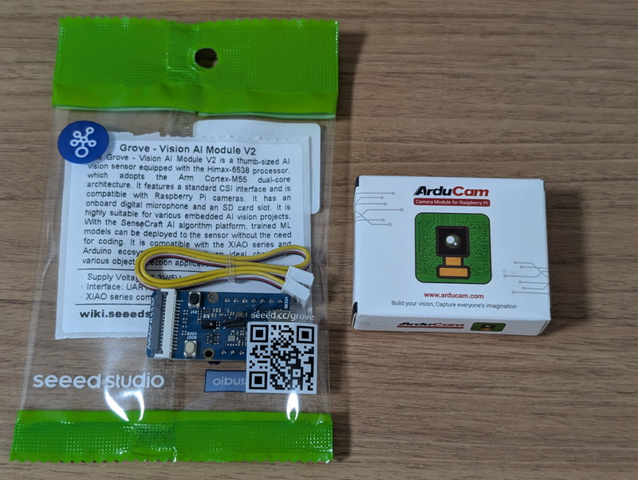
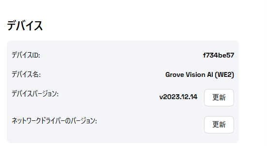
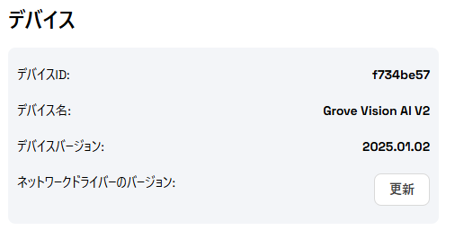
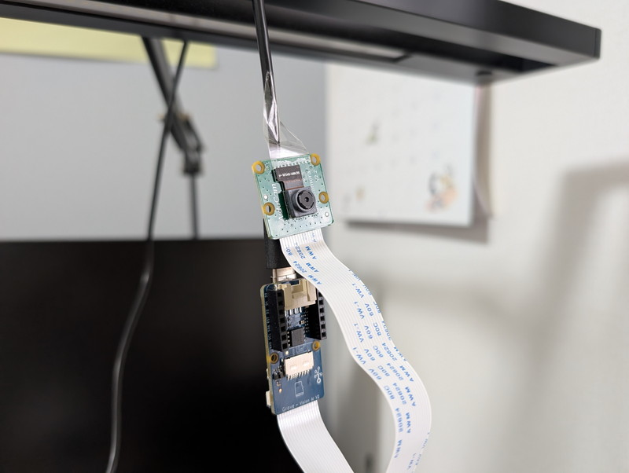
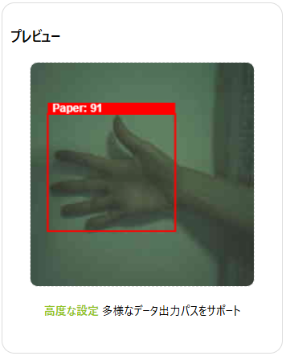
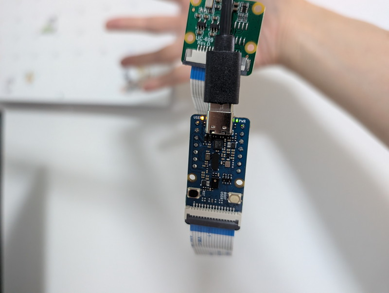

+++
date = '2026-08-09T08:11:53+09:00'
title = 'Grove Vision AI V2でSenseCraft AIを試す'
slug = 'grove-vision-ai-v2'
tags = ["ESP32","Xiao","grove","電子工作","IoT","SenseCraftAI"]
categories = ["Electronics"]
image = 'grove-vision-ai-v2.jpg'
+++

[電子工作初心者勉強会でESP32S3 SenseとSenseCraft AIを試してみました](/2026/08/otafab-esp32-arduino-sensecraft-ai-1.html)が、他にもエッジデバイスとして[Grove Vision AI V2](https://wiki.seeedstudio.com/ja/grove_vision_ai_v2/)というものがあることを知りました。こちらはNPUを搭載していて高速化が期待できそうなので、こちらも試してみることにしました。

## Grove Vision AI V2の入手

秋月電子さんで[Grove Vision AI V2](https://akizukidenshi.com/catalog/g/g118381/)を探してみたところなんと残り1で在庫限りでした。最近の円安で次回の入荷では高くなってしまうことが予想されるので、迷わずオーダーしました。店頭在庫にはなかったので最近始まった店舗受け取りを試してみました。

Grove Vision AI V2で画像認識を行うためにはCSIのカメラも必要です。Raspberry Pi V2のカメラが確かあったなと思いつつ別の機器で使用しているので、カメラも探してみたところ[ArduCam B0390 IMX219 Visible Light Fixed Focus](https://akizukidenshi.com/catalog/g/g117368/)という安価なものを見つけてしまいました。
これも在庫が２つしかありません。今後を考えるとこの価格での入手は難しくなりそうなのでこちらも迷わず購入です。こちらも店頭在庫がなかったので店舗受け取りです。

こうして、無事Grove Vision AI V2とCSIカメラを手に入れることができました。



なお、店舗受け取りは2Fのカウンターですのでお間違いなく。

## Grove Vision AI V2を動かす

Grove Vision AI V2を入手してCSIカメラを取り付けて、SenseCraft AIで使おうとしたのですが、なぜか認識してくれません。いろいろ試したところ、どうやらファームウェアがv2023.12.14とかなり古いようです。



SenseCraft AIでファームウェア更新の機能もあるのですが、ボタンを押しても更新できませんでした。

## Grove Vision AI V2のファームウェアを更新する

さらに調べたところ手動で最新のファームウェアに直接更新できることがわかりました。XMODEMプロトコルでイメージファイルを送信すれば良さそうです。

* [最新のファームウェア](https://github.com/Seeed-Studio/sscma-example-we2/releases)
* [Windows環境でのファームウェアアップデート方法](https://github.com/HimaxWiseEyePlus/Seeed_Grove_Vision_AI_Module_V2?tab=readme-ov-file#flash-image-update-at-windows-environment)

この手順で最新のファームウェアをXMODEMで書き込んでみました。

```plain
1st BL Modem Build DATE=Nov 30 2023, 0x0002000b
Please input any key to enter X-Modem mode in 100 ms
waiting input key
Set X-modem flag = Yes

slot flash_offset 0x00100000
jump_addr=0x3401f000
Compiler Version: ARM CLANG, Clang 13.0.0 (ssh://ds-gerrit/armcompiler/llvm-project 1f5770d6f72ee4eba2159092bbf4cbb819be323a)
set_IP_secure done
flash type[2], flash size[5]
slot FlashOffset 0x00000000
Image max size 0x00100000
------------------------------------------------------------
[0] Reboot system
[1] Xmodem download and burn FW image
------------------------------------------------------------

------------------------------------------------------------
[0] Reboot system
[1] Xmodem download and burn FW image
------------------------------------------------------------

!!!!!!!!!!!!!!!!!!!!!!!!!!!!!!!!!!!!!!!!!!!!!!!!!!!!!!!!!!!!!!!!!!!
!!  Please keep the power on during the program upgrade process  !!
!!!!!!!!!!!!!!!!!!!!!!!!!!!!!!!!!!!!!!!!!!!!!!!!!!!!!!!!!!!!!!!!!!!


Send data using the xmodem protocol from your terminal
CCCCCCCCCCC
backup slot header


Do you want to end file transmission and reboot system? (y)
1st BL Modem Build DATE=Nov 30 2023, 0x0002000b
Please input any key to enter X-Modem mode in 100 ms
waiting input key...
slot flash_offset 0x00000000
New MemDesp himax_sec_SB_image_process PASS
set_memory_s_ns
bl_status = 0x800000, HX_DSP_FLAG 1
bl_status = 0x800000
jump_addr=0x10000000
Compiler Version: ARM GNU, 13.2.1 20231009
Build date: Jan  2 2025 06:21:56
```

無事ファームウェアが2025.01.02版に更新できたようです。  
SenseCraft AIに接続したところようやく認識してくれました。



## SenceCraft AIで画像認識を試す

SenceCraft AIで画像認識のテストを行ってみました。机のZライトにぶら下げるような形にして確認してみました。



プレビュー画面を確認したところ、パーのジェスチャが認識されてはいますが、画像が緑一色になっています。



ドキュメントを確認したところ、 カメラモジュールはやや旧型の[OV5647](https://www.seeedstudio.com/OV5647-69-1-FOV-Camera-module-for-Raspberry-Pi-3B-4B-p-5484.html)が強く推奨されていて、他のカメラでは緑一色になったり、フルカラーにならない場合があるそうです。  
とりあえずは使用できているので、このまま使うことにしますが、OV5647カメラモジュールはAliexpressで安価に販売されているようなので機会があれば購入してみようと思います。

## 認識結果でLEDを点灯する


設定を見るとわかりますが、認識したときの画像をSDカードに保存することもできるようです。

パーを出したところ、左側のUSER LEDが点灯しました。



## まとめ

Grove Vision AI V2の認識速度はESP32S3 Senseと比較すると圧倒的に速いです。これなら動くものでも使用できそうです。
残念ながら一部のCSIカメラでは色がおかしくなることがあり、この影響で認識精度も左右するので、推奨カメラを使用するのが良さそうです。  
Grove Vision AI V2はXIAOシリーズのマイコンを搭載できるようになっており、I2C経由でGrove Vision AI V2との通信が行えます。Arduino IDE用のサンプルプログラムも提供されているので様々な電子工作に応用できそうです。
