+++
date = '2026-02-11T08:17:33+09:00'
title = 'ESP32でArduino Cloudを使ってみた（おおたfab 電子工作初心者勉強会）'
slug = 'otafab-esp32-arduino-cloud-blink'
tags = ["Arduino","ESP32","Otafab","Xiao","電子工作","IoT"]
categories = ["Electronics"]
image = 'esp32c3-bme280-led.jpg'
+++

[おおたfab](https://ot-fb.com/event)さんでは電子工作初心者勉強会を定期的に開催しています。

これまで[ESP32マイコンで動くミニカー](/2025/12/otafab-esp32-minicar7.html)の自律走行を試してきましたが、参加者のかたが[Arduino Cloud](https://cloud.arduino.cc/)を使ってリモート制御でミニカーを動かしてみたとのことで、今回はArduino Cloudがどんなものかを知るための勉強会を行いました。

## Arduino Cloudとは
いわゆるIoTプラットホームです。インターネット経由でモノを制御したり、モノの情報を読み取ったりすることができます。Arduino Cloudではインターネット上のクラウドに`変数`を作り、モノやクラウドから変数の値を読み書きすることで情報のやりとりを行います。
文章ではピンとこないので実際にLEDをArduino Cloudで制御してみます。

## ターゲットを準備する
今回のターゲットマイコンは[XIAO ESP32-C3](https://wiki.seeedstudio.com/ja/XIAO_ESP32C3_Getting_Started/)を使用しました。これまでマイコンカーではXIAO ESP32-C6を使ってきたのですが、Arduino CloudではESP32-C6は未対応のようです。

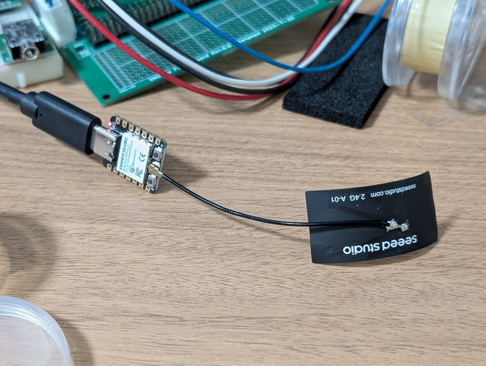

今回はESP32C3のD10に1KΩの抵抗を挟んでLEDを接続しました。これを制御することを目標とします。

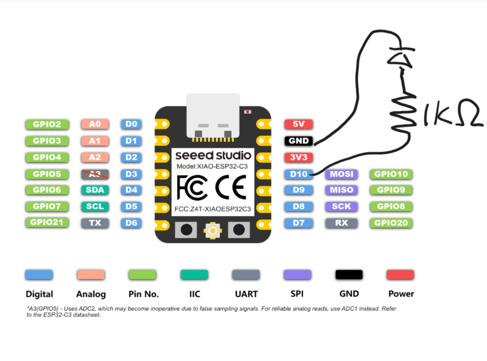

## Lチカのシステム構成

今回作成するLチカシステムを図にまとめました。
クラウドの上にある変数`ledswitch`が重要なものになります。この変数をダッシュボードで操作し、マイコンはこの変数`ledswitch`の値に従ってLEDのON/OFFを行います。

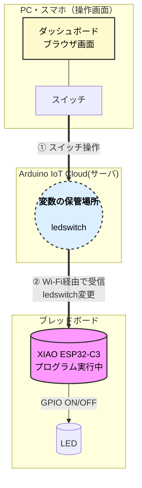
```mermaid
graph TD
    %% スタイル定義
    classDef hardware fill:#f9f,stroke:#333,stroke-width:2px,color:black;
    classDef cloud fill:#dbefff,stroke:#333,stroke-width:2px,stroke-dasharray: 5 5,color:black;
    classDef dashboard fill:#fffacd,stroke:#333,stroke-width:2px,color:black;

    subgraph BreadBoard ["ブレッドボード"]
        direction TB
        ESP32C3[("XIAO ESP32-C3<br>プログラム実行中")]:::hardware
        LED[("LED")]        
        ESP32C3 --"GPIO ON/OFF"--> LED
    end

    subgraph Internet ["Arduino IoT Cloud(サーバ)"]
        direction TB
        CloudBox(("<B>変数の保管場所</B><br><br>ledswitch<br>")):::cloud
    end

    subgraph PC_Smartphone ["PC・スマホ（操作画面）"]
        direction TB
        DashBoard["ダッシュボード<br>ブラウザ画面"]:::dashboard
        SwitchWidget["スイッチ"]
        DashBoard --- SwitchWidget
    end

    %% 通信の流れ
    SwitchWidget == "① スイッチ操作" ==> CloudBox
    CloudBox == "② Wi-Fi経由で受信<br>ledswitch変更" ==> ESP32C3
```

## 開発の流れ
最初はArduino Cloudを適当にいじっていたのですが、順序立てて進めないと混乱したり後戻りすることがわかりました。  
進め方のポイントは、**「スケッチを書く前に、クラウド上でデータ構造（変数）を定義する」** ことでした。これにより、クラウドを使用するためのコードや変数宣言が自動的に生成され、その後に処理したい機能だけをスケッチに追加すれば良いのです。

以下の順序で進めると良いようです。

1. プロジェクトとなる"Thing"（モノ）の作成
1. 変数（Cloud Variables）の定義
1. デバイスの紐付け (Device)
1. WiFiネットワーク設定 (Network)
1. スケッチの編集 (Sketch)
1. ダッシュボード作成 (Dashboard)

これで、ブラウザやスマホアプリ（Arduino IoT Remote）からデバイスの操作・確認ができるようになります。

## 実際に作ってみる

先ほどの順序に従ってArduino Cloudで開発を進めてみます。

### Thingを作る

左サイドバーにある`Things`をクリックすると次の画面になります。

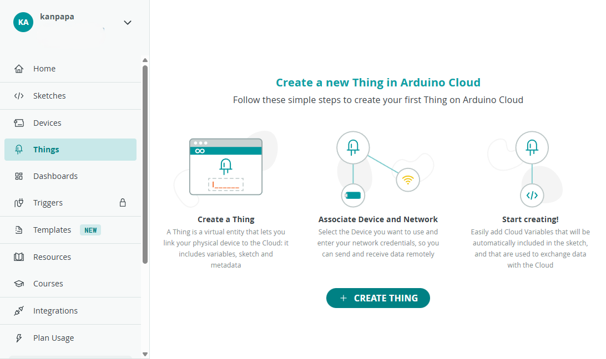

ここで`CREATE THING`をクリックすると、自動的に次の変数定義画面に進みます。

### 変数（Cloud Variables）の定義

クラウド変数の定義画面に変わります。ここで`ADD`をクリックします。

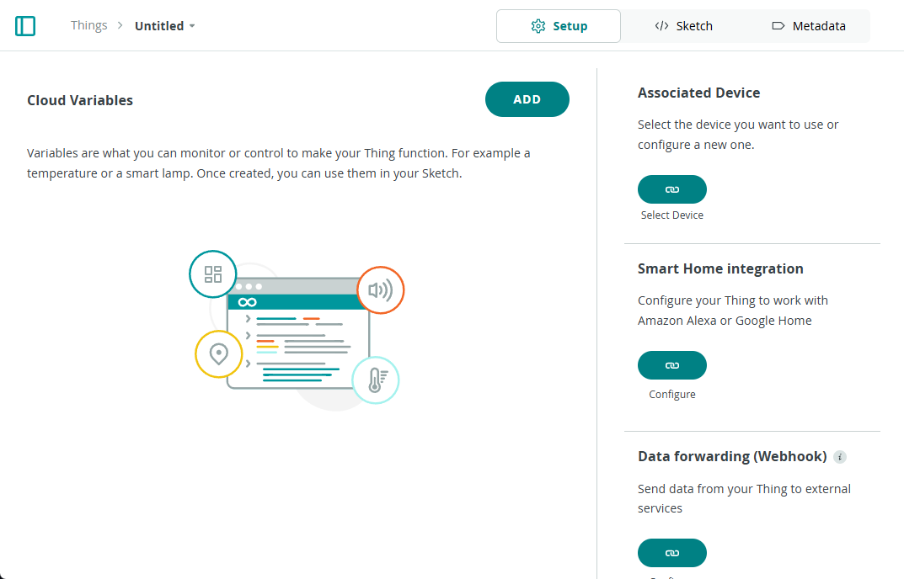

変数の追加画面になりますので、変数名を`ledswitch`とします。変数の型は`Boolean`を選びます。これはONかOFFの2種類しかないためです。

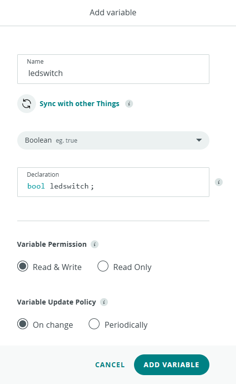

変数の権限はクラウドから読み書きするので、`Read & Write`を選びます。変数の更新ポリシーは`On change`です。これにより変数の値が変わるたびにデバイスに値が通知されます。

### デバイスの紐付け (Device)

変数の定義が完了すると変数名が表示されます。この画面の右側にある`Associated Device`でデバイスの紐づけを行います。

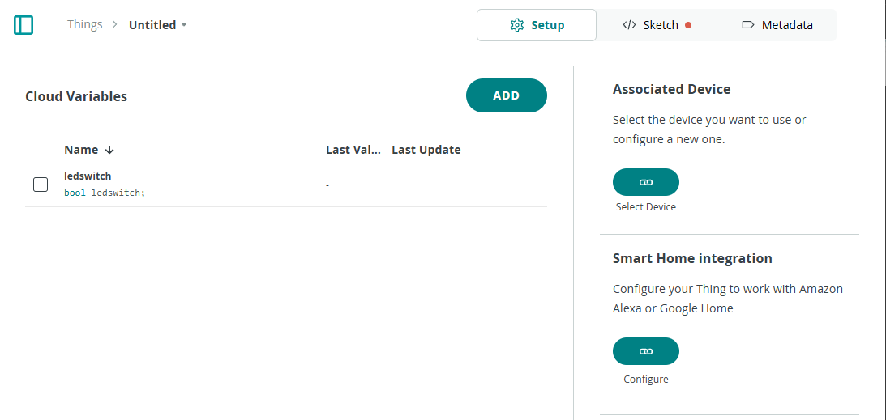

`Associated Device`の`Select Device`をクリックすると次の画面になります。

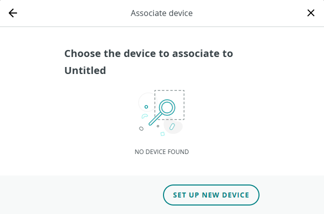

`SET UP NEW DEVICE`をクリックすると追加するデバイスの選択画面になります。

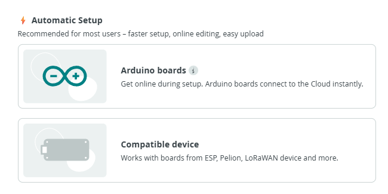

今回はXIAO ESP32-C3を使用するので、`Compatible device`をクリックすると次の画面になります。ESP32を選びプルダウンで表示されるXIAO_ESPC3を選択して、`CONTINUE`をクリックします。

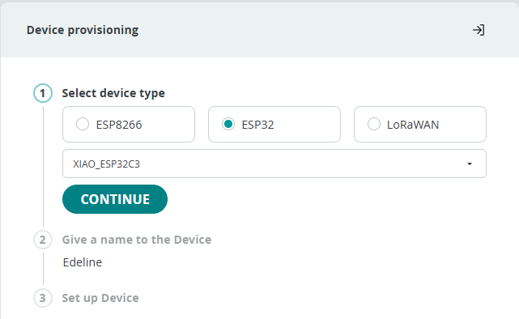

次にこのデバイスに名前を付ける画面になります。わかりやすい名前を付けてください。

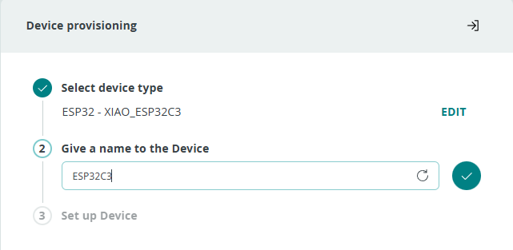

名前の設定が終わると`Devive ID`と`Secret Key`が表示されます。DOWNLOADをクリックすると、これらの情報が書かれたPDFファイルがダウンロードされます。この情報は後でWiFi設定で使います。また、この情報は他人には知られないようにしてください。

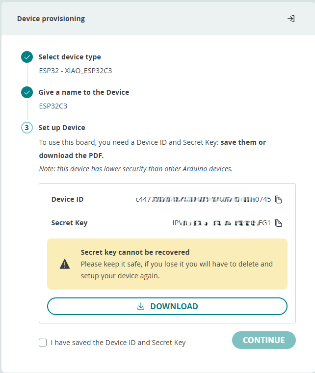

PDFファイルをダウンロードしたらチェックボックスにチェックをいれて、`CONTINUE`をクリックします。

Associated DeviceにXIAO ESP32C3が登録されました。

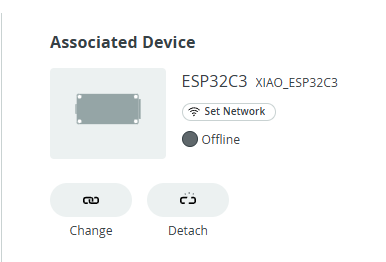


### ネットワーク設定 (Network)

`Associated Device`の`Set Network`をクリックすると次の画面になります。

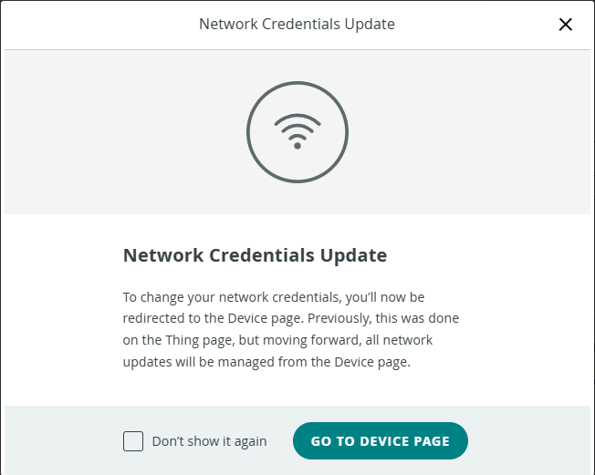

`GO TO DEVICE PAGE`でデバイスメニューに移動します。

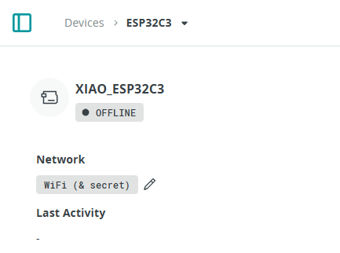

`WiFi (& secret)`の横の鉛筆マークをクリックすると次の画面になります。

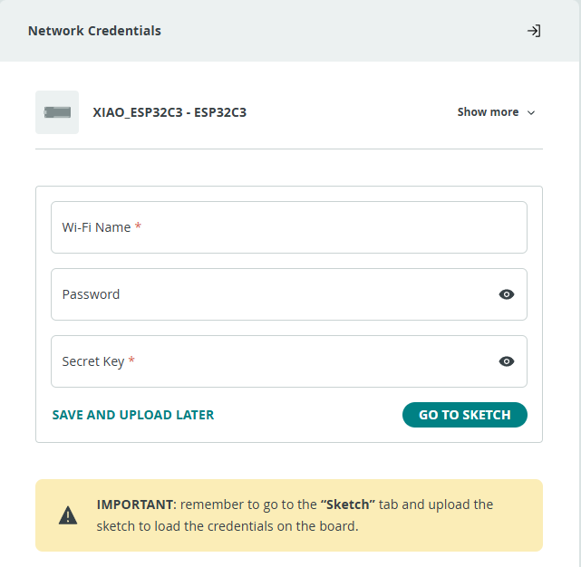

ここでWiFiの`SSID`と`パスワード`を入力し、`Secret Key`は先ほどダウンロードしたPDFから`Client Secret`をコピペして入力します。

その後に`GO TO SKETCH`をクリックしてください。スケッチの編集画面が表示されます。

### スケッチの編集 (Sketch)

スケッチの編集方法はArduino IDEと同じです。

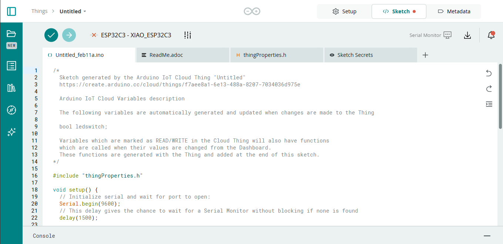

今回は生成されたひな型のスケッチを以下のように変更しました。

* 関数`setup()`でLEDを接続しているGPIO D10を出力モードにして初期化。
* スイッチの状態が変わったときに実行される関数`onLedswitchChange()`で`ledswitch`変数の状態に合わせてGPIO D10をHIにするかLOWにするかを追加。

その他の部分はArduino Cloudを制御するコードなのでそのままにしています。

```C
/* 
  Sketch generated by the Arduino IoT Cloud Thing "Untitled"

  Arduino IoT Cloud Variables description

  The following variables are automatically generated and updated when changes are made to the Thing

  bool ledswitch;

  Variables which are marked as READ/WRITE in the Cloud Thing will also have functions
  which are called when their values are changed from the Dashboard.
  These functions are generated with the Thing and added at the end of this sketch.
*/

#include "thingProperties.h"

void setup() {
  // Initialize serial and wait for port to open:
  Serial.begin(9600);
  // This delay gives the chance to wait for a Serial Monitor without blocking if none is found
  delay(1500); 

  // Defined in thingProperties.h
  initProperties();

  // Connect to Arduino IoT Cloud
  ArduinoCloud.begin(ArduinoIoTPreferredConnection);
  
  /*
     The following function allows you to obtain more information
     related to the state of network and IoT Cloud connection and errors
     the higher number the more granular information you’ll get.
     The default is 0 (only errors).
     Maximum is 4
 */
  setDebugMessageLevel(2);
  ArduinoCloud.printDebugInfo();

  // LEDのピンを出力モードに設定
  // XIAO ESP32C3のD10にLEDを接続
  pinMode(D10, OUTPUT);

  // 初期状態はOFF
  digitalWrite(D10, LOW);
}

void loop() {
  ArduinoCloud.update();
  // Your code here 
}

/*
  Since Ledswitch is READ_WRITE variable, onLedswitchChange() is
  executed every time a new value is received from IoT Cloud.
*/
void onLedswitchChange()  {
  // Add your code here to act upon Ledswitch change
  if (ledswitch) {
    // スイッチONのとき
    digitalWrite(D10, HIGH); 
    Serial.println("LED ON");
  } else {
    // スイッチOFFのとき
    digitalWrite(D10, LOW);
    Serial.println("LED OFF");
  }
}
```

スケッチの作成が終わったら、Arduino IDEと同じでVerify後にUploadを行ってください。これでThingsの情報がXIAO ESP32C3に登録されます。

左サイドメニューからThingsをクリックすると、デバイスとスケッチがThingsに登録されていることがわかります。

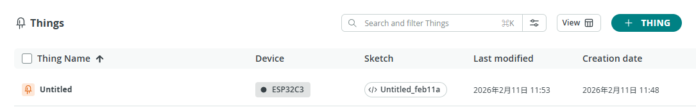

### Dashboardを作ってみる

最後にUIを作ります。左サイドメニューからDashboardsを選びます。

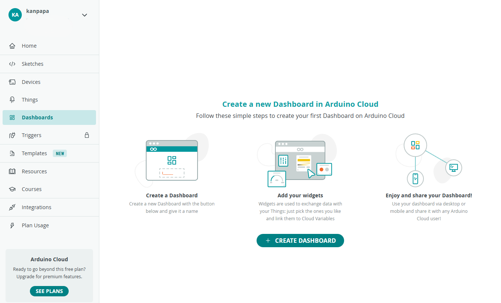

`CREATE DASHBOARD`をクリックすると何もない画面が表示されます。ここにウィジェットを配置していきます。

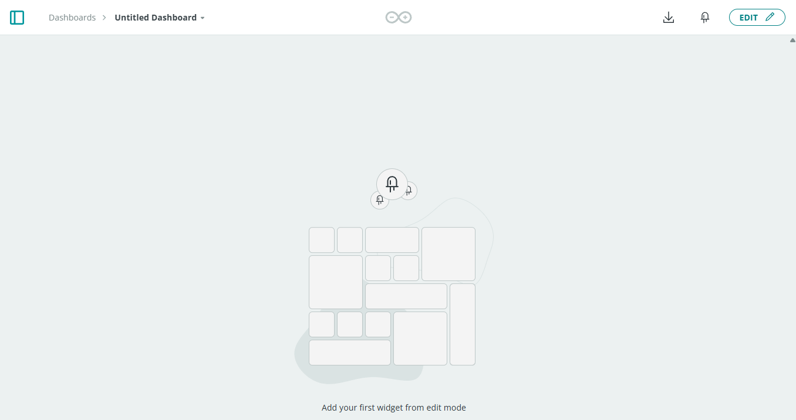

右上の`EDIT`をクリックし、ADDをクリックしてSwitchを選択します。

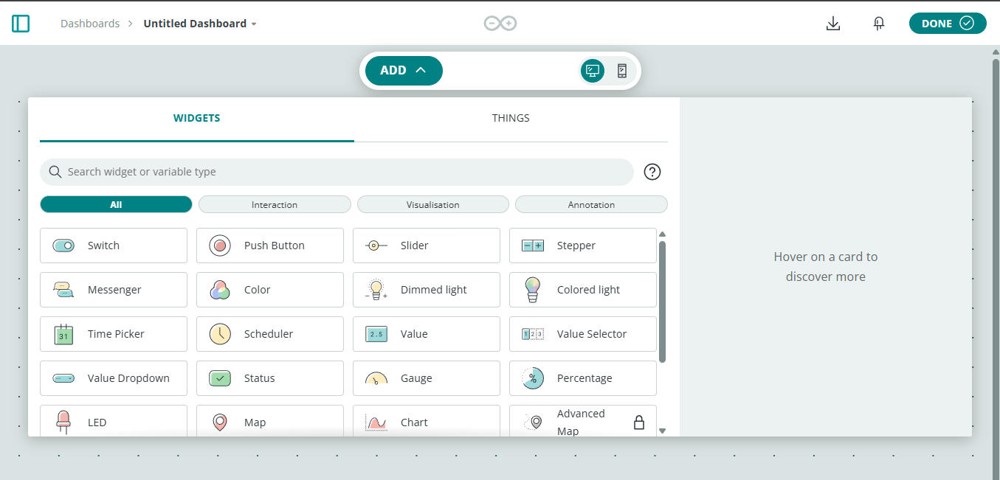

Switchの設定画面になります。ここではウィジェットの名前の変更と変数のリンクができます。

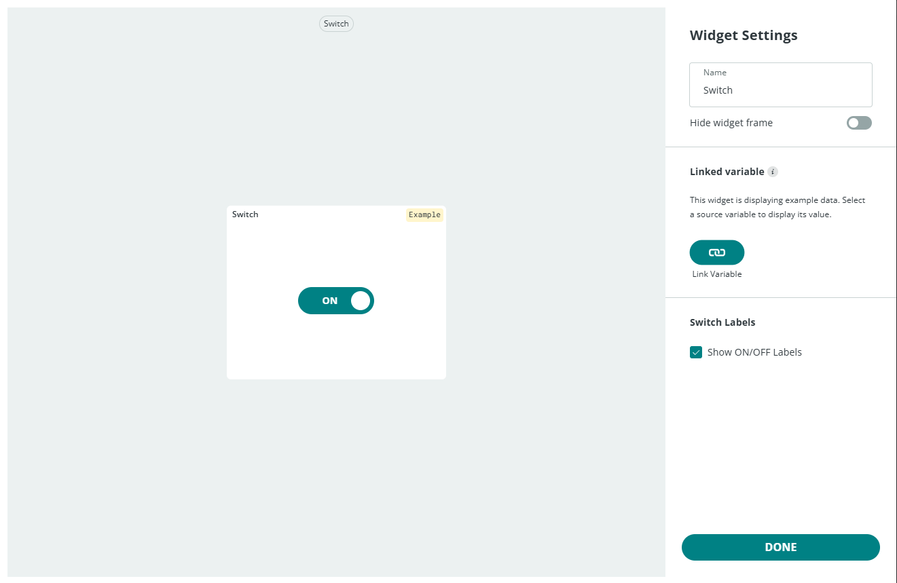

`Linked variable`の項目の`Link variable`をクリックすると次の画面になります。

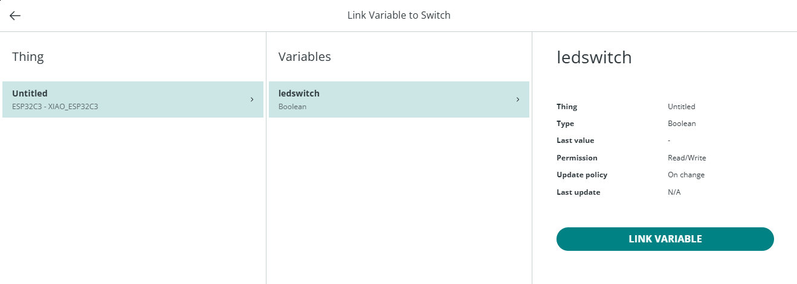

このスイッチにどの変数をリンクするか指定します。ここでは`switchled`しかありませんのでそれを選択し、`LINK VARIABLE`をクリックします。設定が完了すると次の確認画面になります。リンクした変数が正しいか確認してください。

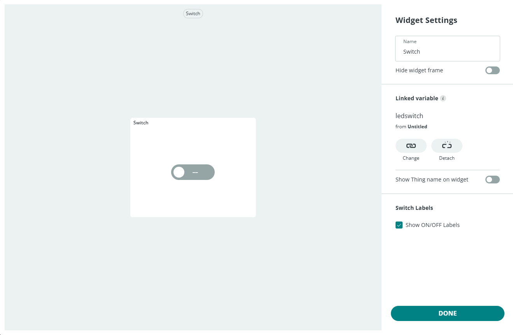

Switchの設定内容を確認したら、`DONE`をクリックします。他に追加するものが無ければ画面右上の`DONE`をクリックしてして編集を完了してください。

## ブラウザで動かしてみる

ブラウザで表示されているダッシュボードのスイッチをONにします。

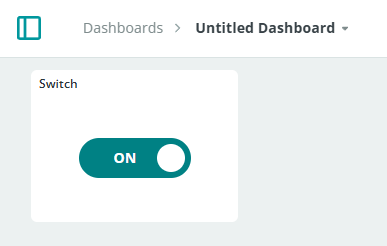

LEDが点灯しました。

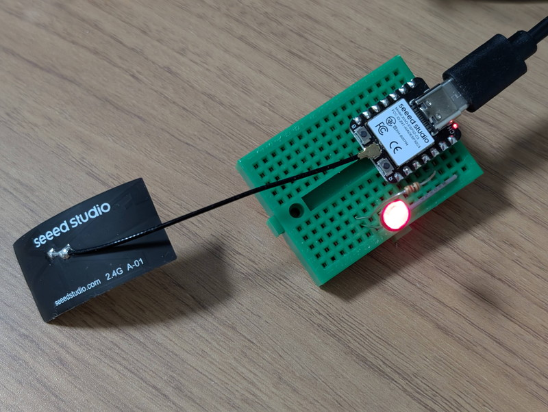

ダッシュボードのスイッチをOFFにするとLEDが消灯しました。

## スマホで動かしてみる
これまではブラウザでダッシュボードを動かしましたが、スマートフォンでも[Arduino IoT remote](https://cloud.arduino.cc/iot-remote-app/)というアプリケーションが公開されており、iPhoneやAndroidで使用できます。自宅で動作しているセンサーをリモートで確認するのも容易です。

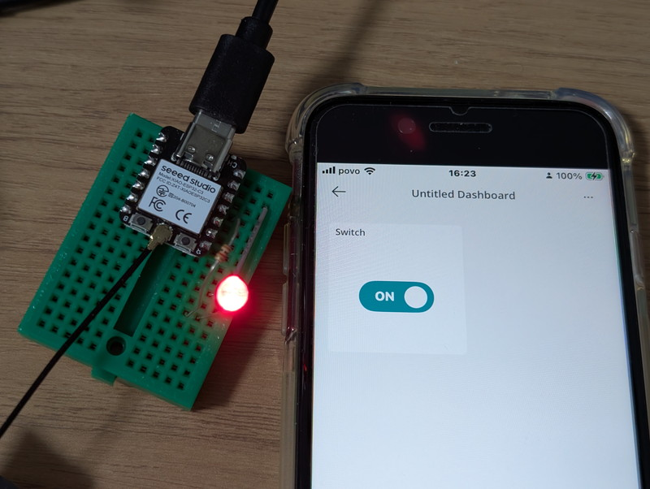


## センサーを接続してみる

次にマイコン側からデータを送ってみます。XIAO ESP32C3に温湿度・気圧センサー[AE-BME280](https://akizukidenshi.com/catalog/g/g109421/)をI2Cで接続して気温と気圧の値を送ってみます。AE-BME280を使用する場合はI2Cが使える設定（J3をジャンパ接続、SDOはGNDに接続）にしてください。

小さなブレッドボードで配線しましたがコンパクトに収まりました。

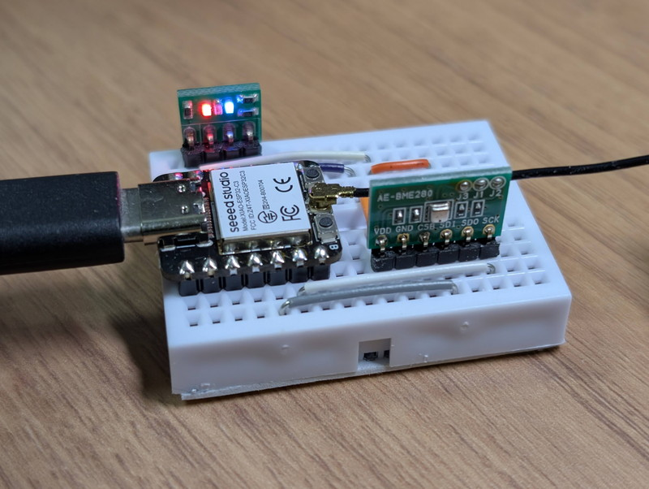

新たに２つの変数を追加します。両方とも浮動小数点形式です。クラウドからは読み取り専用で、10秒間隔で読み取る設定にしました。

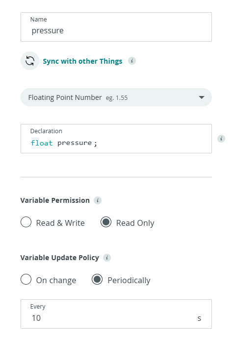
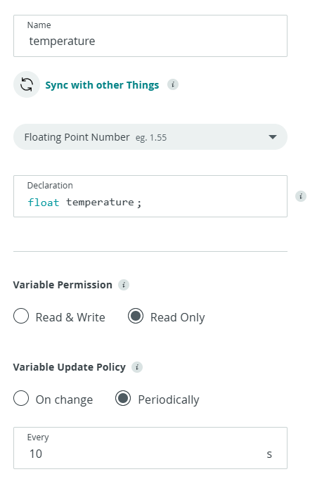


BME280の値を読み取るライブラリは[Adafruits BME280 Library](https://github.com/adafruit/Adafruit_BME280_Library)を使用しました。

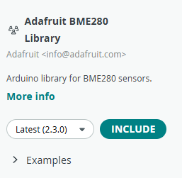

作成したスケッチは以下の通りです。

```C
/* 
  Sketch generated by the Arduino IoT Cloud Thing "Untitled"

  Arduino IoT Cloud Variables description

  The following variables are automatically generated and updated when changes are made to the Thing

  float pressure;
  float temperature;
  bool ledswitch;

  Variables which are marked as READ/WRITE in the Cloud Thing will also have functions
  which are called when their values are changed from the Dashboard.
  These functions are generated with the Thing and added at the end of this sketch.
*/

#include <Wire.h>
#include <SPI.h>
#include <Adafruit_Sensor.h>
#include <Adafruit_BME280.h>

#define SEALEVELPRESSURE_HPA (1013.25)

Adafruit_BME280 bme; // I2C

unsigned long delayTime = 1000;

#include "thingProperties.h"

void setup() {
  // Initialize serial and wait for port to open:
  Serial.begin(9600);
  // This delay gives the chance to wait for a Serial Monitor without blocking if none is found
  delay(1500); 

  // Defined in thingProperties.h
  initProperties();

  // Connect to Arduino IoT Cloud
  ArduinoCloud.begin(ArduinoIoTPreferredConnection);
  
  /*
     The following function allows you to obtain more information
     related to the state of network and IoT Cloud connection and errors
     the higher number the more granular information you’ll get.
     The default is 0 (only errors).
     Maximum is 4
 */
  setDebugMessageLevel(2);
  ArduinoCloud.printDebugInfo();

  // LEDのピンを出力モードに設定
  // XIAO ESP32C3のD10にLEDを接続
  pinMode(D10, OUTPUT);

  // 初期状態はOFF
  digitalWrite(D10, LOW);

  unsigned status;

  // BME280 default settings
  status = bme.begin(0x76);
  if (!status) {
        Serial.println("Could not find a valid BME280 sensor, check wiring, address, sensor ID!");
        Serial.print("SensorID was: 0x"); Serial.println(bme.sensorID(),16);
        Serial.print("        ID of 0xFF probably means a bad address, a BMP 180 or BMP 085\n");
        Serial.print("   ID of 0x56-0x58 represents a BMP 280,\n");
        Serial.print("        ID of 0x60 represents a BME 280.\n");
        Serial.print("        ID of 0x61 represents a BME 680.\n");
        while (1) delay(10);
  }  
}

void loop() {
  ArduinoCloud.update();

  // 現在時刻を取得
  static unsigned long lastUpdate = 0;
  unsigned long currentMillis = millis();

  // 1000ミリ秒（1秒）経過したかチェック
  if (currentMillis - lastUpdate >= 1000) {
    lastUpdate = currentMillis;
    
    // 1秒ごとの処理
    pressure = bme.readPressure() / 100.0F;
    temperature = bme.readTemperature();
  }
}

/*
  Since Ledswitch is READ_WRITE variable, onLedswitchChange() is
  executed every time a new value is received from IoT Cloud.
*/
void onLedswitchChange()  {
  // Add your code here to act upon Ledswitch change
    if (ledswitch) {
    // スイッチONのとき
    digitalWrite(D10, HIGH); 
    Serial.println("LED ON");
  } else {
    // スイッチOFFのとき
    digitalWrite(D10, LOW);
    Serial.println("LED OFF");
  }
}
```

ダッシュボードはchartを2つ追加して、以下のようになりました。

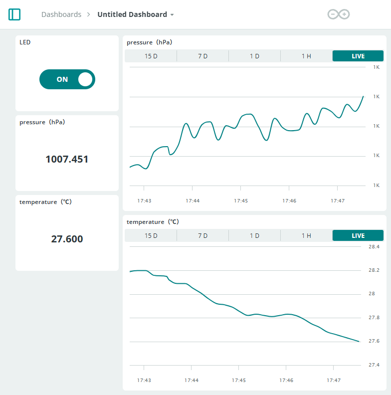

10秒ごとにリアルタイムで気温と気圧がグラフとして表示されていることがわかります。

## まとめ
Arduino Cloudを使用することにより、IoTデバイスが簡単にインターネットに接続できることがわかりました。対応デバイスも豊富で、ダッシュボードにも様々な機能があるのでいろいろなことに応用できそうです。  
ただし、Arduino Cloud 無料版の場合はThingsは２個、変数は５個、データ保持は1日という制約があります。インターネット上のリソースを使用するため、無料で使える機能が制限されているのはやむを得ませんが、お試しであれば十分使えるでしょう。
