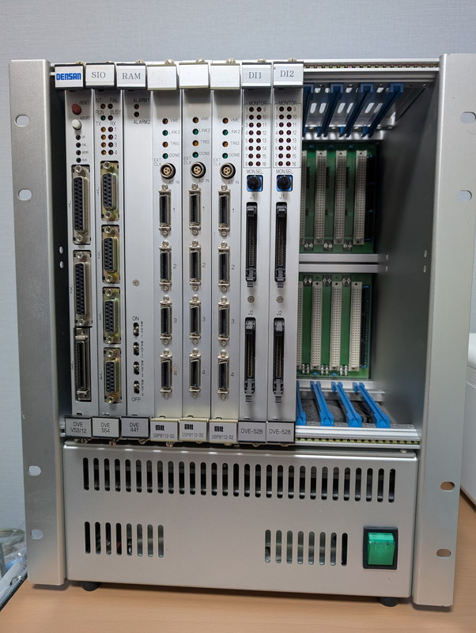
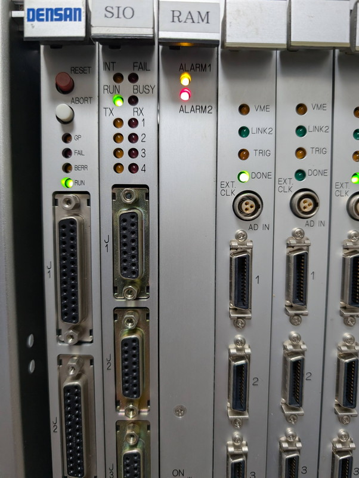
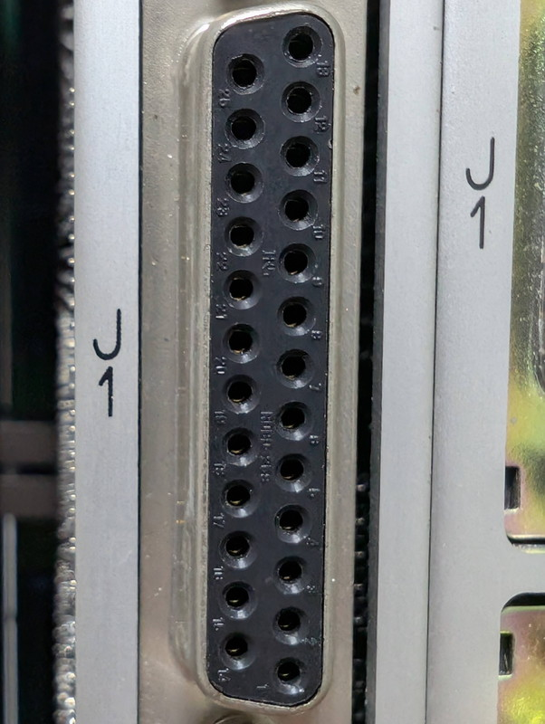

+++
date = '2026-01-05T10:22:32+09:00'
slug = 'v53-vme-system-1'
title = 'V53 VMEシステムで遊んでみました #1'
tags = ["V53", "DVE-V53", "VME"]
categories = ["Retro Computing"]
image = 'v53-vme-system-1.jpg'
+++

## 探し続けたVMEラック

これまでVMEボード用のラックをオークションサイトでずっと探し続けていましたが、ようやく良さそうなものを見つけてしまいました。  
価格はやや高いのですが、ラックの状態も良さそうで、VMEボードも実装されていて、電源も投入できる状態のようです。  
CPUボードにV53と書かれていることから、8086系のCPU V53が使用されている可能性が高く、8086系であれば様々なソフトウェアも動かせそうなので思い切って購入しました。

## VMEシステムの外観

到着したVMEシステムです。12スロットあります。やはり堅牢なシステムで重量もかなりあります。

外観からこのシステムの機能を推測してみます。  
左側のボードから見ていきました。  

|スロットNo.|名称|型番|機能|特記事項|
|---|---|---|---|---|
|1|CPUボード|DENSAN DVE-V53/12|システム全体の制御、データの収集、通信|NECのV53 CPU（x86互換）を搭載か。J1,J2はRS232C, J3はSCSIかも。|
|2|シリアル通信ボード|SIO DVE-554|4チャンネルのRS-232C通信機能、プリンタやターミナルなど外部機器との接続|D-Sub15ピン×4|
|3|メモリボード|RAM DVE-441|メモリ拡張機能| |
|4~6|アナログ入力ボード|mtt DSP8112-32|電圧、電流、温度、圧力などのセンサーからのアナログ信号を取り込む機能|3枚も実装|
|7~8|デジタル入力ボード|DIN DVE-528|デジタル系の入力、スイッチのON/OFF状態、リレーの動作確認、アラーム信号などを監視|フロントパネルにLEDインジケータ（0〜F）があり、16チャンネルの可能性|

このようなシステム構成から多チャンネルのアナログ計測（データロガー）およびデジタル監視システムに使われていたものと推測されます。例えば産業用のプロセス制御や、実験設備のデータ収集に使われていたのではないでしょうか。

なお、これらのボードについて型番から検索してみましたが、残念ながらマニュアルや資料は見つかりませんでした。

## 電源を投入してみる

オークションサイトでは電源を投入した状態の写真がありました。到着したときには電源ケーブルは付属していませんでしたが、一般的な電源ケーブルでしたので手持ちのもので電源を投入してみました。

各ボードのLEDが点灯することまでは確認できました。CPUボードのRUN LEDは点灯し、FAIL LEDは消灯しているので正常な状態のようですが、RAMボードはLEDが赤く点灯しておりメモリバックアップ用のバッテリが劣化している可能性があります。このためシステムとして正常に稼働しているかどうかはわかりません。

## CPUボードにターミナルを接続する

CPUボードのRUN LEDが点灯していることから何らかのプログラムが動作しているのではと考えました。もし、データ収集システムであればそれなりのリアルタイムOSが動いているかもしれません。
その場合はCPUボードのシリアルポート(J1)がシリアルコンソールになっている可能性が高いです。

J1ポートにターミナルを接続する場合、ストレート接続なのかクロス接続なのかを見極める必要があります。  
このためJ1ポートにテスターを接続して電圧を測りました。7番ピンがGNDなのでテスターのマイナスに接続した状態で、3番ピンが負電圧で、2番ピンがほぼ0Vだったので、ストレートケーブルが正解のようです。  
ちなみに[68K VMEボードもストレートケーブル](https://kanpapa.com/2023/09/68000-vme-board7.html)でした。  
CPUボードのJ1ポートをストレートシリアルケーブルでPCと接続し、TeraTermを起動してリセットスイッチやABORTスイッチを押してみたところ何も反応がありませんでした。キーボードから入力したり、通信速度を変更しても何も起こりません。  
残念ながら現時点ではCPUボードのシリアルポートは何も機能していないように見えます。

## 今後の計画

このままのシステムでは動作が確認できないので、次のステップとしてCPUボードを取り外して観察してみることにします。  
CPUボードに何等かのROMが搭載されていれば、それを読みだすことで有用なサンプルコードが手に入るはずです。  
もし、ROMが取り外されているとしても、搭載されていると思われるV53 CPUはV33 CPUに周辺インターフェースが統合されたものなので、V53のユーザマニュアルに記載されているIOアドレスにアクセスすればシリアルポートに容易にアクセスできるはずです。シリアルポートにアクセスできればあとはモニタを書くだけです。  
いずれにしても長く楽しめそうなプロジェクトになりそうです。