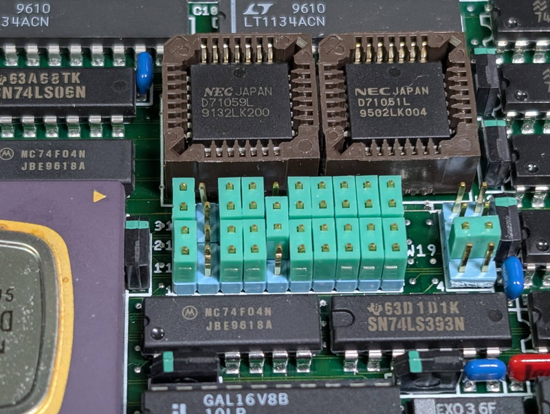
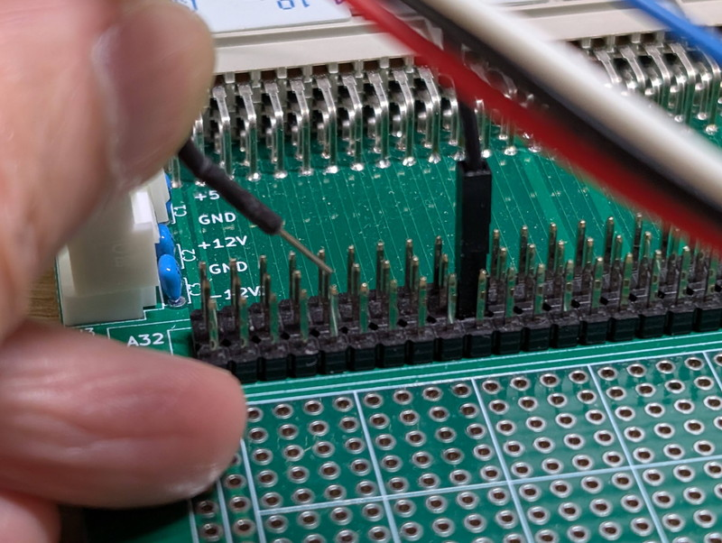

+++
date = '2026-02-01T08:41:48+09:00'
title = 'V53 VMEシステムで遊んでみました #10 割り込みを攻略する'
slug = 'v53-vme-system-10'
tags = ["V53", "DVE-V53", "VME"]
categories = ["Retro Computing"]
image = 'v53-vme-system-10-pic-icu-fix.png'
+++

[前回](/2026/01/v53-vme-system-9.html)はタイマー割り込みでTickカウンタを実装しました。今回はまだ用途が良く分かっていないV53の割り込みコントローラ(ICU)の仕様を調査します。

## ICUの割り込みハンドラの実装

ICUの割り込み機能がまだわかっていないので、割り込みが発生したことをメッセージで表示するだけにします。共通的に使えるハンドラを作り、割り込みベクタでのジャンプ先にどのベクタであるかの情報をpushするスタブを作ってみました。

実装した割り込みハンドラとそのスタブです。
```
; ==========================================================
; Default Interrupt Handler (Trap for unused interrupts)
; ==========================================================

; --- 共通処理部 (Common Handler) ---
_default_int_handler:
    push bp
    mov  bp, sp
    pusha               ; 全レジスタ保存 (AX,CX,DX,BX,SP,BP,SI,DI)
    push ds
    push es

    ; セグメント設定 (Tiny Model的な動作のためCSをDS/ESにコピー)
    mov  ax, cs
    mov  ds, ax
    mov  es, ax

    ; --- メッセージ表示 ---
    mov  si, msg_int_trap
    call puts           ; "** INT "

    ; --- ベクタ番号の表示 ---
    ; スタック構造:
    ; [BP+0] Old BP
    ; [BP+2] Vector Number (スタブでPUSHした値: 16bit)
    ; [BP+4] Return IP ...
    
    mov  ax, [bp+2]     ; ベクタ番号を取得
    call print_hex_byte ; 表示 (例: 25)

    mov  si, msg_detected
    call puts           ; " detected **" (改行含む)

    ; --- EOI (End of Interrupt) to PIC, ICU ---
    mov al, 20h         ; Non-specific EOI
    out PIC_REG0, al    ; 外部PIC (Slave) の割り込み完了
    mov dx, ICU_REG0    ; V53内蔵ICU (Master) の割り込み完了
    out dx, al

    pop  es
    pop  ds
    popa
    pop  bp
    add  sp, 2          ; スタブでPUSHしたベクタ番号分(2byte)をスタックから捨てる
    iret

; --- 各ベクタ用スタブ (Entry Points) ---
; ベクタ番号をスタックに積んで共通処理へジャンプします

_isr_stub_20: push 0x0020       ; ICU INTP0
              jmp _default_int_handler
_isr_stub_21: push 0x0021       ; ICU INTP1
              jmp _default_int_handler
_isr_stub_22: push 0x0022       ; ICU INTP2
              jmp _default_int_handler
_isr_stub_23: push 0x0023       ; ICU INTP3
              jmp _default_int_handler
_isr_stub_24: push 0x0024       ; ICU INTP4
              jmp _default_int_handler
_isr_stub_25: push 0x0025       ; ICU INTP5
              jmp _default_int_handler
_isr_stub_26: push 0x0026       ; ICU INTP6
              jmp _default_int_handler
```

次にICU割り込みベクタの設定を行います。  
ICUのINTP0～INTP6まで７つのベクタを登録します。なお、INTP7はTickハンドラで使っていますのでここでは何もしません。

```
    ; ICU割り込みベクタの登録 (0x20 - 0x27)
    
    ; Vector 20h (ICU INTP0)
    mov  di, 0x0080      ; 0x20 * 4 = 80h
    mov  ax, _isr_stub_20
    stosw
    mov  ax, cs
    stosw
    :
    :（途中省略）
    :
    ; Vector 26h (ICU INTP6)
    mov  di, 0x0098
    mov  ax, _isr_stub_26
    stosw
    mov  ax, cs
    stosw

; Note: Vector 27h (INTP7) は _tick_handler で使用中なのでここには含めません
```

## ICUの割り込みハンドラのテスト

テストのためにジャンパーW19の設定を少し変更し、Timer1の信号がICU INTP2に流れるようにしました。Timer1は20Hzの信号を生成するようにTCUを設定しました。



この状態で`o 1281 7a`と入力し、ICUのINTP2の割り込みマスクを解除したところ以下のように割り込みハンドラが動作したことを確認しました。

```
**  V53 RAM MONITOR v0.7 2026-01-31  **
> t
Tick: 00000113
> t
Tick: 0000019A
> i 1281
Val: 7F
> o 1281 7a** INT 22 detected ** Done
> ** INT 22 detected **** INT 22 detected **** INT 22 detected **** INT 22
detected **** INT 22 detected **** INT 22 detected **** INT 22 detected **
** INT 22 detected **** INT 22 detected **** INT 22 detected **** INT 22 d
etected **** INT 22 detected **** INT 22 detected **** INT 22 detected ***
* INT 22 detected **** INT 22 detected **** INT 22 detected **** INT 22 de
tected **** INT 22 detected **** INT 22 detected **** INT 22 detected **** 
　：
　：
```

これでICUで割り込みが発生した場合は検知ができるようになりました。ベクタが未設定で暴走することもありません。

## PICの割り込みハンドラの改良

次はPICの割り込みハンドラを少し改良します。現在はPICのINTP0に接続しているTimer0の割り込みしか処理しないように割り込みをマスクしています。しかし、今後INTP1～INTP7の割り込み処理を行いたくてもすべてTickハンドラが処理してしまいます。  
これでは正しい割り込み処理が行えないので、ISRの状態を確認して分岐する処理を追加しました。

```
; ==========================================================
; PIC Dispatch Handler (Vector 27h)
; Handles: Timer, Serial, SCSI, PPI via PIC uPD71059
; ==========================================================
_pic_dispatch_handler:
    pusha
    push ds
    push es

    ; DS設定 (Tiny Model)
    mov ax, cs
    mov ds, ax

    ; --- 1. PICのISR (In-Service Register) を読む ---
    ; OCW3: 0000_1011 (0x0B) -> RR=1, RIS=1 (Read ISR)
    mov al, 0x0B
    out PIC_REG0, al
    in  al, PIC_REG0    ; AL = 現在処理中の割り込みビット (ISR)

    ; --- 2. 要因判定と分岐 ---    
    test al, 01h        ; Bit 0: Timer 0 (System Tick)
    jnz .handle_timer0

    test al, 02h        ; Bit 1: SCSI
    jnz .handle_scsi

    test al, 04h        ; Bit 2: Timer 1
    jnz .handle_timer1
　　  :
　　  :（INTP3～INTP6は同様なので省略）
　　  :
    test al, 80h        ; Bit 7: PPI
    jnz .handle_ppi

    ; 該当なしの場合は無視
    jmp .eoi_exit

; --- 各ハンドラ処理 ---
.handle_timer0:
    ; INTP0: Timer 0 (Tick)
    ; --- 32bit カウンタのインクリメント ---
    inc word [tick_counter_lo]
    jnz .skip_carry
    inc word [tick_counter_hi]
.skip_carry:
    jmp .eoi_exit

.handle_scsi:
    ; INTP1: SCSIC
    mov si, msg_int_scsi
    call puts
    jmp .eoi_exit

.handle_timer1:
    ; INTP2: ユーザ用タイマー
    mov si, msg_int_timer1
    call puts
    jmp .eoi_exit
  :
  :（INTP3～INTP6は同様なので省略）
  :
.handle_ppi:
    ; INTP7: PPI割り込み
    mov si, msg_int_ppi
    call puts
    jmp .eoi_exit

; --- 終了処理 ---
.eoi_exit:
    ; --- EOI (End of Interrupt) to PIC ---
    mov al, 20h     ; Non-specific EOI
    ; 外部PIC (Slave) の割り込み完了
    out PIC_REG0, al
    ; V53内蔵ICU (Master) の割り込み完了
    mov dx, ICU_REG0 
    out dx, al

    pop es
    pop ds
    popa
    iret
```

## PICの割り込みハンドラのテスト

これも動作テストを行ってみます。先ほど変更したジャンパーをもとに戻せば、Timer1の信号が
PICのINTP2に接続されます。この状態で`o 00ca fa`と入力してINTP2の割り込みマスクを外すとメッセージが表示されました。もちろん既存のTickカウンタも正常に処理されています。

```
**  V53 RAM MONITOR v0.7 2026-01-31  **
> t
Tick: 00000113
> t
Tick: 0000019A
> i 00ca
Val: FE
> o 00ca fa** PIC INTP2 Timer1 **
 Done
> ** PIC INTP2 Timer1 **
** PIC INTP2 Timer1 **
** PIC INTP2 Timer1 **
** PIC INTP2 Timer1 **
** PIC INTP2 Timer1 **
** PIC INTP2 Timer1 **
** PIC INTP2 Timer1 **
** PIC INTP2 Timer1 **
** PIC INTP2 Timer1 **
 :
 :
```

これでPICでTimer0以外の割り込みが発生した場合でも正しく処理できるようになりました。

## その他の割り込みハンドラの実装

あと気になるのはPICやSCU以外の割り込み処理です。すでにNMIについてはハンドラを設定していますが、それ以外にも割り込みが発生する要因があります。

|種類|割り込みソース|べクタ番号|
|:---|:---|:---|
|ハードウェア割り込み|NMI|2|
||ICU|32～255|
|ソフトウェア割り込み|BRKフラグ(シングル·ステップ)|1|
||DIV/DIVUのディパイド·エラー|0|
||BRK3|3|
||BRKV|4|
||CHKIND境界オーパ|5|
||未定義命令トラップ|122|
||uPD72291エラー|128|
||(予約済)|129|
||コブロセッサ不在例外|150|
||BRK imm 8|32～255|

これらの割り込みベクタを設定しておかないと万が一発生した場合は暴走してしまいますので、HALTで停止するようにします。

その他の割り込みハンドラは以下のように実装しました。

```
;--------------------------------------
; その他の割り込みベクタ用の簡易トラップ
;--------------------------------------
_default_int_unknown_handler:
    ; 想定外の割り込みが発生したため、
    ; 画面に "UNKNOWN INT" と出して停止する
    
    cli                 ; 多重割り込み禁止
    pusha
    push ds
    push cs
    pop ds              ; DS = CS

    mov si, msg_unknown_int
    call puts
    
    ; 停止（暴走を防ぐ）
.halt:
    hlt
    jmp .halt
```

割り込みベクタの設定は以下のプログラムで無条件で全ベクタを設定し、この処理の後にNMIやSCUの割り込みベクタを上書きするようにしています。

```
    ; ----------------------------------------------------
    ; 1. 全ベクタ (00h-FFh) をデフォルトハンドラで埋める
    ;    (予期せぬ割り込みによる暴走を防ぐ安全策)
    ; ----------------------------------------------------
    xor ax, ax
    mov es, ax          ; ES = 0000h (Vector Table)
    mov di, 0           ; Offset 0

    mov cx, 256         ; 256個のベクタ全てを設定
.init_loop:
    mov ax, _default_int_unknown_handler ; 共通トラップハンドラ
    stosw               ; Offset書き込み
    mov ax, cs
    stosw               ; Segment書き込み
    loop .init_loop
```

これらの割り込みはまだ試していませんが、いずれ発生するでしょう。

## VMEバスのIRQの調査

割り込みベクタをすべて設定することで、すべての割り込みが捕捉できるようになりました。この状態でVMEバスのIRQ信号を試してみます。  
VMEバスの割り込み要求信号は以下の通りです。*のマークは負論理であることを示していますので、GNDにつなげば割り込みが発生します。

|VMEバス信号名|ピン番号 (J1)|内容・機能|
|:---|:---|:---|
|IRQ7*|B24|最も優先度の高い割り込み要求|
|IRQ6*|B25|2番目に優先度が高い割り込み要求|
|IRQ5*|B26|一般的な割り込み要求|
|IRQ4*|B27|一般的な割り込み要求|
|IRQ3*|B28|一般的な割り込み要求|
|IRQ2*|B29|優先度の低い割り込み要求|
|IRQ1*|B30|最も優先度の低い割り込み要求|

現在使用している電源供給基板ではバス信号がすべてヘッダに出力されているのでこれを利用します。写真のようにブレッドボード用のワイヤーでIRQ信号に触れて一瞬GNDに落とします。



割り込みマスクを解除して順に試したところ反応がありました。

```
**  V53 RAM MONITOR v0.7 2026-01-31  **
> o 1281 00 Done
> ** INT 26 detected **** INT 26 detected **** INT 26 detected **** INT 26 detected **** INT 26 detected **** INT 26 detected **** INT 26 detected **
** INT 26 detected **** INT 26 detected **** INT 26 detected **** INT 26 d
　：
INT 26 detected **** INT 26 detected **** INT 26 detected **** INT 25 dete
cted **** INT 25 detected **** INT 25 detected **** INT 25 detected **** I
NT 25 detected **** INT 25 detected **** INT 25 detected **** INT 25 detec
　：
25 detected **** INT 25 detected **** INT 24 detected **** INT 24 detected
 **** INT 24 detected **** INT 24 detected **** INT 24 detected **** INT 2
 4 detected **** INT 24 detected **** INT 24 detected **** INT 24 detected
　：
**** INT 24 detected **** INT 24 detected **** INT 24 detected **** INT 24 detected **** INT 23 detected **** INT 23 detected **** INT 23 detected **
** INT 23 detected **** INT 23 detected **** INT 23 detected **** INT 23 d
　：
INT 23 detected **** INT 22 detected **** INT 22 detected **** INT 22 dete
cted **** INT 22 detected **** INT 22 detected **** INT 22 detected **** I
NT 22 detected **** INT 22 detected **** INT 22 detected **** INT 22 detec
　：
INT 22 detected **** INT 22 detected **** INT 22 detected **** INT 21 dete
cted **** INT 21 detected **** INT 21 detected **** INT 21 detected **** I
NT 21 detected **** INT 21 detected **** INT 21 detected **** INT 21 detec
ted **** INT 21 detected **** INT 21 detected **** INT 21 detected **** IN
　：
```

IRQ1～IRQ6はINTP6～INTP1に対応していることがわかりましたが、IRQ7の反応がありません。  
念のためPICの割り込みマスクも外したところ、モニタでキー入力をするたびに割り込みがかかることを発見しました。これは収穫です。

```
> o 00ca 9e Done
> ** PIC INTP5 **
t** PIC INTP5 **

Tick: 0001E905
> ** PIC INTP5 **
d** PIC INTP5 **
 ** PIC INTP5 **
0** PIC INTP5 **
0** PIC INTP5 **
0** PIC INTP5 **
0** PIC INTP5 **
 ** PIC INTP5 **
0** PIC INTP5 **
0** PIC INTP5 **
0** PIC INTP5 **
0
0000:0000 F2 05 00 20 F2 05 00 20 C8 04 00 20 F2 05 00 20
0000:0010 F2 05 00 20 F2 05 00 20 F2 05 00 20 F2 05 00 20
0000:0020 F2 05 00 20 F2 05 00 20 F2 05 00 20 F2 05 00 20
0000:0030 F2 05 00 20 F2 05 00 20 F2 05 00 20 F2 05 00 20
> 
```

結局、VMEバスのIRQ7は見つかりませんでしたが、今後の課題としてIssueにあげておきます。

また、IRQ以外にも以下の信号で異常を検知したらどうなるかも確認しました。

|VMEバス信号名|ピン番号 (J1)|内容・機能|
|:---|:---|:---|
|ACFAIL*|B3|AC電源障害 AC電源の電圧低下時にアサートされます。|
|SYSFAIL*|C10|システム障害 ボードの自己診断エラー時にアサートされます。|

同様にGNDに接続したところ、この2つはNMIが発生しました。どちらが発生しても暴走することなく気づけます。

## 割り込み周辺回路図と割り込みマップ

これまでの調査結果から回路図が確定しました。


V53 ICUの割り込みマップは以下のようになります。

|ベクタ番号|V53 ICU割り込み入力|接続先|
|:---|:---|:---|
|0x20|INTP0|不明|
|0x21|INTP1|VMEバス IRQ6|
|0x22|INTP2|VMEバス IRQ5|
|0x23|INTP3|VMEバス IRQ4|
|0x24|INTP4|VMEバス IRQ3|
|0x25|INTP5|VMEバス IRQ2|
|0x26|INTP6|VMEバス IRQ1|
|0x27|INTP7|PIC INT出力|

uPD71059(PIC)で発生した割り込みはすべてベクタ27hとして処理されます。

ベクタ27hの割り込みハンドラではuPD71059(PIC)のISR (In-Service Register) を見て割り込み信号に対応した処理に分岐します。

|PICのISR|割り込み入力端子|接続先|
|:---|:---|:---|
|bit 0|INTP0|V53 TCU Timer0|
|bit 1|INTP1|SCSIC INT|
|bit 2|INTP2|V53 TCU Timer1|
|bit 3|INTP3|USART RxREADY|
|bit 4|INTP4|USART TxREADY|
|bit 5|INTP5|V53 SCU RxREADY|
|bit 6|INTP6|V53 SCU TxREADY|
|bit 7|INTP7|PPI|

この割り込み関係の機能を含めたRAMモニタのソースはGitHubに置きました。

* [v53_ram_mon.asm](https://github.com/kanpapa/VMEbus-V53/blob/main/monitor/v53_ram_mon.asm)

## まとめ

これでSCSICとDMAを除いたCPUボードのハードウェアについてはほぼ解析できたと思われます。今後はCPUボードをVMEラックに取り付けて、VMEシステムとしての動作を確認しながら、必要な機能をモニタに実装していきます。まずはVMEバスの拡張メモリボードの確認をすすめます。

次の記事：[V53 VMEシステムで遊んでみました #11 VMEシステムを起動する](/2026/02/v53-vme-system-11.html)
