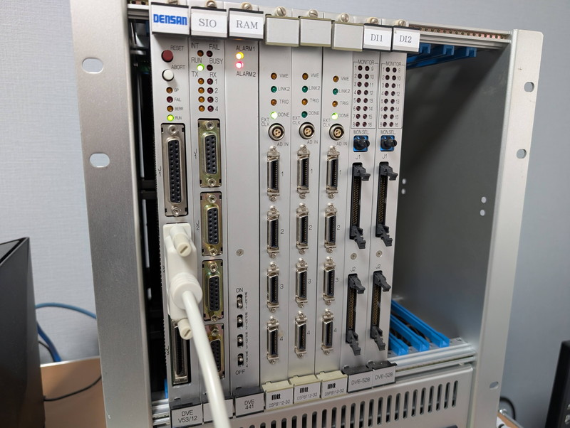
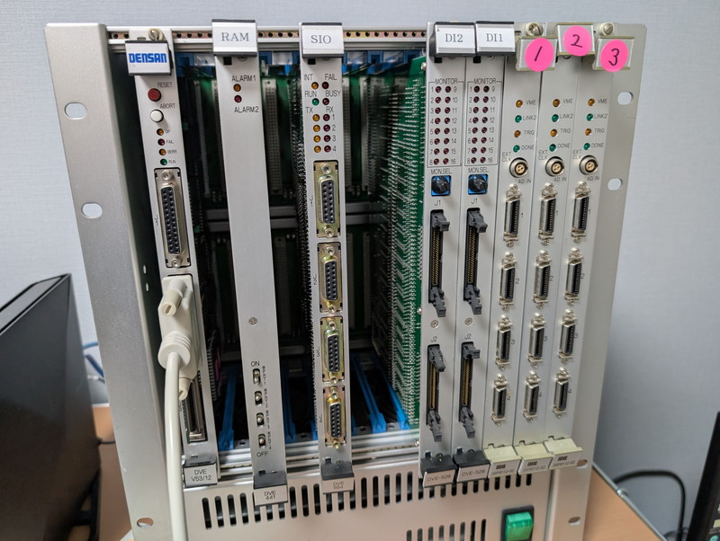

+++
date = '2026-02-03T08:09:49+09:00'
title = 'V53 VMEシステムで遊んでみました #11 VMEシステムを起動する'
slug = 'v53-vme-system-11'
tags = ["V53", "DVE-V53", "VME"]
categories = ["Retro Computing"]
image = 'v53-vme-system-11-eyecatch.jpg'
+++

[前回](/2026/02/v53-vme-system-10.html)までの調査でV53 CPUボードをある程度制御下に置くことができましたので、今回はCPUボードをVMEラックに戻してVMEシステムとしての仕様を調査していきます。

## VMEシステムの構成

[ #1 VMEラックの入手]()の記事でも触れていますが、このVMEシステムは以下のボードで構成されています。

|スロットNo.|名称|型番|特記事項|
|:---|:---|:---|:---|
|1|CPUボード|DENSAN DVE-V53/12|NEC V53 CPU（x86互換）を搭載。RS232Cx1, SCSIx1|
|2|シリアル通信ボード|DENSAN DVE-554|SIOのラベル有。D-Sub15ピン×4|
|3|メモリボード|DENSAN DVE-441|RAMのラベル有。拡張メモリ|
|4~6|アナログ入力ボード|mtt DSP8112-32|3枚実装|
|7~8|デジタル入力ボード|DENSAN DVE-528|DI1,DI2のラベル有、2枚実装|

一番左のスロット１番はVMEシステムではSCON(System Controller)と呼ばれていて、VMEバスシステム全体を制御するボードになります。SCONから他のボードがどのように見えるかを探っていきます。

## モニタの起動確認

まずはCPUボードをスロット１に戻し、シリアルコンソールを接続してから電源を投入しました。



ROMモニタは問題なく起動したので、拡張版のRAMモニタをロードしました。これも問題なく動作しています。

```
**  V53 MONITOR v0.1 2026-01-12  **
> l
Load HEX...2000:0
......................................................................................................................................
OK> 
> g 2000 0000
Go!

**  V53 RAM MONITOR v0.7 2026-01-31  **
> t
Tick: 00002AA9
> 
```

Tickカウンタもカウントアップして時を刻んでいます。

## メモリマップの確認

ここで気になるのはメモリマップです。CPUボード単体では`80000h～DFFFFh`まではメモリが存在せずにバスエラーとなっていました。  
このエリアはVMEバスのRAMボードが割り当てられるのではと推測していたので、`8000:0000`をダンプしてみます。

```
> d 8000 0000
8000:0000 BE 0E A8 CA 55 7D 5D 75 9B 8E EB AA B7 DF 55 45 
  :
>  
```

バスエラーにはならずに、何やらデータが現れました。試しに`8000:0000`に`12`を書き込んでみます。

```
> w 8000 0000 12 Done
> d 8000 0000
8000:0000 12 0E A8 CA 55 7D 5D 75 9B 8E EB AA B7 DF 55 45 
   :
```
問題なく書き込めました。試しに他のアドレスも読み書きしてみましたが、問題なく書き込めているようです。

ROMエリアはそのままE0000-FFFEFであることも確認できました。ROMモニタが見えています。

```
> d e000 0000
E000:0000 FA B8 00 00 8E D8 8E C0 8E D0 BC 00 40 BA F2 FF 
E000:0010 B0 00 EE BA F3 FF B0 71 EE BA F4 FF B0 10 EE BA 
E000:0020 F5 FF B0 32 EE BA FE FF B0 11 EE BA E9 FF B0 1A 
E000:0030 EE BA FC FF B0 12 EE BA F8 FF B0 60 EE BA FD FF 
> 
```

これでVMEバスのRAMボードが正常に動作していることが確認できました。VMEシステムでのメモリマップは以下のようになります。

|アドレス範囲|サイズ|種別|実体|
|:---|:---|:---|:---|
|00000-7FFFF|512KB|RAM|オンボードRAM。ベクタテーブルやRAMモニタで使用|
|80000-DFFFF|384KB|RAM|VMEバスの拡張RAMボード|
|E0000-FFFEF|128KB(-256B)|ROM|オンボードのROMモニタだが、大部分は未使用|
|FFFF0-FFFFF|256B|V53|V53システムエリア|

## I/Oアドレスの確認

VMEシステムには「アドレス空間（Address Space）」の概念があり、メモリボードのような大容量デバイスと、I/Oボードのような制御デバイスでは、アドレス空間が異なることが一般的です。  
x86アーキテクチャのV53にはメモリ空間とは別に64KBのI/O空間があります。
おそらくV53のI/O命令 (in, out) は、そのままVMEバスのShort I/O (A16)空間に変換されているはずです。  
この推測をRAMモニタで実装したScanコマンドを使って確認します。

実行結果は次のようになりました。

```
**  V53 RAM MONITOR v0.7 2026-01-31  **
> s 0000 feff
Scanning I/O (Press any key to abort)...
0000: 00  
0001: 29  
0002: 42  
　：
00DF: 02  
00E2: 00  
1100: 00  
1101: 00  
1102: 00  
1103: 00  
1104: 00  
1105: 00  
1106: 00  
1107: 00  
1108: 00  
1109: 00  
1110: 00  
1112: 00  
1114: 00  
1116: 00  
1120: 00  
1121: 00  
1122: 00  
1123: 00  
1124: 00  
1125: 00  
1126: 00  
1127: 00  
1128: 00  
1129: 00  
1130: 00  
1132: 00  
1134: 00  
1136: 00  
1200: 3E  
1260: 66  
1261: 84  
1262: 84  
1263: 87  
1270: 1E  
1271: D0  
1272: 02  
1273: 02  
1280: 01  
1281: 7F  
1282: 01  
1283: 7F  
1300: 00  
 Done
>
```

`00xx`は前回までに調査したCPUボードの外部ペリフェラルです。  
`1000`以降に多数のI/Oが加わっていることがわかります。しかも、私が適当に設定したV53のペリフェラルI/Oアドレス`1260-1283`がその中に含まれているようです。これではモニタの動作がVMEボードに影響を与えるかもしれないので、V53のペリフェラルアドレスを`1260-`から`2060-`に変更することにしました。

変更したあとの結果です。これでVMEバスのI/O空間が`1xxx`であることがはっきりしました。V53のペリフェラルは`2xxx`以降に移動しています。

```
**  V53 RAM MONITOR v0.7 2026-01-31  **
> s 0000 feff
Scanning I/O (Press any key to abort)...
0000: 00  
0001: 29
　：
00DE: 05  
00DF: 02  
00E2: 00  
1100: 00  
1101: 00  
1102: 00  
1103: 00  
1104: 00  
1105: 00  
1106: 00  
1107: 00  
1108: 00  
1109: 00  
1110: 00  
1112: 00  
1114: 00  
1116: 00  
1120: 00  
1121: 00  
1122: 00  
1123: 00  
1124: 00  
1125: 00  
1126: 00  
1127: 00  
1128: 00  
1129: 00  
1130: 00  
1132: 00  
1134: 00  
1136: 00  
1200: 3E  
1300: 00  
2060: 66  
2061: 84  
2062: 84  
　：
2083: 7F  
 Done
>
```
`1xxx`のI/Oデバイスはある程度の規則性が見受けられますが、実際にどのボードがどのアドレスを使っているかがわからないので、ボードを種類別に外していくことで確認を進めました。



確認した結果は以下のようになりました。
* AIボード3枚を抜く・・・まったく変化なし(!)
* DIボード2枚を抜く・・・1100～113xが消えた
* SIOボードを抜く・・・1300が消えた
* RAMボードを抜く・・・1200が消えた

この結果をまとめると以下のようになります。

|ボード名称|VMEスロット|I/Oアドレス|解析結果 / 備考|
|:---|:---|:---|:---|
|CPU|VME#1|0000-00E2|Onboard SCSI,PPI,USART,PIC|
|CPU|VME#1|2000-2083|V53 Internal SCU,TCU,ICU|
|Serial I/O|VME#2|1300|制御/ステータスレジスタ?|
|Ext RAM Board|VME#3|1200|制御/ステータスレジスタ?|
|Analog Input #1|VME#4|未検出|他の方法でアクセス?|
|Analog Input #2|VME#5|未検出|他の方法でアクセス?|
|Analog Input #3|VME#6|未検出|他の方法でアクセス?|
|Digital Input #1|VME#7|1110-111x|デジタル入力結果がこの範囲に展開?|
|Digital Input #2|VME#8|1120-113x|デジタル入力結果がこの範囲に展開?|

このようにI/Oアドレスで制御できるボードもありそうですが、そうでないボードもあるようです。

## まとめ

V53のI/Oアドレス空間から一部のVMEボードにはアクセスできそうですが、実際にどのようにデータの受け渡しを行うのかはまだまだ不明な点が多くもう少し実験が必要のようです。  
各ボードに実装されているデバイスの型番やヘッダピンなどの設定情報などを確認しながらモニタを使って解析を進めてみます。


