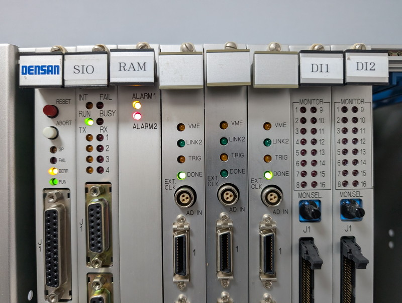
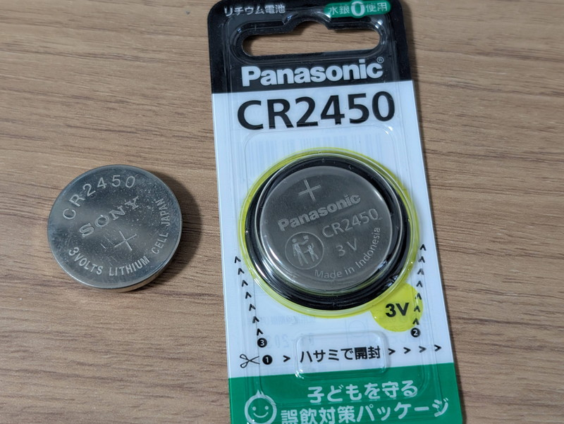
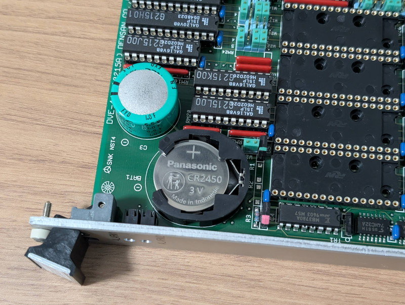
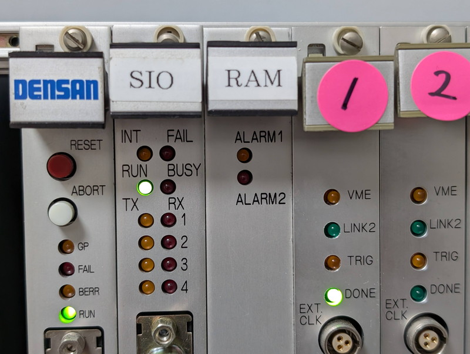

+++
date = '2026-02-06T07:25:21+09:00'
title = 'V53 VMEシステムで遊んでみました #12 RAMボードを理解する'
slug = 'v53-vme-system-12'
tags = ["V53", "DVE-V53", "VME"]
categories = ["Retro Computing"]
image = 'v53-vme-system-12-ram-battery-holder.jpg'
+++

[前回](/2026/02/v53-vme-system-11.html)で、VMEシステムの仕様をI/Oアドレスから調査してみましたが、まだまだ不明な点が多い状況です。各ボードについて仕様や設定などをモニタを使って解析を進めてみます。今回はRAMボードです。

## RAMボードの構成

これまでの調査でVMEバスに実装されているRAMボードはSCONからみると以下のように見えます。
* 80000-DFFFFまでのメモリが割り当てられている。
* I/Oアドレス 1200hに何かのレジスタが見える。

実際のボードを見てみると以下のような仕様でした。
* 主要パーツ
    - HM628128BLP-7 (128KW x 8bit SRAM) x 4
    - 32P空きソケット x 12
    - バッテリー CR2450 x 1
    - スーパーキャパシタ 5.5V 1.0F x 1

* パネル
    - ALARM1 LED
    - ALARM2 LED (赤)
    - WPRT1～4 トグルスイッチ

* I/Oポート
    - 1200h
    - 読みだすと3Eの値。書き込みは不明。

このようにRAMは一部のみの実装で今は512KBですが、同じチップでフル実装すると2MBまで使えるようです。  
またメモリバックアップ用のバッテリーとスーパーキャパシタでバッテリー交換時にもメモリ内容が保持されるとともに、ライトプロテクトのスイッチが4個あり、これでBANKごとに書き込み禁止にできるようです。

## ALARMを解除する

購入時から気になっていたのですが、パネルにあるALARM1, ALARM2が点灯状態です。



多分メモリバックアップのバッテリーが空になっている警告だろうと推測し、バッテリーを取り外して電圧を測ったところ0.5Vでした。これではメモリの内容は保持できません。こちらは同じバッテリーを手配しました。



到着した新しいバッテリーをRAMボードに取り付けました。



この状態で電源を投入したところALARM1, ALARM2のLEDが消灯しました。



バッテリーの電圧が正常と認識されたようです。

## I/Oポートのステータス変化

ここで、I/Oポートをもう一度確認すると値が変化していました。

```
> i 1200
Val: 0E　　　←3Eから0Eに変わった
```

ちょうど4bitめと5bitめが1から0になりました。ここはALARM1, ALARM2の状態を示していた可能性があります。

もしやと思いWPRT1～WPRT4のトグルスイッチを操作してみたところ、予想通りにステータスが変化しました。bit3～bit0はそれぞれWPRT4～WPRT1の状態を示していたのです。

```
> i 1200
Val: 00　　　←WPRT1～4をすべてOFFにした時
> i 1200
Val: 0E　　　←WPRT2～4だけをONにした時
```

まとめると以下の表になります。

|Bit|名称|値|備考|
|:---|:---|:---|:---|
|7|	(Unused)|0固定|未使用？|
|6|	(Unused)|0固定|未使用？|
|5|ALARM 2 or 1|0: 正常 (消灯) 1: 異常 (点灯)|電池交換により 1 から 0 に変化。|
|4|ALARM 1 or 2|0: 正常 (消灯) 1: 異常 (点灯)|電池交換により 1 から 0 に変化。|
|3|	WPRT4|0: Writable 1: Write Protected|WRT4スイッチで変化|
|2|	WPRT3|0: Writable 1: Write Protected|WRT3スイッチで変化|
|1|	WPRT2|0: Writable 1: Write Protected|WRT2スイッチで変化|
|0|	WPRT1|0: Writable 1: Write Protected|WRT1スイッチで変化|

この結果からI/Oポート 1200hはRAMボードの状態を示していて、プログラムが状態を確認するための仕組みと思われます。


## メモリバックアップの実験

次に交換したバッテリーによってメモリバックアップができているかを確認しました。

1. モニタから8000:0000に任意の値を書き込んで、書き込んだ内容（ここでは55 AA 55 AA 55）を記録しておく。
1. 電源を切断ししばらくそのままにする。
1. モニタで8000:0000をdumpし、メモリの内容が変わっていないか確認する。

この結果メモリの内容はバックアップされることが確認できました。

```
**  V53 RAM MONITOR v0.8 2026-02-01  **
> d 8000:0000
8000:0000 55 AA 55 AA 55 7D 5D 75 9B 8E EB AA B7 DF 55 45
8000:0010 FF EA CB AA 5F D5 55 57 EA AA AA 2A 5D F7 65 F5
8000:0020 CB EB AD F8 FD 17 57 75 EB BE 6E 2F 7F D7 39 E5
8000:0030 EB FE B6 AA DD D1 5E 15 AB AB 1B AB 1D 51 F5 37
>
```

バッテリーがどのくらい持つのかは今後ALARM LEDが教えてくれるでしょう。

## メモリプロテクトの実験

次にWRPT1スイッチを操作してメモリプロテクトが行われるか実験してみました。

1. WPRT1スイッチをONにして書き込み禁止にする
1. モニタでdumpし、メモリの内容を確認する
1. モニタから8000:0000に任意の値を書き込んでみる

この操作を行なった結果です。書き込み後ダンプしましたが、メモリは書き換えられていません。

```
> d 8000:0000
8000:0000 55 AA 55 AA 55 7D 5D 75 9B 8E EB AA B7 DF 55 45
8000:0010 FF EA CB AA 5F D5 55 57 EA AA AA 2A 5D F7 65 F5
8000:0020 CB EB AD F8 FD 17 57 75 EB BE 6E 2F 7F D7 39 E5
8000:0030 EB FE B6 AA DD D1 5E 15 AB AB 1B AB 1D 51 F5 37
> w 8000 0000 00 Done　←WPRT1がONの状態で書き込み
> d 8000:0000
8000:0000 55 AA 55 AA 55 7D 5D 75 9B 8E EB AA B7 DF 55 45
8000:0010 FF EA CB AA 5F D5 55 57 EA AA AA 2A 5D F7 65 F5
8000:0020 CB EB AD F8 FD 17 57 75 EB BE 6E 2F 7F D7 39 E5
8000:0030 EB FE B6 AA DD D1 5E 15 AB AB 1B AB 1D 51 F5 37
>
```

これで書き込み保護機能の確認もできました。

## まとめ

今回の調査で、VMEバスのRAMボードについて基本的な構造と機能については把握できました。しかし、CPUボードに1MBのRAMを搭載しているにも関わらず、8000:0000以降でこのVMEバスのRAMボードを使用しているのは何かの理由があるはずです。メモリバックアップが目的なのか、他のVMEボードとのデータ共有用なのか、そのあたりも引き続き調べてみます。

次の記事：[V53 VMEシステムで遊ぶ #13 NASCOM BASICを動かす](/2026/02/v53-vme-system-13.html)