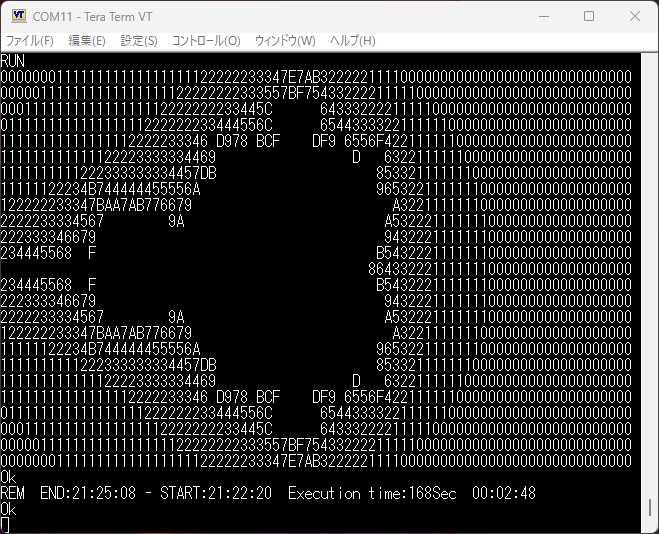
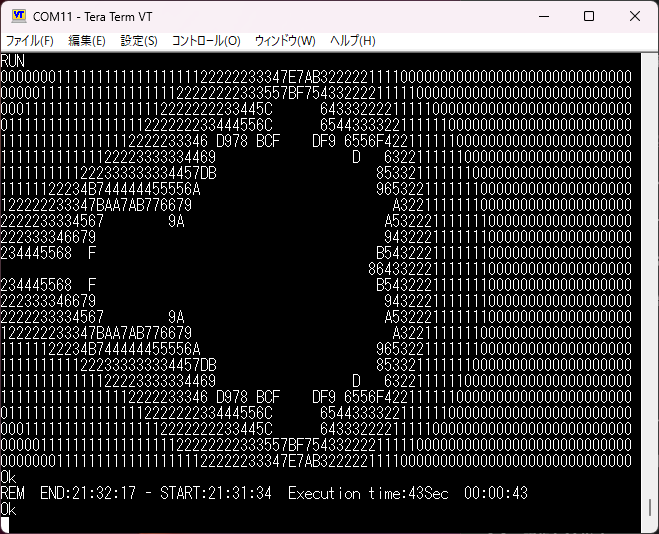

+++
date = '2026-02-14T09:32:54+09:00'
title = 'V53 VMEシステムで遊ぶ #13 NASCOM BASICを動かす'
slug = 'v53-vme-system-13'
tags = ["V53", "DVE-V53", "VME", "BASIC"]
categories = ["Retro Computing"]
image = 'v53-vme-asciiart-local-ram.png'
+++

[前回](/2026/02/v53-vme-system-12.html)は、VMEバスのRAMボードの解析を行いました。このVMEシステムで使える広大なメモリ空間でアプリケーションを動かしていきます。今回はNASCOM BASICを動かしてみました。

## NASCOM BASICとは

8086 CPUで動作するBASICが無いか探してみたところ、8086版のNASCOM BASICを見つけました。

* [8086_NASCOM_BASIC](https://github.com/satoshiokue/8086_NASCOM_BASIC)

Nascom BASICはマイクロソフトが作成し、Grant Searleさんがサブセットに改編し、鈴木哲哉さんが移植されたコードを元に、奥江聡さんが8080/Z80から8086にコンバートされたものでした。当然V53でも動作するはずですが、[SBCV20 V20/8088](https://vintagechips.wordpress.com/2020/12/27/sbcv20-long_and_winding_road/)用のためROMベースになっています。

## ソースコードをRAM版に書き換える

ソースコードを拝見し、以下の方針で私のVMEシステムでも動くようにしました。
* アセンブラは慣れているnasmに変更
* ROM化しているところをRAMだけで動作するようにメモリマップを見直す
* 割り込みはまだ不安なので一旦ポーリングに変更

修正したソースは以下にコミットしています。

* [8086_NASCOM_BASIC for V53 VME](https://github.com/kanpapa/8086_NASCOM_BASIC/blob/v53_vme/README_V53.md)

## NASCOM BASICを起動する

まずWSL2のnasmでNASCOM BASICをビルドして、objcopyでhexファイルを作成します。

```
% nasm -f bin 8088basic.asm  -o 8088basic.bin -l 8088basic.lst
% objcopy -I binary -O ihex --change-addresses=0x0000 8088basic.bin 8088basic.hex
```

次にVMEシステムでRAMモニタを2000:0000にロードして実行後にNASCOM BASICのHEXファイルを8000:0000にロードして実行します。

```
**  V53 MONITOR v0.1 2026-01-12  **
> l
Load HEX...2000:0
.......................................................................
.......................................................................
.......
OK>
> g 2000 0000
Go!

**  V53 RAM MONITOR v0.9 2026-02-07  **
> l 8000
Load HEX...8000:0
.......................................................................
.......................................................................
.......................................................................
.......................................................................
.......................................................................
.......................................................................
.......................................................................
.......................................................................
.................................................................
OK>
> g 8000 0000
Go!

```

NASCOM BASICはモニタコンソールとは別のシリアルポートを入出力にしているので、J1に接続したターミナルがNASCOM BASIC専用となります。

```
INTEL8080 Based x86 BASIC Ver 4.7b
Copyright (C) 1978 by Microsoft
15993 Bytes free
Ok
```

無事起動することができました。

簡単なBASICのコマンドを入力してみましたが、一応動作しているようです。

```
list
Ok
new
Ok
a=10
Ok
print a
 10
Ok
```

## マンデルブロ集合を表示する

NASCOM BASICが動作したところでいつものように[ASCIIART.bas](https://haserin09.la.coocan.jp/asciiart.html)をアップロードして実行してみました。



このときかかった時間は2分48秒でした。

思ったより遅かったのでもしやと思いローカルメモリのセグメントである4000:0000にロードして実行したところ、実行時間が44秒に短縮できました。




## まとめ

V53のWCU(Wait Control Unit)の設定でローカルRAMは0ウェイトで設定しているのですが、VMEバスのメモリは余裕をもって3ウェイトに設定しています。  
VMEバスのRAMボードに搭載されているSRAMのアクセススピードは70nsですので、うまくいけば0ウェイトでも動くかもしれませんが、VMEバスを経由することによるボトルネックもありそうです。このプログラムをベンチマークとして使い、どこまでチューニングできるか今後試してみます。