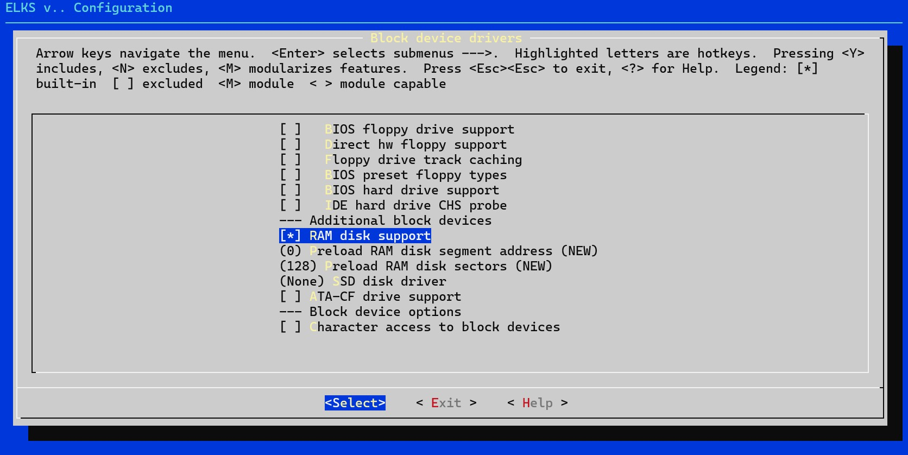

+++
date = '2026-03-09T08:35:19+09:00'
title = 'V53 VMEシステムで遊ぶ #16 ELKSでRAMDISKを使う'
slug = 'v53-vme-system-16-elks-3'
tags = ["V53", "DVE-V53", "VME", "ELKS"]
categories = ["Retro Computing"]
image = 'elks-config-ramdisk-support.jpg'
+++

[前回](/2026/03/v53-vme-system-15-elks-2.html)は、8086系の組み込み向けLinuxである[ELKS](https://github.com/ghaerr/elks)をV53版ELKSとしてELKS単体で動作するようにしました。今回はELKSに組み込まれているRAMDISKを使って書き込み可能なファイルシステムを構築します。

## ELKSのRAMDISK

これまでは組み込み用としてROM化できるROMファイルシステムを使っています。RAMDISKが使えるようになれば外部のクロスコンパイル環境で作成したバイナリを書き込んで動かすことができるようになります。
ELKSのドキュメントを確認したところ、以下の手順でRAMDISKが使えるようです。

1. カーネルのコンフィグレーション時にRAMDISKを組み込むように設定
1. ramdiskコマンドでRAMDISKにメモリを割り当てる
1. mkfsでファイルシステムを作る
1. mountする。

この手順で進めてみました。

## RAMDISKを設定してみる

すでにカーネルのコンフィグレーションでは`RAM disk support`にチェックをいれています。



まずは/dev/ディレクトリを確認したところ/dev/rd0, /dev/rd1というRAMDISK用のデバイスができているようです。

```
brw-rw-rw-  1 root     root       1,   0  Jan  1  1970 rd0
brw-rw-rw-  1 root     root       1,   1  Jan  1  1970 rd1
```

この状態で以下のコマンドを実行してみました。

```
# ramdisk /dev/rd0 make
ramdisk: 64Kb ramdisk created on /dev/rd0
# mkfs /dev/rd0 64
21 inodes
64 blocks
Firstdatazone=5 (5)
Zonesize=1024
Maxsize=65536

mkfs: write failed in write_block
#
```
途中までは順調なのですが、最後のファイルシステムの作成時に書き込みエラーとなってしまいます。

## RAMDISKはメモリ上にできているのか？

ramdiskというコマンドが何を行っているのかをソースから確認しました。

```C
 if (strcmp(argv[2],"make") == 0) {
        if (ioctl(fd, RDCREATE, size)) {
            perror("ramdisk");
            return 1;
        }
```

このようにioctlでRDCREATEをしているだけでした。

ここでメモリの状態を確認してみます。meminfoコマンドを実行しました。

```
# meminfo
  HEAP   TYPE  SIZE    SEG   TYPE    SIZE  CNT  NAME
  123E   MEM     16   1080   DSEG    5776    1  /bin/init 
  125A   TASK 13574
  476C   INOD  6720
  61B8   FILE   896
  6544   CACH  8192
  8550   BUFH   128
  85DC   TTY     80
  8638   TTY     80
  8694   MEM     16   9CF6   CSEG       0 9472  /bin/init 
  86B0   MEM     16   11E9   DSEG    2288    1  meminfo 
  86CC   MEM     16   AB3A   CSEG   43936    1  -/bin/sh 
  86E8   MEM     16   1BEB   RDSK   65536    1  <--これがRAMDISK
  8704   MEM     16   2BEB   free  344400    0  
  8720   free    16
  873C   MEM     16   1663   DSEG   22656    1  -/bin/sh 
  8758   MEM     16   9676   CSEG    3504    1  meminfo 
  8774   MEM     16   1278   free   16048    0  
  8790   free 30832
  Heap/free   60878/30848 Total mem  511280
  Main 94/446K used, 352K free, XMS 0/0K used, 0K free
# 
```
RDSKというタイプで65536バイトの領域が確保されていることがわかります。ここまでは問題なさそうです。

## mkfsのエラーの原因を追う

次はmkfsのソースを追ってみます。mainではパラメタチェックの後、以下の関数を呼んでいます。

```C
setup_tables();
```

ここではテーブルをメモリバッファに設定しています。
関数の最後に以下の表示があり、ここまでは問題なく動作しています。

```C
        printf("%u inodes\n",INODES);
        printf("%u blocks\n",ZONES);
        printf("Firstdatazone=%d (%ld)\n",FIRSTZONE,NORM_FIRSTZONE);
        printf("Zonesize=%d\n",BLOCK_SIZE<<ZONESIZE);
        printf("Maxsize=%ld\n\n",MAXSIZE);
```

実際の表示とも合致しています。

```
# mkfs /dev/rd0 64
21 inodes
64 blocks
Firstdatazone=5 (5)
Zonesize=1024
Maxsize=65536
```

次に make_root_inode() を呼んでいます。ここでは inodeの構造体に必要なデータを設定してwrite_block()を呼んでいます。

```C
void make_root_inode(void)
{
        struct minix_inode * inode = &Inode[MINIX_ROOT_INO];
        mark_inode(MINIX_ROOT_INO);
        inode->i_zone[0] = get_free_block();
        inode->i_nlinks = 2;
        inode->i_time = time(NULL);
        root_block[2*dirsize] = '\0';
        root_block[2*dirsize+1] = '\0';
        inode->i_size = 2*dirsize;
        inode->i_mode = S_IFDIR + 0755;
        write_block(inode->i_zone[0],root_block);
}
```

このwrite_block()で使われているwrite()がエラーとなり、ここでエラーメッセージが表示されているわけです。

```C
void write_block(int blk, char * buffer)
{
        unsigned long seek_point = (long)((long)blk * BLOCK_SIZE);
/*      printf("Seeking in user space to %ld\n",seek_point); */
/*      printf("Seeked to %ld\n",lseek(DEV, seek_point, SEEK_SET)); */
        if (seek_point != lseek(DEV, seek_point, SEEK_SET)) {
                die("seek failed in write_block");
        }
        if (BLOCK_SIZE != write(DEV, buffer, BLOCK_SIZE))
                die("write failed in write_block");
}
```

エラーとなっているwrite()の戻り値を確認しようと思ったところで、make_root_inode()にある以下のコードに気が付きました。

```C
mark_inode(MINIX_ROOT_INO);
```

この引数を見るとMINIXファイルシステムのinodeを作成しようとしていますが、カーネルのコンフィグレーションで使っていない機能は削ろうとMINIXファイルシステムのチェックを外したことを思いだしました。

そこで、MINIXファイルシステムをコンフィグで指定してカーネルを再構築しました。

## RAMDISKの動作確認

再構築したカーネルで再びRAMDISKを設定したところ問題なくmkfsが終了し、RAMDISKをmountできました。やはり原因はMINIXファイルシステムがカーネルに組み込まれていなかったためでした。

```
# ramdisk /dev/rd0 make 64
ramdisk: 64Kb ramdisk created on /dev/rd0
# mkfs /dev/rd0 64
21 inodes
64 blocks
Firstdatazone=5 (5)
Zonesize=1024
Maxsize=65536

# mount -t minix /dev/rd0 /mnt
# mount
          (romfs)                           mount /
/dev/rd0  (minix) blocks     64 free     58 mount /mnt
#
```

catコマンドで作成したテストファイルでファイルの読み書きができることを確認できました。

```
# echo "Hello V53 RAMDISK" > /mnt/test.txt
# cat /mnt/test.txt
Hello V53 RAMDISK
# ls -l /mnt/test.txt
-rw-r--r--  1 root     root           18  Feb  4 21:56 test.txt
# 
```

## まとめ

これで「電源を切るまで消えない高速な一時ストレージ」が手に入りました。あとは起動時のスクリプトを使って自動でRAMディスクを作成してマウントするようにしておこうと思います。

今考えれば当たり前のことですが、マニュアルにはRAMDISKを使うときはMINIXファイルシステムが必要という細かいことは書かれていません。しかし、どんなエラーになってもすべてのソースを触ることができるので必ず原因にたどり着ける点は心強いです。

次の記事：[V53 VMEシステムで遊ぶ #17 IPネットワークに接続する](/2026/03/v53-vme-system-17-elks-network.html)