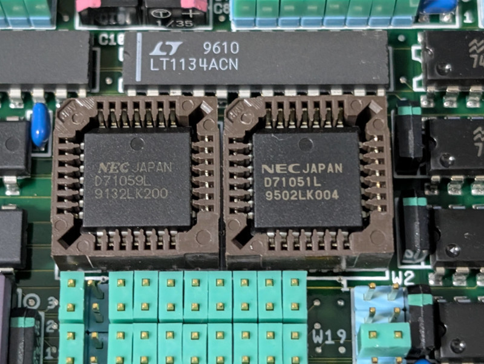
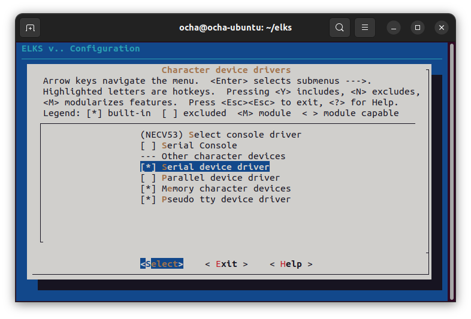
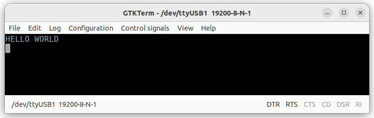
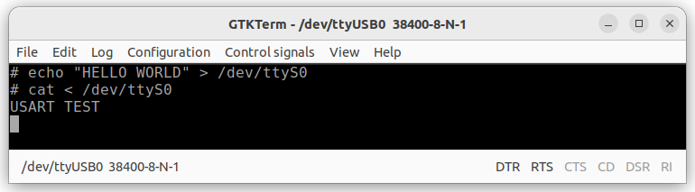
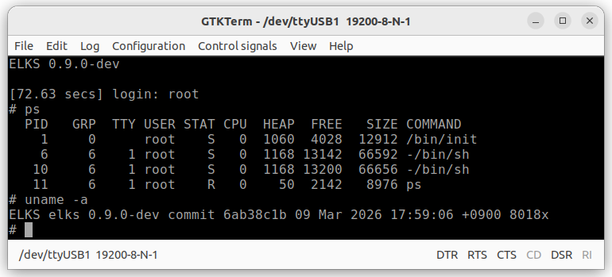
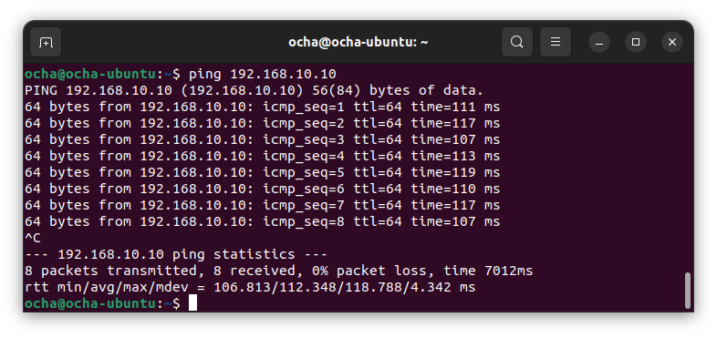
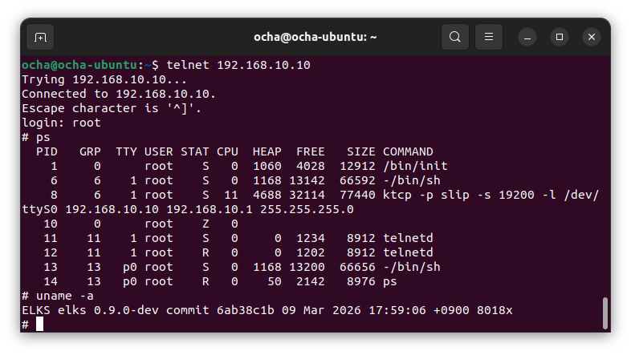
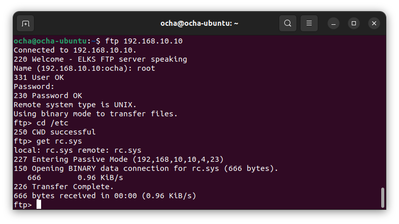
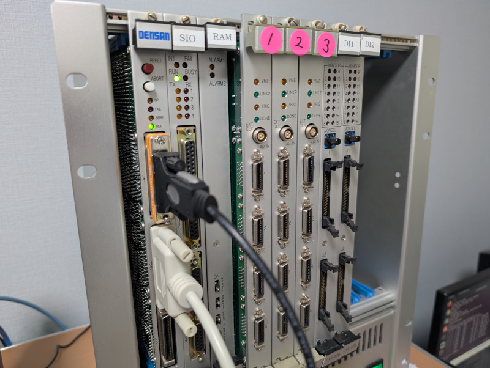

+++
date = '2026-03-12T11:35:37+09:00'
title = 'V53 VMEシステムで遊ぶ #17 ELKSでIPネットワークに接続する'
slug = 'v53-vme-system-17-elks-network'
tags = ["V53", "DVE-V53", "VME", "ELKS"]
categories = ["Retro Computing"]
image = 'v53-vme-elks-network.jpg'
+++

[前回](/2026/03/v53-vme-system-16-elks-3.html)は、8086系の組み込み向けLinuxである[ELKS](https://github.com/ghaerr/elks)をV53 VMEシステムで動かしてRAMDISKを使えるようにしました。
今回はV53 VMEシステムに搭載されているUSARTのシリアルドライバを作成してIPネットワークに接続してみます。

## シリアルポートを活用する

現在はV53に内蔵されているSCU(Serial Control Unit)をコンソールとして使用しています。SCU以外にもこのVMEボードには8251互換のUSART uPD71051が搭載されています。このシリアルデバイスの仕様については過去の記事の[USARTを攻略する](/2026/01/v53-vme-system-6.html)と[割り込みを攻略する](/2026/02/v53-vme-system-10.html)にまとめています。



このUSART用のシリアルドライバを実装してELKSで活用できるようにします。用途としては２つ目のターミナルや他のコンピューターへの接続を想定しています。シリアル接続でIPネットワークに接続するためのプロトコルであるSLIPが動けばさらに可能性が広がります。

## シリアルドライバの実装

ELKSにはシリアルドライバを書くためのテンプレート serial-template.c が用意されていますので、これをベースに実装します。
以前USARTをELKSのシリアルコンソールとして実装したときのノウハウと他のデバイス用のシリアルドライバのソースも参考にして新たにuPD71051用のシリアルドライバを作成しました。

* [elks/arch/i86/drivers/char/serial-upd71051.c](https://github.com/kanpapa/elks/blob/v53-rom/elks/arch/i86/drivers/char/serial-upd71051.c)

これを使用するようにMakefileで指定しました。

* [elks/arch/i86/drivers/char/Makefile](https://github.com/kanpapa/elks/blob/v53-rom/elks/arch/i86/drivers/char/Makefile)

```Makefile
ifeq ($(CONFIG_ARCH_NECV53), y)
	CONIO = necv53
	SERIAL = upd71051 <--今回実装したシリアルドライバを指定
endif
```

また、USARTの割り込み信号はPICに接続されているためPICのディスパッチャでUSARTの受信割り込みハンドラを呼び出すように修正しています。

* [elks/arch/i86/kernel/irq-necv53.c](https://github.com/kanpapa/elks/blob/v53-rom/elks/arch/i86/kernel/irq-necv53.c)

```C
void v53_external_pic_dispatcher(int irq, struct pt_regs *regs)
{
    unsigned char irr;

    //printk("!");
    // 1. PICのISR (In-Service Register) を読む ---
    // OCW3: 0000_1011 (0x0B) -> RR=1, RIS=1 (Read ISR)
    // IRR (0x0A): 「今、どのピンに割り込み信号が届いているか」を示します。
    // ISR (0x0B): 「今、どの割り込みをCPUが実行中か」を示します。
    outb(0x0B, PIC_OCW2);
    irr = inb(PIC_OCW2);    // AL = IRR

    // 2. 要因判定と分岐 ---
    // タイマー処理の判定 (IR0)
    if (irr & 0x01) {
        timer_tick(TIMER_IRQ, regs);
    }
    // シリアル受信の判定 (PIC IR3) EXT USART
    if (irr & 0x08) {
        rs_irq(EXT_USART_IRQ_RX, regs); <---シリアルドライバの受信処理を追加
    }
    // シリアル受信の判定 (PIC IR5) V53 SCU
    if (irr & 0x20) {
        irq_rx(EXT_SCU_IRQ_RX, regs);
    }

    outb(0x20, PIC_OCW2);   // 外部PIC (Slave) へのEOI発行
    outb(0x20, V53_ICU_OCW2);   // V53内蔵ICU (Master) へのEOI発行
}
```

## カーネルへの組み込みとビルド

カーネルのコンフィグレーションで`Serial device driver`にチェックを入れると、シリアルドライバがカーネルに組み込まれます。



カーネルのビルドが正常に完了するまでには少しデバッグが必要でしたが、正常に起動できるようになり、起動時にシリアルデバイスが表示されるようになりました。

```
> g c000 0014
Go!

ELKS Setup INT f002 START
ttyS0 at d8, irq 11 <---シリアルドライバが組み込まれた
console_init: V53 SCU
NECV53 machine, syscaps 0, 512K base ram, 16 tasks, 64 files, 96 inodes
ELKS 0.9.0-dev (43360 text, 0 ftext, 4000 data, 4720 bss, 56814 heap)
Kernel text c062 data 80 end 1080 top 8000 446+0+0K free
VFS: Mounted root device /dev/rom (0600) romfs filesystem.
Running /etc/rc.sys script
Mon Oct 23 05:52:49 2084

ELKS 0.9.0-dev

[0.48 secs] login: 
```

USARTには/dev/ttyS0のデバイスが割り当てられました。IRQ 11が設定されて、ここまでは問題なさそうです。

## シリアルドライバのテスト

まずは簡単な送信テストとしてシリアルデバイスにechoしてみます。
USARTのコネクタをシリアルターミナルにつなぎ、通信速度は19200bpsに設定します。

コンソールから以下のコマンドを入力します。

```
# echo "HELLO WORLD" > /dev/ttyS0
```

送信した文字がターミナルに表示されました。



次は受信のテストです。こちらは割り込みなのですこしドキドキです。

```
# cat < /dev/ttyS0
```

シリアルターミナルで文字を入力しEnterを入力したところ、入力した文字がコンソールに表示されました。



問題なく動作しているようなので、コンソールからgettyを動かしてログインできるかを確認しました。

```
# getty /dev/ttyS0 &
```

シリアルターミナルに`login:`プロンプトが表示されてログインすることができました。



シリアルドライバは今のところは問題なく動作しているようです。

## IPネットワークに接続する

いよいよIPネットワークにVMEシステムを接続してみます。接続するシステムはUbuntu 22.04 LTSです。USBシリアル 19200bpsでV53 VMEシステムと接続しています。

### ネットワーク構成

今回のIPネットワーク構成は以下の通りです。


### Ubuntu側での準備

以下のようにコマンドを入力し、slip接続を設定します。
```
$ sudo chmod 666 /dev/ttyUSB1
$ sudo slattach -p slip -s 19200 /dev/ttyUSB1 &
[1] 5935
$ sudo ifconfig sl0 192.168.10.1 pointopoint 192.168.10.10 up
```

netstatで確認するとsl0が192.168.10.10のホストに向いていることがわかります。

```
$ netstat -r 
Kernel IP routing table
Destination     Gateway         Genmask         Flags   MSS Window  irtt Iface
default         router.askey.ne 0.0.0.0         UG        0 0          0 eno1
link-local      0.0.0.0         255.255.0.0     U         0 0          0 eno1
172.17.0.0      0.0.0.0         255.255.0.0     U         0 0          0 docker0
192.168.0.0     0.0.0.0         255.255.255.0   U         0 0          0 eno1
192.168.10.10   0.0.0.0         255.255.255.255 UH        0 0          0 sl0
$
```

### ELKS側での準備

Ubuntu側の準備を行ったところで、ELKSで以下のようにコマンドを入力し、ktcpをバックグラウンドで起動します。

```
# ktcp -p slip -s 19200 -l /dev/ttyS0 192.168.10.10 192.168.10.1 255.255.255.0 &
ktcp: ip 192.168.10.10, gateway 192.168.10.1, netmask 255.255.255.0
ktcp: slip /dev/ttyS0 baud 19200 mtu 1024
```

これでELKSがIPネットワークに接続されたはずです。

### pingのテスト

最初に疎通確認のためUbuntuからELKSにpingを実行してみます。



問題なくpingが返ってきました。これでIPネットワークに接続できたことが確認できました。

### telnetのテスト

次にELKSにtelnetでログインしてみます。ELKS側でtelnetdを起動しておきます。

```
# telnetd &
```
この状態でubuntu側からtelnetで接続します。



問題なくELKSに接続できました。

### ftpのテスト

次はELKS側にftp接続をしてみます。これができればファイル転送が容易にできるようになります。ELKS側でftpdを起動しておきます。

```
# ftpd &
```
この状態でubuntu側からftpで接続し、ELKS側のファイルをUbuntu側に転送してみます。



問題なさそうです。さらにnetstatでネットワークの状況を確認してみました。

```
# netstat 
----- Received ---------  ----- Sent -------------
TCP Packets          842  TCP Packets          863
TCP Dropped            2  TCP Retransmits        1
TCP Bad Checksum      13  TCP Retrans Memory     0
IP Packets           852  IP Packets           872
IP Bad Checksum        0  IP Bad Headers         0
ICMP Packets           8  ICMP Packets           8
SLIP Packets         604  SLIP Packets         624
ETH Packets            0  ETH Packets            0
ARP Reqs Sent          0  ARP Replies Rcvd       0
ARP Reqs Rcvd          0  ARP Replies Sent       0
ARP Cache Adds         0

 No        State    RTT lport        raddress  rport
-----------------------------------------------------
  1  ESTABLISHED   62ms  1048         0.0.0.0      2
  2  ESTABLISHED   62ms    21    192.168.10.1  49554
  3       LISTEN   62ms    21         0.0.0.0      0
  4       LISTEN   62ms    23         0.0.0.0      0
# 
```

送受信パケットの状況や通信先IPが表示されています。受信時にDroppedやBad Checksumもカウントされていますが、これは低速のシリアル通信のためやむを得ないでしょう。ただしこれはTCPがリカバリしてくれます。

## まとめ

こんなに短期間にV53 VMEシステムがIPネットワークにつながり、ファイル転送ができるようになるとは思ってもいませんでした。これもELKSというプラットフォームが公開されていたおかげです。

ELKS本体の実装はここでひと段落して、まだ未解明のSIOボード、DINボード、AINボードの解析を進めたいと思います。その解析作業にもこのELKSが役立つはずです。



次の記事：[V53 VMEシステムで遊ぶ #18 SIOボードの解析](/2026/04/v53-vme-system-18-sio-1.html)