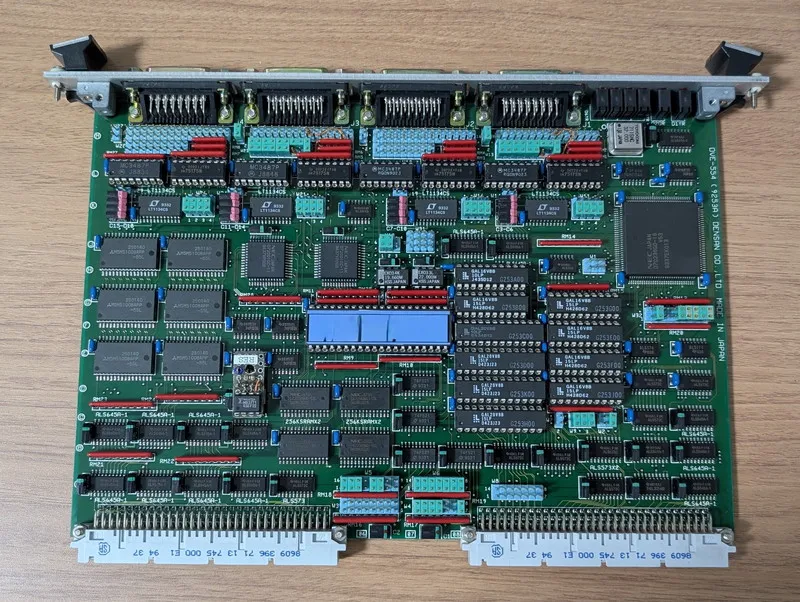
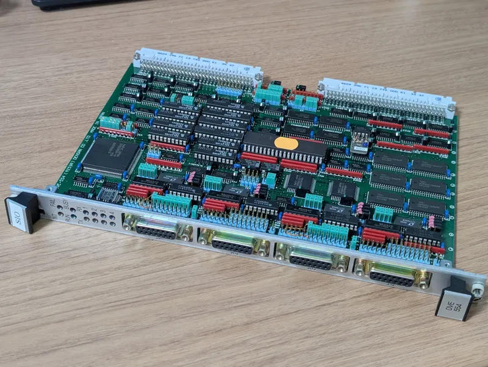
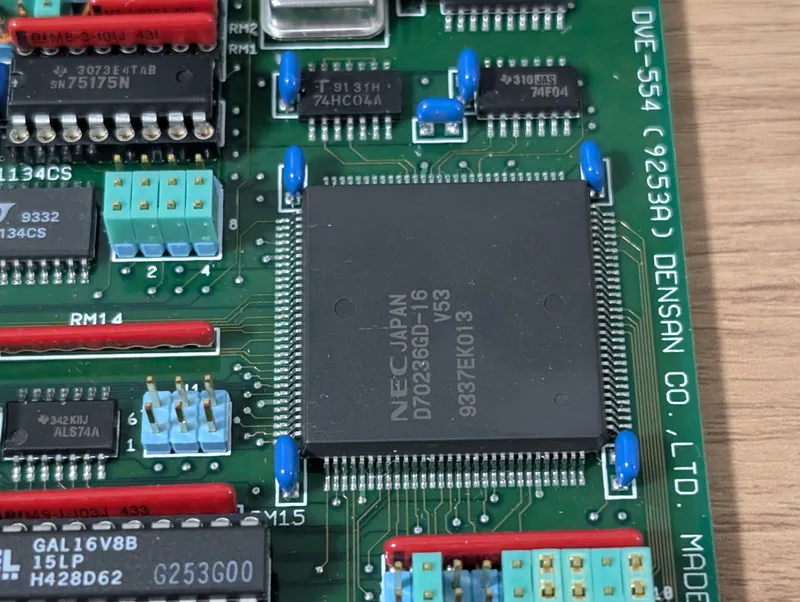
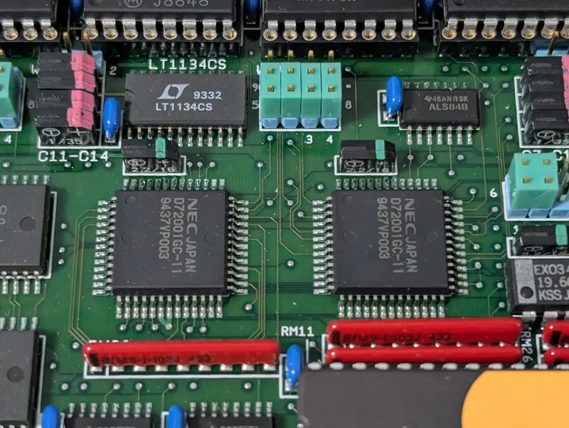
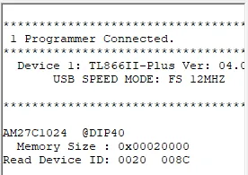
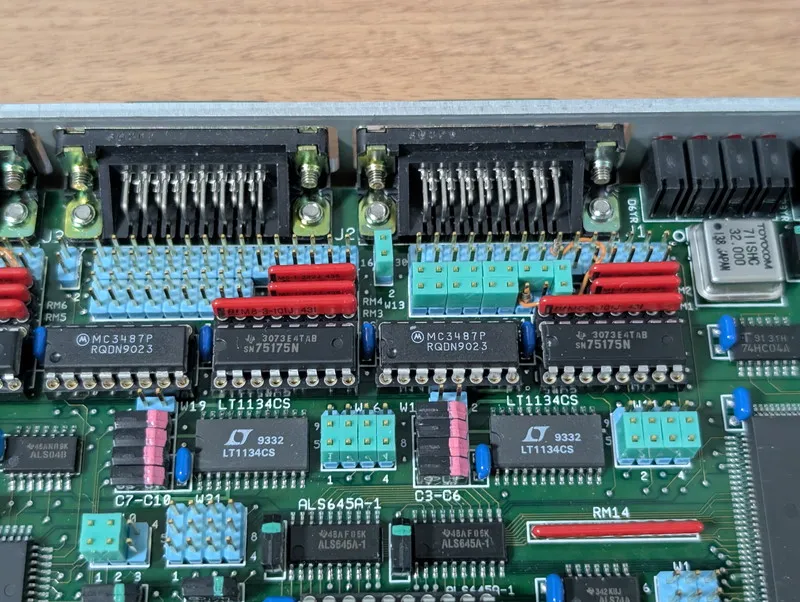
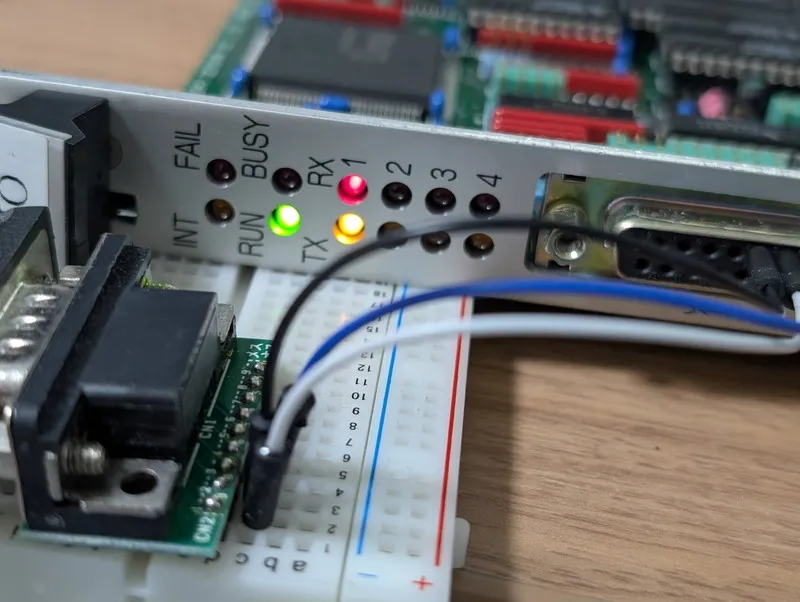
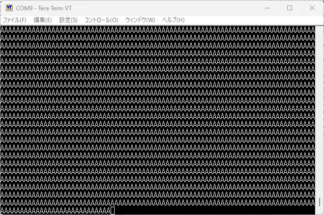

+++
date = '2026-04-12T12:40:07+09:00'
title = 'V53 VMEシステムで遊ぶ #18 SIOボードの解析'
slug = 'v53-vme-system-18-sio-1'
tags = ["V53", "DVE-V53", "VME", "uPD72001"]
categories = ["Retro Computing"]
image = 'v53-vme-sio-board-1.webp'
+++

[前回](/2026/03/v53-vme-system-17-elks-network.html)は、V53 CPUボードに[ELKS](https://github.com/ghaerr/elks)を載せてSLIPでネットワークに接続しました。これでV53 VMEシステムが本格的に稼働しました。
次はV53 VMEシステムに搭載されているSIOボードについて調査を進めていきます。

## SIOボードの外観

SIOボードの外観です。



SIOという名前の通りシリアルIOボードです。4つのコネクタがありますので4回線分と思われます。



中身をのぞいてみると、なんとV53 CPUが存在します。SIOボードは単なるシリアルIOではなく、このV53が自律的に処理していると思われます。



シリアル通信を行うデバイスはuPD72001というあまり聞いたことがないものでした。



このデバイスを調べてみると調歩同期だけでなくHDLCなどの高度な通信まで対応しているようです。  

このように当初思っていたよりも高機能なハードウェアでしたが、このSIOボードにはROMが取り付けられたままでしたので、ROMを解析することである程度のハードウェアの情報は得られそうです。

## ROMから判明した情報

ROMにはシールがべったり張り付けられており無理にはがすことはやめました。このためROMの型番は不明なのですが、ROMライターで読んでみたところどうやら27C1024のようです。



実際のバイナリは18000-1A3EFに書かれており、最後の16バイトにはV53のリセットベクタが書き込まれていました。アドレスはF000:8100となっていたので、ROMのアドレスとも一致します。

また、uPD72001のIOアドレスは以下の通りでした。

```
%define MPSC1_DATA 0x00A0
%define MPSC1_CTRL 0x00A2
%define MPSC2_DATA 0x00A8
%define MPSC2_CTRL 0x00AA
```

これでHello Worldが書けそうです。

## シリアルコネクタの仕様

このボードのシリアルコネクタはD-SUB15ピンです。D-SUB15ピンといえばX.21が思い当たりますが、シリアルコネクタ近辺には多数のジャンパーピンがあり、コネクタへの接続が柔軟に設定できるように見えます。



またシリアルドライバICは2種類あり、1つはRS-422用、もう1つはRS-232C用が搭載されています。これもジャンパー設定で選択できると思われます。

|インターフェース|ドライバIC|伝送方式|
|:--|:--|:--|
|RS-232C|LT1134|不平衡伝送|
|RS-422A|SN75175, MC3487|平衡伝送|

このSIOボードのジャンパー設定は2つのポートしか行われていないようで、写真の左側のように全くジャンパーが無いポートは使用されていないようにみえます。
使用されている2つのポートの配線を追ったところ、RS422のドライバICではなく、RS232CのドライバICにたどり着き、D-SUB15ピンコネクタの配線は以下のようになっていました。

|ピン番号|機能|
|:--|:--|
|1|GND|
|2|TXD|
|3|RXD|
|4|RTS|
|5|CTS|
|6|DCD|
|12|STRxC|
|13|TRxC|
|15|DTR|

RS-232Cであれば手持ちのシリアル変換USBケーブルで接続できそうです。

## Hello Worldを動かす

ROMから得られた情報を元にSIOボードのテストプログラムを書いてみました。

* [SIO/hello_world/test2.asm](https://github.com/kanpapa/VMEbus-V53/blob/main/SIO/hello_world/test2.asm)

シリアルポートから連続して"A"を出力するものです。V53の初期設定はROMの内容に沿った形で行いましたが、シリアル通信デバイスの設定がBiSyncだったため、ASyncになるように書き直しました。  
テスト版のROMを取り付けて、D-SUB15ピンのGND、TXD、RXDをシリアルターミナルに接続して電源を投入したところ、RUN LEDとTX LEDが点灯し、無事シリアルポートに"A"のデータが出力されました。また、ターミナルから連続してキー入力をするとRX LEDも点灯しました。





## まとめ

SIOボードはV53 CPUが搭載されたインテリジェンスなボードでした。メモリも十分搭載されており4ポートの高度な通信機能を実現できるものでした。  
次のステップとしてSIOボードを詳細に調査するために簡単なモニタを載せることにします。SIOボード側からVMEシステムがどのように見えるのか、IOポートの役割はどうなっているのかなど探ります。
このSIOボードがVMEシステムにおいて、CPUボードやその他のボードとどのように連携していたのかがわかれば、今後の活用方法が見えてくると思われます。

次の記事：[V53 VMEシステムで遊ぶ #19 SIOボード用モニタの実装](/2026/04/v53-vme-system-19-sio-monitor.html)