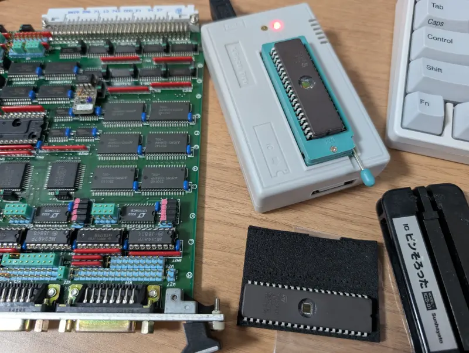
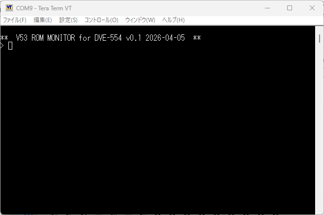
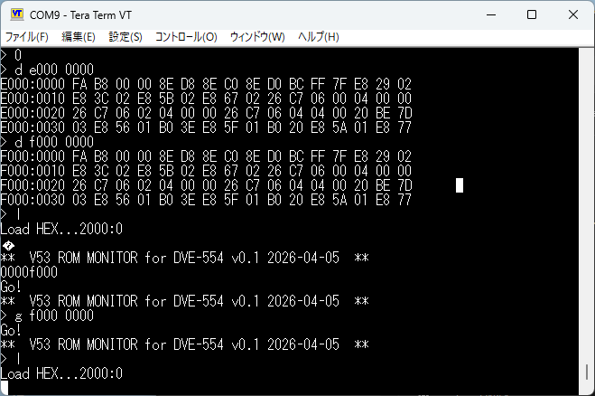
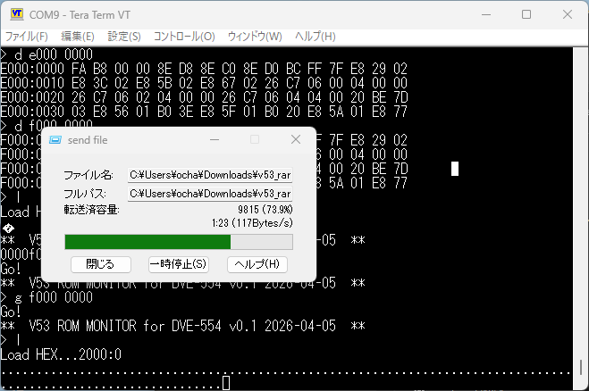
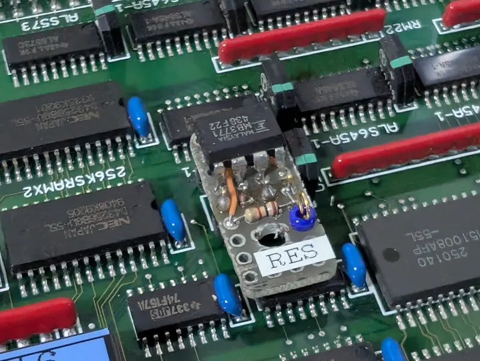
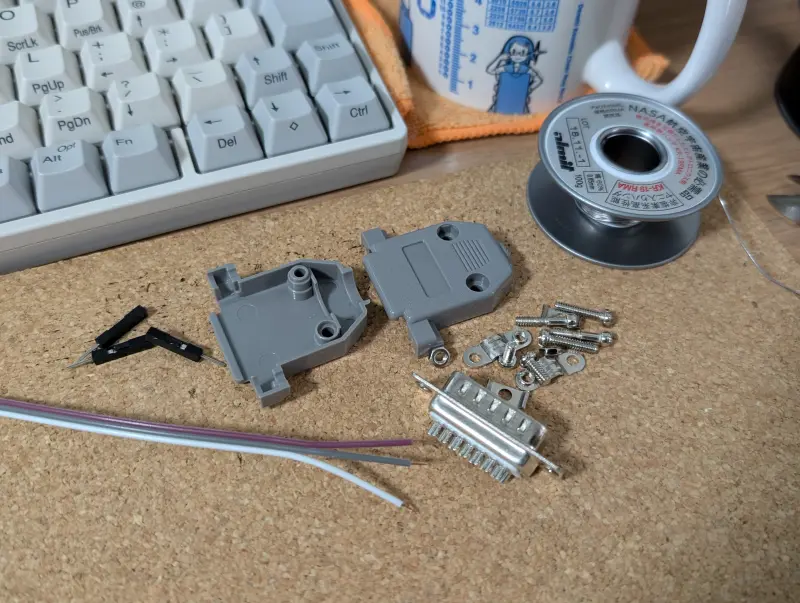
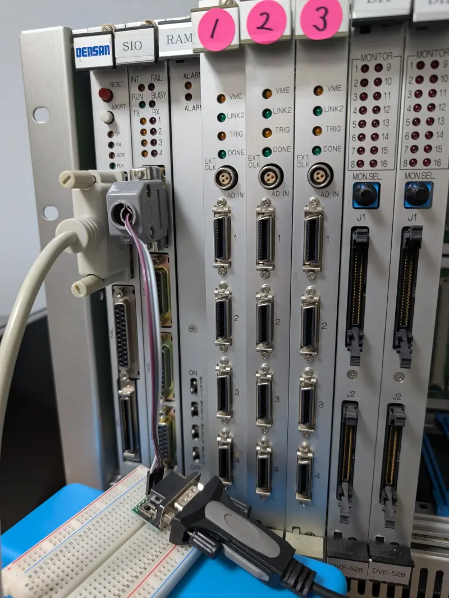
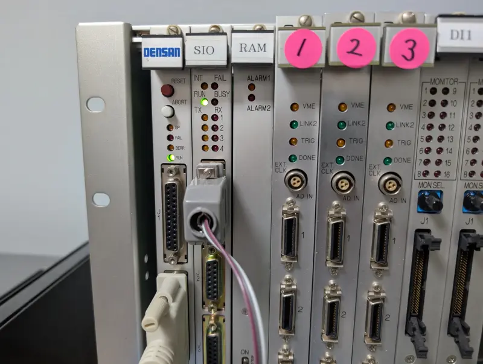
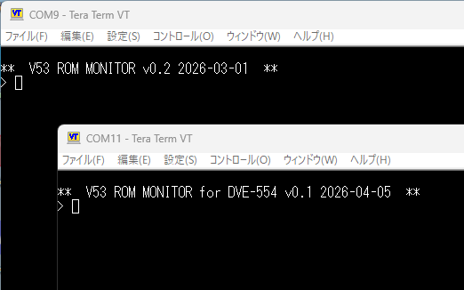
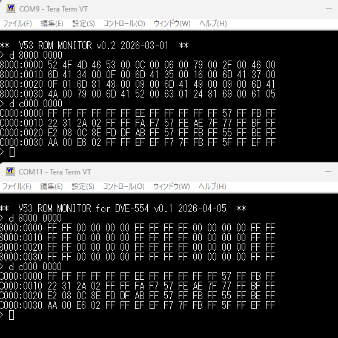

+++
date = '2026-04-14T15:31:33+09:00'
title = 'V53 VMEシステムで遊ぶ #19 SIOボード用モニタの実装'
slug = 'v53-vme-system-19-sio-monitor'
tags = ["V53", "DVE-V53", "VME", "uPD72001"]
categories = ["Retro Computing"]
image = 'v53-vme-system-mount-sio-board-1.webp'
+++

[前回](/2026/04/v53-vme-system-18-sio-1.html)は、V53搭載のSIOボードでシリアル入出力ができることを確認しました。今回はSIOボードにモニタを実装して、SIOボードをV53のワンボードコンピュータとして使用できるようにします。

## V53モニタの実装

ここで使用するV53モニタは[V53 CPUボード用に開発したモニタ](/2026/01/v53-vme-system-5.html)を移植します。CPUボードとほぼ同じメモリマップと思われるので、入出力部分をSIOボードに搭載されているシリアル通信デバイス用に書き換えます。
前回作成した[Hello worldのコード](https://github.com/kanpapa/VMEbus-V53/blob/main/SIO/hello_world/test2.asm)とV53モニタのコードをマージするイメージです。

ベースとなるV53モニタのコードは以下にあります。600行程度でプログラムの実行に必要な最小限の機能(DUMP/LOAD/GO)を持つものです。

* [v53mon.asm](https://github.com/kanpapa/VMEbus-V53/blob/main/monitor/v53mon.asm)

このモニタのコードはV53内蔵のSCUをコンソールとして使用していますが、SIOボードではSCUの外部ポートは無いため、uPD72001を使用し、V53 CPUの初期化コードはHello wolrdのものをそのまま使います。

完成したSIO用モニタのコードです。今回はF000:0000に配置しました。

* [v53sio_mon.asm](https://github.com/kanpapa/VMEbus-V53/blob/main/SIO/monitor/v53sio_mon.asm)

できたバイナリをROMライターでROMに書き込みます。

## モニタの動作確認

モニタROMをSIOボードに取り付けて電源を投入したところ、次のような画面になりました。無事モニタが動きだしました。

モニタの３つのコマンドは動いているように見えます。

HEXファイルのアップロードをテストしてみます。

DUMPコマンドでメモリを確認しアップロードできていることを確認しました。  
これでSIOボードで自由にプログラムを動かせるようになりました。

## 改造されたRESET端子

このSIOボードはCPUボードとは違い外部にリセットスイッチがありません。このためプログラムを実行して暴走した場合はリセットを行うことができません。  
このシステムの開発者もその課題を持っていたようで、基板を改造して写真のようなRESET端子を作ったようです。

ラベルにはRESと書かれていて、テストプローブをひっかけやすい端子を用意してくれています。この端子をGNDに落とすとRESETがかかり再びモニタのプロンプトに戻りました。  
このRESET機能は今後の作業に役立ちそうです。

## SIOボードをVMEラックにマウントする

これでSIOボード単体でモニタが動作するようになりましたが、やはりVMEシステムの一つとして動作させたいものです。  
これまでは机の上にSIOボードを平置きにして、暫定的にシリアルコネクタにブレッドボード用のワイヤーを刺しこんでシリアルターミナルに接続していました。VMEラックに戻すためにはこの部分を改善する必要があります。  
そこでD-SUB15ピンを使った専用のシリアルコネクタを製作しました。

今回はTXD、RXD、GNDだけをD-SUB15ピンコネクタからワイヤーで引き出しておき、ラックマウントしたSIOボードにD-SUB15ピンコネクタで接続しました。

もう少し長いケーブルが良かったのですが、とりあえず手持ちのケーブルを使いました。

## VMEシステムを起動する

この状態で電源をいれたところ、無事CPUボード、SIOボードともにRUN LEDが点灯しました。  
V53 CPUが2つ同時に動いている状態です。

各ボードのシリアルポートをターミナルに接続することで、VMEシステムの上で2つのモニタが動いていることが確認できます。

両方のモニタでメモリダンプを行ったところ、同じ内容が表示されるところがありました。C0000-DFFFFまでが共有メモリとして見えているようです。

このVMEシステムではC0000-FFFFFの共有メモリを使って各ボードが連携していたものと推測されます。他のデジタル入力ボードやアナログ入力ボードもこの共有メモリを使っているかもしれません。

## まとめ

ここまでの成果物をGitHubリポジトリに登録しておきました。

https://github.com/kanpapa/VMEbus-V53

このSIOボードをどのように活用するかはまだはっきりしませんが、まだ機能が判明していないIOアドレスが存在しますので、IOスキャンを行ってみて、もう少し機能を探ってみようと思います。