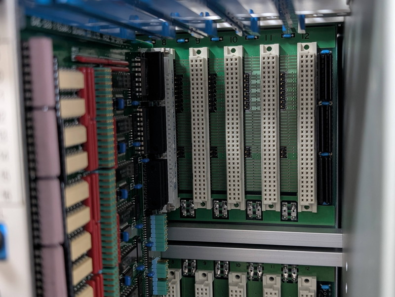
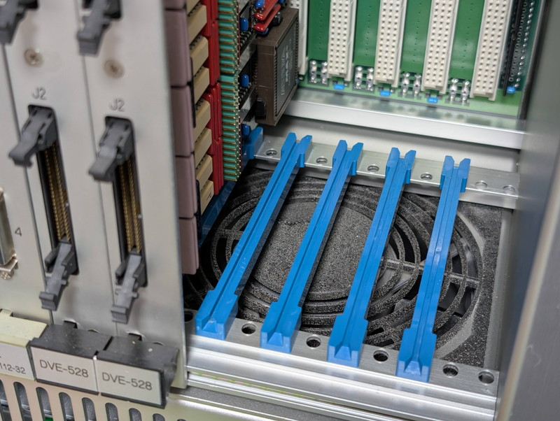
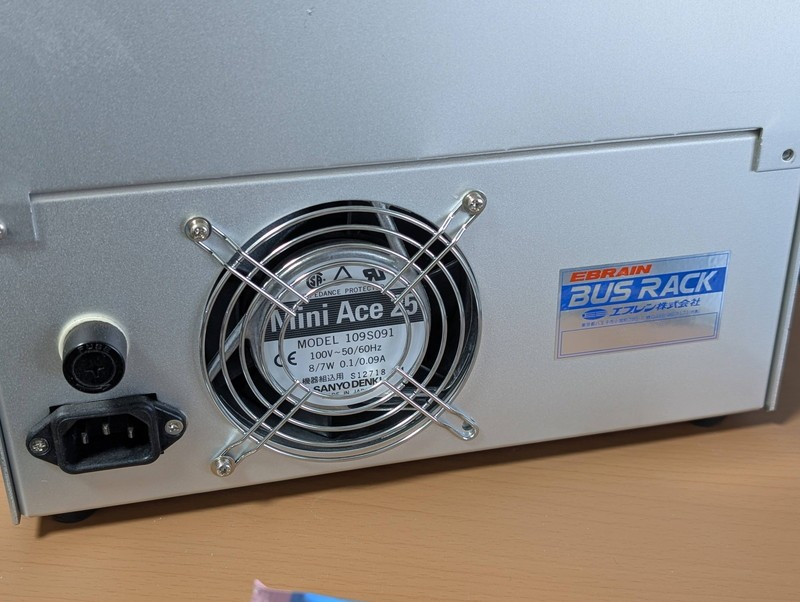
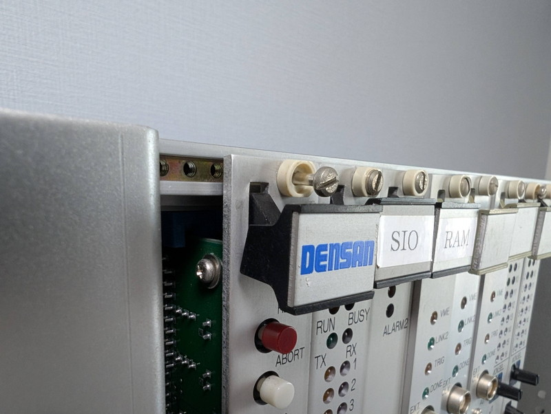
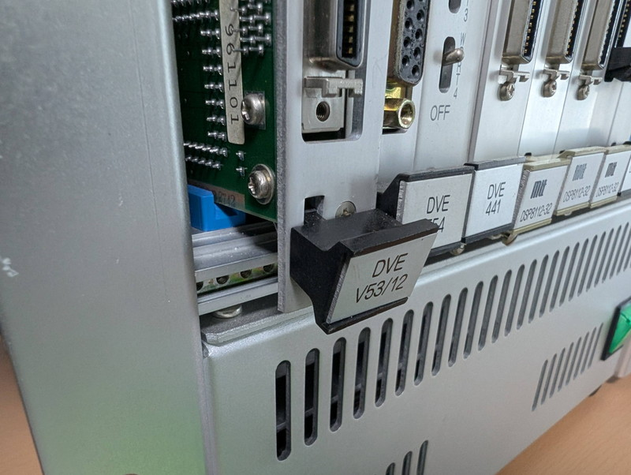
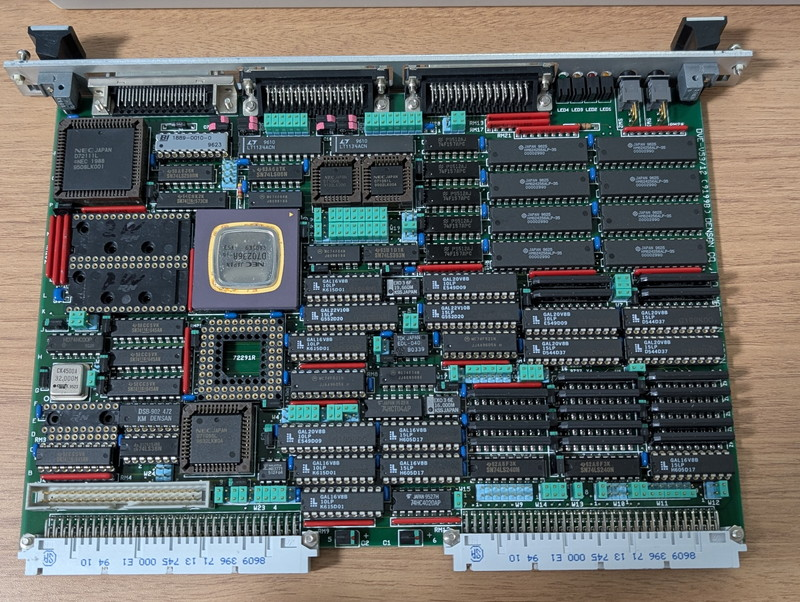
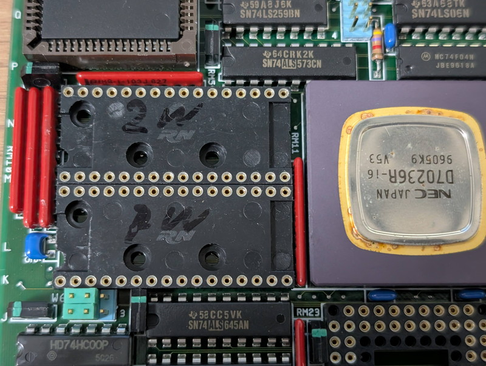

+++
date = '2026-01-06T13:04:00+09:00'
slug = 'v53-vme-system-2'
title = 'V53 VMEシステムで遊んでみました #2 CPUボードの概要'
tags = ["V53", "DVE-V53", "VME"]
categories = ["Retro Computing"]
image = 'v53-vme-system-2-cpu-board1.jpg'
+++

実はVMEラックを触るのは今回が初めてです。取り扱い方法を間違えて壊さないようにじっくり確認しながら作業を進めます。  

## VMEラックの構造

ここでVMEラックの構造を確認してみます。ラックの後面にバックプレーンボードが取り付けられており、ここにVMEバスのコネクタが並んでいます。右端にはターミネーターの抵抗群が見えます。

VMEボードのスロットの下側には大きなファンが２基あり、ラック上側に向けて冷却風が流れます。ファンの音はやや大きいです。長年のほこりが溜まっているのでいずれ大掃除をする予定です。

電源はファンの下側にあり、電源後部にもファンがついています。サーバー並みの堅牢な構造です。

## VMEボードの取り外し

VMEボードは上下２本のネジでラックに固定されているのでまずこれを外します。

あとはバックプレーンのコネクタで固定されている状態ですが、しっかりコネクタに刺さっていてなかなか外れません。そこでボードの上下に取り付けられている器具を外側に倒すと徐々にコネクタから外れてボードが外せました。

取り付け時はこの逆の順番で作業すればよさそうです。

ボードの取り付け・取り外しの際はVMEボードのコネクタのピンにダメージを与えないように慎重に作業する必要がありそうです。

## CPUボードの外観と機能

取り外したCPUボードです。隙間なくパーツが実装されています。GALも多用されていて解析にはややてこずるかもしれません。

CPUボードに搭載されている気になるチップを一覧にしてみました。

| 型番 | メーカー | 機能・概要 | 備考 |
| :--- | :--- | :--- | :--- |
| **μPD70236R-16** | NEC | **V53 (16MHz)** | 8086互換のV33コアにDMA、シリアル、タイマー等を内蔵した統合プロセッサ|
| **μPD72291R** | NEC | **FPU (数値演算コプロセッサ)** | このボードではソケットのみ |
| **HM624256ALP-35** | 日立 | **SRAM (256Kbitx4)** | 高速SRAM 1Mbit×8個|
| **μPD72111L** | NEC | **SCSIC (SCSIコントローラ)** | J3のSCSI制御用か？|
| **μPD71055L** | NEC | **PPI (パラレル入出力)** |8255互換。位置的にP2コネクタ近くのピンソケットに接続されているかも。 |
| **μPD71053L** | NEC | **PIT (タイマー)** |8253互換|
| **μPD71051L** | NEC | **USART (シリアル)** |8251互換|
| **LT1134ACN** | Linear Tech | **RS-232 トランシーバ** |2個搭載で2チャンネル分|

また、クロック源は以下の通りです。これも手掛かりとなります。

| 型番 | メーカー | 周波数 | 機能・概要 |
| :--- | :--- | :--- | :--- |
|CK4500A|TEW|**32.000M**|1/2分周の16MHzがCPUのクロックか？|
|EXO 3|KSS|**19.660M**|RS232C用？|
|EXO 3|KSS|**16.000M**|VMEバス用？|

残念ながらROMは取り外されているようです。CPUの近くに空きの32ピンICソケットが2個あり、手書きで1W、2Wと書かれていました。

これがROM用のソケットでピン数からみて`27C010`あたりが適合するのではと思われます。

## まとめ
CPUボードの構成からみて**NEC V53 CPU** を中心に、1MBのメモリを実装し、SCSI、GPIO、通信機能を備えた高機能CPUボードのようです。  
V53はペリフェラルを内蔵していますが、`D7105x` シリーズ（PPI, PIT, USART）が個別に実装されていることから、多くのI/Oポートを必要とする設計、または古いPC-98用ボードのアーキテクチャを踏襲しているかもしれません。

次のステップとしてV53の内蔵ペリフェラルを使用した簡単な動作確認用のプログラムをROMに焼いてCPUボードに取り付けてみます。ここでも[VMEバス用電源供給基板](https://kanpapa.com/2023/08/68000-vme-board2.html)が役立ちそうです。