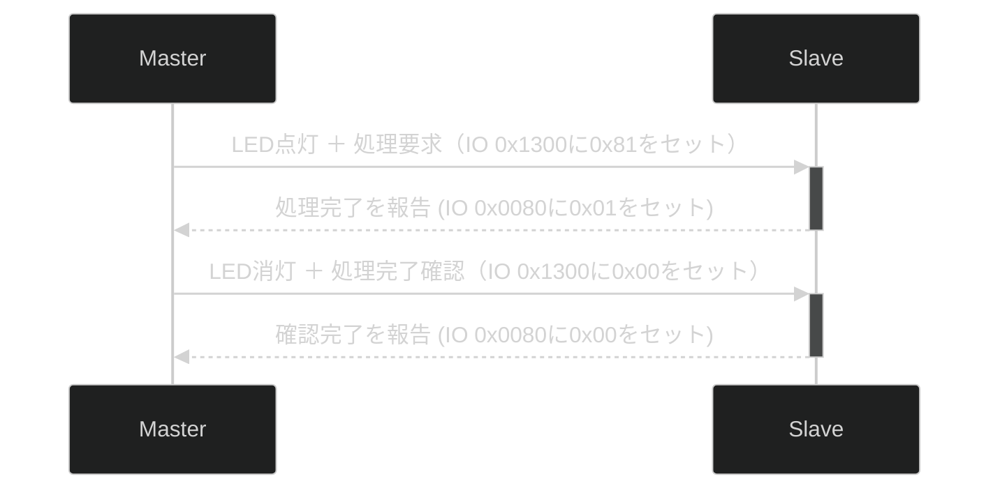

+++
date = '2026-04-25T06:58:41+09:00'
title = 'V53 VMEシステムで遊ぶ #20 SIOボードとCPUボードを連携する'
slug = 'v53-vme-system-20-sio-cpu-handshake'
tags = ["V53", "DVE-V53", "VME", "uPD72001"]
categories = ["Retro Computing"]
image = 'v53-vme-system-20-sio-port1.jpg'
+++


[前回](/2026/04/v53-vme-system-19-sio-monitor.html)は、V53搭載のSIOボードに簡易モニタを実装しプログラムの実行ができる環境になりました。今回は本格的なモニタを実装し、SIOボードとCPUボードがどのように連携しているのかを探ります。

## V53 RAMモニタの実装

ROMに書き込んだモニタはプログラムをロードして実行する機能しかありません。それ以上の機能はRAMモニタに実装して自在に修正ができるようにします。ここではCPUボードの解析に使用したV53 RAMモニタを移植しました。

* [v53sio_ram_mon.asm](https://github.com/kanpapa/VMEbus-V53/blob/main/SIO/monitor/v53sio_ram_mon.asm)

割り込み機能はまだ細かい仕様がわからないためわかっている範囲で実装しました。

## IOスキャンをする

とりあえず動作するようになったRAMモニタで、I/Oスキャンを実行したところ、想定通りの結果になりました。

```
> s 0000 ffff
Scanning I/O (Press any key to abort)...
  :
0080: 00   ???
  :
00A0: 66   MPSC?
00A2: 00
00A4: 00
00A6: 04
00A8: 00
00AA: 04
00AC: 00
00AE: 04
  :
00C0: 00   ICU?
00C2: 00
00C4: 00
00C6: 00
  :
00D0: C0   TCU?
00D2: 27
00D4: 88
00D6: 88
  :
```
まとめると以下のようになります。

|IOアドレス|名称|役割・機能詳細|
|:--|:--|:--|
|0080h|	詳細不明|読み込みで0が返ってくる。ファームウェアでは0を書き込み初期化している|
|0082h|	詳細不明|ファームウェアでは0を書き込み初期化している|
|0086h|	詳細不明|ファームウェアでは0を書き込み初期化している|
|00A0h|	MPSC #1 Data A|J1コネクタ。RS232C設定|
|00A2h|	MPSC #1 Cmd/Stat A|同上|
|00A4h|	MPSC #1 Data B|J2コネクタ。コネクタジャンパ未設定|
|00A6h|	MPSC #1 Cmd/Stat B|同上|
|00A8h|	MPSC #2 Data A|J3コネクタ。RS232C設定|
|00AAh|	MPSC #2 Cmd/Stat A|同上|
|00ACh|	MPSC #2 Data B|J4コネクタ。コネクタジャンパ未設定| 
|00AEh|	MPSC #2 Cmd/Stat B|同上|
|00C0h|	V53 ICU REG0|READ:IRQ/IIS/IPOL, WRITE:IIW1/IPFW,IMDW|
|00C2h|	V53 ICU REG1|READ/WRITE:IMKW, WRITE:IIW2/IIW3/IIW4|
|00D0h|	V53 TCU TM0_CNT|Timer 0 Counter (TOUT0 100.00Hz)|
|00D2h|	V53 TCU TM1_CNT|Timer 1 Counter|
|00D4h|	V53 TCU TM2_CNT|Timer 2 Counter|
|00D6h|	V53 TCU TM_CTL|Timer Control|
|FF00h-FFFFh|V53 内部レジスタ| |

0x0080～0x0086のI/Oの機能は良くわかりませんが、それ以外のI/Oアドレスはこれで確定と思われます。

## 4ポートシリアルを制御する

ここで4つのシリアルポートで遊んでみます。テストプログラムを作ってみました。

* [sendloop2.asm](https://github.com/kanpapa/VMEbus-V53/blob/main/SIO/hello_world/sendloop2.asm)

実行するとSIOボードのTXランプが順に点灯します。これで4つのシリアルポートのI/Oアドレスが正しいことが確認できました。



## 正体不明のIOポートを探る

気になるのは0x0080～0x0086のI/Oです。これまでの調査で、CPUボード側からみるとこのSIOボードはIOアドレス0x1300として見えるようです。これと何等かの関連があるように思われます。

そこで双方のボードのRAMモニタからIコマンド、Oコマンドで操作してみたところ以下のような結果となりました。

### CPUボードから書き込んだ結果

|CPU側 O コマンド実行|SIO側 I 0080の結果|その他の変化|
|:--|:--|:--|
|O 1300 00|00| |
|O 1300 01|01| |
|O 1300 02|02| |
|O 1300 04|04| |
|O 1300 08|08| |
|O 1300 10|10| |
|O 1300 20|20| |
|O 1300 40|00| |
|O 1300 80|80|SIOボード BUSY LED点灯|

### SIOボード側から書き込んだ結果

|SIO側 O コマンド実行|CPU側 I 1300の結果|その他の変化|
|:--|:--|:--|
|O 0080 00|00| |
|O 0080 01|01| |
|O 0080 02|02| |
|O 0080 04|04| |
|O 0080 08|08| |
|O 0080 10|10| |
|O 0080 20|20| |
|O 0080 40|00| |
|O 0080 80|00| |

確定ではありませんが、以下の図のような仕様ではないかと思われます。

```
        1300h              0080h        
┌──────┐     ┌────────────┐     ┌──────┐
│      │WRITE│ REGISTER-A │READ │      │
│      │────>│  CPU->SIO  │────>│      │
│      │     └────────────┘     │      │
│ CPU  │                        │ SIO  │
│ V53  │                        │ V53  │
│      │                        │      │
│      │     ┌────────────┐     │      │
│      │READ │ REGISTER-B │WRITE│      │
│      │<────│  CPU<-SIO  │<────│      │
└──────┘     └────────────┘     └──────┘
                                        
```

* レジスタA-レジスタBのD0～D5は書き込んだ値がそのまま見える
* レジスタAのD7はSIOボードのBUSY LEDのON/OFFに対応
* レジスタAのD6はREADで常に0に見える。未使用？
* レジスタBのD7,D6はREADで常に0に見える。未使用？

## CPUボードと連携してみる

この通信用とおもわれるレジスタを使いマスタCPUボードとスレーブSIOボードが連携するサンプルプログラムを作成しました。
シーケンス図は以下の通りです。



実際のデータは共有メモリでやり取りできるので、そのタイミングを通知する処理を想定しました。

サンプルプログラムは以下に置きました。

- [マスタ側 CPUボード](https://github.com/kanpapa/VMEbus-V53/blob/main/SIO/handshake/master_cpu.asm)
- [スレーブ側 SIOボード](https://github.com/kanpapa/VMEbus-V53/blob/main/SIO/handshake/slave_sio.asm)

実際に動かすと以下の動画のようになりました。



あくまでも推測ですが、このような使いかたなのかなと思われます。ただし、0x82、0x86の使いかたはまだ不明です。

## まとめ

今回は強化されたRAMモニタで他のVMEボードからどのようにSIOボードが見えるのかを探ってみました。実験中にVMEバスの割り込みが発生しないかと期待したのですが、SIOボードではVMEバスの割り込み端子は使われていないようで割り込みが発生することはありませんでした。その代わりにマスタCPUとの通信用に使われていると思われるレジスタの機能の一部が判明しました。

次は内部の割り込みを調査してみます。４つのシリアル通信ポートがあるので、必ず割り込みを使っているはずです。シリアル通信で発生する割り込みの仕組みが判明すればELKSの移植への道が開けます。

次の記事：[V53 VMEシステムで遊ぶ #21 SIOボードの割り込みを攻略する](/2026/05/v53-vme-system-21-sio-interrupt.html)