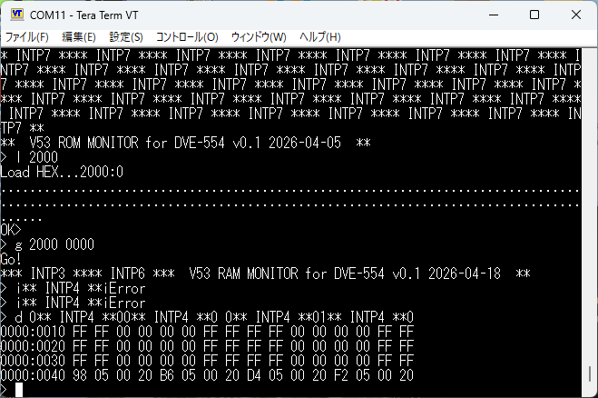
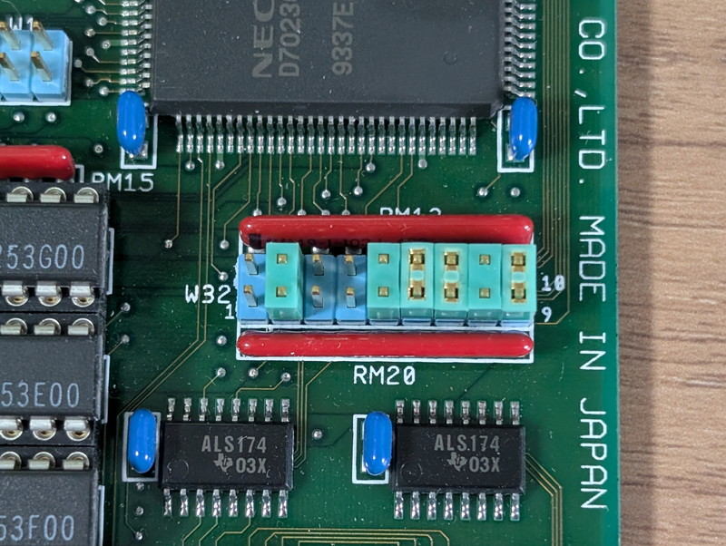
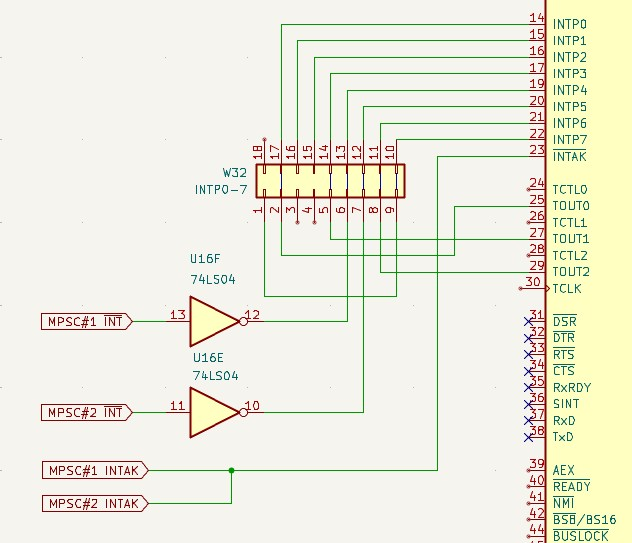
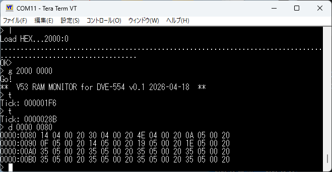

+++
date = '2026-05-05T16:40:15+09:00'
title = 'V53 VMEシステムで遊ぶ #21 SIOボードの割り込みを攻略する'
slug = 'v53-vme-system-21-sio-interrupt'
tags = ["V53", "DVE-V53", "VME", "uPD72001"]
categories = ["Retro Computing"]
image = 'v53-vme-system-21-sio-interrupt.jpg'
draft = true
+++

[前回](/2026/04/v53-vme-system-20-sio-cpu-handshake.html)は、V53搭載のSIOボードのIOポートについて調べました。今回は割り込みハンドラの動作確認を行い、モニタで割り込み機能を使用したシリアル入出力ルーチンを実装します。

## 仮割り込みハンドラの実装

とりあえずV53 ICUのINTP0～INTP7までの割り込みハンドラを実装して、ハンドラが呼ばれたらコンソールに文字列を出力するようにしてみました。
その結果、INTP0、INTP3、INTP4、INTP6、INTP7の文字列が出力されることがわかりました。



INTP0は100Hzの信号が接続されていることがわかりました。INTP3、INTP6は初期化時のみに発生しているようです。INTP7にも定期的な割り込みが発生しているようですが詳細不明です。キーを叩くたびに表示されるINTP4はMPSCの割り込みと思われます。

## 実回路の確認

VMEラックからSIOボードを取り外してINTP0～INTP7の接続先を追ってみたところ、CPU V53の近くにあるジャンパーピンW32に集約されていることがわかりました。



このジャンパー設定で様々な接続ができるようになっています。ジャンパーが未接続なのはINTP1,INTP2,INTP7でした。この割り込みピンは使われていないものと思われます。
ジャンパーピンからどこに接続されているのかをテスターで確認したところ次のような接続になっていました。



これでINTP4とINTP5がそれぞれのMPSCのINTピンに接続されていることがわかりました。さらにMPSCのINTAKがV53 INTAKに接続されているため、V53 ICUとMPSCはカスケード接続され、スレーブとなるMPSCが割り込みベクタを送信していると考えられます。

## MPSCの割り込みを使う

V53 ICUの設定を確認したところ、INTP0～INTP7は0x20～0x27のベクタを使用していました。INTP0(0x20)にはタイマー用の割り込みハンドラが実装されていましたが、INTP1～INTP7にはメモリにフラグを書き込むだけのダミーハンドラしか無く実処理はありません。

```asm
_intp1:
        cli		        ;割り込み禁止
        or byte [1275h], 20h	;メモリの特定の場所にフラグをセット
        sti		        ;割り込み許可
        iret
```

他のベクタを確認すると0x28～0x37に実際のシリアル処理のハンドラが書かれているようです。MPSCの初期設定を確認したところ、MPSC#1にはベクタ0x28が、MPSC#2にはベクタ0x30が設定されていました。

```asm
        mov al, 2                ;CR2Bを指定
        mov dx, MPSC1_B_CTRL
        out dx, al
        mov dx, MPSC2_B_CTRL
        out dx, al
        
        mov al, 0x28             ;MPSC#1はベクタ0x28を設定
        mov dx, MPSC1_B_CTRL
        out dx, al
        
        mov al, 0x30             ;MPSC#2はベクタ0x30を設定
        mov dx, MPSC2_B_CTRL
        out dx, al
```

これらをまとめると以下のようになります。

|割り込み要因|ベクタ番号|割り込みハンドラ|物理接続先|
|:--|:--|:--|:--|
|INTP0|0x20|Tickハンドラ|V53 TOUT0。Timer0は100Hzで設定|
|INTP1|0x21|ダミーハンドラ|未接続|
|INTP2|0x22|ダミーハンドラ|未接続|
|INTP3|0x23|ダミーハンドラ|V53 TOUT1。ただしTimer1は未設定|
|INTP4|0x24|ダミーハンドラ|MPSC#1 INT カスケード設定|
|INTP5|0x25|ダミーハンドラ|MPSC#2 INT カスケード設定|
|INTP6|0x26|ダミーハンドラ|V53 TOUT2。ただしTimer2は未設定|
|INTP7|0x27|ダミーハンドラ|未接続|
|MPSC#1|0x28|MPSC#1にEOI発行のみ (Ch.B?)|MPSC#1 INT|
|MPSC#1|0x29|MPSC#1にEOI発行のみ (Ch.B?)|MPSC#1 INT|
|MPSC#1|0x2a|MPSC#1にEOI発行のみ (Ch.B?)|MPSC#1 INT|
|MPSC#1|0x2b|MPSC#1にEOI発行のみ (Ch.B?)|MPSC#1 INT|
|MPSC#1|0x2c|何らかのシリアル処理ハンドラ|MPSC#1 INT|
|MPSC#1|0x2d|何らかのシリアル処理ハンドラ|MPSC#1 INT|
|MPSC#1|0x2e|MPSC#1 Ch.A 受信割り込みハンドラ|MPSC#1 INT|
|MPSC#1|0x2f|0x2eと同じ処理|MPSC#1 INT|
|MPSC#2|0x30|MPSC#2にEOI発行のみ (Ch.B?)|MPSC#2 INT|
|MPSC#2|0x31|MPSC#2にEOI発行のみ (Ch.B?)|MPSC#2 INT|
|MPSC#2|0x32|MPSC#2にEOI発行のみ (Ch.B?)|MPSC#2 INT|
|MPSC#2|0x33|MPSC#2にEOI発行のみ (Ch.B?)|MPSC#2 INT|
|MPSC#2|0x34|何らかのシリアル処理ハンドラ|MPSC#2 INT|
|MPSC#2|0x35|何らかのシリアル処理ハンドラ|MPSC#2 INT|
|MPSC#2|0x36|MPSC#2 Ch.A 受信割り込みハンドラ|MPSC#2 INT|
|MPSC#2|0x37|0x36と同じ処理|MPSC#2 INT|

MPSCの各割り込みハンドラで発生フラグをメモリに書くように組み込んで動作を観察したところ、受信割り込みは0x2eと0x36のようです。他の割り込みは発生していませんでした。

## V53 RAMモニタの受信割り込み対応

これまでの調査でシリアル受信割り込みの使いかたがわかったのでV53 RAMモニタにタイマー割り込みとシリアル割り込み機能を実装してみます。

### タイマーハンドラの実装

すでにRAMモニタに実装されている機能ですので、INTP0のハンドラに置き換えれば動作するはずです。

組み込んだあとモニタのTコマンドでTickを確認することができました。



これでモニタが時を刻み始めました。

### キー入力のハンドラの実装

このモニタはシリアル入出力をブロッキングが発生するポーリング方式で行っていました。今回はこの処理をシリアル受信割り込みハンドラに置き換えて、入力された文字をリングバッファに格納するようにしてみました。
受信割り込みハンドラのコードです。受信した文字をリングバッファに格納します。

```asm
; --------------------------------------
; INT 0x2e MPSC#1 Ch.A 受信割り込みハンドラ
; --------------------------------------
_isr_int0x2e:
    cli	                        ;割り込み禁止
    push ax
    push bx
    push dx

    inc word [int0x2e_flag]     ; 割り込み発生フラグセット

    ; uartデータレジスタから読み込み
    mov dx, MPSC1_A_DATA
    in  al, dx                  ; 1バイト受信

    ; リングバッファへ格納
    mov bx, [head_ptr]          ; バッファポインタをbxに設定
    mov [rx_buffer + bx], al    ; 受信データを格納
    
    inc bx                      ; ポインタを加算
    cmp bx, RX_BUF_SIZE         ; バッファオーバーフローチェック
    jne .skip_wrap
    xor bx, bx                  ; バッファポインタをリセット
.skip_wrap:
    mov [head_ptr], bx          ; バッファポインタを保存
    
    ; MPSC EOI / Error Reset
    mov dx, MPSC1_A_CTRL	; MPSC #1 コマンドポート 0x00A2 を指定
    mov al, 0x38
    out dx, al	                ; ポートへ出力

    pop dx
    pop bx
    pop ax
    sti	                        ;割り込み許可
    iret	                ;割り込み復帰
```

1文字入力ルーチンでは、リングバッファを確認して文字を拾っています。

```asm
    ; 1文字取得関数 (非ブロッキング 受信割り込み方式) ---
    ; 戻り値: AL=データ, Carry Flag(CF)=1ならデータあり/0なら空
getc_noblock:
    push bx
    mov bx, [tail_ptr]
    cmp bx, [head_ptr]
    je  .empty               ; 等しければデータなし

    mov al, [rx_buffer + bx]
    inc bx
    cmp bx, RX_BUF_SIZE
    jne .next
    xor bx, bx
.next:
    mov [tail_ptr], bx
    stc                     ; CF = 1
    pop bx
    ret
.empty:
    clc                     ; CF = 0
    pop bx
    RET
```

これで非ブロッキング処理ができるようになりましたので、何かの処理中に処理を中断するといった処理ができるようになりました。
完成したRAMモニタのソースコードはGitHubに登録しました。

* [v53sio_ram_mon.asm](https://github.com/kanpapa/VMEbus-V53/blob/main/SIO/monitor/v53sio_ram_mon.asm)

## おわりに

現状のSIOボードは4個あるシリアルポートのうち2個しか使用していません。ジャンパー設定を行えば4ポート使用でき、割り込み機能も使える状態ですので、組み込み用のLinuxである[ELKSを移植](/2026/02/v53-vme-system-14-elks-1.html)して4ポート対応にして、ROMに焼いてみようかと考えています。
