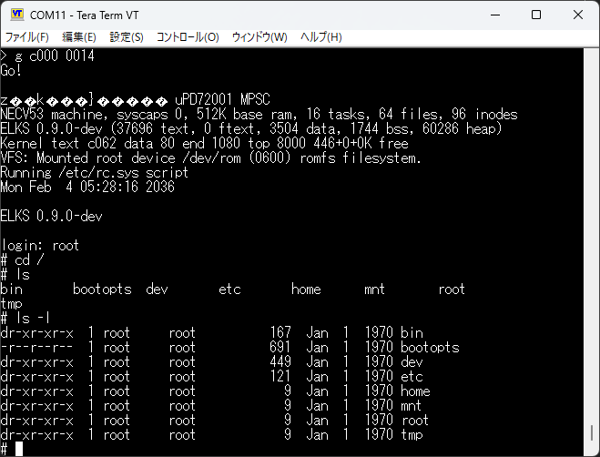
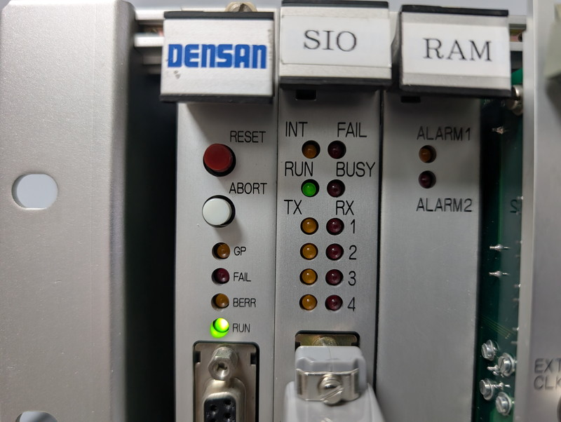

+++
date = '2026-05-23T08:59:29+09:00'
title = 'V53 VMEシステムで遊ぶ #22 SIOボードでELKSを動かす'
slug = 'v53-vme-system-22-sio-elks-1'
tags = ["V53", "DVE-V53", "VME", "uPD72001", "ELKS"]
categories = ["Retro Computing"]
image = 'v53-vme-system-sio-elks-login1.png'
+++

[前回](/2026/05/v53-vme-system-21-sio-interrupt.html)は、V53搭載のSIO VMEボードで割り込み機能の確認をおこないました。今回は8086系の組み込み向けLinuxである[ELKS](https://github.com/ghaerr/elks)をこのSIO VMEボードで動かしてみます。

## ELKSの移植方針

[V53 CPUボードにELKSを移植した時](/2026/03/v53-vme-system-15-elks-2.html)のコードを使用してこのSIOボードで動作するようにします。V53 CPUやメモリマップはほぼ同じですが、割り込みの方式とシリアル機能が大きく異なるため、この部分をさらに修正することになります。前回同様にほとんどの機能を削って最低限の状態でELKSが起動することを目指します。

## ELKSのコンフィグレーション

ELKSのコンフィグレーションはmake menuconfigで行うことができますが、V53 CPUボードでの設定をそのまま使用しました。

## メモリマップの定義

メモリマップは以下のようにしました。

|Area|Address|Size|Type|ファイル名|機能|
|:---|:---|:---|:---|:---|:---|
|RAM|00000-7FFFF|512KB|RAM|-|ベクタ,スタック,ヒープ,アプリケーション|
|ELKS ROMFS|80000-9FFFF|128KB|RAM|romfs.hex|ルートファイルシステム|
|空き|A0000-BFFFF|128KB|RAM|-| |
|ELKS KERNEL|C0000-CFFFF|64KB| RAM|image.hex|ELKSカーネル本体(実行アドレス C000:0014)|
|空き|D0000-DFFFF|64KB|RAM|-| |
|ROM MONITOR|E0000-FFFFF|128KB|ROM|-|ROMモニタ(ロード,ダンプ,実行)|

今回はELKSのロードと実行はROMモニタで行いますが、最終的にはROMベースにして電源投入と同時にELKSが起動することを目指します。今回はまずはRAM上で動作を確認します。

## コードの主な修正点

V53 CPUボードとSIOボードのハードウェアの違いを吸収するために新しいブランチ[v53-rom-sio](https://github.com/kanpapa/elks/tree/v53-rom-sio)を作成し以下の修正を行いました。開発中のため非常に暫定的な実装となっている点はご容赦ください。

### V53 CPUの設定

CPUボードではファームウェアもなくドキュメントも全く無いため手探りでV53 CPUの設定を行いましたが、SIOボードではファームウェアで使用されていた設定に従っています。  
異なる点としてはCPUボードでは8bit I/Oバウンダリとしていましたが、SIOボードでは16ビット I/Oバウンダリとなっています。またV53 CPU内蔵のペリフェラルはICUとTCUしか使用していません。SCUのシリアル信号は外部に引き出されておらず使えないようです。

* [elks/arch/i86/boot/setup.S](https://github.com/kanpapa/elks/blob/v53-rom-sio/elks/arch/i86/boot/setup.S)

### 割り込み処理の設定

V53 CPUボードではV53 ICUをマスタとして、μPD71059 PPIがスレーブとなるカスケード接続になっていましたが、このSIOボードではICUのスレーブとしてuPD72001 MPSCが接続されています。  
ELKSでは仮想的に使用するIRQ番号と実際の割り込みベクタの対応を定義する必要がありますが、今回はシンプルになるように設定しました。MPSCは1つめのAチャネルのみ実装しており、その他のチャネルはまだ未実装です。

|IRQ番号|ベクタ番号|IVT物理アドレス|デバイス|
|:--|:--|:--|:--|
|0|0x20|0x0080|V53 TCU TOUT0（100Hz）|
|1|0x21|0x0084|未接続|
|2|0x22|0x0088|未接続|
|3|0x23|0x008C|V53 TCU TOUT1（未設定）|
|4|0x24|0x0090|カスケード（スレーブMPSC#1）|
|5|0x25|0x0094|カスケード（スレーブMPSC#2）|
|6|0x26|0x0098|V53 TCU TOUT2（未設定）|
|7|0x27|0x009C|未接続|
|8|0x28|0x00A0|MPSC#1 ch.B（未設定）|
|9|0x29|0x00A4|MPSC#1 ch.B（未設定）|
|10|0x2a|0x00A8|MPSC#1 ch.B（未設定）|
|11|0x2b|0x00AC|MPSC#1 ch.B（未設定）|
|12|0x2c|0x00B0|MPSC#1 ch.A（未設定）|
|13|0x2d|0x00B4|MPSC#1 ch.A（未設定）|
|14|0x2e|0x00B8|BBSC#1 ch.A 受信割り込み|
|15|0x2f|0x00BC|MPSC#1 ch.A（未設定）|

* [elks/arch/i86/kernel/irq.c](https://github.com/kanpapa/elks/blob/v53-rom-sio/elks/arch/i86/kernel/irq.c)
* [elks/arch/i86/kernel/irqtab.S](https://github.com/kanpapa/elks/blob/v53-rom-sio/elks/arch/i86/kernel/irqtab.S)
* [elks/arch/i86/kernel/irq-necv53.c](https://github.com/kanpapa/elks/blob/v53-rom-sio/elks/arch/i86/kernel/irq-necv53.c)

### シリアルコンソールの実装

V53 SCUのシリアルポートが外部に引き出されていれば変更は必要なかったのですが、SIOボードでは残念ながらシリアルポートはMPSCのシリアルポートしかありません。このためMPSC用にシリアルコンソールドライバが必要となります。
MPSCは高機能なデバイスのため、初期設定がやや難解なのですが、前回のモニタで実装したコードを流用してシリアルコンソールドライバを作成しました。

* [elks/arch/i86/drivers/char/console-serial-upd72001.c](https://github.com/kanpapa/elks/blob/v53-rom-sio/elks/arch/i86/drivers/char/console-serial-upd72001.c)
* [elks/arch/i86/boot/crt0.S](https://github.com/kanpapa/elks/blob/v53-rom-sio/elks/arch/i86/boot/crt0.S)
* [elks/arch/i86/drivers/char/conio-necv53.c](https://github.com/kanpapa/elks/blob/v53-rom-sio/elks/arch/i86/drivers/char/conio-necv53.c)

### タイマー割り込み

V53 CPUボードではV53 SCUにスレーブ接続されたμPD71059 PPIにタイマーが接続されていました。SIOボードではタイマーがV53 SCUに接続されていますので、V53 SCUでタイマー割り込みを行います。  
すでに[SIOボード用RAMモニタでタイマー割り込みを実装](/2026/05/v53-vme-system-21-sio-interrupt.html)をしていますのでこのコードを流用します。

* [elks/arch/i86/kernel/timer-necv53.c](https://github.com/kanpapa/elks/blob/v53-rom-sio/elks/arch/i86/kernel/timer-necv53.c)

## 動作確認

SIOボード用の修正を反映してビルドが通るようになり、カーネルとROMFSが生成できました。

ELKSを起動するには生成されたバイナリを[ツールでHEXファイルに変換](https://github.com/kanpapa/elks/blob/v53-rom-sio/image2hex.sh)したものをROMモニタでロードして実行します。

```
**  V53 ROM MONITOR for DVE-554 v0.1 2026-04-05  **
> l c000                ←カーネル(image.hex)をC000:0000からロード
Load HEX...C000:0
....................................
....
OK> 
> l 8000
Load HEX...8000:0       ←ROMディスク(romfs.hex)を8000:0000からロード
....................................
....
OK> 
> g c000 0014           ←カーネルの実行
Go
```

ELKSが起動すると以下のような画面になります。起動時に若干文字化けが発生していますが、これは次の機会に調査します。

```
> g c000 0014
Go!

ELKS Setup INT f002 STARTz  k   }      uPD72001 MPSC
NECV53 machine, syscaps 0, 512K base ram, 16 tasks, 64 files, 96 inodes
ELKS 0.9.0-dev (37696 text, 0 ftext, 3504 data, 1744 bss, 60286 heap)
Kernel text c062 data 80 end 1080 top 8000 446+0+0K free
VFS: Mounted root device /dev/rom (0600) romfs filesystem.
Running /etc/rc.sys script
Mon Feb  4 05:28:16 2036

ELKS 0.9.0-dev

login: 
```
見慣れたlogin:プロンプトにrootと入力してログインするとシェルが使える状態になりました。



## まとめ

SIOボードでは128KB ROMの設定しかできないようです。もともとはシリアル通信ボードですからファームウェアを格納するメモリ空間としては128KBで十分と思われるのですが、ELKSではかなりギリギリの容量です。次のステップとして、何とかこの128KBのROMにELKSカーネルとROMFSを詰め込み、シリアルドライバで4ポート対応を行ってみます。まだまだ楽しめそうです。

なお、ELKS稼働中のV53 SIOボードをみるとRUNのLEDが非常に薄く点灯しています。ELKS稼働中はCPUが忙しく動いているようです。


