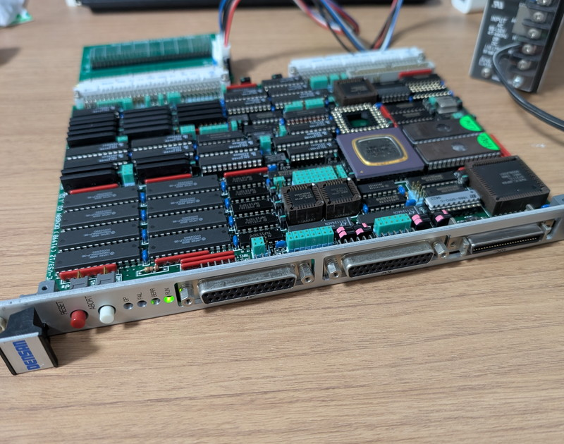
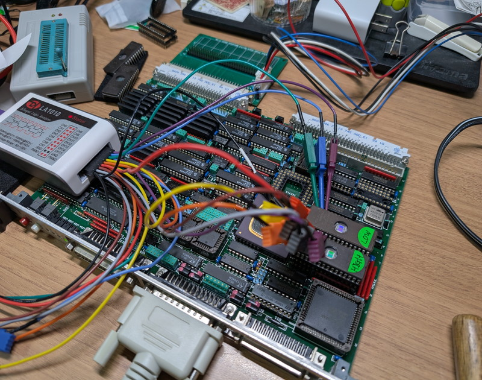
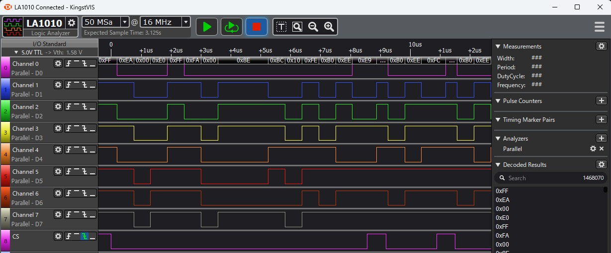
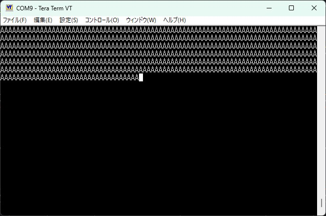
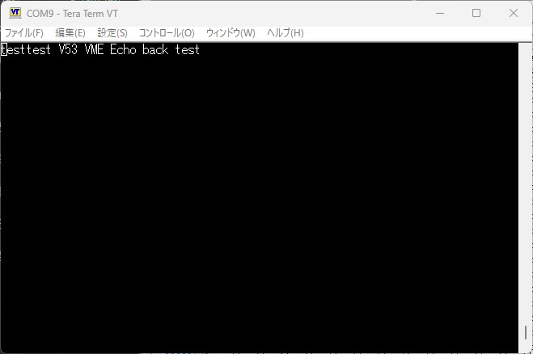
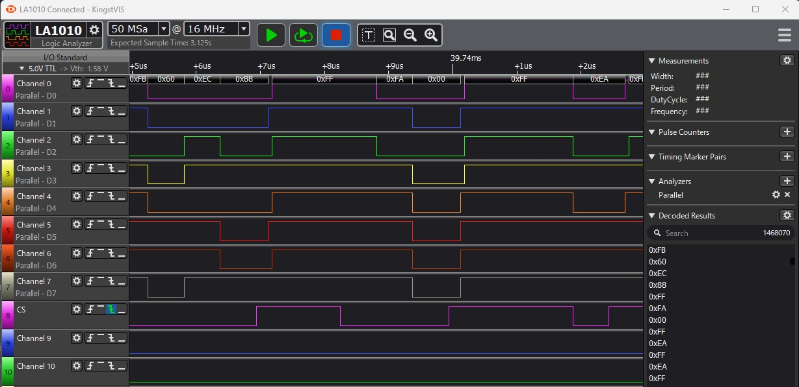

+++
date = '2026-01-12T08:26:41+09:00'
title = 'V53 VMEシステムで遊んでみました #3 Hello world'
slug = 'v53-vme-system-3'
tags = ["V53", "DVE-V53", "VME"]
categories = ["Retro Computing"]
image = 'v53-vme-system-3-rom-probe.jpg'
+++

[前回](/2026/01/v53-vme-system-2.html)はVMEラックから取り外したV53 CPUボードの構成からある程度の機能を推測しましたが、今回は実際にCPUボードを動かしてみます。V53には内蔵ペリフェラルでシリアル入出力機能をもっているので、Hello worldとしてシリアル出力に挑戦します。

## CPUボードの電源投入

最初にV53 CPUボードに電源を供給しなければなりません。そこで以前製作した[VMEバス用電源供給基板](https://kanpapa.com/2023/08/68000-vme-board2.html)を使用します。VMEバスですので電源を接続するコネクタのピンは標準化されていますので安心です。

電源をいれたところVMEラックに搭載されていたときと同じLEDが点灯しました。ここまでは問題なさそうです。



## 動作確認プログラムの作成

次に簡単な動作確認用のプログラムをROMに焼いてCPUボードに取り付けてみます。Hello worldとして一番最初に作成するのはV53のSCUを使用してシリアル出力を行うプログラムです。

開発環境はWSL2上に[Nasm](https://www.nasm.us/)をインストールし、VSCodeでコーディングし、VSCodeのターミナルでアセンブルやROM用のバイナリの作成を行ったのちに、Windows環境のROMライターで書き込める環境としました。

8086のメモリマップを踏まえ、オンボードで1MBのSRAMを搭載し、32ピンのROM用ソケットが2つなので、27C010を2個使用して256KBを割り当てていたと考え、メモリマップは以下のように想定しました。

|アドレス| 種別 | 機能・概要 | 備考 |
| :--- | :--- | :--- | :--- |
|FFFFF|ROM|End of memory|メモリ領域の終端|
|FFFF0|ROM|Start address|リセット時にCPUはここから命令を実行する|
|E0000-FFFEF|ROM|Boot strap area|ここに起動するプログラムを置く|
|00400-DFFFF|RAM|User area|ユーザ領域|
|00000-003FF|RAM|Vector|V53が使用する割り込みベクタテーブル|

久しぶりの8086アセンブラなのでひな形はGeminiに手伝ってもらい、アセンブル後ROMに書き込みました。ROMをCPUボードに取り付けて電源をいれましたが、残念ながら何も反応がありませんでした。

## ロジアナで動作確認

ここで登場するのがロジアナです。以前[68K VMEボードの解析](/2023/09/68000-vme-board5.html)の時に役立った16chデジアナを接続します。今回はROMのプログラムが動きはじめているかの確認をします。



まず気になっているのは２個のROMの取り付け位置が正しいかという点です。１個は偶数バイト、１個は奇数バイトのROMを取り付ける必要があります。ここが入れ替わっていたら当然動きません。

ROMソケットに1Wという書き込みがあり多分偶数バイトではないかと思われるROMのD0-D7とCEにデジアナを接続してデータを観測します。



ROMのCS信号がアクティブになった直後に見えるデータは`EA`です。これはV53 CPUがFFFF0番地に書かれている`JMP`命令を実行しようとしていることを示します。コードでは以下の部分になります。

```
FFFF0 EA000000E0    jmp 0xE000:0000   ; Far Jump to start of ROM
```
その後、偶数アドレスの内容である`00`と`E0`が見えています。その後は、E0000に書かれているプログラムの先頭の命令`FA`を読み込んでいます。
```
E0000 FA         cli             ; 割り込み禁止
E0001 B80000     mov ax, 0x0000
E0004 8ED8       mov ds, ax
　　：
```
このようにCPUは正しくプログラムを実行していて、ROMの取り付け位置も正しいことが確認できました。

## SCUの初期化ができていない？ 

プログラムの動きとしてはシリアル出力に'A'を書き込み続ける内容なので同じコードの繰り返しになります。ロジアナの観測でもそのように動作しているようにみえます。

しかし、シリアル出力と思われるJ1およびJ2のコネクタには何も信号がでていません。やはりプログラムに問題があると考え、V53のデータブックをよく読みこんだところ、ペリフェラルの初期化にかなり漏れがあることがわかりました。またビット位置の誤りなどもかなりあり、大幅な見直しを行いました。

もう一度アセンブルしてROMに書き込み電源を投入したところ、無事'A'の文字が連続して表示されました。



ここでの収穫はSCUのシリアルポートはJ1コネクタではなくJ2コネクタだったという点です。また38400bpsという高速通信も問題なく行えることもわかりました。

完成したHello worldのソースはGitHubに登録しておきました。
- [hello_world_stackless.asm](https://github.com/kanpapa/VMEbus-V53/blob/main/hello_world/hello_world_stackless.asm)

## シリアル入出力の確認

Hello worldでシリアル出力ができることは確認できました。次にシリアル入力ができるかも確認します。シリアル入力で受信したデータをそのままシリアル出力に渡すプログラムを作成します。いわゆるエコーバックプログラムです。

Hello worldのプログラムをベースに修正後、アセンブルし、ROMに書き込んで電源を投入すると無事エコーバックの動作確認ができました。



作成したプログラムはGitHubに登録しておきました。

- [echo_back_stackless.asm](https://github.com/kanpapa/VMEbus-V53/blob/main/echo_back/echo_back_stackless.asm)

これでシリアルポートから入力と出力ができることが確認できました。

## RAMが使えない？

ここまではRAMやスタックをあえて使わないプログラムを作成してきました。これはそもそもRAMが使えるのか、どこにあるのかがまだ確定していないためです。

今回作成したエコーバックプログラムのシリアル入出力の部分をサブルーチン化しておくと後々モニタを作成するときに便利と思い、想定通りのメモリマップであると仮定して、スタックを使用したエコーバックプログラムを作成しました。

- [echo_back.asm](https://github.com/kanpapa/VMEbus-V53/blob/main/echo_back/echo_back.asm)

これを動かしたところなぜかハングアップしてしまいました。ここで再びロジアナの登場です。データバスに出力される命令コードを確認していくと、ret命令のあとに暴走しているようにみえます。これはスタックが正常に機能していない可能性があります。



## まとめ

今回はV53 CPUボードでシリアル入出力ができることが確認できました。これでモニタを動かせる可能性が開けました。

ただし、新たな課題として想定した場所にメモリが存在しない可能性もでてきました。次回はRAMやスタックを使わずにメモリを探索するプログラムを書いてメモリマップを確定させます。
