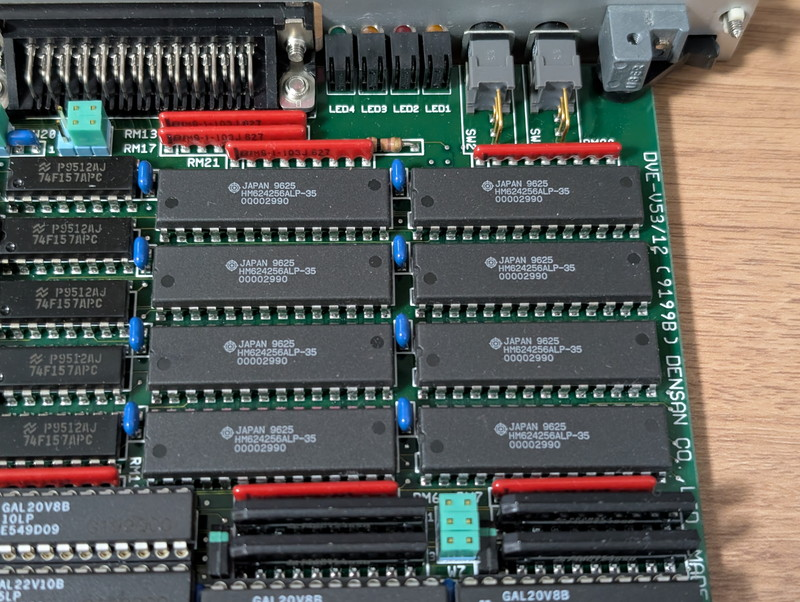
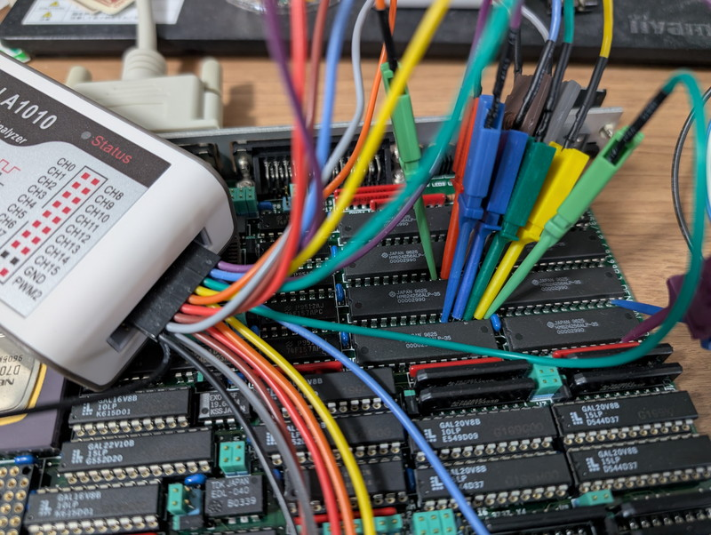
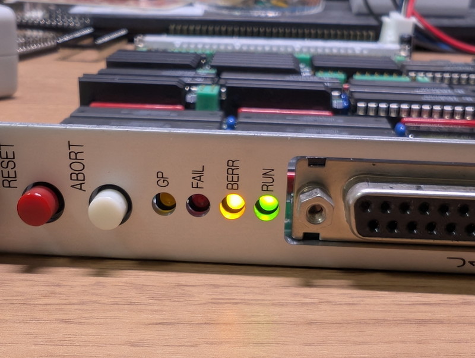

+++
date = '2026-01-13T18:07:37+09:00'
title = 'V53 VMEシステムで遊んでみました #4 オンボードRAMを探す'
slug = 'v53-vme-system-4'
tags = ["V53", "DVE-V53", "VME"]
categories = ["Retro Computing"]
image = 'v53-vme-system-4-onboard-ram.jpg'
+++

[前回](/2026/01/v53-vme-system-3.html)はV53 CPUボードでシリアル入出力ができることが確認できました。これでモニタを動かせる可能性が開けました。ただし、新たにスタックが正常に動作しないのではという課題もでてきました。今回はRAMやスタックを使わずにRAM領域を探索するプログラムを書いてメモリマップを確定させます。

## スタックを使いたい

スタックを使用したプログラムが動きませんでした。以下のようにスタックポインタは0000:1000に設定したのですが、この付近のRAMが使えなかった可能性があります。

```
    mov ax, 0x0000
    mov ds, ax
    mov es, ax
    mov ss, ax
    mov sp, 0x1000
```

通常ですとRAMがあってもおかしくない場所なのですが、VMEシステムで他にもRAMボードがあることから、利用できない領域を設定しているかもしれません。



いずれにしてもCPUボードに実装されているメモリのどこかにスタックを設定してデータの保存やサブルーチンの利用などができないと今後のプログラム開発に支障があります。

## RAMのテストプログラム

E0000-FFFFFまではROMが割り当てられているのはこれまでのHello worldのテストで確認できています。そのため、00000-DFFFFのメモリについて読み書きテストするプログラムを作りました。

プログラムの仕様は以下のようにしました。

1. DSレジスタに0000、SIレジスタに0000をセットする
1. アドレス [DS:SI] に55H(01010101)を書く
1. アドレス [DS:SI] を読みだして55H以外であればそのアドレスと読みだした値をシリアルターミナルに表示する。
1. アドレス [DS:SI] にAAH(10101010)を書く
1. アドレス [DS:SI] を読みだしてAAH以外であればそのアドレスと読みだした値をシリアルターミナルに表示する。
1. SIを1加算する。SIが0000にもどったら、DSに1000Hを加算する。DFFFFまでこれを繰り返す
1. DFFFFまで繰り返したら無限ループしてプログラムを停止する。

スタックやメモリは使わない構造になっているので、Hello worldと同様に動作するはずです。

使用したプログラムはGitHubに登録しておきました。

- [ram_test_stackless.asm](https://github.com/kanpapa/VMEbus-V53/blob/82327427c1b0d350a383f947bef9fb62d4edbf23/ram_test/ram_test_stackless.asm)

## テストプログラムを実行してみる

テストプログラムを実行したところ、すべてのメモリ領域で書き込みが失敗し、読みだした値は00Hとなっていました。



これではスタックが使えないわけです。

## ロジアナでRAMの信号を確認

RAMのデータバスの信号をロジアナで確認してみます。その前に8個あるRAMがどのような接続になっているのかテスターで確認して回路図をおこしました。



このメモリチップは256K×4bitですが、下側の4つと上側の4つがセットとなって16bitバスに対応しているようです。ここではBANK AとBANK Bと名付けました。00000からメモリテストを実行するとどちらかのBANKに信号がでるはずですが、まずはBANK Aにロジアナのプローブを取り付けました。



この状態でメモリテストプログラムを実行します。



この状態でCSがアクティブになっているので、BANK Aのアドレスは00000-7FFFFだと推測されます。CSとWEがアクティブになり書き込みデータの55HはRAMのバスに届いているようです。しかし、直後の読み出しでOEがアクティブになったときに読み出したデータはFFHになっています。RAMへの読み書きが正しく行われていないように見えます。

## メモリ関係の設定を追加してみる

信号自体は問題なさそうにみえるので、他に何かヒントが無いかとV53ユーザーズマニュアルを確認したところ、メモリ関係で以下のシステムI/O領域がありました。これらについて追加設定をしてみました。

* RFC（リフレッシュ・コントロール・レジスタ）
* WCU（ウェイト・コントロール・ユニット）

RFCはリフレッシュ制御用ですが、リセット直後の値は不定となっていました。DRAMは使用していないのでリフレッシュ禁止設定としました。
WCUはウェイトの設定を行うものですが、リセット直後はすべて7waitとなるようです。今回使用しているオンボードメモリは35nsと高速なので0waitにしました。ROMはリセット値でも問題なくアクセスできていますがとりあえず3waitとしました。

修正したプログラムは以下のようになりました。

- [ram_test_stackless.asm](https://github.com/kanpapa/VMEbus-V53/blob/main/ram_test/ram_test_stackless.asm)

再度実行してみたところメモリテストプログラムの動きに変化がありました。
リセット後しばらく何も表示しないで8000:0000から書き込みエラーとなったのです。



つまり0000:0000から7000:FFFFまではエラーなく書き込めた可能性があります。

ロジアナで確認すると55HとAAHの読み書きができていることが確認できました。



これでオンボードメモリが使えるようになりました。

## 簡易モニタプログラムの動作確認

この状態で以前作成していた簡易モニタをROMに書き込んでリセットしたところ、文字化けはしているもののモニタの機能が使えることを確認しました。



文字列表示時のバグを修正してモニタが動作するようになりました。



電源投入直後にあちこちのセグメントをダンプしてみましたが、それぞれ異なる値になっています。



メモリは正しくアクセスできるようです。ただし8000:0000以降はRAMは割り当てられずにBERRが点灯します。ここから先はVMEバスで使用する領域として設定されているのかもしれません



## 簡易モニタでRAMテストプログラムを動かす

RAM上で動作するメモリテストプログラムを作成してみました。作成したIntel HEXファイルをV53モニタでロードして動かしてみました。

ここでは3000:0000-3000:FFFFまでの64KBをテストしています。



ソースコードはGitHubに置きました。

- [ram_test_mon.asm](https://github.com/kanpapa/VMEbus-V53/blob/main/ram_test/ram_test_mon.asm)


## まとめ
RAMが動かなかったのはV53の初期設定が不足していたのが原因でした。やはり未経験のCPUの場合はユーザーズマニュアルを読み込む必要があることが良くわかりました。  
簡単なモニタプログラムが動くようになったので、今後はROMを焼き直すこともなくなり、プログラムを動かすのが格段に楽になりました。  
このモニタからさらに高機能なモニタをロードしてCPUボードのI/O等を調査していく予定です。