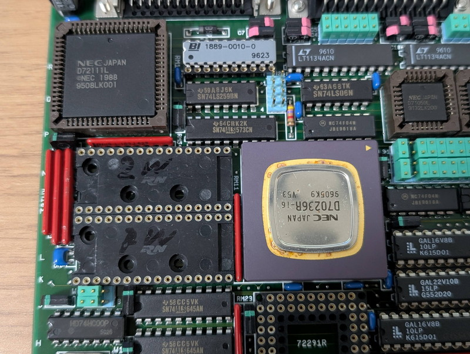

+++
date = '2026-01-18T08:08:43+09:00'
title = 'V53 VMEシステムで遊ぶ #5 モニタの強化'
slug = 'v53-vme-system-5'
tags = ["V53", "DVE-V53", "VME"]
categories = ["Retro Computing"]
image = 'v53-vme-system-5-peripheral.jpg'
+++

[前回](/2026/01/v53-vme-system-4.html)はCPUボードのオンボードRAMを使えるようにしました。今回はROMに実装した簡易モニタにより、I/O空間の探索やメモリの書き換え機能など解析に便利な機能を追加したモニタをメモリにロードして使えるようにします。

## 簡易モニタの機能

現在ROMに書き込んでいる簡易モニタ（v0.1 2026-01-12）は以下の機能を持ちます。

| コマンド名 | 機能 | 使い方 | 実行例 |備考 |
| :--- | :--- | :--- | :--- | :--- |
| Go | 指定したアドレスからプログラムを実行する | G Segment Offset | G 2000 0000 | |
| Dump | 指定したアドレスからメモリの内容を表示する | D Segment Offset | D 2000 0000 | パラメタを省略した場合は次の64バイトを表示 |
| Load | 指定したセグメントのオフセット0000にIntel HEXファイルの内容をロードする | L Segment | L 2000 |パラメタを省略した場合は2000:0000にロード |

このように機能も３つしかなくシンプルなものですが、以下の手順で最低限のプログラムの動作確認ができるものとなっています。

1. メモリにプログラムをロード
1. ロードしたプログラムを実行
1. プログラム実行前後のメモリの状態を確認

モニタのサイズは680バイトと小さくシンプルにすることで確実に動くものにしました。昔のMZ-80のMONITOR SP-1002のようなものです。

ソースはGitHubに置きました。

* [V53簡易モニタ](https://github.com/kanpapa/VMEbus-V53/blob/main/monitor/v53mon.asm)

## モニタに追加したい機能

これまでの実験では、この簡易モニタを使用して基本的な動作確認を行ってきました。しかし、まだまだ不明な点が残っており、このCPUボードにある外部ペリフェラルを使えないか、80000H以降のメモリにアクセスしたい、パネルにあるLEDでLチカしたいなど課題は山積みです。

そのため簡易モニタの機能に以下の機能を追加した強化モニタを作ります。

* I/Oアドレスのアクセス機能
* メモリの書き込み機能

作成した強化モニタは簡易モニタでRAMにロードして使います。これにより今後必要になった機能を容易にモニタに追加して利用できるようにします。

## RAM版モニタの実装

簡易モニタのソースコードをベースに必要となりそうな機能を実装したRAM版モニタを作成しました。以下の機能が追加されています。

| コマンド名 | 機能 | 使い方 | 実行例 |備考 |
| :--- | :--- | :--- | :--- | :--- |
| Input | 指定したI/Oアドレスから入力した値を表示する | I address | I 2000 | |
| Output| 指定したI/Oアドレスに指定した値を出力する | O address value | O 2000 00 | |
| Scan | 指定したI/Oアドレスの範囲でinp命令を実行し取得できた値が0FFH以外の場合にI/Oアドレスと値を表示する | S start end | S 0000 00FF | |
| Write | 指定したアドレスのメモリに値を書き込む | W Segment offset value  | W 3000 0000 44 | |
| Help | コマンドの一覧表示 | ? | | |

RAM版モニタのソースはGitHubに置きました。

* [V53RAMモニタ](https://github.com/kanpapa/VMEbus-V53/blob/main/monitor/v53_ram_mon.asm)

## I/O空間探索の結果

RAM版モニタでI/Oの探索を行った結果は以下の通りです。



これをみると00XXHに反応がありました。1260H-1263Hは私が定義したV53のSCUで、その後はFF00H-FFFFHのV53のI/Oしか見えませんでした。
この結果からみて、外部ペリフェラルは00xxHに集中しており、アドレスの並びから見てCPUボード上にある[４種類のペリフェラルデバイス](/2026/01/v53-vme-system-2.html#cpuボードの外観と機能)に割り当てられているように見えます。

## まとめ

今回作成したRAM版モニタにより外部ペリフェラルのアクセスの目途が立ちました。簡単なデバイスから攻略して最終的にはSCSIデバイスの接続を目指します。まだまだ楽しめそうです。

次の記事：[V53 VMEシステムで遊ぶ #6 USARTを攻略する](/2026/01/v53-vme-system-6.html)