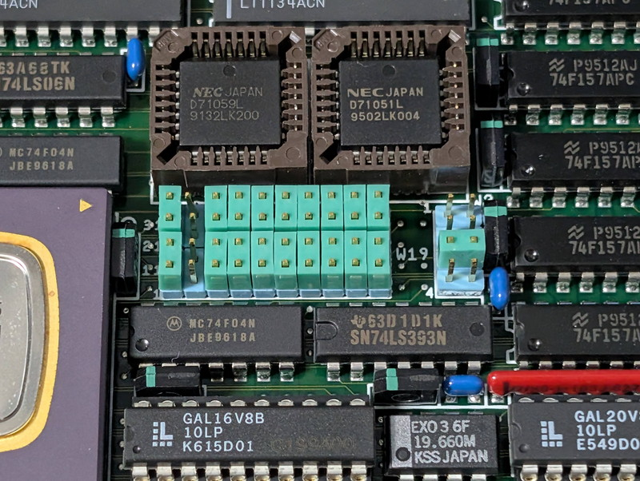
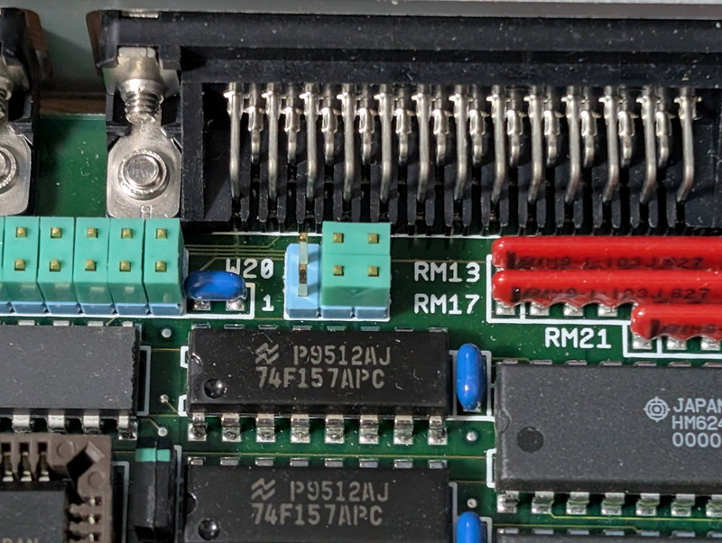
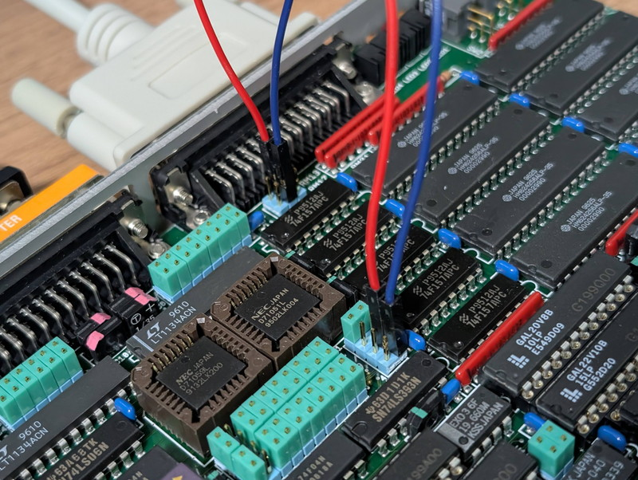
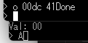
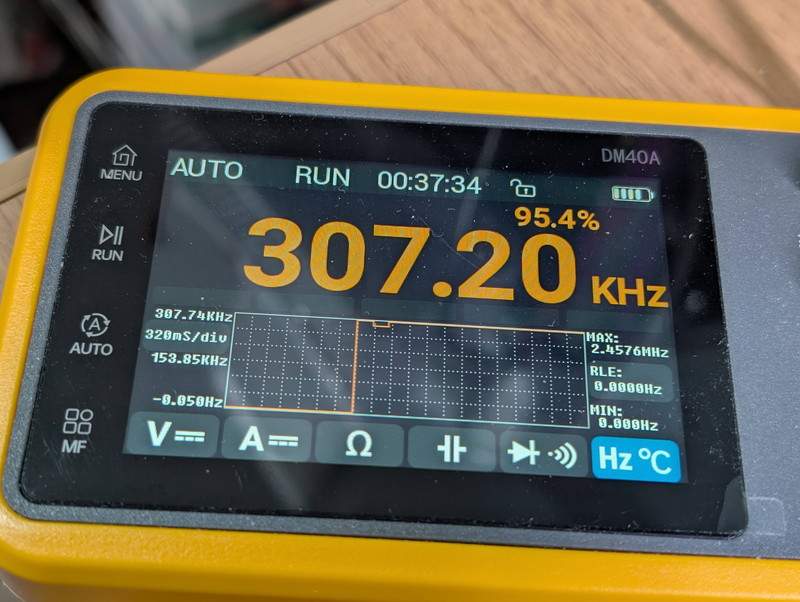

+++
date = '2026-01-23T08:18:55+09:00'
title = 'V53 VMEシステムで遊んでみました #6 USARTを攻略する'
slug = 'v53-vme-system-6'
tags = ["V53", "DVE-V53", "VME"]
categories = ["Retro Computing"]
image = 'v53-vme-system-6-w19-1.jpg'
+++

[前回](/2026/01/v53-vme-system-5.html)はRAM上で動作するモニタにI/O関連のコマンドを追加して、外部ペリフェラルの調査ができるようにしました。今回はI/Oコマンドの結果からペリフェラルにアクセスしてみます。

## I/Oスキャンの結果

モニタに実装したI/Oスキャンの結果は以下のようになりました。毎回この値ではなく少しづつ変化しているようです。

```
> s 0000 ffff
Scanning I/O (Press any key to abort)...
0000: 00
0001: 7B
0002: 42
0003: 00
0004: 00
0005: 00
0006: 00
0007: 80
00C8: 00
00CA: 05
00CC: 00
00CE: 05
00D9: 02
00DB: 02
00DD: 02
00DF: 02
00E2: 00
1260: 66
1261: 84
1262: 84
1263: 87
FF00: AD
FF01: 03
FF02: 44
  :
  :
FFFE: 11
FFFF: 84
```

ただしScanコマンドはIN命令で0xFF以外の値が取れたときに表示しているだけですのでこの結果はあくまでも目安です。

しかし、以下のようにある程度の特徴が見受けられます。

|I/Oアドレス|用途|
|:---|:---|
|0000-00FF|何かのI/Oがつながっていそう|
|1260-1263|V53 SCUに割り当てたI/Oアドレス|
|FF00-FFFF|V53 CPUの制御レジスタ|

ここで着目すべきは0000-00FFのI/O空間になります。

## ペリフェラルが使用するI/Oアドレス

CPUボードに搭載されているペリフェラルは以下の4つです。デバイスが使用するI/Oアドレス数を示します。

|デバイス|IOアドレス数|用途|
|:---|:---|:---|
|μPD71051 (USART)|2|Data, Control/Status|
|μPD71055 (PPI)|4|Port A, B, C, Control|
|μPD71059 (PIC)|2|IRR/ISR/IW1/PCFW/MCW, IMR/IW2/IW3/IW4|
|μPD72111 (SCSI)|8|DF0,DF1,CST,ADR,WIN1,WIN2,TP/DID,IST/CMD|

これらが、0000-00FFのI/O空間のどこかに設定されていると思われます。

## I/Oアドレスの確認

まずは構造が良く分かっていて動作確認が容易なμPD71051 (USART)を探してみます。

しかし、256個のI/Oアドレスを1つずつ確認するのは大変なので以下のように探索しました。

1. μPD71051のCSにロジアナを接続する
1. ロジアナのトリガをCSアクティブにする
1. scanコマンドを実行する。該当するI/OにアクセスしたらCSがアクティブとなりロジアナが反応します。
1. ロジアナの反応をみながらscanコマンドのアドレス範囲を徐々に狭めていきます。
1. ある程度絞れたら、iコマンド、oコマンドで一つずつアクセスし、ロジアナで反応があれば確定です。

この結果、USARTのCSがアクティブになるアドレスは00D8, 00DA, 00DC, 00DEであることが判明しました。
00D8と00DC、00DAと00DEは常に同じ値でイメージと思われたので以下のように推測しました。

|I/Oアドレス|デバイス|機能|
|:---|:---|:---|
|00D8|μPD71051(USART)|データポート|
|00DA|μPD71051(USART)|コマンドポート|
|00DC|μPD71051(USART)|データポートのイメージ|
|00DE|μPD71051(USART)|コマンドポートのイメージ|

これでUSARTのI/Oアドレスは確定しました。

## 手動でUSARTを操作する

モニタのoコマンドでUSARTを設定してみます。以下のように入力しました。

```
> o 00DA 00
> o 00DA 00
> o 00DA 00
> o 00DA 40  ←Reset
> o 00DA 4e  ←Mode: x16
> o 00DA 37  ←Cmd: TxEN/RxEN/RTS/ErrorReset
> i 00DA     ←ステータスの読み取り
Val: 00
```

しかし、ステータスレジスタがTXREADY, RXREADYになることはありませんでした。データレジスタにデータを送っても無反応です。

## USARTに送受信クロックが来ていない

念のためUSARTのピンの信号を確認したところ、CLKには4.915MHzが供給されていましたが、TXCLK, RXCLKに送受信クロックがきていません。

どこかのジャンパー設定の問題かもしれないと、USARTの近くを確認したところ気になる場所がありました。



19.660MHzのEXO3の近くに74LS393があり、その真上に8ピンのジャンパーピンW19があります。このW19に来ている信号を確認したところ以下のようになっていました。


```
              w19
0.3072MHz --> 1  8 --+--> RX/TXCLK(?)
0.6144MHz --> 2  7 --+
1.2288MHz --> 3--6 --+
2.4576MHz --> 4  5 --+
```
どうやら、19.660MHzを74LS393で分周したクロックを選択できるようにしているようです。この信号がそのままUSARTに供給されていれば、RXCLK, TXCLKに信号が見えるはずですが残念ながら見えません。
しかし、この周波数はどう考えてもシリアル通信と密接に関係していると思われます。

|計測周波数(MHz)|計算式 (19.6608MHz ÷ N)|対応ボーレート (÷16)|	
|:---|:---|:---|
|0.3072|1/64分周|19200 bps|
|0.6144|1/32分周|38400 bps|
|1.2288|1/16分周|76800 bps|
|2.4576|1/8分周|153600 bps|

USARTのRXCLKとTXCLKがつながっているジャンパーが無いか探索したところ、6ピンのジャンパW20の2番ピンと5番ピンにつながっているのを発見しました。

```
                USART
                RxCLKへ
             w20  | 
RS232C(?) ---> 6  5--4 <--- どこかのRxCLK(?) 
RS232C(?) ---> 1  2--3 <--- どこかのTxCLK(?)
                  |
                USART
                TxCLKへ
```

しかし、このジャンパーにも送受信用のクロックがきていません。



ここでW19の1番ピンの0.3072MHzをW20の2番ピンと5番ピンに接続することでUSARTのRXCLK/TXCLKに供給してみました。



この状態で先ほどのUSART設定を行ったところ、見事にステータスレジスタがTXREADY/RXREADYになりました。

データポートに0x41を投げたところ、"A"の文字がターミナルに表示されました。USARTのI/Oアドレスは合っており、送受信クロックを与えれば正常に動作することが確認できました。



## V53 TCUでUSART送受信クロックを作成する

これまでの情報をつなぎ合わせると以下のような回路になっているのではと思われます。

* W19で選択したクロックはV53 TCUに供給される。
* V53 TCUで分周されたクロックがW20に供給される。W20はV53 TCUの出力かRS232C外部クロック使用かの切り替えジャンパー
* W20で選択されたクロックがUSARTのRX/TXClockに供給される。

W19で設定されている1.2288MHzがV53 TCLKに接続されていたとして、V53 TCUで1/4分周に設定するとTimer出力は0.3072MHz(19200bps)となります。

この推測を確認するためにV53 TCUのTimer出力を設定するプログラムを作成しました。

* [set_timer.asm](https://github.com/kanpapa/VMEbus-V53/blob/main/set_timer/set_timer.asm)

このプログラムを動作させると、W20に0.3072MHzのクロックが供給され、USARTのRXCLK, TXCLKにも0.3072MHzのクロックが供給されました。



この状態で、ターミナルにシリアル出力ができることも確認しました。

## USARTを攻略

これまでの結果から、V53 TCUの設定とUSARTの初期化コードをRAMモニタに組み込みました。

* [v53_ram_mon.asm](https://github.com/kanpapa/VMEbus-V53/blob/main/monitor/v53_ram_mon.asm)

RAMモニタ起動直後にUSARTのデータポートにデータを書き込むことでJ1シリアルに出力されることを確認しました。

なお、USARTの初期化は時間が必要なようで、各ステップでwaitをいれないと正常に動作しませんでした。mul cxを使ってwaitを入れるテクニックは[8086ファミリハンドブック(CQ出版社 1989年)](https://www.cqpub.co.jp/hanbai/books/31/31651.htm)を参考にしました。

## 終わりに

次のターゲットはuPD71055(PPI)です。PPIには24ポートのGPIOがありますが、PPIの近くに40Pのコネクタがあります。


ここにGPIOが引き出されているのではないかと推測しています。Lチカできるか楽しみです。