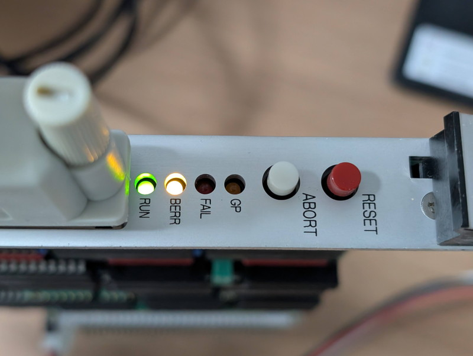

+++
date = '2026-01-29T12:40:27+09:00'
title = 'V53 VMEシステムで遊んでみました #8 NMIでレジスタを表示する'
slug = 'v53-vme-system-8'
tags = ["V53", "DVE-V53", "VME"]
categories = ["Retro Computing"]
image = 'v53-vme-system-8-abort-switch.jpg'
+++

[前回](/2026/01/v53-vme-system-7.html)はCPUボードに実装されているuPD71055(PPI)でLチカを行いました。次のPIC（割り込みコントローラ）の動作確認の前に、割り込みの一つであるNMIを調査します。NMIはNon-maskable interruptでマスクできない割り込みです。CPUボードにはABORTスイッチがあり、多分NMIに接続されていると思われます。

## ABORTスイッチを押してみる

CPUボードのABORTスイッチを押すと次のような状態になります。



このようにBERRが点灯したままハングアップした状態になります。
まだNMIベクタが正しく設定されていないので、適当なアドレスから実行を開始してメモリが無いところをアクセスしてバスエラーになったと考えられます。

## NMIベクタを書き換えてみる

まずはRAMモニタを起動してNMIベクタを確認してみます。NMIベクタは0008h～000Bhです。

```
**  V53 RAM MONITOR v0.5 2026-01-24  **
> d 0000 0000
0000:0000 83 F0 46 F0 46 F0 83 F0 46 F0 46 F0 83 F0 46 F0
0000:0010 46 F0 83 F0 46 F0 46 F0 83 F0 46 F0 46 F0 83 F0
0000:0020 46 F0 46 F0 83 F0 46 F0 46 F0 83 F0 46 F0 46 F0
0000:0030 83 F0 46 F0 46 F0 83 F0 46 F0 46 F0 83 F0 46 F0
>
```

このダンプの結果を例にすると以下のようになります。

* IP: F046
* CS: F046
* NMI発生時の飛び先: F046:F046

この情報は適当な値になっていて意味がありません。モニタのwコマンドでメモリ内容を書き換えてRAMモニタに飛ぶようにNMIベクタを設定してみます。

```
> w 0000 0008 00   ←IP Low
> w 0000 0009 00   ←IP High
> w 0000 000a 00   ←CS Low
> w 0000 000b 20   ←CS High
> d 0000 0000
0000:0000 83 F0 46 F0 46 F0 83 F0 00 00 00 20 83 F0 46 F0
0000:0010 46 F0 83 F0 46 F0 46 F0 83 F0 46 F0 46 F0 83 F0
0000:0020 46 F0 46 F0 83 F0 46 F0 46 F0 83 F0 46 F0 46 F0
0000:0030 83 F0 46 F0 46 F0 83 F0 46 F0 46 F0 83 F0 46 F0
>
```

NMIベクタがRAMモニタのアドレスに設定されました。ここでABORTスイッチを押してみます。

```
>
>
**  V53 RAM MONITOR v0.5 2026-01-24  **
>
```

ABORTスイッチを押すことでNMIが発生し、RAMモニタの再起動が確認できました。


## NMIハンドラをモニタに実装する

プログラム実行中にABORTスイッチを押すと割り込みが発生し、レジスタの情報が表示されるとデバックが楽になりそうです。早速モニタにNMIハンドラを実装してみました。

ソースコードはGitHubに置きました。

* [v53_ram_mon.asm](https://github.com/kanpapa/VMEbus-V53/blob/main/monitor/v53_ram_mon.asm)

RAMモニタ実行中にABORTスイッチを押すと以下のようになりました。

```
>
>
>
*** ABORT (NMI) ***
 AX=0085 BX=200D CX=0000 DX=1261
 Stop at CS:IP = 2000:0348

**  V53 RAM MONITOR v0.6 2026-01-29  **
>
```

表示された情報から以下のようなことが読み取れます。  
中断したアドレスは「文字入力待ちループ」の場所です。また、DXレジスタは1261となっていて、これはSCUのステータスレジスタのI/Oアドレスを指しています。まさにIN命令でステータスレジスタを読み取る入力待ちループで、NMIが発生したことがわかります。

## まとめ

これでABORTスイッチがデバック機能として機能するようになりました。  
ハングアップした場所の確認や現在のレジスタの状態を確認するなど便利に使えそうです。  
NMI割り込みに続いてPICを使った通常の割り込み機能も試していきます。
