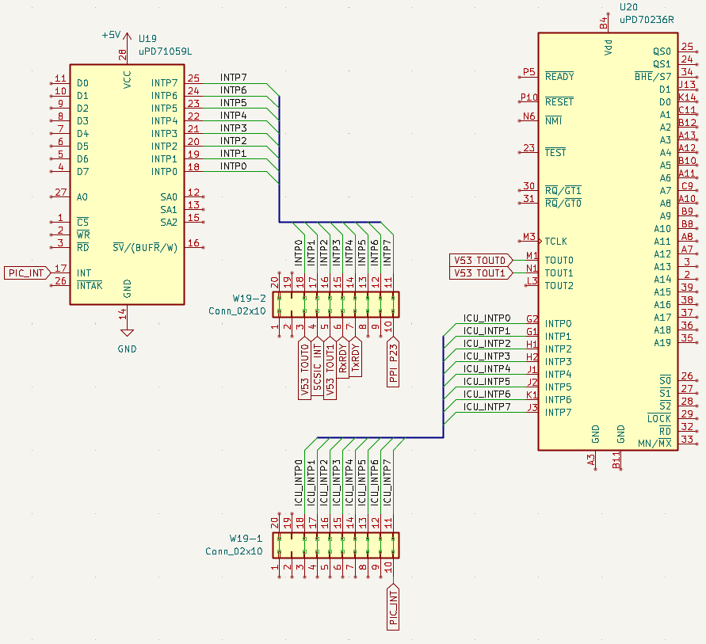

+++
date = '2026-01-31T18:22:29+09:00'
title = 'V53 VMEシステムで遊ぶ #9 割り込みで時を刻む'
slug = 'v53-vme-system-9'
tags = ["V53", "DVE-V53", "VME"]
categories = ["Retro Computing"]
image = 'v53-vme-system-9-int-jumper.jpg'
+++

[前回](/2026/01/v53-vme-system-8.html)はABORTスイッチを押すと発生するNMIでプログラムを中断し、デバック情報が表示されるようにしました。今回はuPD71059(PIC)の割り込みコントローラの仕様を調査します。

## 気になるジャンパーピン

割り込みコントローラーuPD71059(PIC)とV53 CPUの近くに10x4のピンヘッダW19があり、上2段と下2段にわかれてジャンパが取り付けられています。


これが割り込みに関係するのではないかと推測し、このジャンパーを中心にテスターで回路を調べてみました。まずはPICへの割り込み入力信号はジャンパーの最上段に並んでいました。  
上から2列目のラインはペリフェラルデバイスの割り込み出力に接続されていました。  
次の3列目のラインはV53 ICUの割り込み入力に接続されていました。  
最後の4列目のラインは接続先が見つかりませんでした。直結ではなく間にゲートやGALなどがあるのかもしれません。

これらを回路図にまとめると次のようになりました。



着目すべき点はPICの割り込み信号がV53 ICUのINTP7に接続されV53 ICUとPICはカスケード接続になっていることがわかります。つまりPICの割り込みを使う場合はICUでも割り込みの設定が必要になります。

## PIC割り込みを使ってみる

PICのINTP0に接続されているTimer 0を使ってTickを設定してみます。ここでは10msごとに割り込みを発生させて動作確認を行います。

### PICとV53 ICUの初期化

PICの初期化とV53 ICUの初期化を行います。PICのI/Oアドレスは0x00c8、0x00caです。ICUのI/Oアドレスは0x1280を割り当てました。なお、OPSELでICUを有効化する必要もあります。

```
%define PIC_REG0    0x00c8  ; μPD71059 (PIC)	IRR/ISR/IW1/PCFW/MCW	
%define PIC_REG1    0x00cA  ; μPD71059 (PIC)	IMR/IW2/IW3/IW4

    ;------------------------------------------
    ; μPD71059 (PIC) 初期化
    ;------------------------------------------
    mov al, 13h         ; ICW1: Edge, Single, ICW4 needed
    out PIC_REG0, al

    mov al, 20h         ; ICW2: Vector Offset = 20h (INT 32)
    out PIC_REG1, al
                        ; ICW3 is skipped in Single Mode
    mov al, 01h         ; ICW4: 8086 Mode, Normal EOI
    out PIC_REG1, al

    mov al, 0FEh        ; OCW1: Unmask IR0 (Timer) only. (1111 1110)
    out PIC_REG1, al

    ;------------------------------------------
    ; ICUの追加設定
    ;------------------------------------------
    ; 1. 内蔵周辺機能の有効化 (OPSEL)
    ;------------------------------------------
    mov  dx, OPSEL
    in   al, dx
    or   al, 00000010b   ; Bit 1 (ICU) をセット
    out  dx, al

    ;------------------------------------------
    ; 2. レジスタ配置アドレスの設定 (IULA)
    ;------------------------------------------
    mov dx, IULA
    mov al, 0x80    ; 下位アドレス
    out dx, al

    ;------------------------------------------
    ; 3. 割り込みマスクの設定 (Enable INTP7)
    ;------------------------------------------
    mov dx, ICU_REG0
    mov al, 13h     ; ICW1: Edge, Single, ICW4 needed
    out dx, al

    mov dx, ICU_REG1
    mov al, 20h     ; ICW2: Vector Offset = 20h (INT 32)
    out dx, al
                    ; ICW3 is skipped in Single Mode
    mov al, 01h     ; ICW4: 8086 Mode, Normal EOI
    out dx, al

    ; Bit 7 (INTP7) を 0 (許可) にします。
    in  al, dx
    and al, 7Fh     ; 0111 1111 (Bit 7をクリア)
    out dx, al

    ;-------------------------------------------
    ; 割り込み許可
    ;-------------------------------------------
    sti
```

### タイマーの設定

割り込みタイミングであるタイマー0の設定はRAMモニタの初期化で行っていますので、10ms間隔で割り込みがかかるようにTimer 0の分周比を変更します。  
ベースクロックは1.2288MHzですので、これを100Hzにするには1.2288MHz/11288=100Hzとなり、11288を16進数にすると3000hとなります。これをV53 SCU Timer 0に設定します。

```
    ;------------------------------------------
    ; 4. カウンタ値 (分周比) のロード
    ;------------------------------------------
    ; Timer 0 (INTP0) 100Hz
    mov  dx, TM0_CNT
    mov  al, 0
    out  dx, al
    mov  al, 0x30
    out  dx, al
```

これで100Hzの信号がTimer 0から出力されます。テスターで100Hzの信号がPICのINTP0に来ていることを確認しました。

### 割り込みハンドラの実装

割り込みハンドラは割り込みが行われたときに実行されるプログラムになります。今回はシンプルにUSARTポートにドットを出力するようにしました。モニタコンソールとは別なのでこのようなデバックに便利です。ソースコードは以下になりました。これをRAMモニタのソースに加えます。

```
;==========================================================
; Tick Handler
;==========================================================
_tick_handler:
    push ax
    push dx

    ; シリアルポートに'.'を出力
    mov al, '.'          ; debug char
    out USART_DATA, al   ; USARTのDataポートに出力

    ; --- EOI (End of Interrupt) to PIC ---
    mov al, 20h     ; Non-specific EOI

    ; 外部PIC (Slave) の割り込み完了
    out PIC_REG0, al

    ; V53内蔵ICU (Master) の割り込み完了
    mov dx, ICU_REG0 
    out dx, al

    pop dx
    pop ax
    iret
```

### 割り込みベクタの実装

割り込みベクタテーブルの設定を行います。最終的にICUに割り込みがかかるのでICUのINTP7に対応する割り込みベクタにTickハンドラのアドレスを設定します。このあたりの設定方法はNMIと同じです。INTP7はベクタ27になるので、テーブルは009chからの4バイトになります。

```
; Tick用割り込みベクタテーブル (Vector 27h = V53 INTP7)
; 0x27 * 4 = 9Ch
mov  di, 0x009c      ; Vector 27h Address offset
mov  ax, _tick_handler ; ハンドラのアドレス (IP)
stosw                ; [0000:009c] = AX
mov  ax, cs          ; 現在のCS
stosw                ; [0000:009e] = CS
```

これらの変更をRAMモニタのソースに加えてアセンブルし、RAMモニタを実行したところ、USARTシリアルにドットを出力しながら、モニタコマンドが問題なく使えることが確認しました。



## Timerコマンドを実装する

割り込みの確認テスト用としてドットの文字をシリアルに出力するだけでしたが、今後実用的に使えるように32bitのTickカウンタをカウントアップする機能を割り込みハンドラに実装しました。

```
;==========================================================
; Tick Handler
;==========================================================
_tick_handler:
    push ax
    push dx

    ; CS (コードセグメント) と DS (データセグメント) を合わせる
    ; (Tiny Model的な動作のため)
    mov ax, cs
    mov ds, ax

    ; --- 32bit カウンタのインクリメント ---
    inc word [tick_counter_lo]
    jnz .skip_carry
    inc word [tick_counter_hi]
.skip_carry:

    ; --- EOI (End of Interrupt) to PIC ---
    mov al, 20h     ; Non-specific EOI

    ; 外部PIC (Slave) の割り込み完了
    out PIC_REG0, al

    ; V53内蔵ICU (Master) の割り込み完了
    mov dx, ICU_REG0 
    out dx, al

    pop dx
    pop ax
    iret
```

またTickの値がわかるようにモニタにTimerコマンドを追加し、指定した時間だけ待つ機能とTickカウンタの表示機能を実装しました。

```
; ==============================================================
; Command: Timer (ms)
;   T          -> Show current tick counter (32-bit HEX)
;   T <val>    -> Wait for <val> ticks (10ms unit)
; ==============================================================
do_timer:
    call getc_echo      ; コマンド('T')の次の文字を取得
    cmp al, 0x0D        ; Enterキー(CR)なら表示モードへ
    je .show_counter
    cmp al, ' '         ; スペースならWaitモードへ
    jne error           ; それ以外はエラー

    ; --- Wait Mode (引数あり: T 0064 等) ---
    call get_hex_word   ; AX = 待ち時間 (0064h = 1秒)

    ; 開始時刻を保存 (Start Time)
    mov bx, [tick_counter_lo]

.wait_loop:
    ; 1. 現在時刻を取得
    mov cx, [tick_counter_lo]
    
    ; 2. 経過時間を計算 (Current - Start)
    ; オーバーフローしても、この引き算の結果は正しい経過時間になる
    sub cx, bx          
    
    ; 3. 経過時間 < 待ち時間 ならループ継続
    cmp cx, ax
    jb .wait_loop       ; Jump if Below (unsigned compare)

    ; 指定時間経過した
    mov si, msg_done
    call puts
    jmp monitor_loop

.show_counter:
    ; --- Show Counter Mode (引数なし: Tのみ) ---
    call putc_crlf
    
    mov si, msg_tick    ; "Tick: "
    call puts

    ; 32bitカウンタを [High][Low] の順で表示
    mov ax, [tick_counter_hi]
    call print_hex_word
    mov ax, [tick_counter_lo]
    call print_hex_word
    
    call putc_crlf
    jmp monitor_loop

; 変数領域
tick_counter_lo: dw 0x0000  ; Tick: 下位16bit
tick_counter_hi: dw 0x0000  ; Tick: 上位16bit
```

Timerコマンドの実行結果は以下のようになります。Tick変数が増加しているのが確認できます。また指定した時間を経過するとDoneが表示されました。

```
**  V53 RAM MONITOR v0.7 2026-01-31  **
> t
Tick: 000000EB
> t
Tick: 000001D7
> t
Tick: 000002FD
> t 0064 Done　　←1秒後(0064h: 100x10ms)にDoneが表示されます。
> t 1770 Done　　←1分後(1770h: 6000x10ms)にDoneが表示されます。
>
```

## まとめ

今回はPICとICUを使ってタイマー割り込みでTickカウンタのシンプルな実装を行いました。  
次回はまだ用途がわかっていないV53 ICU割り込みを探ります。たぶんVMEバスのIRQと関連していると思われますが、それを確認できるように割り込みハンドラを実装していきます。  
また、現在のPICの割り込みハンドラはTimer 0の機能しか処理できません。これを他の割り込み入力にも対応する必要があります。まだまだ割り込みは奥が深いので楽しみです。

次の記事：[V53 VMEシステムで遊ぶ #10 割り込みを攻略する](/2026/02/v53-vme-system-10.html)