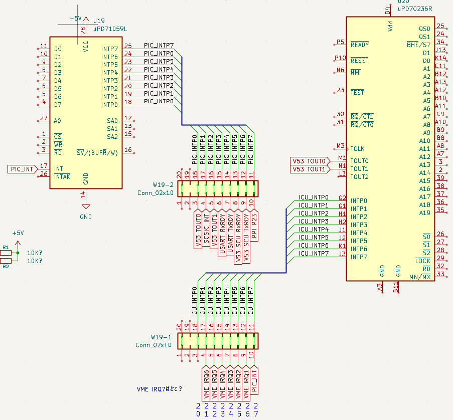

+++
date = '2026-01-31T18:22:29+09:00'
title = 'V53 VMEシステムで遊んでみました #9 割り込みで時を刻む'
slug = 'v53-vme-system-9'
tags = ["V53", "DVE-V53", "VME"]
categories = ["Retro Computing"]
image = 'v53-vme-system-9.jpg'
draft = true
+++

[前回](/2026/01/v53-vme-system-8.html)はABORTスイッチを押すと発生するNMIでプログラムを中断し、デバック情報が表示されるようにしました。今回はV53のICUおよびuPD71059(PIC)の割り込みコントローラの仕様を調査します。VMEバスにあるIRQ1-7との関連も解明します。

## 気になるジャンパーピン

ペリフェラルの割り込みコントローラーuPD71059(PIC)とV53 CPUの近くに10x4のピンヘッダがあり、上2段と下2段にわかれてジャンパが取り付けられています。


これが割り込みに関係するのではないかと推測し、このジャンパーを中心にテスターで回路を調べてみました。まずはPICへの割り込み入力信号はジャンパーの最上段に並んでいました。
上から2列目のラインはペリフェラルデバイスの割り込み出力に接続されていました。
次の3列目のラインはV53の割り込み入力に接続されていました。
最後の4列目のラインは接続先が見つかりませんでした。直結ではなく間にゲートやGALなどがあるのかもしれません。

これらを回路図にまとめると次のようになりました。


着目すべき点はPICの割り込み信号がV53 ICUのINTP7に接続されていることです。V53 ICUとPICはカスケード接続になっていることがわかります。PICの割り込みを使う場合はICUでも割り込みの設定が必要になります。

## PIC割り込みを使ってみる

タイマー0で割り込みをかけてみます。タイマー0の設定はモニタの初期化のところで行っていますので、10ms間隔で割り込みがかかるようにTimer 0の分周比を変更します。

```
```

これで100Hzの信号がTimer 0から出力されます。テスターで100Hzの信号がPICのINTP0に来ていることを確認しました。

USARTシリアルにドットを出力しながら、モニタコマンドが問題なく使えることが確認しました。



## Timerコマンドを実装する

ドット出力をカウンタ加算に変更

モニタにTimerコマンドをつけてwait機能とTick表示機能を追加しました。

```
**  V53 RAM MONITOR v0.7 2026-01-31  **
> t
Tick: 000000EB
> t
Tick: 000001D7
> t
Tick: 000002FD
> t 0064 Done　　←1秒後(0064h: 100x10ms)にDoneが表示されます。
> t 1770 Done　　←1分後(1770h: 6000x10ms)にDoneが表示されます。
>
```

## SCUの割り込みが確認できるようにする

SCU用のベクタの設定と対応するハンドラの実装

## PICの割り込みが確認できるようにする

PICのディスパッチャの実装

## その他の割り込みが確認できるようにする

未定義ベクタの設定後にNMI、SCUとPICのベクタを上書きする

未定義ベクタの表示ハンドラの実装

## VME IRQ信号の確認

VME IRQをGNDにつないでみる。

VME IRQ7が見つからないので、PICのマスクをすべて外したところ、モニタでキー入力をするたびに割り込みがかかることを発見。

結局、VME IRQ7は見つからなかった。

## 割り込み周辺回路と割り込みマップ

以下のように回路図が確定しました。



表にすると以下のようになります。

uPD71059(PIC)
|PIC割り込み入力(W19 31)|接続先(W19 21)|
|:---|:---|
|INTP0|V53 TCU Timer0|
|INTP1|SCSIC INT|
|INTP2|V53 TCU Timer1|
|INTP3|USART RxREADY|
|INTP4|USART TxREADY|
|INTP5|V53 SCU RxREADY|
|INTP6|V53 SCU TxREADY|
|INTP7|PPI|

V53 ICU
|ICU割り込み入力(W19 11)|接続先(W19 01)|
|:---|:---|
|INTP0|不明|
|INTP1|VMEバス IRQ6|
|INTP2|VMEバス IRQ5|
|INTP3|VMEバス IRQ4|
|INTP4|VMEバス IRQ3|
|INTP5|VMEバス IRQ2|
|INTP6|VMEバス IRQ1|
|INTP7|PIC INT出力|

## まとめ

これでSCSICとDMAを除いたCPUボードのハードウェアについてはほぼ解析できたと思われます。今後はCPUボードをVMEラックに取り付けて、VMEシステムとしての動作を確認しながら、必要な機能をモニタに実装していきます。まずはVMEバスの拡張メモリボードを接続してみたいと思います。
