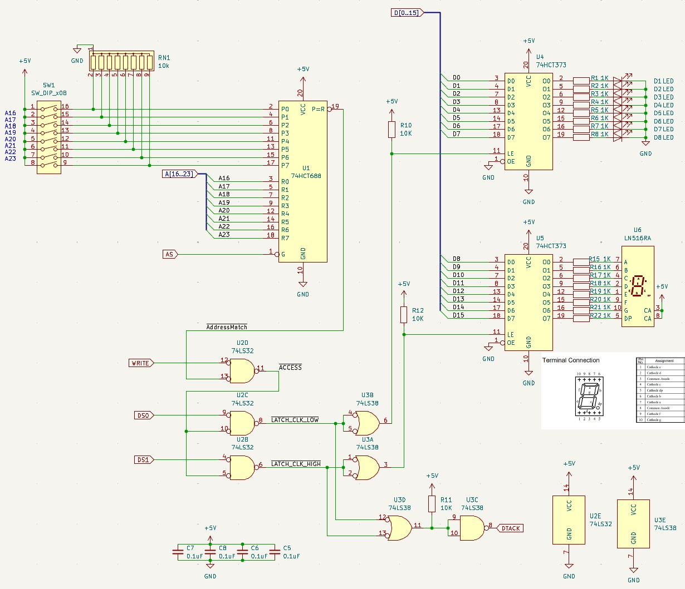
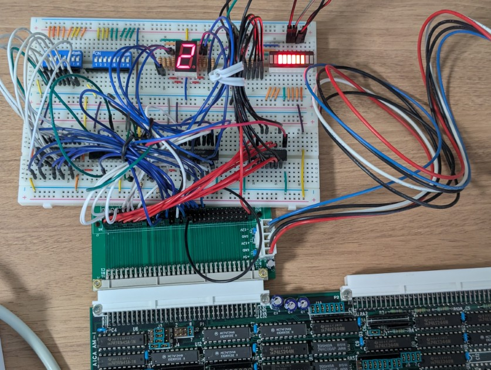
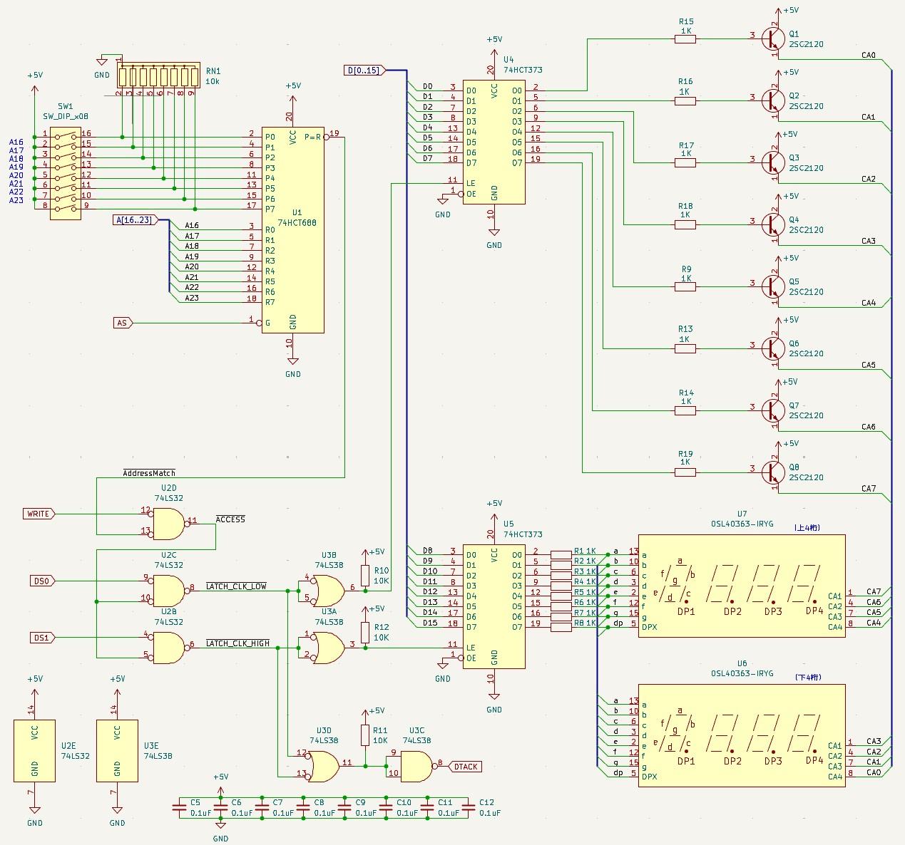
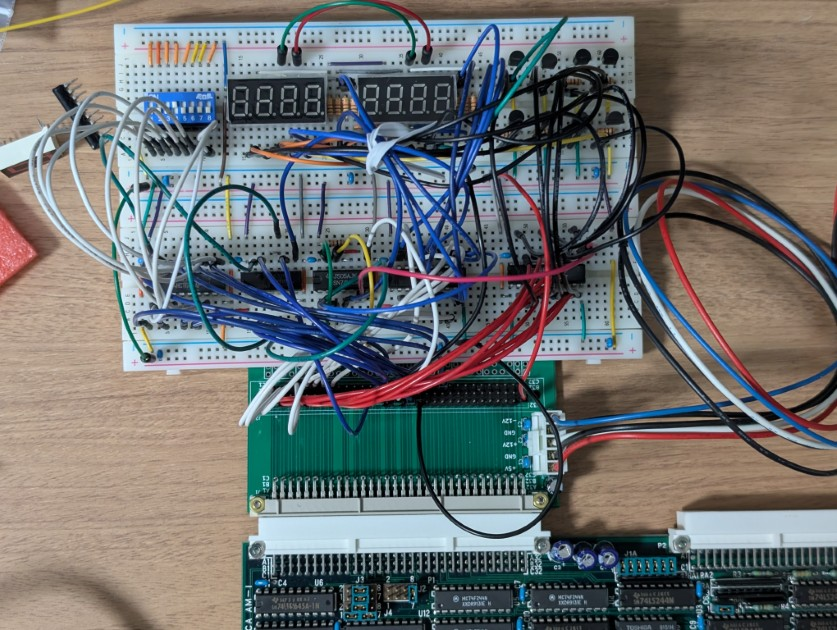

+++
date = '2026-01-01T00:00:00+09:00'
title = '68000 VMEボードで2026年の書き初めをしてみました'
slug = 'vme-68k-newyear2026'
image = 'vme-68k-newyear2026.jpg'
tags = ["68000", "Dvmecpu2", "VME", "書き初め"]
categories = ["Retro Computing"]
+++

あけましておめでとうございます。

去年は[COSMAC TOY V2で2025年の書き初めをしてみました](https://kanpapa.com/2025/01/cosmac-toy-v2-pov-newyear2025.html)が、今年は[68000 VMEボード](https://kanpapa.com/2023/08/68000-vme-board1.html)で書き初めをしましたので、これを新年のご挨拶とさせていただきます。

## VMEバスにLEDを接続する

手元にある68000 VMEボードはターミナルを接続してモニタやBASICが動くようにしています。しかし、それ以外に何も出力装置が無いため、デバック用のLEDがあるといいなと思っていました。
そこで、VMEバスに自作のI/Oを接続している事例が無いかと探したところ次の記事を見つけました。

* [Reverse engineering a 68K VMEbus system](https://justanotherelectronicsblog.com/?p=876) (Just another electronics blog)

私と同じように68000 VMEボードを動かして楽しんでいるようで、VMEバスにLEDを接続して動作させていました。

### ハードウェアの製作

早速このブログに掲載されているLED表示回路を参考にして製作してみました。記事の回路に近いものを手持ちのパーツで製作してみたのですが、私のVMEボードでは正しく動きませんでした。  
調査したところ手持ちのロジックICが74HCシリーズであり、VMEバスのTTLレベルの信号を扱うと不安定な動きをすることがわかりました。またこの回路はWORDアクセス専用と割り切って設計されている点も気になりました。  
そこで手持ちの74HCTシリーズや74LSシリーズに置き換え、BYTEアクセスにも対応するように回路を改良してみました。



この回路をブレッドボードで製作しました。VMEバスの引き出しは以前製作した[VME電源供給ボード](https://kanpapa.com/2023/08/68000-vme-board2.html)からピンヘッダで引き出してブレッドボードに接続しています。



ブレッドボードにある8PのDIPスイッチでこのLEDを割り当てるメモリアドレスを決めることができます。今回はDIPスイッチの設定を"00010000"として、$100000～$10FFFF番地までの空間をLEDに割り当てました。この状態でzBugモニタを使って$100000番地にデータを書き込むとLEDの表示が変化することが確認できました。試しに$100000番地をダンプすると仕様通りに例外エラーが発生して停止しました。

### ソフトウェアの準備
[Easy68K](http://www.easy68k.com/)でテストプログラムをアセンブルし、生成されたSレコードをzBugでメモリにロードして実行しました。  
テストプログラムは下位バイトをカウントアップしている様子を8個のLEDで2進数で表示し、下位バイトの繰り上がりを上位バイトでカウントし10進数で7セグメントLEDに表示するものです。動作確認のためにWORDアクセス版とBYTEアクセス版の2種類のコードを書きました。

#### WORDアクセスのテストプログラム
```
* =================================================================
* 68000 Assembly: Word Access Write-Only Test
* Target: MC68000 VME Board (Write-Only DTACK Logic)
* =================================================================
    ORG    $1000

START:
    MOVE.L #$100000, A1     ; I/Oアドレス
    
    MOVE.L #0, D0           ; D0: 下位バイト用カウンタ (0-255)
    MOVE.L #0, D1           ; D1: 上位バイト用数字 (0-9)
    MOVE.L #0, D2           ; D2: 書き込み用一時レジスタ

LOOP:
    * -----------------------------------------------------
    * 1. 書き込むデータの作成 (ここがポイント！)
    * -----------------------------------------------------
    
    * 上位バイトの準備: D1(0-9)に対応するパターンをテーブルから引く
    LEA    TABLE_DATA, A2   ; テーブルの先頭アドレス
    MOVE.B 0(A2,D1.W), D2   ; D2の下位8bitに7セグパターンを入れる
    
    LSL.W  #8, D2           ; D2を8ビット左シフト (下位→上位へ移動)
                            ; これで D2 は [7セグパターン][00] になる

    * 下位バイトの準備: D0(カウンタ)を合成
    OR.B   D0, D2           ; D2の下位8bitにD0を混ぜる
                            ; これで D2 は [7セグパターン][2進数LED] になる

    * -----------------------------------------------------
    * 2. ハードウェアへの出力 (ワードアクセス)
    * -----------------------------------------------------
    MOVE.W D2, (A1)         ; 16ビットまとめてドン！

    * -----------------------------------------------------
    * 3. ウェイト (Easy68Kのマクロを使用)
    * -----------------------------------------------------
    FOR.L D3 = #1 TO #10000 BY #1 DO.S
        NOP
        NOP                 ; 時間調整したければNOPを増やす
    ENDF
    
    * -----------------------------------------------------
    * 4. カウントアップ処理
    * -----------------------------------------------------
    ADDQ.B #1, D0           ; 下位(LED)を+1
    CMP.B  #0, D0           ; 0に戻ったか？(255 -> 0 オーバーフロー確認)
    BNE    LOOP             ; 戻ってなければループ継続
    
    * 下位が一周したので、上位(7セグ)を更新
    ADDQ.B #1, D1           ; 数字を+1
    CMP.B  #10, D1          ; 10になったか？
    BNE    LOOP             ; 10未満ならループ継続
    
    MOVE.B #0, D1           ; 10になったら0に戻す
    JMP    LOOP

* --- 定数定義 (7セグメントパターン: アノードコモン) ---
* 0, 1, 2, 3, 4, 5, 6, 7, 8, 9
TABLE_DATA:
    DC.B   $C0, $F9, $A4, $B0, $99, $92, $82, $F8, $80, $90

    END    START        ; last line of source
```

#### BYTEアクセスのテストプログラム
```
* =================================================================
* 68000 Assembly: Byte Access Write-Only Test
* Target: MC68000 VME Board (Write-Only DTACK Logic)
* =================================================================

    ORG     $1000           ; プログラム開始アドレス

* --- 定数定義 ---
IO_BASE     EQU $100000      ; ベースアドレス

* --- メイン処理 ---
START:
    MOVE.L  #IO_BASE, A0    ; A0にベースアドレス($80000)をセット
    MOVEQ   #0, D1          ; D1: 7セグ用カウンタ (0-9)

LOOP_MAIN:
    * -----------------------------------------------------
    * 1. 上位バイト (7セグ) だけを書き換える
    * 命令: MOVE.B  Dn, 0(An)
    * 動作: DS1(UDS)のみアサート -> U5(7セグ)のみラッチ
    * -----------------------------------------------------
    LEA     SEG_TABLE, A2   ; テーブルアドレス取得
    MOVE.B  0(A2,D1.W), D2  ; テーブルからパターンをD2にロード(Read)
    
    * 【重要】偶数アドレス(+0)へのバイト書き込み
    MOVE.B  D2, 0(A0)       ; $100000へ書き込み (7セグ更新)


    * -----------------------------------------------------
    * 2. 下位バイト (LED) のループ処理
    * -----------------------------------------------------
    MOVEQ   #0, D0          ; D0: LED用カウンタ (0-255)

LOOP_LEDS:
    * 【重要】奇数アドレス(+1)へのバイト書き込み
    * 命令: MOVE.B  Dn, 1(An)
    * 動作: DS0(LDS)のみアサート -> U4(LED)のみラッチ
    MOVE.B  D0, 1(A0)       ; $100001へ書き込み (LED更新)

    * --- ウェイト処理 ---
    MOVE.L  #$2000, D3      ; カウンタ値 (適宜調整してください)
WAIT:
    SUBQ.L  #1, D3
    BNE.S   WAIT

    * --- カウントアップ (レジスタ内で計算！) ---
    ADDQ.B  #1, D0          ; レジスタD0を+1 (メモリは触らない)
    BNE.S   LOOP_LEDS       ; 0に戻るまでループ

    * -----------------------------------------------------
    * 3. 7セグのカウントアップ処理
    * -----------------------------------------------------
    ADDQ.B  #1, D1          ; D1を+1
    CMP.B   #10, D1         ; 10になったか確認
    BNE.S   LOOP_MAIN       ; 10未満ならループ

    MOVEQ   #0, D1          ; 0にリセット
    BRA.S   LOOP_MAIN       ; 最初に戻る
    
    * --- データテーブル (アノードコモン 0-9) ---
SEG_TABLE:
    DC.B    $C0, $F9, $A4, $B0, $99, $92, $82, $F8, $80, $90

    END    START        ; last line of source
```

プログラムを動かしたときの動画です。想定通りの動きができています。



これで自由にLチカができるようになりました。メモリに書き込むだけで結果がすぐ見えるのでデバック用のツールとしても使えそうです。注意点としては、Write専用なので誤ってReadを行うとDTACKが発生しないので例外エラーとなります。

## ダイナミック点灯で新年"20260101"を表示する

せっかく16ビットのI/Oポートができたので、ダイナミック点灯用の4桁の7セグメントLEDを2個使って8桁の数字を表示できるようにしてみました。

### ダイナミック点灯用ハードウェアの製作
回路図は以下のようになります。D0～D7を使って表示するLEDの桁を指定し、D8～D15を各セグメントの表示箇所の指定を行います。これで8桁の数字が表示できます。



この回路もブレッドボードで製作しました。



### ダイナミック点灯用ソフトウェアの準備
Easy68Kでテストプログラムをアセンブルし、生成されたSレコードをzBugでロードして実行しました。1桁ずつ高速に順番に表示して8桁が表示されているようにしています。

```
* =================================================================
* 8-Digit Display Newyear 20251231-20260101
* =================================================================
    ORG     $1000

IO_BASE     EQU     $100000

* --- 調整用定数 ---
* ダイナミック点灯のウェイト 
WAIT_VAL    EQU     1500    

* 約10秒ぐらいのカウント数
* 表示切替の時間調整はこの値を増減してください。
LOOP_10SEC  EQU     300

* --- 桁選択ビット (U4 / Odd Address) ---
DIGIT_1     EQU     $01
DIGIT_2     EQU     $02
DIGIT_3     EQU     $04
DIGIT_4     EQU     $08
DIGIT_5     EQU     $10
DIGIT_6     EQU     $20
DIGIT_7     EQU     $40
DIGIT_8     EQU     $80
ALL_OFF     EQU     $00

* --- 数字パターン (U5 / Even Address / 0=ON) ---
PAT_0       EQU     $C0     ; "0" (1100 0000)
PAT_1       EQU     $F9     ; "1" (1111 1001)
PAT_2       EQU     $A4     ; "2" (1010 0100)
PAT_3       EQU     $B0     ; "3" (1011 0000)
PAT_5       EQU     $92     ; "5" (1001 0010)
PAT_6       EQU     $82     ; "6" (1000 0010)

* =================================================================
* メイン処理
* =================================================================
START:
    MOVE.L  #IO_BASE, A0

MAIN_LOOP:
    * ------------------------------------------------
    * パターンA: "20251231" を表示
    * ------------------------------------------------
    LEA     DATA_2025, A1   ; 表示データの先頭アドレスをセット
    BSR     DISPLAY_10S     ; 10秒間表示サブルーチンへ

    * ------------------------------------------------
    * パターンB: "20260101" を表示
    * ------------------------------------------------
    LEA     DATA_2026, A1   ; 表示データの先頭アドレスをセット
    BSR     DISPLAY_10S     ; 10秒間表示サブルーチンへ

    BRA     MAIN_LOOP       ; 最初に戻る


* =================================================================
* サブルーチン: 指定されたデータを約10秒間表示し続ける
* 入力: A1 = 表示したいデータ列(8バイト)の先頭アドレス
* =================================================================
DISPLAY_10S:
    MOVE.L  #LOOP_10SEC, D7 ; 10秒カウンタをセット

SCAN_LOOP:
    * --- 1桁目 (左端) ---
    MOVE.B  0(A1), 0(A0)    ; データ(A1+0)を出力
    MOVE.B  #DIGIT_8, 1(A0) ; 8桁目(左端)をON
    BSR     WAIT_SUB
    MOVE.B  #ALL_OFF, 1(A0)

    * --- 2桁目 ---
    MOVE.B  1(A1), 0(A0)
    MOVE.B  #DIGIT_7, 1(A0)
    BSR     WAIT_SUB
    MOVE.B  #ALL_OFF, 1(A0)

    * --- 3桁目 ---
    MOVE.B  2(A1), 0(A0)
    MOVE.B  #DIGIT_6, 1(A0)
    BSR     WAIT_SUB
    MOVE.B  #ALL_OFF, 1(A0)

    * --- 4桁目 ---
    MOVE.B  3(A1), 0(A0)
    MOVE.B  #DIGIT_5, 1(A0)
    BSR     WAIT_SUB
    MOVE.B  #ALL_OFF, 1(A0)

    * --- 5桁目 ---
    MOVE.B  4(A1), 0(A0)
    MOVE.B  #DIGIT_4, 1(A0)
    BSR     WAIT_SUB
    MOVE.B  #ALL_OFF, 1(A0)

    * --- 6桁目 ---
    MOVE.B  5(A1), 0(A0)
    MOVE.B  #DIGIT_3, 1(A0)
    BSR     WAIT_SUB
    MOVE.B  #ALL_OFF, 1(A0)

    * --- 7桁目 ---
    MOVE.B  6(A1), 0(A0)
    MOVE.B  #DIGIT_2, 1(A0)
    BSR     WAIT_SUB
    MOVE.B  #ALL_OFF, 1(A0)

    * --- 8桁目 (右端) ---
    MOVE.B  7(A1), 0(A0)
    MOVE.B  #DIGIT_1, 1(A0) ; 1桁目(右端)
    BSR     WAIT_SUB
    MOVE.B  #ALL_OFF, 1(A0)

    * --- 1周終わり。カウンタを減らす ---
    SUBQ.L  #1, D7          ; 10秒カウンタを-1
    BNE     SCAN_LOOP       ; 0になるまで繰り返す

    RTS                     ; メインに戻る

* --- ウェイト処理 ---
WAIT_SUB:
    MOVE.L  #WAIT_VAL, D0
W_LOOP:
    SUBQ.L  #1, D0
    BNE     W_LOOP
    RTS

* =================================================================
* 表示データ定義 (パターン定数を並べる)
* =================================================================
    * 左(8桁目) -> 右(1桁目) の順

DATA_2025:
    DC.B    PAT_2, PAT_0, PAT_2, PAT_5, PAT_1, PAT_2, PAT_3, PAT_1  ; "20251231"

DATA_2026:
    DC.B    PAT_2, PAT_0, PAT_2, PAT_6, PAT_0, PAT_1, PAT_0, PAT_1  ; "20260101"

    END     START
```

このプログラムを動かしたときの動画です。"20251231"と表示されて、しばらくすると"20260101"に変わります。



## まとめ

これで新年への年越しが表示できましたので、今年の書き初めは完成です。
VMEシステムで新年を祝うかたはあまりいないと思いますが、新たにV53 VMEボードも手に入りましたので今年も楽しく過ごせそうです。  
この回路の試作では74HC、74HCT、74LSでの入力レベルの違いを実感したり、ダイナミック点灯で桁数を増やしたらノイズでプログラムが停止する事態になり、パスコンを電源ラインに多数投入して改善
するなど、久々に動かないデジタル回路を経験することができました。

今年もよろしくお願いします。
