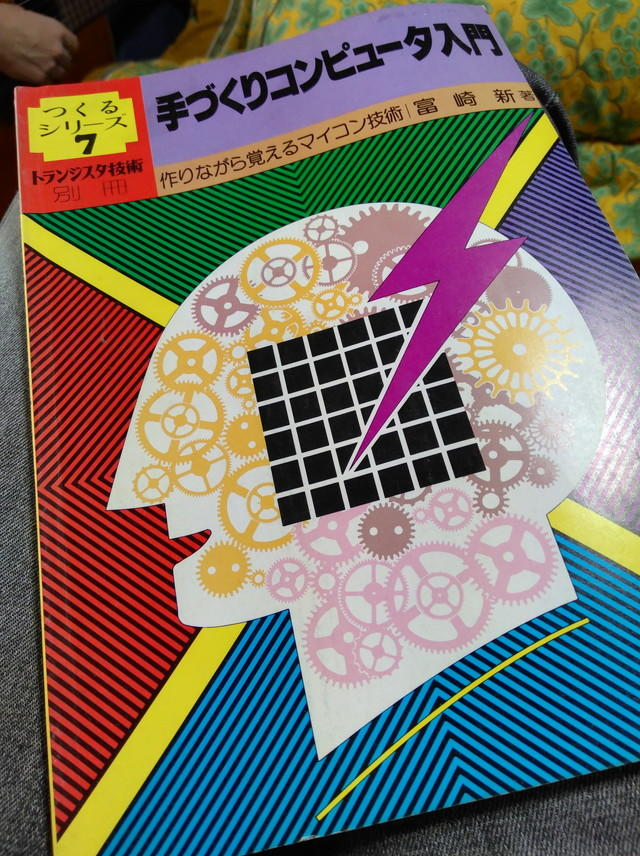

2017年5月の連休に実家の書庫を整理しました。そのときに「トランジスタ技術別冊 つくるシリーズ７ 手作りコンピュータ入門」(CQ出版社）という本を見つけました。

1981年5月初版です。当時は本は買ったものの製作までには至らなかったと思います。久しぶりに読み返してみるとCOSMACというアーキテクチャを持つCPU CDP1802で基本CPUボードを作り、それに付加回路を接続することで、電子工作の応用例を提示されています。今で言うとArduinoのような使い方です。  
さすがにこのCPUはもう手に入らないだろうと海外の通販サイトを探したところ、再生品ですが安価に入手できました。  
2019年の現在でも手に入れることができるCOSMAC CPUで、過去の文献を参考に、現在入手可能なパーツでレトロコンピュータを動かしてみようとCOSMAC研究会の活動が始まりました。
