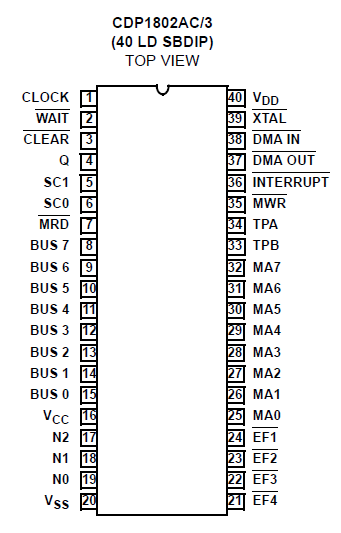
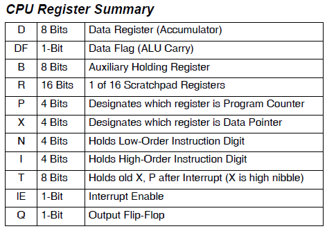
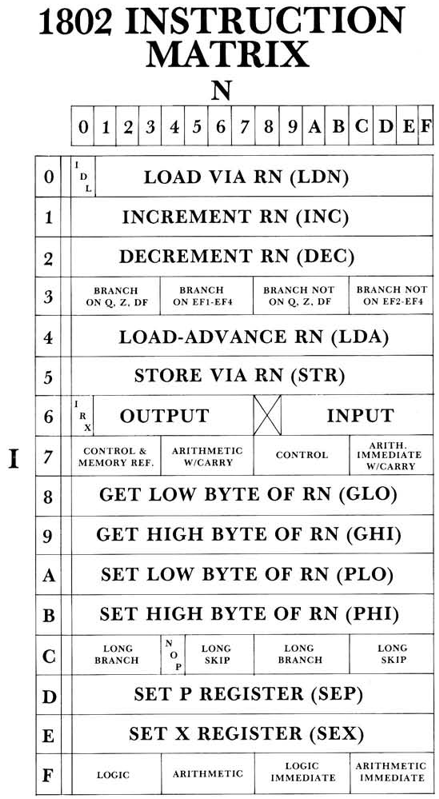

COSMAC CPUとは、1970年代半ばにRCA社が開発した高信頼性CMOS 8ビットマイクロプロセッサCDP1802です。CPUのプログラムローダーの機能により、トグルスイッチでプログラムを書き込むことができます。アセンブラの知識は必要ですが、簡単なものであれば数バイト書き込むだけで動かすことができます。

## 主な特徴

- 低消費電力(最大クロックで8mW)
- 広い電源電圧範囲(4V~6.5V)
- クロックは最大3.2MHzで下限なし
- 耐放射線
- シンプルなアーキテクチャ

## 用途

- 航空宇宙、軍用、および重要産業用装置

## CPUのピン配置

- 扱いやすい40P DIPです。



※[intersil CDP1802 datasheet](https://www.renesas.com/jp/ja/www/doc/datasheet/cdp1802ac-3.pdf)から引用

## レジスタの構成

Dレジスタは8ビットのアキュムレータです。16ビットの汎用レジスタが16個あり、どのレジスタもプログラムカウンタやインデックスレジスタにできるユニークな構成です。またQレジスタで1ビットの出力ができます。



※[intersil CDP1802 datasheet](https://www.renesas.com/jp/ja/www/doc/datasheet/cdp1802ac-3.pdf)から引用

## 命令セット

COSMAC CPUの命令セットは１枚の表にまとめることができます。



※[The 1802 Instruction Set](https://www.atarimagazines.com/computeii/issue3/page52.php)から引用

## 簡単なプログラム例

Q出力に0,1を繰り返し出力するプログラム

```
0000 7B    START SEQ
0001 7A          REQ
0002 30 00       BR START
```
