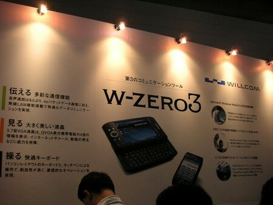
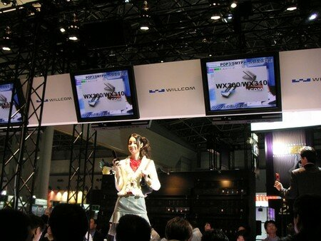

噂の[WILLCOM](http://www.willcom-inc.com/ja/index.html)の新機種をみてきました。

レポート記事はどこにでもあるので、第一印象を中心に書き留めておきます。

最初に触ったのはサンヨーの機種 [WX310SA](http://www.willcom-inc.com/ja/lineup/wx/310sa/index.html)。触ってみると普通の携帯みたいにキビキビうごきます。

Webブラウザもなかなかの感じです。少しレイアウトがずれて見えるページもありましたが、こんなものかなというところ。京ぽんに慣れているとキーレイアウトがあまりにもちがうので操作にとまどいましたが、慣れてしまえば問題ないのかもしれないです。

次は[TT](http://www.willcom-inc.com/ja/lineup/ws/001in/index.html)。ちいさいです。かわいいです。通話だけと割り切ってしまえばこれはいい感じの機種です。他のメーカでもぜひ[W-SIM](http://www.willcom-inc.com/ja/lineup/rx/410in/index.html)対応の機種をだしてほしいです。

W-ZERO3の脇の方にあった[WX300K](http://www.willcom-inc.com/ja/lineup/wx/300k/index.html)も触ってきました。これは結構いい感じ。モッサリ感がなくなっています。1Xなので通信速度は京ぽんと同じですが、初めてのかたにはピッタリかも。企業ユースにもいけそうです。

次は[W-ZERO3](http://www.willcom-inc.com/ja/lineup/ws/003sh/index.html)。長蛇の列で待ちました。できれば**３分間砂時計**を置いてほしかった。

見た目より軽いですが、やはりPDAと割り切ったほうが良さそう。動きも軽快とはいいがたく、操作性も両手で使うことが前提に思えます。立ち状態でのブラウジングは厳しそう。２台目向けの機種といったところか。

次は[WX310K](http://www.willcom-inc.com/ja/lineup/wx/310k/)。キーレイアウトは慣れているためか一番しっくりきましたが、やはり少し重く大きい感じがあります。あとフォントがこんなに汚かったかなという印象。SAのほうがきれいな文字に見えましたが、気のせいかもしれません。動作は軽快ですが、SAほどでは無い印象。

最後に[WX310J](http://www.willcom-inc.com/ja/lineup/wx/310j/index.html)。一番列が短かったですが、指紋センサーによるスクロールは思ったよりは使えそうです。しかし、その下の決定ボタンが少し押しにくいことと、ページダウン／アップのボタン、通話ボタンの両サイドの下のほうにあり、親指で操作するには少しつらいように思いました。でも慣れてしまえば良いのかも。

実物を見た限りでは、WX310SAかWX310Kが購入候補かなという感じでしたあ。

おしまい。

